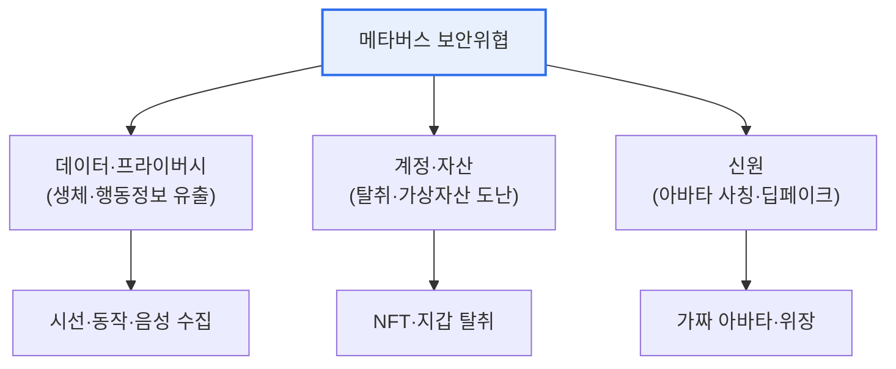
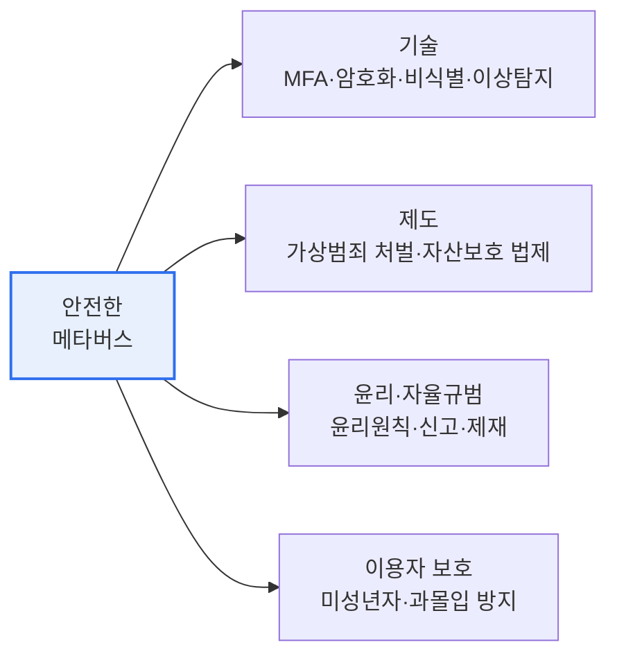

# 메타버스 보안 위협과 사회적 문제

## 1. 개요

### 가. 개념과 특징

> **메타버스(Metaverse)** 는 현실 세계와 가상 세계가 융합된 **3차원 몰입형 가상 공간**으로, 이용자가 아바타(Avatar)를 통해 사회·경제·문화 활동을 수행하는 지속적(persistent)·실시간 인터넷 환경을 말한다. '초월'을 뜻하는 메타(meta)와 '세계'를 뜻하는 유니버스(universe)의 합성어다.

메타버스가 편리함과 동시에 새로운 위협을 낳는 근본 이유는 '**현실과 가상의 경계가 무너지고, 몰입을 위해 방대하고 민감한 개인·생체 데이터가 상시 오간다**'는 데 있다. 메타버스는 단순한 게임이나 화상회의가 아니라, 사람들이 아바타로 만나 일하고 거래하고 소통하는 '또 하나의 지속되는 현실'을 지향한다. 이 몰입(immersion)과 실재감(presence)이 가치의 원천이지만, 동시에 위협의 근원이기도 하다. 현실처럼 느껴지기에 가상에서의 폭력·괴롭힘이 실제 심리적 충격을 주고, 몰입을 구현하기 위해 수집하는 시선·머리 회전·손동작·표정·음성 같은 생체·행동 데이터가 유출되면 극도로 민감한 프라이버시 침해가 된다. 게다가 NFT·가상화폐 같은 가상 자산이 실제 화폐 가치와 연결되면서 금전적 공격의 표적이 되고, 아바타로 신원을 숨기거나 위조할 수 있어 사칭·범죄가 쉬워진다.

메타버스 보안이 기존 사이버 보안의 단순 연장이 아닌 이유가 여기 있다. 웹 서비스의 위협(계정 탈취·피싱·악성코드)은 그대로 상속하면서, **가상·몰입·생체데이터·가상경제**라는 고유 특성에서 비롯된 새로운 층위의 위협과 사회 문제가 겹쳐진다. 특히 VR/AR 헤드셋이 수집하는 데이터는 단순 프로필 정보가 아니라 개인을 재식별할 수 있는 생체·행동 신호라는 점에서, 유출 시 회복 불가능한 피해로 이어질 수 있다(비밀번호는 바꿀 수 있으나 걸음걸이·홍채·시선 패턴은 바꿀 수 없다).

### 나. 메타버스의 주요 특징

메타버스의 네 특징은 각각 특정 위협과 직결되므로, 특징을 먼저 이해해야 위협의 구조가 보인다. **몰입감·실재감**은 3D·VR/AR 기술로 현실 같은 경험을 주지만, 이를 위한 센서가 민감 데이터를 상시 수집한다. **아바타**는 가상 자아로 자유로운 활동을 가능케 하지만 익명성 뒤에 신원을 숨겨 사칭·책임 회피를 부른다. **가상 경제**는 NFT·가상화폐로 새로운 경제 활동을 열지만 금전적 공격의 유인을 만든다. **실시간 다중 상호작용**은 소통을 풍부하게 하지만 동시에 가상 폭력·괴롭힘의 통로가 된다.

| 특징 | 내용 | 직결되는 위협 |
|---|---|---|
| **몰입감·실재감** | 3D·VR/AR로 현실 같은 경험 | 생체·행동 데이터 수집·유출 |
| **아바타** | 가상 자아로 활동, 익명성 | 사칭·딥페이크·책임 회피 |
| **가상 경제** | NFT·가상화폐 기반 거래 | 자산 도난·스마트컨트랙트 공격 |
| **실시간 상호작용** | 다중 사용자 동시 소통 | 가상 성범죄·괴롭힘·혐오 |

## 2. 정보시스템 측면의 보안 위협

메타버스 위협은 크게 데이터·프라이버시, 계정·자산, 신원의 세 축으로 나눌 수 있으며, 아래 개념도는 그 전체 구조를 보여준다.

```mermaid
flowchart TB
  M["메타버스 보안위협"] --> D["데이터·프라이버시<br/>(생체·행동정보 유출)"]
  M --> A["계정·자산<br/>(탈취·가상자산 도난)"]
  M --> I["신원<br/>(아바타 사칭·딥페이크)"]
  D --> D1["시선·동작·음성 수집"]
  A --> A1["NFT·지갑 탈취"]
  I --> I1["가짜 아바타·위장"]
  style M fill:#e8f0fe,stroke:#2f6fed,stroke-width:2px
```

**가. 개인·생체정보 유출** 은 메타버스 고유의 가장 심각한 위협이다. 몰입형 기기는 이용자의 시선 추적(eye-tracking), 머리·손 움직임, 방 크기·가구 배치(공간 매핑), 음성, 나아가 표정·심박까지 수집할 수 있다. 연구자들은 이런 모션·시선 데이터만으로도 개인을 높은 정확도로 재식별할 수 있음을 보고해 왔는데, 이는 가명 처리된 아바타 뒤의 실제 사용자를 특정할 수 있다는 의미다. 시선 데이터는 무엇에 관심을 두는지(광고·정치 성향·건강 상태 암시)를 드러내므로, 유출·오남용 시 표적 광고를 넘어 심리적 조작이나 차별로 이어질 수 있다. 이 데이터는 한 번 새어 나가면 바꿀 수 없다는 점에서 비밀번호 유출과 질적으로 다르다.

**나. 계정 탈취와 가상자산 공격** 은 가상 경제가 실물 가치와 연결되며 커진 위협이다. 아바타 계정에는 구매한 아이템, 가상 부동산, NFT, 연동된 결제수단이 묶여 있어, 계정을 잃으면 곧 금전 손실이다. 특히 블록체인 기반 자산은 지갑 개인키가 탈취되면 거래를 되돌릴 수 없고(비가역성), 스마트컨트랙트 코드의 취약점(재진입 공격 등)을 노린 탈취 사례가 실제로 발생해 왔다. 피싱으로 위조된 가상 상점·에어드롭 링크를 통해 지갑 서명을 유도하는 수법이 대표적이다.

**다. 아바타 사칭·딥페이크·악성코드** 는 신원과 콘텐츠의 신뢰를 무너뜨린다. 타인의 외형·목소리를 위조한 아바타로 지인·유명인을 사칭해 사기를 벌이거나(딥페이크와 결합 시 실시간 위장도 가능), 가상 아이템·링크에 악성코드를 심어 감염시킬 수 있다. 아바타의 익명성은 표현의 자유를 넓히는 동시에, 가해자가 신원을 숨긴 채 공격하고 추적을 회피하는 방패가 되기도 한다.

한편 몰입 환경은 **사회공학 공격의 효과를 증폭**한다는 점도 주목해야 한다. 3D 공간에서 신뢰할 만한 기관의 로고를 두른 가상 지점(branch)이나 실제 인물과 구분하기 어려운 아바타가 눈앞에서 말을 걸면, 텍스트 기반 피싱보다 훨씬 강한 설득력을 갖는다. 즉 메타버스는 기존 위협을 상속하는 데 그치지 않고, 실재감이라는 특성을 통해 그 위협의 성공률을 높이는 '증폭기' 역할을 한다. 이는 이용자 교육과 플랫폼 차원의 신원 인증 표식(공식 계정 배지 등)이 함께 필요한 이유다.

| 위협 | 내용 | 특성 |
|---|---|---|
| **개인·생체정보 유출** | 시선·동작·음성 등 민감 데이터 탈취 | 재식별 가능·회복 불가 |
| **계정 탈취** | 가상 자산·신원 도용 | 금전 피해 직결 |
| **가상자산 공격** | NFT·가상화폐 도난, 컨트랙트 취약점 | 비가역·추적 곤란 |
| **아바타 사칭·딥페이크** | 타인 아바타 위조, 가짜 신원 | 신뢰 붕괴 |
| **악성코드·피싱** | 가상 아이템·링크를 통한 감염 | 기존 위협 상속 |

## 3. 사회적 문제와 안전한 메타버스 방안

### 가. 사회적 문제

메타버스의 사회적 문제는 기술만으로 풀 수 없는 인간·윤리 차원의 문제라는 점에서 별도의 접근이 필요하다. 첫째, **정체성 혼란**이다. 아바타로 여러 자아를 오가며 현실 자아와의 괴리가 커지고, 특히 자아 형성기의 청소년에게는 현실·가상 혼동으로 이어질 수 있다. 둘째, **가상 성범죄·폭력·괴롭힘**이다. 몰입감 때문에 가상 공간에서의 성희롱·스토킹·폭력이 실제 피해자에게 현실에 가까운 심리적 외상을 남긴다는 보고가 이어지며, 실제로 VR 소셜 공간에서의 아바타 대상 성추행 신고가 사회 문제로 부각된 바 있다. 셋째, **과몰입·중독**이다. 현실보다 매력적인 가상 보상 체계가 과도한 몰입을 유발해 일상·학업·대인관계를 잠식할 수 있다. 넷째, **경제 범죄와 사기**로, 가상 부동산·아이템을 미끼로 한 투자 사기·다단계가 익명성과 규제 공백을 틈타 확산된다. 다섯째, **디지털 격차와 접근성** 문제로, 고가의 VR 장비와 고속 네트워크가 전제되는 특성상 경제적·신체적 여건에 따라 참여 기회가 갈리며, 이는 메타버스가 새로운 사회·경제 활동의 장이 될수록 소외 계층의 배제로 이어질 수 있다.

이 문제들은 서로 얽혀 증폭된다. 예컨대 익명성은 가상 폭력과 경제 범죄를 동시에 키우고, 과몰입은 사기·범죄에 대한 취약성을 높인다. 따라서 개별 문제를 따로 대응하기보다, 신원·행동에 대한 최소한의 책임 추적성과 이용자 보호 장치를 플랫폼 설계에 통합하는 접근이 요구된다.

이런 문제의 공통 배경은 **익명성 + 몰입감 + 규제 미비**의 결합이다. 가해자는 신원을 숨긴 채 현실에 가까운 충격을 줄 수 있고, 국경을 넘나드는 가상 공간이라 관할·처벌이 모호하다. 실제로 대형 VR 소셜 플랫폼에서는 서비스 초기 아바타 대상 성추행 신고가 잇따르자, 이용자 간 최소 거리를 강제하는 '퍼스널 바운더리(personal boundary)' 기능을 사후에 기본값으로 도입한 사례가 있는데, 이는 사회 문제가 기술 설계의 결함에서 비롯될 수 있고 또 설계로 완화될 수 있음을 동시에 보여준다.

또 하나 주목할 흐름은 아동·청소년 보호다. 몰입형 가상 공간은 성인과 미성년자가 아바타로 뒤섞이는 구조라, 미성년자가 부적절한 콘텐츠·접촉에 노출되거나 나이를 속인 성인과 상호작용할 위험이 크다. 이 때문에 연령 확인(age assurance), 미성년 계정의 기본 보호 강화, 보호자 통제 기능이 규제·플랫폼 정책의 핵심 쟁점으로 떠오르고 있다.

### 나. 안전한 메타버스 방안

안전한 메타버스는 기술·제도·윤리·이용자 보호를 함께 갖출 때 성립한다. 어느 하나만으로는 부족한데, 예컨대 강력한 암호화(기술)를 갖춰도 아바타 성폭력(사회 문제)은 막지 못하고, 처벌 규정(제도)만으로는 국경을 넘는 익명 가해를 추적하기 어렵기 때문이다. 아래 개념도는 4개 축이 서로를 보완하는 구조를 나타낸다.

```mermaid
flowchart LR
  S["안전한<br/>메타버스"] --> T["기술<br/>MFA·암호화·비식별·이상탐지"]
  S --> R["제도<br/>가상범죄 처벌·자산보호 법제"]
  S --> E["윤리·자율규범<br/>윤리원칙·신고·제재"]
  S --> U["이용자 보호<br/>미성년자·과몰입 방지"]
  style S fill:#e8f0fe,stroke:#2f6fed,stroke-width:2px
```

**기술적 방안** 은 강력한 인증(MFA·FIDO), 전송·저장 데이터 암호화, 데이터 최소 수집·비식별화, 시선·생체 데이터의 온디바이스(local) 처리, 이상행위 탐지(계정 도용·봇 탐지)를 포함한다. **제도적 방안** 은 가상 공간 범죄를 처벌할 수 있는 법 정비와 가상자산 이용자 보호 법제(국내 가상자산이용자보호법 등)이다. **윤리·자율규범** 은 플랫폼 차원의 메타버스 윤리원칙과 실효적 신고·제재 체계이며, **이용자 보호** 는 미성년자 접근 통제, 과몰입 방지(이용시간 안내), 개인 안전 경계(퍼스널 버블 등 물리적 거리 확보 기능) 같은 구체 장치를 말한다.

| 구분 | 방안 |
|---|---|
| **기술** | MFA·암호화, 데이터 최소수집·비식별, 온디바이스 처리, 이상행위 탐지 |
| **제도** | 가상범죄 처벌·규제, 가상자산 이용자 보호 법제 |
| **윤리·자율규범** | 메타버스 윤리원칙, 신고·제재 체계 |
| **이용자 보호** | 미성년자 보호, 과몰입 방지, 퍼스널 버블 등 안전 기능 |

## 4. 심화 — 규제·표준 동향과 프라이버시 바이 디자인

메타버스 보안은 개별 플랫폼의 노력을 넘어 규제·표준 차원으로 확장되고 있다. 데이터 보호 측면에서 EU GDPR은 시선·생체 데이터를 민감정보(특별범주)로 보아 강한 보호를 요구하며, 국내에서도 개인정보보호법상 생체정보·행태정보 규율이 메타버스 데이터에 적용된다. 상호운용성·표준화 측면에서는 여러 플랫폼 간 아바타·자산 이동을 다루는 표준화 논의(메타버스 표준 포럼 등)가 진행 중인데, 상호운용이 확대될수록 한 플랫폼의 취약점이 연결된 전체로 번질 수 있어 보안 표준의 중요성이 커진다. 가상자산 측면에서는 국내 '가상자산 이용자 보호법' 시행으로 자산 보관·불공정거래 규율의 법적 근거가 마련되었다.

설계 철학으로는 **프라이버시 바이 디자인(Privacy by Design)** 이 핵심이다. 서비스 기획 단계부터 데이터 최소 수집, 목적 제한, 기본값의 프라이버시 보호(privacy by default), 생체 데이터의 로컬 처리·즉시 폐기를 설계에 내장하는 것이다. 사후 대응(유출 후 대응)으로는 회복 불가능한 생체 데이터를 지킬 수 없으므로, 애초에 '수집하지 않거나 기기 밖으로 내보내지 않는' 사전 설계가 유일하게 실효적인 방어다. 이는 최근 규제의 '설계 단계 책임(accountability by design)' 흐름과도 맞닿는다. [[privacy-by-design]]

기술적 보완책으로는 시선·모션 같은 원(raw) 신호를 서버로 보내기 전에 노이즈를 더하거나 정밀도를 낮추는 **차등 프라이버시·데이터 난독화** 기법, 재식별을 어렵게 하는 생체 데이터 처리 연구가 진행되고 있다. 다만 이런 기법은 몰입 품질과 상충할 수 있어(과도한 난독화는 반응 지연·부정확을 낳는다), '보호 수준 대 몰입 품질'의 균형점을 도메인별로 찾는 것이 실무 과제로 남는다. 결국 메타버스 보안은 완제품 기능이 아니라 기술·정책·이용자 인식이 함께 진화해야 하는 지속적 과정으로 이해해야 한다.

예상 출제 방향으로는 ▲메타버스 고유 위협 3~5가지와 대응방안을 기술적·제도적·윤리적으로 계층화해 서술하는 논술형, ▲생체·행동 데이터의 재식별 위험과 프라이버시 바이 디자인 적용 방안, ▲아바타 익명성의 순기능·역기능과 실명·책임 추적의 균형 문제 등이 유력하다. 답안 구성 시에는 '특징 → 특징에서 파생되는 위협 → 계층적 대응 → 기술사 관점 시사점'의 인과 흐름으로 전개하면 설득력이 높다.

또한 최근에는 생성형 AI와의 결합이 새 변수로 떠오른다. AI가 생성한 아바타·음성·콘텐츠가 메타버스에 유입되면 딥페이크 사칭과 허위정보 확산이 한층 쉬워지므로, 콘텐츠 출처 표시(provenance)와 AI 생성물 라벨링이 신뢰 유지의 새로운 과제로 부상하고 있다. 이는 메타버스 보안이 고정된 대책이 아니라 기술 발전에 따라 계속 갱신되어야 하는 영역임을 다시 보여준다.

## 5. 고려사항 및 시사점

1. **프라이버시 보호가 최우선 과제다.** 메타버스는 몰입을 위해 시선·표정·동작 등 재식별 가능하고 회복 불가능한 생체·행동 데이터를 상시 수집하므로, 최소 수집·비식별·온디바이스 처리와 프라이버시 바이 디자인을 기본값으로 삼아야 한다. 사후 대응으로는 이 데이터를 지킬 수 없다는 점이 다른 서비스와의 결정적 차이다. [[privacy-by-design]]

2. **기술·제도·윤리의 균형이 필요하다.** 암호화·인증 같은 기술적 보안만으로는 아바타 사칭·가상 성폭력 같은 사회 문제를 막을 수 없다. 국경을 넘는 익명 가해라는 특성상 처벌 법제와 관할 협력, 플랫폼 자율 윤리규범·신고 체계가 함께 작동해야 실효가 있다. [[metaverse-ethics]]

3. **신뢰가 산업 확산의 전제다.** 안전·프라이버시가 보장되지 않으면 이용자가 떠나므로, 보안은 메타버스 성장의 걸림돌이 아니라 지속 가능성의 필수 기반이다. 특히 미성년자 보호 실패는 사회적 신뢰와 규제 리스크로 직결된다.

4. **상호운용·확장이 새로운 공격면을 만든다.** 플랫폼 간 아바타·자산 이동이 확대될수록 한 곳의 취약점이 연결된 전체로 전파되므로, 상호운용 표준에 보안·신원검증을 처음부터 내장해야 한다. 기술사는 메타버스 아키텍처 설계 시 몰입 품질과 데이터 최소화라는 상충 목표를 함께 저울질하고, 생체 데이터의 생애주기(수집·처리·폐기)를 관리하는 거버넌스를 처방할 수 있어야 한다. [[digital-twin-metaverse]]

## 참고자료

- Wikipedia, "Metaverse" — https://en.wikipedia.org/wiki/Metaverse
- 개인정보보호위원회, 개인정보보호법(생체·행태정보 관련) — https://www.pipc.go.kr
- 금융위원회, 가상자산 이용자 보호법 안내 — https://www.fsc.go.kr

---

> **한 줄 요약**: 메타버스는 *몰입·아바타·가상경제*라는 고유 특성 때문에 재식별 가능한 생체·행동정보 유출, 가상자산·계정 탈취, 아바타 사칭 같은 보안 위협과 정체성 혼란·가상폭력·중독 등 사회 문제를 함께 안고 있으며, 회복 불가능한 데이터를 지키려면 프라이버시 바이 디자인을 축으로 기술·제도·윤리·이용자 보호를 아우른 다층적 대응이 필요하다.
