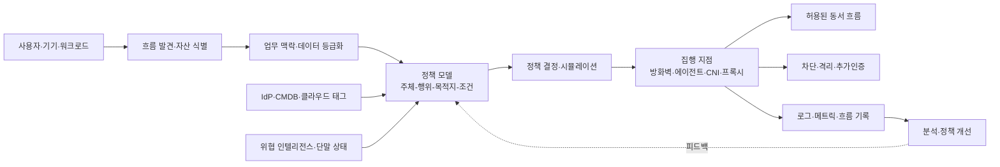
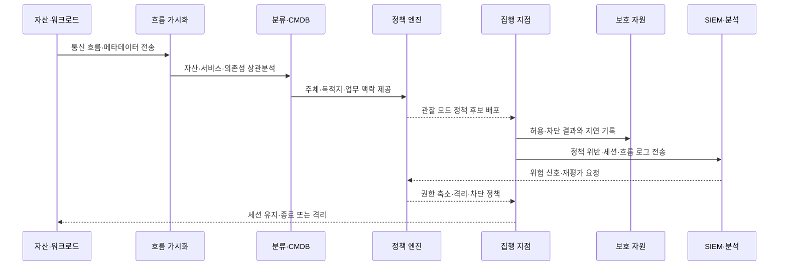

# 마이크로세그멘테이션(Microsegmentation) 기반 동서 트래픽 제어와 제로 트러스트 구현

## 1. 개요

> **마이크로세그멘테이션(Microsegmentation)**은 사용자·애플리케이션·워크로드·기기·데이터 흐름을 업무적 속성과 통신 필요성에 따라 매우 작은 논리적 영역으로 나누고, 영역 사이의 통신을 허용 목록과 정책으로 세밀하게 통제하는 보안 설계 기법이다.

전통적인 네트워크 보안은 인터넷과 내부망 사이의 경계에 방화벽을 배치하고 내부에서는 비교적 넓은 통신을 허용하는 방식으로 발전했다.

이 구조는 데이터센터와 업무 시스템이 고정된 위치에 있고, 사용자가 회사 건물 안에서 접속하던 시기에는 운영하기 쉬웠다.

그러나 클라우드, 컨테이너, SaaS, 재택근무, 협력사 연계가 확산되면서 사용자의 위치와 서버의 물리적 위치가 보호 기준이 되기 어려워졌다.

공격자가 한 계정이나 한 서버를 장악한 뒤 내부의 다른 서버로 이동하는 측면 이동(Lateral Movement)이 가능하면, 최초 침해 지점보다 훨씬 큰 피해가 발생한다.

마이크로세그멘테이션은 이 문제를 동서(East-West) 트래픽 관점에서 다룬다.

동서 트래픽은 사용자와 인터넷 사이의 남북(North-South) 트래픽과 달리, 서버와 서버, 서비스와 서비스, 단말과 단말 사이의 내부 흐름을 의미한다.

따라서 외부 방화벽만 강화하는 것으로는 충분하지 않으며, 내부의 모든 통신을 업무상 필요한 흐름인지 확인하고 불필요한 연결은 차단해야 한다.

NIST SP 800-207은 제로 트러스트를 네트워크 위치에 따른 묵시적 신뢰를 없애고 자원에 대한 접근을 지속적으로 평가하는 보안 패러다임으로 설명하며, 논리적 마이크로세그멘테이션을 제로 트러스트 아키텍처의 접근 방식 중 하나로 제시한다([NIST SP 800-207](https://csrc.nist.gov/pubs/sp/800/207/final)).

마이크로세그멘테이션은 제로 트러스트 그 자체가 아니라, 제로 트러스트의 최소권한과 침해 가정을 네트워크·워크로드 경계에서 집행하는 수단이다.

즉, 신원과 컨텍스트로 접근 결정을 내리는 정책 체계와, 실제 패킷·세션·서비스 호출을 막거나 허용하는 집행 지점이 함께 있어야 한다.

### 가. 등장 배경과 필요성

첫째, 가상화와 컨테이너는 하나의 물리 서버 위에 서로 다른 업무와 고객의 워크로드를 동시에 배치하게 만들었다.

같은 호스트 또는 같은 클러스터 안에 있다는 이유만으로 모든 워크로드가 서로 통신할 수 있다면, 하나의 취약점이 여러 서비스로 확대될 수 있다.

둘째, 개발 속도를 높이기 위한 마이크로서비스 구조는 서비스 간 API 호출을 크게 늘렸다.

서비스 수가 증가하면 네트워크 연결도 복잡해지므로, “내부 서비스는 신뢰한다”는 단순한 규칙이 오히려 공격자의 이동 경로가 된다.

셋째, 하이브리드·멀티클라우드 환경에서는 VLAN이나 물리 방화벽만으로 모든 업무 흐름을 일관되게 관리하기 어렵다.

클라우드 보안 그룹, 호스트 방화벽, 서비스 메시, 컨테이너 네트워크 정책을 정책 모델로 묶어야 자산의 위치가 바뀌어도 같은 통제를 유지할 수 있다.

넷째, 랜섬웨어와 계정 탈취 사고에서는 초기 침투 이후의 확산을 얼마나 빨리 차단하는지가 피해 규모를 좌우한다.

세그먼트가 작고 정책이 구체적일수록 공격자가 사용할 수 있는 경로와 접근 가능한 자원의 범위가 줄어든다.

## 2. 핵심 원리와 개념 구조

마이크로세그멘테이션의 핵심은 네트워크를 무조건 잘게 나누는 데 있지 않다.

업무 흐름을 식별하고, 각 흐름의 주체·목적지·행위·조건을 표현한 뒤, 필요한 통신만 허용하는 것이 본질이다.

정책의 단위는 IP 주소와 포트에만 머물지 않고 사용자, 기기 상태, 애플리케이션 이름, 워크로드 라벨, 서비스 계정, 데이터 등급, 환경과 배포 버전으로 확장될 수 있다.

다음 개념도는 자산 발견부터 정책 집행과 지속 관측까지의 전체 구조를 나타낸다.

### 가. 보호 표면과 세그먼트

보호 표면은 모든 자산을 한꺼번에 보호 대상으로 삼는 대신, 비즈니스 영향도가 높은 데이터·애플리케이션·서비스를 우선 식별하는 개념이다.

예를 들어 결제 데이터베이스, 고객 개인정보 저장소, 인증 서비스, 생산 제어 서버는 일반 개발 서버와 같은 보안 우선순위를 갖지 않는다.

보호 표면을 정의하면 세그먼트의 경계를 자산의 물리적 위치가 아니라 업무 중요도와 통신 관계에 맞출 수 있다.

세그먼트는 VLAN처럼 네트워크 주소로 나눌 수도 있고, 클라우드 보안 그룹, 호스트 방화벽, 컨테이너 네임스페이스, 서비스 메시의 워크로드 신원으로 나눌 수도 있다.

한 워크로드를 하나의 세그먼트로 만들 수 있지만, 실제 환경에서는 관리 복잡성과 성능을 고려해 같은 정책을 공유하는 자산 그룹을 묶기도 한다.

세그먼트가 너무 크면 측면 이동을 충분히 제한하지 못하고, 너무 작으면 정책 수가 폭발하여 운영자가 예외를 남발하게 된다.

따라서 세그먼트의 크기는 “가장 작은 단위”가 아니라 “독립적으로 위험을 관리하고 업무 흐름을 설명할 수 있는 단위”로 정해야 한다.

### 나. 주체·목적지·행위·조건

정책은 “A 네트워크에서 B 네트워크로 TCP 443을 허용한다”는 기술 규칙에서 시작할 수 있다.

그러나 클라우드와 컨테이너 환경에서는 IP가 재배치되고 인스턴스가 자주 교체되므로, IP만으로 정책을 유지하면 변경 때마다 수작업이 필요하다.

대신 “주문 서비스가 승인된 배포 버전의 결제 서비스에 결제 승인 API를 호출한다”와 같이 주체와 목적지의 의미를 표현해야 한다.

주체는 사람, 서비스 계정, 애플리케이션, 기기, 작업 스케줄러가 될 수 있다.

목적지는 웹 서비스, 메시지 큐, 데이터베이스, 파일 저장소, 관리 인터페이스 등 보호 자원이 될 수 있다.

행위는 연결뿐 아니라 API 메서드, 데이터베이스 명령, 파일 읽기·쓰기, 관리 명령처럼 세밀하게 정의할 수 있다.

조건에는 시간, 환경(dev·staging·production), 배포 버전, 단말 보안 상태, 데이터 등급, 요청 위험도, 승인 여부가 포함된다.

이 속성을 이용하면 같은 서비스라도 개발 환경에서는 넓은 테스트 접근을 허용하고, 운영 환경에서는 특정 서비스 계정의 읽기 요청만 허용하는 식으로 차등 통제할 수 있다.

### 다. 기본 거부와 최소권한

마이크로세그멘테이션의 일반적인 기본값은 명시적으로 허용하지 않은 흐름을 거부하는 것이다.

다만 업무 흐름을 파악하기 전에 전면 차단하면 장애가 발생하므로, 초기에는 관찰 모드에서 실제 통신을 수집하고 정책 후보를 만든다.

정책 후보는 자동으로 허용 규칙이 되어서는 안 된다.

정상적인 업무 흐름인지, 임시 디버깅 연결인지, 오래된 에이전트의 불필요한 통신인지 운영자와 서비스 담당자가 확인해야 한다.

최소권한은 연결 대상뿐 아니라 연결 방향, 포트, 호출 API, 데이터 유형, 세션 시간까지 좁히는 과정이다.

예를 들어 주문 서비스가 결제 서비스에 요청할 수 있다고 해서 결제 서비스의 관리 포트와 운영 셸까지 접근하게 해서는 안 된다.

기본 거부 정책은 가용성에 영향을 주므로, 예외 승인 절차와 긴급 해제 절차를 함께 설계해야 한다.

긴급 해제는 일정 시간 후 자동 만료되고 사유·승인자·영향 범위가 기록되어야 영구적인 우회 통로가 되지 않는다.

### 라. 지속 검증과 침해 가정

마이크로세그멘테이션은 세그먼트에 들어온 주체를 영구적으로 신뢰하는 기술이 아니다.

서비스 인증서가 만료되거나, 기기의 보안 상태가 나빠지거나, 이상 행동이 탐지되면 기존 세션의 권한을 재평가할 수 있어야 한다.

제로 트러스트의 침해 가정은 이미 하나의 자산이 침해되었더라도 다른 자산으로 자동 이동할 수 없도록 설계하라는 의미다.

그러므로 정책은 정상 상황뿐 아니라 계정 탈취, 악성 프로세스 실행, 비정상 대량 요청, 공급망 악성 코드 유입 상황에서 어떻게 축소되는지를 포함해야 한다.

## 3. 구현 아키텍처와 동작 절차

구현 방식은 자산의 유형과 통신 계층에 따라 달라진다.

데이터센터 서버에는 호스트 에이전트나 호스트 방화벽을 적용할 수 있고, 클라우드에는 네이티브 보안 그룹과 네트워크 방화벽을 사용할 수 있다.

컨테이너에는 CNI 플러그인의 네트워크 정책과 서비스 메시의 사이드카 또는 노드 프록시를 조합할 수 있다.

OT·IoT처럼 에이전트 설치가 어려운 자산에는 스위치, 방화벽, 패시브 센서, ID 기반 NAC와 같은 네트워크 중심 통제가 필요하다.

다음 시퀀스는 관찰에서 정책 집행과 사고 대응으로 이어지는 운영 절차다.

### 가. 자산 발견과 흐름 기준선

첫 단계는 방화벽 규칙을 바로 작성하는 것이 아니라 자산 목록과 통신 관계를 신뢰할 수 있게 만드는 것이다.

IP 주소, 호스트명, 클라우드 계정, 태그, 컨테이너 라벨, 서비스 계정, 소유 조직을 가능한 한 하나의 식별 체계로 연결한다.

NetFlow·VPC Flow Logs·패킷 메타데이터·애플리케이션 로그를 수집하면 누가 어느 자원에 어떤 포트로 얼마나 자주 연결하는지 파악할 수 있다.

암호화된 트래픽은 본문을 복호화하지 않더라도 양 끝점, 시간, 포트, 바이트 수, 연결 빈도와 같은 메타데이터로 기본 흐름을 확인할 수 있다.

자산의 소유자와 업무 목적이 확인되지 않는 흐름은 바로 삭제하지 말고 위험도와 영향도를 표시해 조사 대상으로 둔다.

기준선에는 배치 작업의 시간대, 백업 트래픽의 주기, 장애 조치 때의 대체 경로도 포함해야 한다.

그렇지 않으면 정상적인 야간 백업을 공격으로 오인하거나, 장애 시 필요한 흐름을 정책에서 누락할 수 있다.

### 나. 정책 모델과 정책 수명주기

정책 모델은 자연어 업무 규칙을 실제 집행 규칙으로 변환하는 중간 표현이다.

정책에 포함할 최소 필드는 주체, 행위, 목적지, 프로토콜·포트, 조건, 결정, 만료일, 소유자, 근거다.

정책의 근거를 기록하면 감사나 장애 분석 때 “누가 어떤 업무 요구로 이 흐름을 허용했는가”를 확인할 수 있다.

정책은 생성·검토·시뮬레이션·승인·배포·관찰·개정·폐기의 수명주기를 가져야 한다.

개발자가 긴급하게 포트를 열어 달라고 요청하더라도, 만료가 없는 영구 예외로 처리하면 보안 부채가 누적된다.

코드형 정책을 사용하면 변경 이력과 동료 검토를 남길 수 있지만, 정책 언어의 표현력과 실제 집행기의 차이를 검증해야 한다.

정책 시뮬레이션은 기존 허용 흐름이 차단되는지, 규칙의 순서가 의도와 같은지, 더 넓은 규칙이 좁은 규칙을 덮어쓰지 않는지 확인해야 한다.

### 다. 정책 결정점과 정책 집행점

정책 결정점은 접근을 허용할지 거부할지 판단하고, 정책 집행점은 실제 통신 경로에서 그 결정을 강제한다.

NIST SP 800-207의 논리적 구성에서 정책 엔진은 결정을 만들고 정책 관리자는 집행점에 세션 생성·수정·종료 지시를 전달한다.

마이크로세그멘테이션의 집행점은 방화벽, 라우터, 호스트 에이전트, 클라우드 보안 그룹, 컨테이너 네트워크 플러그인, 서비스 메시 프록시로 구현될 수 있다.

정책 엔진이 정상적으로 “허용”을 반환해도, 자원이 다른 우회 경로로 직접 노출되어 있으면 통제는 실패한다.

보호 자원은 승인된 집행점을 통하지 않고는 접근할 수 없도록 라우팅, 보안 그룹, 호스트 방화벽을 함께 조정해야 한다.

집행점의 장애 동작도 중요하다.

인증 서비스나 정책 엔진이 일시적으로 사용할 수 없을 때 기존 세션을 유지할지, 신규 세션만 차단할지, 고위험 자원만 우선 차단할지를 업무 중요도에 따라 정한다.

### 라. 관측성과 대응 자동화

모든 차단을 성공으로 볼 수는 없다.

정책이 너무 넓으면 침해 시 확산을 막지 못하고, 너무 좁으면 정상 호출을 차단해 운영자가 우회 정책을 만들게 된다.

허용·차단·예외·정책 조회 실패·집행점 오류를 모두 중앙 로그로 보내고, 자산·사용자·티켓·배포 정보와 연계한다.

운영 지표로는 미분류 자산 비율, 관찰 모드 기간, 정책 예외 수, 만료된 예외 비율, 차단 후 재시도 수, 정책 변경 실패율을 사용할 수 있다.

보안 지표로는 중요 자산으로의 비인가 연결 시도, 세그먼트 간 측면 이동 경로, 격리까지 걸린 시간, 침해 자산이 접근한 자원 수를 추적할 수 있다.

자동 격리는 오탐 시 업무 중단을 일으킬 수 있으므로, 중요도와 신뢰도에 따라 경고·추가 인증·읽기 전용·격리의 단계적 대응을 적용한다.

## 4. 적용 유형과 비교

### 가. 데이터센터와 클라우드

데이터센터 환경에서는 VLAN·VRF·내부 방화벽으로 큰 영역을 나누고, 호스트 방화벽이나 에이전트로 서버 간 통제를 보완할 수 있다.

이 방식은 기존 장비와 호환하기 쉬운 반면, IP 주소 변경과 장비별 정책 문법 때문에 일관된 운영이 어렵다.

클라우드 환경에서는 계정·VPC·서브넷·보안 그룹·네트워크 ACL·워크로드 태그를 정책 속성으로 활용할 수 있다.

클라우드 네이티브 기능은 확장성이 좋지만, 클라우드마다 모델과 로그 형식이 달라 멀티클라우드 정책의 이식성이 떨어질 수 있다.

따라서 공통 정책 모델과 클라우드별 변환·검증 계층을 두고, 실제 집행 결과는 각 환경에서 다시 확인해야 한다.

### 나. 컨테이너와 서비스 메시

컨테이너 네트워크 정책은 네임스페이스, 파드 라벨, 서비스 계정 등을 이용해 L3·L4 통신을 제한한다.

서비스 메시 프록시는 서비스 신원, mTLS, 요청 경로, 메서드와 같은 L7 정보를 활용할 수 있어 API 수준의 정책에 유리하다.

반면 모든 트래픽이 프록시를 거치면 지연·자원 사용량·운영 복잡성이 증가할 수 있다.

또한 메시 정책만으로 노드 관리 포트, 외부 DNS, 스토리지 경로 같은 비애플리케이션 흐름을 모두 보호할 수는 없다.

따라서 L3·L4 기본 격리와 L7 세밀 통제를 계층적으로 조합하고, 메시 외부의 관리 경로도 별도로 통제한다.

### 다. 에이전트 기반과 네트워크 기반

에이전트 기반 방식은 프로세스·사용자·워크로드 정보를 정책에 반영하기 쉽고, 호스트 안에서 세밀한 통제를 수행할 수 있다.

그러나 에이전트 설치가 불가능한 OT·IoT, 성능이 제한된 장비, 외부 협력사 장비에는 적용하기 어렵다.

네트워크 기반 방식은 기존 라우터·스위치·방화벽으로 폭넓은 장비를 보호할 수 있지만, 암호화된 애플리케이션 의미와 프로세스 수준 주체를 파악하기 어렵다.

두 방식은 대체 관계라기보다 보호 대상과 통신 계층에 따라 보완적으로 사용해야 한다.

| 구분 | 전통적 네트워크 분할 | 마이크로세그멘테이션 | ZTNA |
|---|---|---|---|
| 주된 목표 | 큰 영역의 경계 분리 | 동서 흐름과 측면 이동 제한 | 사용자·기기의 애플리케이션 접근 통제 |
| 정책 단위 | VLAN·서브넷·IP | 워크로드·신원·태그·서비스 | 사용자·기기·자원·컨텍스트 |
| 주요 흐름 | 영역 간 트래픽 | 서버·서비스·기기 간 내부 흐름 | 사용자·외부 주체와 자원 사이 |
| 집행 지점 | 라우터·방화벽 | 호스트·CNI·방화벽·프록시 | 브로커·게이트웨이·에이전트 |
| 장점 | 이해와 운영이 비교적 단순 | 폭발 반경과 정책 범위를 축소 | 네트워크 전체 노출 없이 자원 연결 |
| 한계 | 영역 안의 과도한 신뢰 | 정책·자산·예외 운영 복잡성 | 레거시·비웹 프로토콜과 연계 난도 |

세 기술은 서로를 대체하지 않는다.

외부 사용자 접근은 ZTNA로 최소화하고, 내부 워크로드 간 통신은 마이크로세그멘테이션으로 통제하며, 데이터센터의 큰 장애 도메인은 전통적 네트워크 분할로 격리하는 식의 다층 설계가 현실적이다.

## 5. 적용 사례

### 가. 전자상거래 서비스 사례

다음은 웹·주문·결제·데이터 계층을 운영하는 전자상거래 기업을 가정한 예시다.

인터넷에서 웹 계층으로 들어오는 트래픽은 WAF와 API 게이트웨이를 통과하고, 웹 계층은 주문 API만 호출할 수 있도록 제한한다.

주문 서비스는 결제 승인 API와 재고 조회 API를 호출할 수 있지만, 결제 데이터베이스의 관리 포트에는 접근하지 못한다.

결제 서비스는 승인에 필요한 저장 프로시저 또는 특정 읽기·쓰기 계정만 사용하고, 운영자 셸과 대량 내보내기 경로는 별도 승인으로 분리한다.

개발 환경의 테스트 서비스가 운영 결제 계층을 호출하는 흐름은 기본 거부하고, 장애 대응 때 생성되는 임시 접근은 티켓 번호와 만료 시간을 정책에 기록한다.

결제 서비스 계정이 평소와 달리 고객 데이터베이스의 여러 테이블을 대량 조회하면, SIEM의 위험 신호를 정책 엔진에 전달해 세션을 읽기 전용으로 전환하거나 격리할 수 있다.

이 구조의 효과는 공격자가 웹 계층을 장악하더라도 주문·결제·개인정보 계층으로 바로 이동하지 못하게 하는 데 있다.

다만 정상적인 주문 흐름을 차단하면 매출 손실로 이어지므로, 관찰 모드와 부하 테스트를 거쳐 정책을 점진적으로 집행해야 한다.

### 나. 제조·OT 환경 사례

제조 공장에서는 사무용 IT망, 생산관리 서버, 제어망, 설비·센서망을 같은 보안 수준으로 취급해서는 안 된다.

생산 설비의 제어 프로토콜은 업무상 필요한 서버와 제한된 방향으로만 통신하도록 하고, 사무용 단말에서 제어망으로 직접 접근하는 경로는 차단한다.

협력사가 원격 유지보수를 수행할 때는 승인된 시간과 승인된 장비에서 중계 서버를 통해 특정 설비에만 접근하도록 한다.

오래된 PLC나 센서처럼 에이전트를 설치하기 어려운 장비는 패시브 모니터링, 산업용 방화벽, 스위치 ACL, 점프 서버로 통제를 구성한다.

제어망에서는 보안 정책의 변경이 가용성과 안전에 영향을 줄 수 있으므로, 차단 정책을 배포하기 전에 시뮬레이션과 변경 승인, 현장 안전 절차를 거쳐야 한다.

ISA/IEC 62443의 Zone·Conduit 접근처럼 기능과 위험이 유사한 자산을 구역으로 묶고 구역 사이의 통신 경로를 통제하면, IT와 OT의 서로 다른 가용성 요구를 조정하는 데 도움이 된다.

## 6. 심화: 단계적 도입과 성숙도 전략

CISA는 2025년에 마이크로세그멘테이션을 제로 트러스트 관점에서 계획하고 적용하기 위한 안내서의 첫 번째 부분을 공개했으며, 네트워크 기둥의 통신 필요성에 따라 네트워크를 나누고 보안 통제를 적용하는 능력으로 설명한다([CISA Microsegmentation in Zero Trust, Part One](https://www.cisa.gov/resources-tools/resources/microsegmentation-zero-trust-part-one-introduction-and-planning)).

이 안내 흐름을 실무에 적용할 때는 제품 도입보다 업무 자산과 흐름의 이해를 먼저 수행하는 것이 중요하다.

1단계는 준비 단계로, 보호 표면·중요 자산·소유 조직·규제 요구사항·장애 허용 수준을 정한다.

2단계는 발견 단계로, 일정 기간 흐름을 관찰하고 자산·서비스·사용자·데이터 의존성을 정규화한다.

3단계는 설계 단계로, 업무 흐름을 주체·행위·목적지·조건으로 표현하고 정책 후보를 시뮬레이션한다.

4단계는 제한적 집행 단계로, 영향이 낮고 소유자가 명확한 개발·테스트 또는 중요 자산의 일부부터 기본 거부를 적용한다.

5단계는 확장 단계로, 클라우드·컨테이너·데이터센터·OT의 서로 다른 집행 수단을 공통 정책 모델과 로그 체계로 연결한다.

6단계는 최적화 단계로, 위험 신호에 따른 자동 격리, 정책 만료, 예외 감소, 공격 경로 검증을 운영에 내재화한다.

성숙도는 단순히 세그먼트 수로 측정하면 안 된다.

중요 자산의 보호 비율, 미분류 흐름의 감소, 영구 예외의 감소, 정책 변경 실패율, 침해 시 접근 가능한 자원 수와 격리 시간을 함께 봐야 한다.

AI 기반 정책 추천을 사용할 수 있지만, 추천 결과가 곧 허용 정책이 되면 잘못된 흐름이나 공격자의 통신을 자동 승인할 위험이 있다.

AI는 흐름 군집화와 중복 정책 탐지의 보조 수단으로 사용하고, 고위험 자원과 예외 정책은 사람이 근거를 검토한 뒤 승인해야 한다.

## 7. 고려사항 및 시사점

### 가. 업무 연속성과 보안의 균형

마이크로세그멘테이션은 보안을 강화하지만 잘못된 차단은 즉시 업무 장애가 된다.

처음부터 전면 차단하지 말고 관찰·시뮬레이션·부분 집행·확대의 단계를 지키며, 장애 조치 경로와 긴급 해제 절차를 사전에 검증해야 한다.

### 나. 자산 식별과 정책 품질

자산 목록이 부정확하거나 소유자가 정해지지 않으면 정책의 기준도 흔들린다.

CMDB, 클라우드 인벤토리, 컨테이너 오케스트레이터, IdP의 식별자를 연결하고, 자산의 수명주기 종료 시 정책도 함께 폐기하는 자동화가 필요하다.

### 다. 정책 예외와 보안 부채

긴급 장애 대응을 이유로 만든 예외가 만료되지 않으면 마이크로세그멘테이션은 이름만 남게 된다.

예외에는 사유·승인자·영향 범위·만료일·대체 통제를 기록하고, 만료 전 재승인하지 않으면 자동으로 제거하는 원칙을 적용해야 한다.

### 라. 암호화와 가시성

TLS와 mTLS는 기밀성과 신원 확인에 유리하지만, 관측 시스템이 업무 흐름을 완전히 이해하기 어렵게 만들 수 있다.

복호화 여부를 무조건 확대하기보다 메타데이터, 서비스 로그, 분산 추적, 인증서·서비스 신원, 엔드포인트 텔레메트리를 결합해 필요한 가시성을 확보해야 한다.

### 마. 성능과 확장성

정책 조회와 패킷 검사가 요청 경로의 지연을 늘릴 수 있으므로, 캐시·정책 배포 구조·집행점의 용량·장애 시 동작을 성능시험해야 한다.

서비스 메시의 프록시 수, 에이전트의 CPU·메모리 사용, 로그량과 저장 비용도 전체 설계의 비기능 요구사항으로 관리한다.

### 바. 레거시·OT·IoT의 현실성

모든 장비에 최신 에이전트나 강한 인증을 적용할 수 있다는 가정은 현실과 다르다.

지원이 제한된 장비에는 네트워크 기반 격리, 가상 패치, 점프 서버, 패시브 탐지와 같은 보완 통제를 적용하고, 교체 계획과 잔여 위험을 경영진에게 보고해야 한다.

### 사. 성과 측정과 지속 개선

세그먼트 개수나 차단 규칙 수가 많다고 보안 성숙도가 높은 것은 아니다.

침해 시나리오를 가정한 공격 경로 검증과 보라색 팀 훈련을 통해 실제로 측면 이동이 차단되는지 확인하고, 서비스 변경 때 정책 영향 분석을 자동화해야 한다.

## 참고자료

- NIST, “Zero Trust Architecture, SP 800-207”: https://csrc.nist.gov/pubs/sp/800/207/final
- NIST NCCoE, “Implementing a Zero Trust Architecture, SP 1800-35”: https://www.nist.gov/news-events/news/2025/06/nist-releases-cybersecurity-practice-guide-implementing-zero-trust
- CISA, “Microsegmentation in Zero Trust, Part One: Introduction and Planning”: https://www.cisa.gov/resources-tools/resources/microsegmentation-zero-trust-part-one-introduction-and-planning
- CISA, “Zero Trust Maturity Model Version 2.0”: https://www.cisa.gov/resources-tools/resources/zero-trust-maturity-model

---

> **한 줄 요약**: 마이크로세그멘테이션은 자산과 업무 흐름을 작은 논리 경계로 나누고 최소권한·기본 거부 정책을 동서 트래픽에 집행하여, 침해 이후 측면 이동과 피해의 폭발 반경을 줄이는 제로 트러스트 구현 수단이다.
