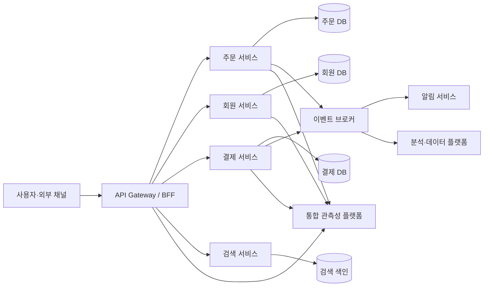
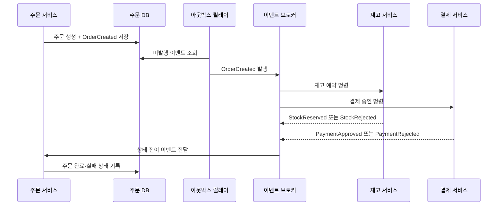

# 마이크로서비스 아키텍처(MSA, Microservices Architecture)

## 1. 개요

> **마이크로서비스 아키텍처(MSA)**란 하나의 업무 시스템을 독립적으로 개발·배포·확장할 수 있는 작은 서비스들의 집합으로 구성하고, 서비스 사이를 명시적인 계약과 네트워크 통신으로 연결하는 아키텍처 스타일이다.

전통적인 모놀리식 시스템은 하나의 애플리케이션 단위로 빌드하고 배포한다. 초기에는 호출 경로가 단순하고 트랜잭션을 한 데이터베이스에서 처리하기 쉬워 생산성이 높다. 그러나 조직과 기능이 커지면 변경 범위가 넓어지고, 작은 수정도 전체 배포와 회귀시험을 요구한다. 특정 기능의 부하가 전체 애플리케이션의 확장으로 이어지고, 장애가 다른 기능으로 전파되는 결합도 문제도 나타난다.

MSA는 이 문제를 업무 능력(business capability) 단위의 서비스 경계로 분해하여 해결하려는 접근이다. 서비스는 자체 코드, 배포 단위, 데이터 소유권을 갖고 필요한 계약만 외부에 공개한다. 따라서 조직은 서비스별로 다른 기술과 배포 주기를 선택할 수 있고, 트래픽이 집중된 서비스만 수평 확장할 수 있다.

다만 MSA는 단순히 애플리케이션을 여러 프로세스로 나누는 작업이 아니다. 네트워크 호출, 분산 트랜잭션, 데이터 일관성, 관측성, 보안, 운영 자동화가 함께 도입되므로 시스템 전체의 복잡성이 증가한다. 작은 서비스가 많아졌지만 배포·장애·데이터 흐름을 관리하지 못하면 오히려 모놀리식보다 운영이 어려워진다.

따라서 기술사 답안에서는 “분해하면 무조건 좋다”라고 주장하기보다, 왜 경계를 나누어야 하는지, 어떤 결합을 허용할지, 분산환경의 실패를 어떻게 통제할지를 아키텍처 관점에서 설명해야 한다.

### 1.1 등장 배경과 필요성

첫째, 비즈니스 변화 속도가 빨라졌다. 결제, 회원, 주문, 추천처럼 변경 빈도와 위험도가 다른 기능을 하나의 릴리스에 묶으면 전체 일정이 가장 느린 부분에 맞춰진다. 서비스별 독립 배포는 변경의 영향 범위를 줄이고 실험과 점진적 출시를 가능하게 한다.

둘째, 워크로드 특성이 달라졌다. 검색은 읽기 중심이고 결제는 일관성과 감사 추적이 중요하며, 이미지 처리는 CPU·GPU 자원이 많이 필요할 수 있다. 단일 프로세스의 동일한 확장 정책으로는 이러한 차이를 효율적으로 반영하기 어렵다.

셋째, 대규모 조직에서는 코드보다 조직 간 의사소통 비용이 병목이 된다. 서비스 경계와 API 계약을 명확히 하면 팀의 책임 범위가 분명해지고, 팀이 독립적으로 계획·개발·운영할 수 있다. 그러나 조직 구조가 서비스 경계를 무리하게 결정해서는 안 되며, 실제 도메인 결합도와 데이터 소유권을 먼저 분석해야 한다.

### 1.2 핵심 특성

MSA의 첫 번째 특성은 서비스의 독립성이다. 독립성은 소스 저장소가 분리되었다는 의미만이 아니라, 서비스가 독립적으로 빌드되고 테스트되며 배포될 수 있다는 의미다. 한 서비스가 다른 서비스의 내부 테이블이나 배포 순서에 의존하면 논리적으로는 분리되어 있어도 운영상 결합된 상태다.

두 번째 특성은 명시적 계약이다. REST, gRPC, 메시지 이벤트 등 어떤 통신 방식을 쓰더라도 요청·응답 형식, 오류 의미, 버전 호환성, 보안 요구사항이 계약으로 관리되어야 한다. 계약을 문서와 자동 검증으로 유지하지 않으면 서비스 수가 늘어날수록 변경 충돌이 커진다.

세 번째 특성은 데이터의 자율성이다. 각 서비스는 자신이 책임지는 데이터 모델을 소유하고 다른 서비스가 내부 스키마를 직접 조회하지 않게 한다. 이 원칙은 데이터 중복과 최종 일관성을 감수하게 하지만, 서비스 간 결합을 줄이고 독립 변경을 가능하게 한다.

## 2. 참조 구조와 서비스 분해

### 2.1 전체 아키텍처 개념도

위 구조에서 게이트웨이는 외부 클라이언트의 인증, 라우팅, 속도 제한, 공통 정책을 담당한다. 그러나 모든 업무 로직을 게이트웨이에 넣으면 새로운 모놀리스가 되므로, 도메인 규칙은 각 서비스에 남겨야 한다. 모바일·웹 화면에 특화된 조합이 필요하다면 BFF를 별도로 두되, BFF가 핵심 데이터의 주인이 되지 않도록 경계를 구분한다.

주문·회원·결제 서비스는 각각 자신의 데이터 저장소를 소유한다. 여기서 저장소 기술이 반드시 서로 달라야 하는 것은 아니다. 중요한 것은 다른 서비스가 테이블을 직접 수정하거나 조인하지 않고, 소유 서비스가 정의한 API나 이벤트를 통해 접근한다는 점이다.

이벤트 브로커는 서비스 간 비동기 연결과 상태 변화를 전달한다. 주문 서비스가 주문 생성 이벤트를 발행하면 알림과 분석 서비스가 각자의 속도로 처리할 수 있다. 그러나 이벤트 전달이 한 번만 일어난다고 가정하면 중복이나 재처리 실패가 발생하므로, 멱등성 키, 재시도, 보존 기간, 순서 요구사항을 설계해야 한다.

통합 관측성 플랫폼은 로그·메트릭·트레이스를 서비스 경계를 넘어 연결한다. 분산 트레이스의 상관관계 ID가 없으면 사용자의 한 요청이 어떤 서비스에서 지연되었는지 파악하기 어렵다. MSA에서는 관측성이 운영 부가 기능이 아니라 기본 아키텍처 구성요소다.

### 2.2 서비스 경계 결정 원리

서비스 경계는 기술 계층이 아니라 도메인 업무 능력을 기준으로 결정한다. “컨트롤러 서비스”, “데이터베이스 서비스”처럼 계층별로 쪼개면 한 업무 요청이 여러 서비스에 걸쳐 호출되고, 서비스 간 통신량과 조정 비용이 급증한다. 반면 주문, 재고, 배송처럼 업무 책임과 변경 이유가 다른 단위는 경계 후보가 된다.

도메인 주도 설계의 바운디드 컨텍스트는 경계 설정에 유용한 사고 틀이다. 같은 단어라도 맥락에 따라 의미가 다르면 모델을 분리한다. 예를 들어 고객은 마케팅에서는 세그먼트 대상이고, 결제에서는 청구 주체이며, 배송에서는 수령인일 수 있다. 모든 맥락의 고객 정보를 하나의 거대한 고객 모델로 통합하면 변경 영향이 커진다.

응집도와 결합도도 함께 평가한다. 함께 변경되고 함께 배포되어야 하는 기능은 같은 서비스에 두는 편이 낫고, 서로 다른 팀·일정·장애 특성을 가진 기능은 분리 후보가 된다. 호출 빈도만 보고 분리하면 네트워크 왕복이 과도해질 수 있으므로, 업무 흐름의 경계와 데이터 일관성 요구를 우선 검토한다.

분해 결과는 한 번에 완성되지 않는다. 모놀리식 코드에서 변경 지점을 관찰하고, 우선순위가 높은 업무 능력부터 스트랭글러 패턴으로 점진적으로 추출하는 방법이 위험을 줄인다. 추출한 서비스가 안정화되기 전에는 기능 플래그, 병렬 검증, 롤백 경로를 마련해야 한다.

### 2.3 구성요소별 역할

| 구성요소 | 주요 역할 | 설계 시 핵심 질문 |
|---|---|---|
| 서비스 | 업무 능력 구현과 데이터 소유 | 독립 배포와 책임 범위가 명확한가? |
| API Gateway | 외부 진입점, 라우팅, 공통 정책 | 정책과 업무 로직이 혼재하지 않는가? |
| 서비스 메시 | 서비스 간 통신 정책, 보안, 관측성 | 프록시 운영 복잡성이 이득보다 크지 않은가? |
| 이벤트 브로커 | 비동기 전달과 완충 | 중복·순서·재처리를 어떻게 보장하는가? |
| 서비스별 저장소 | 데이터 소유와 모델 최적화 | 타 서비스의 직접 접근을 차단했는가? |
| CI/CD | 빌드·테스트·배포 자동화 | 서비스별 파이프라인과 품질 게이트가 있는가? |
| 관측성 플랫폼 | 로그·메트릭·트레이스 통합 | 요청 상관관계를 추적할 수 있는가? |

표의 구성요소는 독립적으로 도입하는 제품 목록이 아니다. 예를 들어 이벤트 브로커를 설치해도 서비스 간 데이터 소유권과 재처리 정책이 없으면 메시지 처리만 복잡해진다. 반대로 관측성은 서비스 수가 많아지기 전에 표준 필드와 추적 전파 규칙을 정해야 효과가 있다.

## 3. 통신과 데이터 관리

### 3.1 동기·비동기 통신 선택

동기 호출은 즉시 응답이 필요한 조회나 짧은 검증에 적합하다. 호출자는 결과를 받은 뒤 다음 처리를 결정할 수 있고, 인터페이스가 직관적이다. 그러나 호출 대상이 지연되거나 장애가 나면 호출자의 스레드와 자원도 함께 묶인다. 호출 사슬이 길어질수록 부분 장애가 전체 요청 실패로 전파된다.

비동기 메시지는 서비스 간 시간적 결합을 줄인다. 주문 생성 뒤 알림을 즉시 완료할 필요가 없다면 주문 서비스는 이벤트를 발행하고 알림 서비스가 나중에 처리하게 할 수 있다. 그 대신 중복 전달, 순서 뒤바뀜, 소비자 지연, 메시지 유실에 대응해야 한다.

실무에서는 통신 유형을 이분법으로 고르지 않는다. 사용자의 결제 승인처럼 즉시 결과가 필요한 핵심 단계는 동기 호출과 제한된 타임아웃으로 처리하고, 영수증 발송·추천 갱신·분석 적재는 이벤트로 분리한다. 업무의 완료 정의와 실패 시 보상 절차를 기준으로 통신 방식을 선택해야 한다.

| 구분 | 동기 API | 비동기 메시지 |
|---|---|---|
| 응답성 | 호출 시점에 결과 확인 | 나중에 처리 결과 확인 |
| 결합도 | 시간적 결합이 큼 | 시간적 결합이 작음 |
| 장애 전파 | 타임아웃 연쇄 가능 | 큐에 적재해 완충 가능 |
| 일관성 | 즉시 검증이 쉬움 | 최종 일관성 설계 필요 |
| 운영 난이도 | 호출·재시도 중심 | 브로커·재처리·순서 관리 필요 |

### 3.2 데이터 일관성과 분산 트랜잭션

MSA에서 서비스별 데이터베이스를 사용하면 하나의 ACID 트랜잭션으로 여러 서비스를 묶기 어렵다. 예를 들어 주문 저장, 재고 차감, 결제 승인을 하나의 커밋으로 처리하려 하면 서비스 간 강한 결합과 장애 시 잠금 문제가 생긴다. 따라서 업무를 로컬 트랜잭션과 상태 전이로 나누고, 실패 시 보상하는 구조를 설계한다.

사가(Saga)는 분산 업무를 여러 로컬 트랜잭션으로 구성하고, 중간 단계가 실패하면 이미 완료된 작업을 되돌리는 보상 트랜잭션을 수행하는 패턴이다. 오케스트레이션 방식은 중앙 조정자가 다음 단계를 지시하므로 흐름과 실패 처리가 명확하다. 코레오그래피 방식은 서비스가 이벤트에 반응하므로 결합이 낮지만, 전체 흐름을 한눈에 파악하기 어렵다.

보상은 데이터베이스의 물리적 롤백과 다르다. 이미 외부 결제가 승인되었다면 단순히 행을 삭제할 수 없고 결제 취소라는 별도 업무를 수행해야 한다. 따라서 보상 가능성, 중복 실행, 시간 제한, 운영자 수동 조치까지 포함하여 상태 머신으로 정의하는 것이 안전하다.

아웃박스 패턴은 데이터 변경과 이벤트 발행의 불일치를 줄인다. 서비스는 업무 데이터와 발행할 이벤트를 같은 로컬 트랜잭션으로 저장하고, 별도의 발행기가 아웃박스 레코드를 브로커에 전달한다. 전달 성공 여부와 중복 발행을 관리할 수 있지만, 소비자 측 멱등 처리까지 함께 설계해야 한다.

### 3.3 사가·아웃박스 처리 흐름

이 흐름에서 주문 서비스가 주문을 저장한 뒤 이벤트를 직접 네트워크로 발행하면, 데이터 커밋 성공과 발행 성공 사이에 틈이 생긴다. 아웃박스 릴레이는 같은 로컬 트랜잭션으로 저장된 이벤트를 다시 읽어 발행하므로 이 틈을 줄인다. 릴레이가 발행 후 장애를 일으키면 동일 이벤트가 다시 나갈 수 있으므로, 이벤트 ID를 기준으로 소비자 멱등성을 보장해야 한다.

재고와 결제의 결과는 독립적으로 도착할 수 있다. 주문 서비스는 이벤트 도착 순서가 항상 일정하다고 가정하지 않고, 상태 전이 규칙과 허용되지 않는 전이를 검증한다. 예를 들어 결제 승인이 먼저 도착하더라도 재고 예약이 실패하면 결제 취소 보상을 실행한 뒤 주문을 실패 상태로 전환해야 한다.

### 3.4 API 계약과 버전 관리

계약은 정상 응답뿐 아니라 오류 코드, 필수·선택 필드, 시간 단위, 식별자 형식, 개인정보 포함 여부까지 포함한다. 문서가 있어도 실제 구현과 어긋나면 계약이 아니므로, 스키마 기반 계약 테스트와 소비자 주도 계약 테스트를 CI에 연결한다.

하위 호환성을 고려하면 기존 필드를 갑자기 삭제하거나 의미를 변경해서는 안 된다. 새 필드를 추가할 때 소비자가 무시할 수 있게 하고, 필드 폐기는 사용 현황을 확인한 뒤 공지·병행 기간·제거 순서를 거친다. URI 버전, 헤더 버전, 콘텐츠 협상 중 선택은 조직의 표준과 운영 도구에 맞춰 일관되게 적용한다.

내부 서비스라고 해서 계약 관리가 덜 중요한 것은 아니다. 오히려 내부 소비자가 많고 배포 주기가 다르면 변경 영향 추적이 어렵다. 호출자 목록, 계약 소유자, 만료 예정일, 스키마 변경 이력을 카탈로그로 관리하면 비공식 의존성을 줄일 수 있다.

## 4. 운영·보안·품질 관리

### 4.1 장애 격리와 복원력

분산 시스템에서는 실패를 예외가 아니라 정상적인 설계 조건으로 본다. 타임아웃을 설정하지 않은 호출은 장애 서비스가 회복될 때까지 자원을 점유하게 만들고, 결국 정상 서비스까지 고갈시킨다. 모든 원격 호출에는 업무에 맞는 제한 시간과 실패 시 대체 경로가 필요하다.

서킷 브레이커는 연속 실패가 일정 기준을 넘으면 호출을 차단하고 빠르게 실패하게 한다. 격리된 호출 풀이나 벌크헤드는 한 기능의 자원 고갈이 다른 기능으로 번지는 것을 막는다. 재시도는 일시적 오류에만 제한적으로 사용하고, 지수 백오프와 지터를 넣어 재시도 폭풍을 방지한다.

재시도 가능한 작업은 멱등적이어야 한다. 결제 요청에 단순 재시도를 적용하면 중복 결제가 될 수 있으므로 클라이언트 요청 키와 서버의 처리 결과 저장이 필요하다. 장애 복구 설계는 기술 패턴 이름을 나열하는 것이 아니라, 각 오류 유형의 사용자 경험과 데이터 결과를 정의하는 작업이다.

### 4.2 배포 전략과 품질 게이트

서비스별 독립 배포는 자동화된 빌드·테스트·배포 파이프라인을 전제로 한다. 정적 분석, 단위 테스트, 계약 테스트, 통합 테스트, 취약점 점검을 변경 위험에 맞춰 배치하고, 운영 배포 전에는 되돌릴 수 있는 아티팩트와 데이터 마이그레이션 계획을 확보한다.

블루-그린 배포는 두 환경을 전환하여 빠른 롤백을 제공한다. 카나리 배포는 일부 사용자나 트래픽에 새 버전을 노출하고 오류율·지연시간·업무 지표를 비교한다. 점진적 배포는 네트워크 라우팅만으로 끝나지 않으며, 어떤 지표를 기준으로 중단할지와 데이터 호환 기간을 정해야 한다.

데이터 스키마 변경은 애플리케이션 배포보다 오래 남는다. 먼저 새 필드를 추가하고 양쪽 버전이 읽을 수 있게 한 뒤, 애플리케이션을 전환하고, 사용하지 않는 구필드를 나중에 제거하는 확장-전환-축소 방식이 안전하다. 스키마 변경과 코드 배포를 한 번에 묶으면 롤백이 데이터 구조에 막힐 수 있다.

### 4.3 보안과 공급망

서비스 수가 늘면 인증·인가 지점과 비밀정보의 수가 함께 증가한다. 외부 사용자의 인증과 서비스 간 인증을 구분하고, 최소 권한 원칙에 따라 서비스 계정별 권한을 줄인다. 전송 구간 암호화, 비밀정보 중앙 관리, 키 교체, 감사 로그를 기본 통제로 둔다.

서비스 메시를 사용하면 상호 TLS와 정책을 공통화할 수 있지만, 프록시와 제어면 자체의 권한과 업데이트를 관리해야 한다. 네트워크 위치를 신뢰하는 것만으로는 충분하지 않으며, 호출 주체·대상·행위·데이터 등급을 확인하여 세분화된 접근 결정을 내린다.

각 서비스의 의존 라이브러리와 컨테이너 이미지에 대한 취약점 점검도 필요하다. 소프트웨어 구성요소 목록, 이미지 서명, 빌드 출처, 배포 승인 이력을 연결하면 문제가 발견되었을 때 영향을 받는 서비스를 빠르게 찾을 수 있다.

### 4.4 관측성과 서비스 수준

로그는 사건의 맥락을, 메트릭은 추세와 임계값을, 트레이스는 요청의 경로와 지연 구간을 보여준다. 세 신호에 동일한 trace ID, 서비스명, 버전, 환경, 사용자 요청 식별자를 넣으면 원인 분석 시간이 줄어든다. 개인정보와 비밀정보를 로그에 남기지 않는 마스킹 규칙도 공통 라이브러리나 수집 단계에서 강제한다.

서비스 수준 목표(SLO)는 기술 지표와 업무 결과를 연결해야 한다. 주문 API의 성공률만 보지 말고 주문 완료율, 결제 실패율, 처리 지연과 같은 사용자 관점 지표를 함께 본다. 서비스별 SLO가 서로 충돌하면 상위 업무 흐름의 목표를 기준으로 우선순위를 조정한다.

에러 버짓은 안정성과 변경 속도의 균형을 위한 운영 장치다. 허용된 실패량을 모두 소진했을 때 신규 기능 배포를 일시 조정하고, 복원력 개선에 투자한다. 단, 숫자 자체가 목적이 되면 지표를 조작하게 되므로 장애의 업무 영향과 고객 경험을 함께 검토해야 한다.

## 5. 비교와 사례

### 5.1 모놀리식·SOA·MSA 비교

모놀리식은 배포 단위와 프로세스가 하나이므로 초기 개발과 트랜잭션 처리가 단순하다. 대신 코드와 데이터가 커질수록 변경 영향 분석과 선택적 확장이 어렵다. MSA는 독립성을 얻는 대신 네트워크와 운영 복잡성을 부담한다. SOA는 서비스 지향과 재사용을 추구하지만, 중앙 ESB에 정책과 변환이 집중되면 병목과 강한 결합이 발생할 수 있다.

| 관점 | 모놀리식 | SOA | MSA |
|---|---|---|---|
| 배포 단위 | 전체 애플리케이션 | 서비스·ESB 조합 | 독립 서비스 |
| 통합 방식 | 프로세스 내부 호출 | 중앙 통합과 표준 계약 | 경량 API·이벤트 중심 |
| 데이터 | 통합 DB가 흔함 | 공유 데이터 가능 | 서비스별 소유 원칙 |
| 확장 | 전체 또는 큰 단위 | 서비스 단위 가능 | 기능별 정밀 확장 |
| 운영 복잡도 | 상대적으로 낮음 | 중간, 중앙 통합 의존 | 높음, 자동화 필수 |
| 적합 상황 | 작고 안정적인 도메인 | 조직 간 통합·재사용 | 빠른 변화와 대규모 운영 |

비교의 핵심은 MSA가 상위 개념의 진화 단계라는 식으로 서열화하지 않는 것이다. 트랜잭션 중심의 소규모 시스템은 모놀리식이 더 경제적일 수 있고, 여러 조직의 이기종 시스템 통합에는 SOA의 중앙 정책이 유리할 수 있다. 업무 변화율, 팀 구조, 운영 역량, 규제 요구를 함께 평가하여 선택해야 한다.

### 5.2 전자상거래 주문 사례

전자상거래에서 주문 생성은 회원 확인, 재고 예약, 결제 승인, 배송 요청, 알림 발송이 연쇄적으로 연결된다. 이 모든 작업을 단일 동기 트랜잭션으로 묶으면 결제 시스템 지연이 주문 전체를 막고, 트래픽 급증 시 연결 자원이 빠르게 고갈될 수 있다.

개선된 흐름은 주문 서비스가 주문을 “결제 대기” 상태로 저장한 뒤 결제 승인 요청을 발행하는 방식이다. 결제가 승인되면 결제 승인 이벤트가 발행되고 재고 서비스가 예약을 확정한다. 재고 부족이면 결제 취소 보상 이벤트를 발생시키고 주문 상태를 “실패”로 전환한다.

이 흐름에서 사용자는 즉시 완료 화면 대신 처리 중 상태를 볼 수 있어야 한다. 각 단계의 상태와 재처리 버튼, 운영자 보정 절차를 제공하면 최종 일관성을 사용자 경험으로 흡수할 수 있다. 이벤트에는 주문 ID, 이벤트 ID, 발생 시각, 스키마 버전이 포함되어야 하고 소비자는 이벤트 ID로 중복을 제거한다.

### 5.3 단계적 전환 사례

기존 모놀리식 쇼핑몰을 한 번에 서비스로 분해하는 것은 위험하다. 먼저 변경 빈도와 장애 영향이 높은 검색 기능을 읽기 전용 서비스로 분리하고, 기존 데이터에서 검색 색인을 비동기로 구축한다. 검색 결과의 정합성을 일정 기간 병렬 비교하여 품질을 확인한 뒤 트래픽을 점진적으로 전환한다.

다음으로 주문과 결제처럼 데이터 정합성이 높은 영역을 분리할 때는 경계를 명확히 정의하고, 기존 코드가 데이터베이스를 직접 조회하는 경로를 API 호출로 치환한다. 이때 성능 저하와 장애 전파를 측정해야 하며, 모든 호출을 단순히 네트워크로 바꾸는 것이 목표가 아니다.

전환의 완료 기준에는 코드 이동량보다 독립 배포 가능성, 장애 격리, 팀 책임, 운영 지표가 포함되어야 한다. 서비스가 추출되었지만 매번 전체 시스템과 함께 배포된다면 구조적 분리의 효과가 아직 실현되지 않은 것이다.

## 6. 심화: 조직·플랫폼·출제 연계

MSA의 성공 여부는 개별 서비스 코드보다 플랫폼 표준화와 팀의 운영 책임에 좌우된다. 서비스 템플릿, 공통 인증 라이브러리, 로그 형식, 배포 파이프라인, 기본 대시보드를 제공하면 팀이 매번 기반 기능을 재구현하지 않아도 된다. 다만 공통 플랫폼이 모든 기술 선택을 강제하면 자율성이 사라지므로, 필수 통제와 선택 가능한 구현을 구분해야 한다.

개발팀이 운영까지 책임지는 DevOps 모델은 장애 원인과 사용자 영향을 빠르게 학습하게 한다. 반대로 운영팀에 배포를 일괄 위임하면 서비스별 특성을 반영하기 어렵고, 배포 대기열이 다시 생긴다. 조직 설계에서는 서비스 경계, 코드 소유권, 온콜 책임, 비용 배분을 함께 정의해야 한다.

기술사 답안에서는 MSA를 설명한 뒤 마이크로서비스의 장점만 반복하지 말고, 분산 트랜잭션과 운영 복잡성이라는 반대 논거를 제시하는 것이 중요하다. 답안 흐름은 배경과 정의, 분해 원칙, 통신·데이터 일관성, 운영·보안 통제, 단계적 도입과 위험관리 순서로 구성하면 논리적이다.

예상 문제는 “MSA 전환 시 고려사항”, “모놀리식과 MSA 비교”, “서비스 간 데이터 일관성 확보 방안”, “MSA 환경의 관측성과 장애 대응” 형태로 출제될 수 있다. 각 문제에 공통적으로 서비스 경계의 근거, 독립 배포, 계약 관리, 사가·아웃박스, 관측성, 보안, 조직 변화까지 연결하면 단순 용어 설명을 넘어선 답안이 된다.

## 7. 고려사항 및 시사점

### 7.1 도입 타당성

모든 시스템에 MSA를 적용하지 않는다. 도메인이 작고 변경이 적으며 팀이 한두 개라면 모듈형 모놀리식으로 경계를 먼저 검증하는 편이 경제적이다. 서비스 분리로 얻는 독립성보다 네트워크·운영 비용이 크다면 도입 타당성이 부족하다.

### 7.2 경계와 데이터 소유

서비스 경계는 조직도나 현재 테이블 구조가 아니라 업무 능력과 변경 이유를 바탕으로 정한다. 데이터 소유자를 명확히 하고 타 서비스의 직접 DB 접근을 금지해야 독립 배포가 지속된다. 중복 데이터가 필요할 때는 복제 목적과 정합성 허용 범위를 문서화한다.

### 7.3 점진적 전환과 품질

스트랭글러 패턴, 기능 플래그, 카나리, 병렬 검증으로 위험을 작은 단위로 나눈다. 전환 전후의 지연시간·오류율·업무 성공률을 비교하고, 롤백 경로와 데이터 보정 절차를 훈련한다. 성공적인 도입은 서비스 개수의 증가가 아니라 장애 영향과 변경 리드타임의 개선으로 측정한다.

### 7.4 운영 자동화

서비스가 늘어날수록 수작업 배포와 개별 모니터링은 한계에 도달한다. 표준 파이프라인, 자동 스케일링, 정책 코드화, 중앙 로그·트레이스, 비용 가시화를 플랫폼으로 제공한다. 자동화 자체의 실패도 감시하고 권한과 변경 이력을 감사한다.

### 7.5 보안과 규제

서비스별 최소 권한, 상호 인증, 비밀정보 관리, 취약점 점검을 기본 통제로 삼는다. 개인정보가 이벤트와 로그를 통해 복제될 수 있으므로 데이터 등급, 보존 기간, 마스킹, 삭제 전파를 설계한다. 규제 대상 데이터는 서비스 분리의 편의보다 접근 통제와 감사 가능성을 우선한다.

### 7.6 성능·비용·지속가능성

네트워크 호출, 직렬화, 프록시, 로그 저장은 요청당 비용과 지연을 증가시킨다. 호출을 무조건 잘게 쪼개지 말고 데이터 접근 패턴과 캐시, 배치, 비동기 처리를 함께 설계한다. 서비스별 자원 사용량과 탄소·비용 지표를 추적하여 독립 확장이 실제 사업 가치로 이어지는지 평가한다.

---

> **한 줄 요약**: MSA는 도메인 경계에 따른 독립 배포와 확장을 제공하지만, 데이터 일관성·장애 격리·관측성·보안·조직 운영을 함께 설계할 때 비로소 가치를 만든다.
