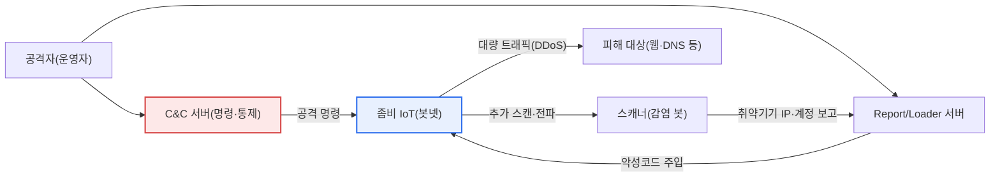
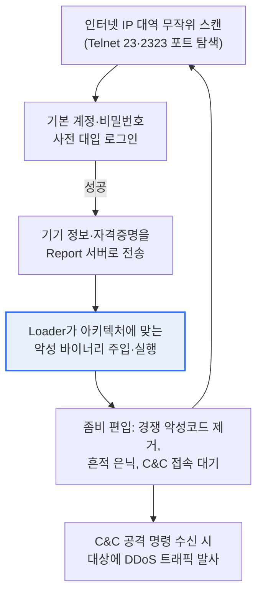

# 미라이 봇넷(Mirai Botnet)

## 1. 개요

### 가. 개념

> **미라이 봇넷**은 보안이 취약한 **IoT 기기(IP카메라·공유기·DVR 등)를 기본 계정·비밀번호 사전 대입으로 대량 감염시켜 원격 제어 좀비(bot)로 만든 뒤, 지휘·통제(C&C) 서버의 명령에 따라 대규모 DDoS 공격에 악용하는 악성코드 및 봇넷**이다. 2016년 하반기 대규모 인터넷 마비 사태를 일으키며 IoT 보안의 심각성을 전 세계에 각인시킨 대표적 위협이다.

미라이가 IoT 보안의 경종을 울린 근본 이유는 '**허술하게 방치된 IoT 기기 하나하나가 강력한 공격 무기가 된다**'는 점을 대규모로 실증했다는 데 있다. 종래의 봇넷은 주로 취약점이 많은 PC를 악성코드로 감염시켜 구성했으나, PC는 백신·방화벽·정기 패치로 어느 정도 보호되고 사용자가 상주해 이상을 알아차리기도 쉬웠다. 반면 IoT 기기는 성능이 낮아 보안 소프트웨어를 올리기 어렵고, 관리자가 없이 24시간 인터넷에 연결된 채 수년간 방치되며, 무엇보다 공장 출하 시 설정된 기본 인증정보가 그대로 남아 있는 경우가 많았다. 미라이는 이 사각지대를 정확히 노렸다.

미라이의 공격 기법은 정교한 제로데이 취약점이 아니라 놀랍도록 단순한 방식이었다는 점에서 오히려 충격적이었다. 미라이는 인터넷 주소 공간을 무작위로 스캔하며 원격 접속 포트(Telnet 23번, 2323번)가 열린 기기를 찾고, `admin/admin`, `root/12345`, `root/xc3511` 등 제조사가 흔히 쓰는 **수십 개의 기본 계정·비밀번호 목록**을 순차 대입(brute force)해 로그인에 성공하면 곧바로 악성코드를 내려받아 감염시켰다. 비밀번호를 바꾸지 않은 기기가 인터넷에 수십만 대씩 널려 있었기에, 감염은 기하급수적으로 확산되었다.

이렇게 확보한 좀비들이 C&C 서버의 한 번의 명령에 일제히 특정 대상으로 트래픽을 퍼부으면서(DDoS), 미라이는 단시간에 수백 Gbps에서 1 Tbps에 달하는 당시로선 전례 없는 규모의 공격을 만들어냈다. 미라이는 IoT가 주는 편의만큼이나 보안이 뒤처져 있으며, 개별 기기의 사소한 허술함이 결집되면 인터넷 인프라 전체를 위협할 수 있음을 보여준 상징적 사건이다.

### 나. 주요 공격 사례와 파급

미라이의 위험성은 추상적 우려가 아니라 실제 대형 장애로 드러났다. 2016년 9월 보안 저널리스트의 사이트(KrebsOnSecurity)를 향한 약 600Gbps대의 공격, 프랑스 호스팅 업체 OVH를 겨냥한 약 1Tbps에 이르는 공격이 잇따랐고, 결정적으로 **2016년 10월 미국의 주요 DNS 서비스 업체 Dyn을 마비**시키면서 트위터·넷플릭스·레딧·스포티파이 등 수많은 유명 서비스가 대규모로 접속 불능 상태에 빠졌다. DNS는 인터넷의 전화번호부에 해당하므로, DNS 한 곳이 무너지자 정상적으로 살아 있던 서비스들까지 도미노처럼 접속되지 않은 것이다. 이는 특정 사이트가 아니라 인터넷의 '공용 기반 서비스'를 노리면 파급이 훨씬 커진다는 교훈을 남겼다.

또한 미라이는 2016년 말 **소스코드가 온라인 포럼에 공개**되면서 수많은 변종(예: Satori, Okiru, Mozi 등으로 알려진 계열)을 낳았다. 공격 기법이 대중화되어 누구나 손쉽게 IoT 봇넷을 구성할 수 있게 되었다는 점에서, 미라이는 단발성 사건이 아니라 이후 IoT 위협의 '표준 설계도'가 되었다. 아래 표는 미라이의 핵심 특징을 정리한 것이다.

| 특징 | 내용 |
|---|---|
| **공격 방식** | Telnet 스캔 + 기본 계정·비밀번호 사전 대입(brute force)으로 IoT 감염 |
| **목적** | C&C 명령에 따른 대규모 DDoS(SYN·UDP·HTTP·GRE 플러딩 등 다중 벡터) |
| **규모** | 최대 수십만 대 좀비 IoT 동원, 수백 Gbps~1Tbps대 공격 |
| **파급** | 소스코드 공개로 변종 다수 확산, IoT 봇넷 대중화 |

## 2. 미라이 봇넷의 감염·공격 아키텍처

미라이의 동작을 이해하려면 '감염을 넓히는 과정'과 '명령을 받아 공격하는 과정'을 나누어 보아야 한다. 아래 전체 구조도는 봇넷의 구성요소가 어떻게 연결되는지를 보여준다.

위 구조에서 핵심은 봇넷이 스스로 몸집을 불린다는 점이다. 이미 감염된 좀비 IoT가 다시 스캐너 역할을 하며 새로운 취약 기기를 탐색하고, 발견한 기기의 IP와 통한 계정을 리포트/로더 서버로 보내면, 로더가 해당 기기에 악성코드를 주입해 새 좀비로 편입시킨다. 이렇게 감염이 자기증식하는 구조이기 때문에 초기 진압에 실패하면 봇넷은 삽시간에 대규모로 성장한다.

다음 프로세스 세부도는 하나의 취약 기기가 감염되어 공격에 동원되기까지의 단계를 순서대로 나타낸다.

### 가. 감염 단계(스캔·자격증명 대입)

감염의 출발점은 무차별 스캔이다. 미라이 봇은 인터넷 주소 공간을 빠르게 훑으며 원격 접속용 Telnet 포트가 열린 기기를 찾는다. Telnet은 암호화 없이 원격 로그인을 제공하는 오래된 프로토콜로, 편의상 IoT 기기에 활성화된 채 출하되는 경우가 많아 미라이의 1차 표적이 되었다. 이 단계에서 방어의 핵심은 '**불필요한 서비스·포트를 닫는 것**'이다. 애초에 Telnet이 인터넷에 노출되지 않았다면 대입 시도 자체가 성립하지 않기 때문이다.

포트가 열린 기기를 찾으면 미라이는 내장된 수십 개의 기본 계정·비밀번호 조합을 순차적으로 시도한다. 여기서 결정적인 취약점은 기술이 아니라 '운영 관행'이다. 제조사가 편의를 위해 동일한 기본 비밀번호를 대량 제품에 심고, 이용자가 이를 바꾸지 않으며, 기기에 강제 변경을 요구하는 절차조차 없었기 때문에 단순 대입만으로 로그인이 뚫렸다. 실제로 미라이가 사용한 자격증명 목록은 특정 제조사 제품군의 하드코딩된 계정을 상당 부분 포함하고 있었던 것으로 분석된다.

이 단계가 주는 실무적 함의는 명확하다. IoT 도입 시 '설치 즉시 기본 비밀번호를 강제 변경'하고, 가능하면 공장 출하 단계부터 기기마다 서로 다른 초기 비밀번호(unique default password)를 부여하도록 제도화해야 한다. 실제로 이후 여러 국가에서 기본·공통 비밀번호 사용을 제한하는 IoT 보안 규제를 도입한 것도 미라이의 이 대목에서 비롯되었다.

### 나. 전파·좀비화 단계(악성코드 주입)

로그인에 성공하면 봇은 기기의 정보와 자격증명을 리포트 서버에 보고하고, 로더(Loader)가 해당 기기의 CPU 아키텍처(ARM·MIPS·x86 등)에 맞는 악성 바이너리를 내려보내 실행한다. IoT 기기는 종류가 다양해 아키텍처도 제각각인데, 미라이가 여러 아키텍처용 바이너리를 준비해 폭넓게 감염시킬 수 있었던 점이 확산력을 높였다.

좀비로 편입된 기기는 자신을 보호하고 은닉하는 동작도 수행한다. 다른 경쟁 악성코드나 원격 관리 프로세스를 종료·차단해 기기를 '독점'하고, 프로세스명을 위장하거나 흔적을 지워 탐지를 회피하며, 재부팅되면 감염이 풀리는 특성(주로 메모리에 상주) 때문에 지속적으로 재감염을 시도한다. 이 대목에서 방어 관점의 함의는 '**단순 재부팅은 임시방편일 뿐, 비밀번호를 바꾸고 펌웨어를 갱신하지 않으면 곧 재감염된다**'는 것이다.

이 단계는 또한 '운영 중 지속 관리'의 중요성을 보여준다. 감염 여부를 이용자가 알아채기 어렵고, 기기가 정상 동작하는 것처럼 보여도 뒤에서 공격에 동원될 수 있으므로, 네트워크 단에서 이상 트래픽을 탐지하고 알려진 악성 C&C 도메인·IP로의 통신을 차단하는 등 상시 모니터링 체계가 필요하다.

### 다. 공격 단계(DDoS 실행)

충분한 좀비가 확보되면 공격자는 C&C 서버를 통해 목표와 공격 유형을 지정해 명령을 내리고, 좀비들이 일제히 트래픽을 발사한다. 미라이는 SYN 플러딩·UDP 플러딩·HTTP 플러딩·GRE 플러딩 등 다양한 공격 벡터를 지원해, 대상의 방어 방식에 따라 유형을 바꿔가며 공격할 수 있었다. 이렇게 여러 유형을 조합하는 '다중 벡터 DDoS'는 단일 유형만 막는 방어책을 우회하기 때문에 대응을 어렵게 만든다.

DDoS의 본질적 어려움은 트래픽 하나하나가 '정상적인 요청처럼' 보인다는 데 있다. 수십만 대의 서로 다른 IP에서 오는 요청을 무조건 차단하면 정상 이용자까지 막히므로, 볼류메트릭 공격을 흡수·분산하는 CDN·클린존(scrubbing center)과, 트래픽 패턴을 분석해 봇을 걸러내는 지능형 방어가 함께 필요하다. Dyn 사례처럼 DNS 같은 공용 인프라가 표적이 되면 다중화·애니캐스트 구성으로 특정 지점 마비가 전체 서비스로 번지지 않도록 설계하는 것도 중요하다.

### 라. 전통적 봇넷과의 비교

미라이의 성격을 정확히 파악하려면 PC 기반의 전통적 봇넷과 대비해 보는 것이 유용하다. 두 봇넷은 '다수의 감염 단말을 C&C로 통제해 악용한다'는 골격은 같지만, 감염 대상과 방식·탐지 난이도에서 뚜렷한 차이가 있으며, 이 차이가 곧 미라이가 왜 그렇게 빠르고 광범위하게 확산됐는지를 설명한다.

| 구분 | 전통적 PC 봇넷 | 미라이(IoT 봇넷) |
|---|---|---|
| **감염 대상** | PC·서버(백신·패치로 일부 보호) | IoT 기기(보안 SW 탑재 곤란, 방치) |
| **감염 방식** | 취약점 익스플로잇·피싱 첨부 등 | Telnet 기본 계정·비밀번호 사전 대입 |
| **탐지·대응** | 사용자·백신이 인지 가능 | 관리자 부재로 감염 인지 어려움 |
| **주 용도** | 스팸·정보탈취·DDoS 등 다목적 | 초기엔 대규모 DDoS 특화 |

이 비교의 실무적 함의는 'IoT는 PC와 다른 방어 전략이 필요하다'는 점이다. PC 보안이 백신·사용자 인지에 상당 부분 의존한다면, IoT는 그런 방어 수단이 부실하므로 '설계·설치 단계의 안전한 기본값'과 '네트워크 단의 이상 탐지·차단'에 무게를 두어야 한다. 미라이가 단순 기법으로도 성공한 근본 원인이 바로 이 방어 공백에 있었다.

## 3. IoT 서비스 생애주기별 보안위협 및 대응

IoT 보안은 특정 시점의 문제가 아니라 기기의 전 생애주기에 걸쳐 확보해야 하는 과제다. 미라이는 '설치 시 기본 비밀번호 방치'와 '운영 중 업데이트 부재'라는, 생애주기 관리의 대표적 허점을 정확히 파고들었다. 아래 표는 단계별 위협과 대응을 정리한 것으로, 각 단계는 앞뒤가 연결되어 있어 어느 한 단계만 강화한다고 안전이 확보되지 않는다.

| 단계 | 보안위협 | 대응 |
|---|---|---|
| **설계·개발** | 취약한 설계, 하드코딩된 계정, 검증되지 않은 SW | 시큐어 설계·코딩(Security by Design), 기본 보안 내장 |
| **배포·설치** | 기본·공통 비밀번호, 불필요 포트(Telnet) 개방 | 초기 비밀번호 강제 변경, 최소 노출(포트·서비스 축소) |
| **운영·이용** | 미패치 취약점, 악성코드 감염, 봇넷 편입 | 정기 펌웨어 업데이트, 이상 탐지·접근 통제 |
| **폐기** | 잔존 데이터·인증정보 유출, 방치된 기기의 재악용 | 데이터 완전 삭제, 인증정보 폐기, 회수·비활성화 |

특히 미라이 관점에서 가장 취약한 고리는 '배포·설치'와 '운영·이용' 단계다. 아무리 설계 단계에서 보안을 넣어도 설치 시 기본 비밀번호가 그대로면 무력화되고, 운영 중 취약점이 발견되어도 패치가 배포·적용되지 않으면 공격 창구는 계속 열려 있다. 따라서 생애주기 관리는 '한 번의 조치'가 아니라 '지속적 관리 체계'로 접근해야 한다.

## 4. IoT 공통보안 7대 원칙

IoT 보안 강화를 위해 국내외 기관이 제시한 공통보안 원칙은 설계부터 폐기까지 보안을 내재화할 것을 요구한다. 이 원칙들은 미라이가 노출한 허점에 대한 직접적 대응책이라는 점에서 함께 이해하면 좋다. 예컨대 '안전한 초기 보안설정' 원칙은 기본 비밀번호 대입을, '최신 보안 패치' 원칙은 운영 중 방치를 겨냥한다.

| 원칙(요지) | 내용 | 미라이 관점의 의미 |
|---|---|---|
| **1. 설계 단계 보안 내재화** | 기획·설계부터 보안 반영(Security by Design) | 하드코딩 계정 제거의 출발점 |
| **2. 안전한 SW·하드웨어** | 검증된 개발·시큐어 코딩 | 취약 바이너리 실행 차단 |
| **3. 안전한 초기 보안설정** | 기본 비밀번호 변경 등 안전 기본값 | 사전 대입 자체를 무력화 |
| **4. 인증·암호화 적용** | 상호 인증, 데이터·통신 암호화 | Telnet 등 평문 접속 대체 |
| **5. 최신 보안 패치·업데이트** | 지속적 취약점 조치 | 운영 중 방치 방지 |
| **6. 안전한 운영·관리** | 이상 탐지, 접근 통제 | 봇넷 편입 조기 탐지 |
| **7. 침해 대응·복구 체계** | 사고 대응·안전한 폐기 | 감염 확산 차단·복구 |

원칙을 '항목의 나열'로만 외우면 실전에서 힘을 발휘하지 못한다. 중요한 것은 각 원칙이 '어느 공격 단계를 끊는가'를 이해하는 것이다. 미라이의 감염 사슬(스캔→대입→주입→공격)에서 어느 한 고리라도 끊으면 봇넷화가 저지되므로, 원칙들은 서로 중첩된 다층 방어(defense in depth)로 작동한다.

## 5. 심화 — 미라이 이후의 위협 변화와 규제 동향

미라이가 남긴 가장 큰 유산은 소스코드 공개로 인한 '변종의 시대'다. 미라이의 기본 골격(스캔–대입–로더–C&C–DDoS)을 재활용하면서, 기본 비밀번호 대입에 그치지 않고 **알려진 기기 취약점(CVE) 익스플로잇을 결합**해 감염력을 높인 변종들이 잇따라 등장했다. 또한 일부 IoT 봇넷은 순수 DDoS를 넘어 암호화폐 채굴, 프록시 악용, 정보 탈취 등으로 목적을 다변화하는 경향을 보인다. 즉 IoT 봇넷은 미라이를 원형으로 삼아 '더 다양하게 감염하고, 더 다양하게 돈을 버는' 방향으로 진화해 왔다고 이해하는 것이 타당하다.

규제·표준 측면에서도 미라이는 분수령이 되었다. 여러 국가·기관이 **IoT 기기의 기본·공통 비밀번호 사용을 제한**하고, 취약점 신고 접수 창구 운영, 보안 업데이트 제공 기간 명시 등을 요구하는 방향으로 제도를 정비했다. 대표적으로 영국은 소비자용 커넥티드 기기에 대한 보안 요건(공통 기본 비밀번호 금지 등)을 법제화하는 흐름을 보였고, 미국·EU도 IoT 보안 라벨링·인증과 관련한 정책을 추진해 왔다. 국내에서도 IoT 보안 인증과 공통보안 가이드가 마련되어, '보안이 검증된 기기'를 시장이 선택하도록 유도하는 방향으로 정책이 발전하고 있다. (구체적 법령·제도의 명칭과 시행 시점은 국가별로 상이하며 지속 개정되므로, 인용 시 최신 원문을 확인하는 것이 바람직하다.)

기술적 대응도 진화했다. 통신사·클라우드 사업자는 대규모 볼류메트릭 DDoS를 흡수하는 스크러빙 인프라와 애니캐스트 기반 분산 방어를 강화했고, 기업은 IoT 기기를 별도 세그먼트로 격리(network segmentation)해 감염되더라도 내부 확산과 외부 공격 참여를 제한하는 제로트러스트 지향의 설계를 채택하고 있다. 시험 답안 관점에서는 '미라이의 단순함이 왜 통했는가(운영 관행의 허점)'와 '그 이후 방어·규제가 어떻게 다층화되었는가'를 대비시켜 서술하면 깊이를 보여줄 수 있다.

## 6. 고려사항 및 시사점 (기술사 관점)

1. **기본값 보안이 첫 방어선이다.** 미라이가 증명했듯 기본·공통 계정·비밀번호 방치가 최대 취약점이므로, 설치 시 강제 비밀번호 변경, 기기별 고유 초기 비밀번호 부여, 불필요한 Telnet 등 원격 포트 폐쇄를 우선 적용해야 한다. 가장 단순한 조치가 가장 큰 효과를 내는 영역이다.

2. **생애주기 전반의 지속 관리가 필요하다.** IoT는 배포 후 오래 방치되기 쉬우므로, 원격 펌웨어 업데이트(OTA)와 보안 업데이트 제공 기간의 명시, 취약점 발견 시 신속 배포 체계가 필수다. '설치하고 잊는' 기기에는 자동화된 관리가 답이다.

3. **집단 위협·생태계 책임의 관점이 중요하다.** 개별 IoT는 사소해도 대량 결집되면 인터넷 인프라를 위협하므로, 제조사(안전한 설계·업데이트)·이용자(초기 설정·관리)·통신사(이상 트래픽 차단)·정부(규제·인증)가 함께 책임지는 생태계 차원의 보안이 요구된다. 어느 한 주체의 노력만으로는 근절되지 않는 구조적 문제다.

4. **다층 방어와 회복탄력성을 설계에 반영해야 한다.** 감염 사슬의 여러 고리를 동시에 끊는 다층 방어(포트 폐쇄+강한 인증+패치+이상 탐지)와, DNS 등 공용 인프라의 다중화·애니캐스트, DDoS 스크러빙, IoT 망분리(세그먼테이션)를 병행해 '완전한 예방'이 아니라 '피해 최소화와 신속 복구'까지 포함하는 전략으로 접근해야 한다.

5. **규제·인증 흐름을 사업 전략에 반영해야 한다.** 기본 비밀번호 금지·보안 라벨링 등 IoT 보안 규제가 세계적으로 강화되는 추세이므로, 제품을 개발·수출하는 조직은 규제 준수를 비용이 아닌 시장 진입 요건이자 신뢰 자산으로 인식하고 선제적으로 대응하는 것이 유리하다.

## 참고자료

- CISA, "Understanding and Responding to Distributed Denial-of-Service Attacks": https://www.cisa.gov/news-events/news/understanding-denial-service-attacks
- Cloudflare Learning, "What is the Mirai botnet?": https://www.cloudflare.com/learning/ddos/glossary/mirai-botnet/
- KrebsOnSecurity, "Source Code for IoT Botnet 'Mirai' Released": https://krebsonsecurity.com/2016/10/source-code-for-iot-botnet-mirai-released/
- 한국인터넷진흥원(KISA) IoT 보안 자료실: https://www.kisa.or.kr/

---

> **한 줄 요약**: 미라이 봇넷은 *Telnet 포트가 열리고 기본 비밀번호가 방치된 IoT 기기를 사전 대입으로 대량 감염시켜 C&C 명령에 따라 대규모 DDoS에 악용* 한 대표적 IoT 위협으로, 감염 사슬(스캔→대입→주입→공격)을 다층으로 끊는 생애주기별 보안·공통보안 7대 원칙과, 소스코드 공개 이후의 변종 확산·기본 비밀번호 규제 강화를 함께 이해해야 한다.
