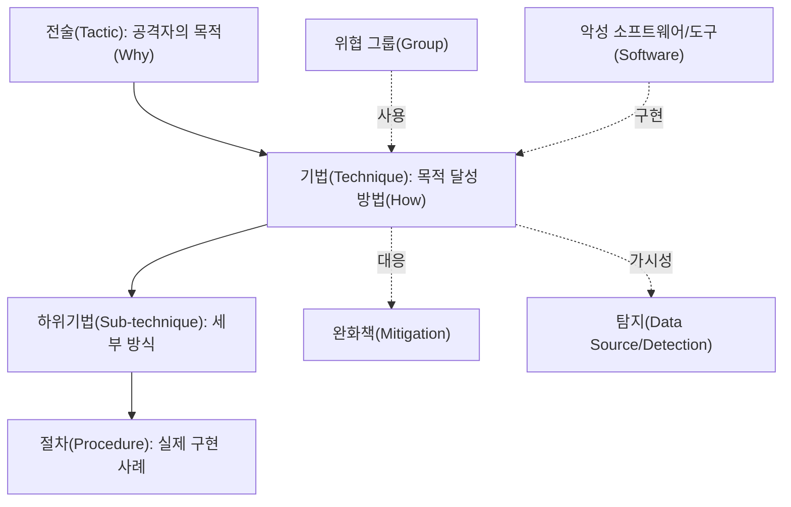
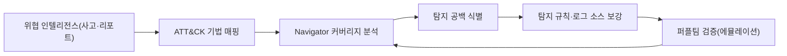

# MITRE ATT&CK (사이버 공격 전술·기법 지식베이스)

## 1. 개요

> **MITRE ATT&CK(Adversarial Tactics, Techniques, and Common Knowledge)** 은 실제 침해사고에서 관측된 공격자의 행위를 **전술(Tactic)·기법(Technique)·절차(Procedure)** 로 체계화한, 미국 비영리 연구기관 MITRE가 구축·공개한 **공격 행위 지식베이스**이다.

전통적 보안 대응은 악성코드 해시·시그니처·IP 같은 **침해지표(IoC, Indicator of Compromise)** 에 의존해 왔다. 그러나 공격자는 해시나 IP를 손쉽게 바꾸므로, 지표 기반 탐지는 이미 알려진 공격의 재탕에는 유효해도 변형·신규 공격에는 취약하다. 보안 실무자들은 "공격자가 무엇(파일·주소)을 썼는가"보다 "공격자가 **어떻게 행동하는가**", 즉 침투 후 권한을 상승시키고 내부를 이동하며 데이터를 빼내는 **행위 패턴**이 훨씬 바꾸기 어렵다는 점에 주목했다. ATT&CK은 바로 이 **관측된 실제 행위(Observed Behavior)** 를 공통 언어로 정리해, 조직이 자신의 탐지·방어 역량을 공격자 관점에서 점검할 수 있도록 한다.

ATT&CK은 David Bianco가 제시한 **고통의 피라미드(Pyramid of Pain)** 개념과 맞닿아 있다. 해시·IP는 공격자가 바꾸기 쉬워 방어자에게 주는 '고통'이 작지만, 도구(Tools)와 전술·기법·절차(TTPs)를 무력화하면 공격자는 작전 방식을 근본적으로 재설계해야 하므로 방어 효과가 크다. ATT&CK은 이 TTP 계층을 표준 식별자로 목록화함으로써, 조직마다 제각각이던 위협 서술을 상호 비교·공유 가능한 형태로 바꾸었다는 데 의의가 있다.

주요 특징은 다음과 같다. 첫째, **실증 기반(Evidence-based)** 으로, 이론적 위협이 아니라 공개 위협 인텔리전스와 사고 보고서에서 확인된 행위만 등재한다. 둘째, **매트릭스 구조**로 전술(열)과 기법(행)을 교차시켜 공격 생애주기를 한눈에 조망한다. 셋째, **무료·개방**되어 누구나 웹·API·STIX로 활용할 수 있다. 넷째, Enterprise·Mobile·ICS 등 **도메인별 매트릭스**로 확장되어 IT뿐 아니라 산업제어시스템까지 포괄한다.

## 2. 전체 구조와 핵심 구성요소

ATT&CK의 근간은 **전술–기법–절차(TTP)** 의 3계층 모델이며, 여기에 위협 그룹(Group)·소프트웨어(Software)·완화책(Mitigation)·탐지(Detection)가 연결된다.

**전술(Tactic)** 은 공격자가 특정 단계에서 달성하려는 **목적**을 의미한다. Enterprise 매트릭스는 정찰(Reconnaissance), 자원개발(Resource Development), 초기침투(Initial Access), 실행(Execution), 지속(Persistence), 권한상승(Privilege Escalation), 방어우회(Defense Evasion), 자격증명접근(Credential Access), 탐색(Discovery), 내부이동(Lateral Movement), 수집(Collection), 명령제어(Command & Control), 유출(Exfiltration), 임팩트(Impact)의 14개 전술로 구성된다. 각 전술은 "왜(Why)" 그 행동을 하는지를 나타내는 상위 범주다.

**기법(Technique)** 은 전술 목적을 달성하는 **구체적 방법(How)** 이며 `T####` 형식의 식별자를 갖는다. 예컨대 자격증명접근 전술에는 자격증명 덤핑(T1003), 무차별 대입(T1110) 등의 기법이 속한다. 하나의 기법이 여러 전술에 동시에 속할 수 있다는 점이 중요한데, 예를 들어 유효 계정 사용(Valid Accounts, T1078)은 초기침투·지속·권한상승·방어우회의 네 전술에 걸쳐 있다. 이는 공격 행위가 목적에 따라 다르게 해석될 수 있음을 반영한다.

**하위기법(Sub-technique)** 은 2020년 도입된 계층으로 `T####.###` 형식을 가지며, 기법을 더 세분화한다. 자격증명 덤핑(T1003)은 LSASS 메모리(T1003.001), SAM(T1003.002) 등으로 나뉜다. **절차(Procedure)** 는 특정 위협 그룹이나 도구가 그 기법을 실제로 **어떻게 구현했는지**에 대한 사례로, 가장 구체적인 수준의 정보다. 여기에 위협 그룹(APT29, Lazarus 등)과 소프트웨어(Mimikatz, Cobalt Strike 등)가 태깅되어, "어떤 그룹이 어떤 도구로 어떤 기법을 쓰는가"를 교차 추적할 수 있다.

| 구분 | 의미 | 식별자 예 | 예시 |
|------|------|-----------|------|
| 전술(Tactic) | 공격 목적(Why) | TA0006 | 자격증명 접근 |
| 기법(Technique) | 달성 방법(How) | T1003 | OS 자격증명 덤핑 |
| 하위기법 | 세부 방식 | T1003.001 | LSASS 메모리 |
| 절차(Procedure) | 실제 구현 사례 | — | Mimikatz로 LSASS 접근 |

## 3. 매트릭스 도메인과 유사 프레임워크 비교

ATT&CK은 대상 환경에 따라 세 개의 주요 매트릭스로 구분된다. **Enterprise 매트릭스**는 Windows·macOS·Linux·클라우드(IaaS·SaaS·Office 365)·컨테이너·네트워크 장비를 포괄하는 가장 방대한 도메인이다. **Mobile 매트릭스**는 Android·iOS 환경의 공격 행위를, **ICS 매트릭스**는 발전·제조 등 산업제어시스템(OT) 특유의 공격(예: 안전장치 무력화, 물리 프로세스 조작)을 다룬다. 이처럼 도메인을 분리한 이유는 각 환경의 자산·취약점·공격 표면이 근본적으로 다르기 때문이며, 특히 ICS는 가용성과 안전(Safety)이 최우선이라는 점에서 IT와 방어 우선순위가 다르다.

ATT&CK을 자주 비교하는 프레임워크로 **Lockheed Martin의 사이버 킬체인(Cyber Kill Chain)** 이 있다. 킬체인은 정찰→무기화→전달→취약점공격→설치→C2→목표행동의 7단계로 공격을 **선형적**으로 모델링한다. 반면 ATT&CK은 단계의 선형 순서를 강제하지 않고, 실제 공격에서 나타나는 **비선형적·반복적** 행위를 매트릭스로 표현한다는 점이 핵심 차이다. 실무에서는 킬체인으로 큰 흐름(전략적 관점)을 잡고, ATT&CK으로 각 단계 내부의 세부 기법(전술적 관점)을 매핑하는 방식으로 상호보완하는 경우가 많다.

| 구분 | Cyber Kill Chain | MITRE ATT&CK |
|------|------------------|--------------|
| 관점 | 선형 7단계(전략적) | 비선형 매트릭스(전술적) |
| 초점 | 공격 진행 흐름 | 구체적 행위(TTP) |
| 침투 후 상세 | 상대적으로 얕음 | 매우 상세(내부이동·지속 등) |
| 활용 | 전체 방어 개념 설계 | 탐지 커버리지·위협 헌팅 |

다만 두 프레임워크가 "무엇을 하는가"를 다룬다면, 최근에는 **공격자의 목표·동기·의사결정**까지 모델링하는 접근이 보완적으로 논의된다. 예컨대 방어자 관점의 대응 지식베이스인 **MITRE D3FEND** 나 능동적 기만·대응을 다루는 **MITRE Engage** 는 ATT&CK을 방어·기만 측면에서 확장한 자매 프로젝트로, ATT&CK의 공격 기법과 상호 매핑되어 함께 활용된다.

## 4. 실무 활용 방안

ATT&CK의 실질적 가치는 **탐지 역량의 가시화**에 있다. 이를 지원하는 핵심 도구가 **ATT&CK Navigator** 로, 매트릭스 위에 조직의 탐지·방어 현황을 색으로 칠해 **커버리지 히트맵**을 만든다. 어떤 기법이 붉게(미탐지) 남아 있는지 한눈에 드러나므로, 보안 투자 우선순위를 데이터 기반으로 결정할 수 있다.

첫째, **위협 인텔리전스(CTI) 구조화**에 쓰인다. 침해사고나 APT 보고서를 ATT&CK 기법으로 매핑하면, 서로 다른 기관의 위협 정보를 공통 언어로 비교·집계할 수 있다. 둘째, **탐지 공백 분석(Gap Analysis)** 이다. 조직의 EDR·SIEM 탐지 규칙을 기법에 매핑해 커버되지 않는 영역을 식별하고, 필요한 로그 소스(예: 프로세스 생성, PowerShell 로그)를 보강한다. 셋째, **위협 헌팅(Threat Hunting)** 의 가설 수립 기준으로 활용한다. "우리 환경에서 T1003 LSASS 덤핑이 발생한다면 어떤 로그에 흔적이 남을까"를 출발점으로 능동적 탐색을 수행한다.

넷째, **적대적 에뮬레이션(Adversary Emulation)** 과 **퍼플팀(Purple Team)** 검증이다. MITRE가 제공하는 **CALDERA**, 오픈소스 **Atomic Red Team** 등은 특정 위협 그룹의 TTP를 실제로 재현해 탐지 규칙이 작동하는지 검증한다. 예를 들어 금융권 CSIRT가 Lazarus 그룹의 공개 TTP(스피어피싱→PowerShell 실행→자격증명 덤핑→내부이동)를 Atomic Red Team으로 재현했을 때 3개 단계는 탐지되었으나 내부이동(T1021) 구간이 탐지되지 않았다면, 해당 로그 소스와 상관분석 규칙을 즉시 보강하는 식의 구체적 개선이 가능하다. 이처럼 ATT&CK은 "우리가 무엇을 탐지하지 못하는가"를 **측정 가능한 지표**로 바꿔 준다는 점에서 SOC 성숙도 향상의 중심축이 된다. 다섯째, 보안 솔루션 도입 시 벤더의 탐지 범위를 ATT&CK 기법 기준으로 요구·비교함으로써 마케팅 용어에 휘둘리지 않는 객관적 평가가 가능하다. MITRE는 실제로 상용 보안 제품을 대상으로 **ATT&CK Evaluations** 를 수행해 탐지 결과를 공개한다.

## 5. 고려사항 및 시사점

첫째, **커버리지 착시(Coverage Illusion)** 를 경계해야 한다. Navigator에서 특정 기법을 '탐지 가능'으로 칠했다고 해서 모든 변형·우회 절차를 잡는다는 뜻은 아니다. 기법 수준의 커버리지와 실제 절차 수준의 탐지력은 다르므로, "모든 칸을 초록으로 채우기"를 목표로 삼기보다 조직에 위협이 되는 그룹의 **우선순위 기법**에 집중하는 위협 기반(Threat-informed) 접근이 바람직하다.

둘째, **적용의 트레이드오프**가 존재한다. ATT&CK 매핑과 탐지 규칙 유지는 상당한 전문 인력·로그 저장·분석 비용을 수반한다. 성숙도가 낮은 조직이 14개 전술 전체를 한 번에 다루려 하면 과부하에 빠지므로, 초기침투·자격증명접근·내부이동처럼 사고 파급이 큰 소수 전술부터 좁게 시작해 점진적으로 확장하는 전략이 현실적이다. 로그 소스 확보(가시성)가 선행되지 않으면 어떤 매핑도 공허하다는 점도 유념해야 한다.

셋째, **자동화·표준 연계** 전망이 중요하다. ATT&CK은 STIX/TAXII 기반으로 기계 판독이 가능해 SIEM·SOAR·TIP와 연동되며, 탐지 규칙 표준인 **Sigma** 규칙에 ATT&CK 태그를 부여해 규칙과 기법을 자동 연계하는 흐름이 확산되고 있다. 나아가 최근에는 생성형 AI로 위협 보고서에서 ATT&CK 기법을 자동 추출하거나 탐지 규칙을 생성하는 시도가 늘고 있어, 인력 부담을 완화하는 방향으로 발전할 것으로 전망된다. 다만 자동 매핑의 정확도 검증(사람 검수)은 여전히 필요하다.

넷째, **버전 관리와 거버넌스** 관점이 필요하다. ATT&CK은 반기 단위로 개정되어 기법이 추가·통폐합·재분류되므로, 조직의 탐지 규칙과 매핑도 특정 버전을 기준으로 형상관리해야 한다. 프레임워크 개정 시 커버리지 지표가 급변할 수 있으므로, 버전 전환 절차와 책임 조직을 명확히 하는 운영 거버넌스가 장기적 활용의 관건이다. 궁극적으로 ATT&CK은 단독 도구가 아니라 **위협 인텔리전스–탐지–대응–검증**을 잇는 공통 언어이자 성숙도 측정 척도로 자리매김하고 있으며, 킬체인·D3FEND·제로트러스트 등 다른 보안 체계와 유기적으로 결합될 때 효과가 극대화된다.

## 참고자료

- MITRE ATT&CK 공식 사이트 — https://attack.mitre.org/
- MITRE ATT&CK Navigator — https://mitre-attack.github.io/attack-navigator/
- MITRE, "ATT&CK Design and Philosophy" — https://attack.mitre.org/resources/
- MITRE D3FEND — https://d3fend.mitre.org/

---
> **한 줄 요약**: MITRE ATT&CK은 실제 침해사고에서 관측된 공격 행위를 전술·기법·절차(TTP)로 체계화한 개방형 지식베이스로, 바꾸기 쉬운 IoC 대신 바꾸기 어려운 공격자 행위에 초점을 맞춰 탐지 공백 분석·위협 헌팅·적대적 에뮬레이션·솔루션 평가의 공통 언어로 활용된다.
