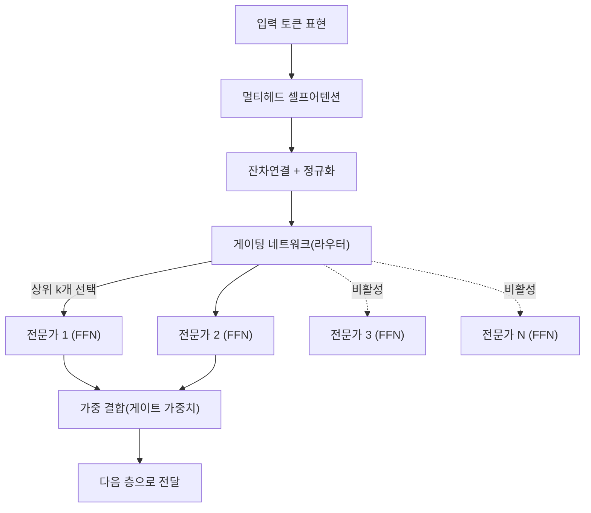
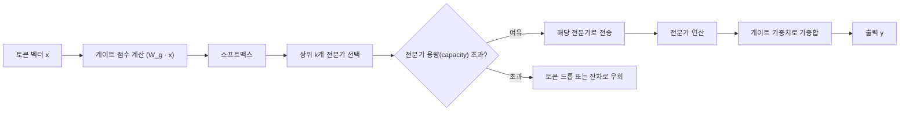

# 혼합 전문가 모델(MoE, Mixture of Experts)

## 1. 개요

> **정의**: 혼합 전문가 모델(MoE)은 하나의 거대한 신경망을 여러 개의 **전문가(Expert)** 서브네트워크로 나누고, **게이팅 네트워크(Gating Network, 라우터)**가 입력 토큰마다 소수의 전문가만 선택적으로 활성화(sparse activation)하여 연산을 수행하는 조건부 계산(conditional computation) 기반의 아키텍처이다.

MoE의 등장 배경은 대규모 언어모델(LLM)이 직면한 **"파라미터는 늘리고 싶지만 연산비용은 감당할 수 없다"**는 근본적 긴장에 있다. 트랜스포머는 파라미터와 데이터를 키울수록 성능이 예측 가능하게 향상되는 규모의 법칙(scaling law)을 따르지만, 기존의 밀집(Dense) 모델은 모든 입력에 대해 전체 파라미터를 빠짐없이 계산한다. 즉 파라미터를 2배로 늘리면 학습·추론 비용도 거의 2배로 증가하여, 파라미터 규모가 수천억을 넘어서면 GPU 메모리와 전력 비용이 기하급수적으로 불어난다.

MoE는 이 문제를 **"모델의 지식 용량(총 파라미터)"과 "토큰당 실제 연산량(활성 파라미터)"을 분리**함으로써 해결한다. 예컨대 전문가가 8개 있고 토큰마다 2개만 활성화하면, 모델은 8배의 지식을 담으면서도 연산은 2개 전문가분만 수행한다. 이는 인간 조직이 모든 업무를 한 사람이 처리하지 않고 분야별 전문가에게 분업시키는 것과 같은 원리로, "필요한 지식만 꺼내 쓴다"는 발상이다.

이러한 희소 활성화 덕분에 MoE는 동일 연산 예산(FLOPs)에서 밀집 모델보다 훨씬 큰 유효 용량을 확보하며, GPT-4·Mixtral·DeepSeek-V3·Gemini 등 최신 초거대 모델의 핵심 설계로 자리 잡았다. 답안에서는 MoE를 단순한 성능 향상 기법이 아니라, **"연산 효율과 모델 규모의 트레이드오프를 재정의한 확장 패러다임"**으로 서술하는 것이 타당하다.

## 2. MoE 전체 아키텍처

MoE는 트랜스포머 블록 내부의 **피드포워드 신경망(FFN)** 층을 하나의 큰 FFN 대신 여러 개의 전문가 FFN과 라우터로 대체하는 방식으로 구현되는 것이 일반적이다. 아래 개념도는 입력 토큰이 라우터를 거쳐 상위 k개 전문가로 분배되고, 그 출력이 가중 결합되어 다음 층으로 전달되는 전체 골격을 나타낸다.

**전문가(Expert)**는 각각 독립적인 파라미터를 가진 FFN이며, 학습 과정에서 서로 다른 유형의 패턴(예: 특정 언어, 문법 구조, 도메인 지식)에 자연스럽게 특화된다. 다만 이 특화는 사람이 명시적으로 지정하는 것이 아니라, 데이터 분포와 라우팅 학습을 통해 **창발적(emergent)**으로 형성된다는 점이 중요하다. 실제로 특정 전문가가 코드 토큰에, 다른 전문가가 수식·구두점에 편중되는 현상이 관측된다.

**라우터(게이팅 네트워크)**는 입력 토큰 벡터를 받아 각 전문가에 대한 점수를 계산하고, 소프트맥스를 거쳐 상위 k개 전문가를 선택한다. 라우터는 보통 하나의 선형 계층이라 파라미터가 매우 작지만, "어떤 토큰을 어느 전문가에게 보낼 것인가"라는 결정이 모델 성능을 좌우하는 핵심이므로 MoE 설계에서 가장 민감한 부분이다.

**결합(Combine)** 단계에서는 선택된 전문가들의 출력을 라우터가 부여한 게이트 가중치로 가중합한다. 활성화되지 않은 전문가는 계산 자체를 건너뛰므로, 총 파라미터가 아무리 커도 토큰당 연산량은 k개 전문가분으로 고정된다.

## 3. 라우팅 메커니즘과 동작 절차

MoE의 성패는 라우팅에 달려 있다. 대표적인 방식이 **Top-k 라우팅**으로, 구글의 Switch Transformer는 k=1(가장 강한 전문가 하나만)로 극단적 희소성을 추구했고, Mixtral 8x7B는 8개 전문가 중 k=2를 선택한다. 아래 다이어그램은 토큰 단위 라우팅과 부하 균형이 이루어지는 처리 흐름을 나타낸다.

동작 절차를 단계별로 보면 다음과 같다. 첫째, 라우터가 토큰 벡터에 게이트 가중치 행렬을 곱해 각 전문가에 대한 선호 점수를 산출한다. 둘째, 소프트맥스로 확률화한 뒤 상위 k개를 고른다. 셋째, 각 전문가에는 처리 가능한 토큰 수 상한인 **용량 요소(capacity factor)**가 정해져 있어, 특정 전문가에 토큰이 몰려 용량을 초과하면 넘친 토큰은 처리되지 못하고 드롭되거나 잔차 연결로 우회된다. 넷째, 선택된 전문가들의 출력을 가중합해 최종 출력을 만든다.

여기서 MoE의 가장 큰 난제인 **부하 불균형(load imbalance)**이 발생한다. 라우터가 특정 소수 전문가만 편애하면 그 전문가에는 토큰이 폭주해 드롭이 늘고, 나머지 전문가는 학습이 되지 않아 "죽은 전문가"가 된다. 이를 막기 위해 학습 손실에 **부하 균형 손실(auxiliary load-balancing loss)**을 추가하여 토큰이 전문가 전체에 고르게 분산되도록 유도한다. 최근 DeepSeek-V3는 보조 손실이 성능을 해치는 부작용을 줄이고자 보조 손실 없이 편향 항(bias)만으로 균형을 맞추는 기법을 도입하기도 했다.

또한 라우팅 결정은 학습 초기에 불안정하기 쉬워, 라우터 z-loss로 게이트 로짓의 발산을 억제하거나, 학습·추론 간 라우팅 일관성을 확보하는 등의 안정화 기법이 병행된다.

## 4. Dense 모델과의 비교 및 적용 사례

MoE와 밀집(Dense) 모델의 차이는 단순한 구조 차이를 넘어, 자원 배분 철학의 차이에서 비롯된다. 밀집 모델은 모든 토큰에 동일한 연산을 균일하게 투입하는 반면, MoE는 토큰마다 필요한 전문가에게만 연산을 배분하는 **조건부 계산**을 수행한다. 그 결과 아래와 같은 상반된 특성이 나타난다.

| 구분 | Dense 모델 | MoE 모델 |
|------|-----------|----------|
| 활성 파라미터 | 전체 파라미터 = 활성 파라미터 | 활성 파라미터 ≪ 총 파라미터 |
| 연산량(추론) | 파라미터에 비례해 큼 | 활성 전문가분만 계산해 작음 |
| 메모리(VRAM) | 활성 파라미터만큼 | 총 파라미터 전체를 적재 필요 |
| 학습 안정성 | 안정적 | 부하 불균형·라우팅 붕괴 위험 |
| 파인튜닝 | 용이 | 과적합·불안정으로 까다로움 |

이 비교에서 핵심은 **MoE가 "연산은 절약하지만 메모리는 절약하지 못한다"**는 점이다. 활성화되지 않는 전문가도 언제 선택될지 모르므로 모든 파라미터를 GPU 메모리에 올려 두어야 한다. 따라서 MoE는 연산(FLOPs)이 병목인 환경에서는 큰 이득을 주지만, 메모리가 부족한 온디바이스·엣지 환경에는 오히려 불리할 수 있다. 여기서 "전문가 병렬화(expert parallelism)"라는 분산 기법이 중요해지는데, 전문가들을 여러 GPU에 분산 배치하고 토큰을 해당 GPU로 보내는(all-to-all 통신) 방식으로 메모리 부담을 나눈다. 다만 이 all-to-all 통신이 새로운 병목이 되어, 통신 대역폭이 MoE 학습 속도를 좌우하는 요인이 된다.

구체적 사례로, **Mixtral 8x7B**는 총 파라미터가 약 467억 개지만 토큰당 활성 파라미터는 약 129억 개에 불과하여, 130억 급의 추론 비용으로 700억 급 밀집 모델에 필적하는 성능을 보였다. **Switch Transformer**는 최대 1.6조 파라미터까지 확장하면서도 토큰당 연산은 기존 T5 수준을 유지했고, **DeepSeek-V3**는 총 6710억 파라미터 중 토큰당 약 370억만 활성화하는 세밀한(fine-grained) 전문가 설계로 학습 효율을 크게 높였다. 이처럼 MoE는 "같은 연산 예산에서 더 큰 지식 용량"이라는 실질적 이득을 수치로 입증하고 있다.

## 5. 심화: 최신 동향과 설계 진화

MoE 설계는 최근 몇 가지 방향으로 정교화되고 있다. 첫째, **세밀한 전문가(fine-grained experts)** 추세로, 소수의 큰 전문가 대신 다수의 작은 전문가를 두어 조합의 다양성을 높이고 지식 특화를 촉진한다. 둘째, **공유 전문가(shared expert)** 도입으로, 항상 활성화되는 공용 전문가를 두어 공통 지식을 담당시키고 나머지 라우팅 전문가는 특화 지식에 집중하게 함으로써 지식 중복을 줄인다(DeepSeek-MoE). 셋째, 학습을 방해하던 보조 손실을 제거하고 편향 조정만으로 부하를 균형화하는 **auxiliary-loss-free** 기법이 확산되고 있다.

또한 밀집 모델을 MoE로 변환하는 **업사이클링(upcycling)**, 추론 시 라우팅을 근사·양자화하여 서빙 비용을 낮추는 최적화, 여러 도메인·모달리티에 전문가를 배정하는 멀티모달 MoE 등이 활발히 연구되고 있다. 이러한 흐름은 결국 "적은 연산으로 더 큰 모델"이라는 MoE의 근본 목표를 정밀화하는 과정으로 이해할 수 있으며, 기술사 관점에서는 하드웨어(HBM 용량·인터커넥트 대역폭)와 소프트웨어(라우팅·병렬화) 설계가 맞물려 발전한다는 점에 주목할 필요가 있다.

## 6. 고려사항 및 시사점

첫째, **연산-메모리 트레이드오프의 명확한 인식**이 필요하다. MoE는 추론 연산은 줄이지만 총 파라미터를 모두 적재해야 하므로, 도입 전 목표 환경이 연산 병목인지 메모리 병목인지를 먼저 진단하고, 클라우드 대규모 서빙(연산 병목)과 엣지·온디바이스(메모리 병목)를 구분해 적용 전략을 세워야 한다.

둘째, **라우팅 안정성과 부하 균형이 운영 리스크**이다. 부하 불균형은 죽은 전문가와 성능 저하를 초래하므로, 부하 균형 손실·용량 요소·라우터 정규화 등을 조합해 튜닝하고, 학습·서빙 중 전문가별 토큰 분포를 상시 모니터링하는 관측성(observability) 체계를 갖춰야 한다.

셋째, **파인튜닝·도메인 적응의 난이도**를 고려해야 한다. MoE는 밀집 모델보다 미세조정 시 과적합과 라우팅 붕괴에 취약하므로, 전문가 일부만 조정하거나 라우터를 동결하는 등 신중한 전략과 충분한 데이터가 요구된다.

넷째, **인프라·비용 관점의 총소유비용(TCO) 산정**이 중요하다. 활성 파라미터 기준의 낮은 추론 비용만 보고 도입했다가, 전체 파라미터 적재를 위한 고용량 GPU와 고속 인터커넥트(NVLink·InfiniBand) 투자, all-to-all 통신 오버헤드로 예상보다 비용이 커질 수 있으므로, FinOps 관점에서 연산·메모리·통신 비용을 종합해 평가해야 한다.

다섯째, **전망**으로, MoE는 초거대 모델의 사실상 표준 확장 기법으로 자리 잡아 가고 있으며, 조건부 계산이라는 원리는 향후 멀티모달·에이전트형 모델에서 더욱 폭넓게 활용될 것으로 보인다. 다만 "규모만 키우는" 접근의 한계도 함께 논의되고 있어, 데이터 품질·정렬(alignment)·효율화와 균형 잡힌 발전이 요구된다.

---

> **한 줄 요약**: MoE는 게이팅 네트워크가 토큰마다 소수의 전문가만 선택적으로 활성화하는 조건부 계산으로 "총 파라미터(지식 용량)"와 "활성 파라미터(연산량)"를 분리해, 같은 연산 예산에서 훨씬 큰 모델을 실현하는 대규모 AI의 핵심 확장 아키텍처다.
