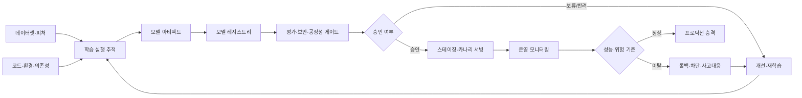
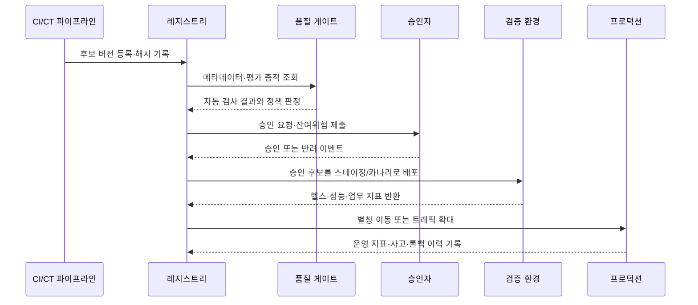

# 머신러닝 모델 레지스트리(Model Registry)와 승인·배포 거버넌스

## 1. 개요

> **정의**: 모델 레지스트리(Model Registry)는 머신러닝 모델과 그 버전, 학습 실행, 데이터·코드 계보, 평가 결과, 승인 상태, 배포 참조 및 운영 메타데이터를 중앙에서 관리하여 모델의 개발부터 폐기까지를 통제하는 시스템이다.

머신러닝 프로젝트가 실험 단계에 머물 때는 노트북과 파일 저장소만으로도 모델을 보관할 수 있다.
그러나 여러 팀이 수십 개 이상의 모델을 운영하면 파일 이름과 폴더만으로는 어떤 모델이 실제 서비스에 사용되는지 설명하기 어렵다.
동일한 이름의 모델 파일이 여러 버킷에 존재하고, 학습 데이터의 기준일과 코드 버전이 기록되지 않으면 장애가 발생했을 때 결과를 재현할 수 없다.

모델 레지스트리는 이 문제를 “모델 파일을 저장하는 곳”이 아니라 “운영 가능한 모델 자산의 기준 시스템(System of Record)”으로 해결한다.
레지스트리에 등록된 모델은 단순한 바이너리가 아니라 버전, 입력·출력 서명, 학습 실행, 평가 지표, 의존 라이브러리, 보안 점검 결과, 책임자와 승인 이력을 가진 관리 대상이다.
따라서 레지스트리는 MLOps 파이프라인과 모델 리스크 관리 사이를 연결하는 통제 지점이 된다.

모델 레지스트리의 핵심은 버전 번호를 붙이는 일 자체가 아니다.
어떤 후보를 왜 등록했는지, 어떤 검증을 통과했는지, 누가 어느 환경으로 승격했는지, 현재 트래픽을 받는 버전과 이전 버전은 무엇인지가 추적되어야 한다.
이 정보가 있어야 새 모델을 빠르게 배포하면서도 문제가 생기면 동일한 조건으로 되돌릴 수 있다.

### 1.1 등장 배경과 필요성

첫째, 모델 산출물이 많아지면서 발견 가능성과 중복 방지가 필요해졌다.
팀마다 비슷한 분류 모델을 따로 만들면 데이터와 GPU 비용이 중복되고, 검증되지 않은 모델이 다른 서비스에 재사용될 수 있다.
중앙 레지스트리는 이름·소유자·도메인·목적·성능을 검색 가능한 형태로 제공하여 재사용과 책임소재를 분명하게 한다.

둘째, 모델은 배포 순간에 완성되는 정적 소프트웨어가 아니다.
운영 데이터의 분포와 업무 규칙이 바뀌면 성능이 변하고, 새로운 학습 데이터가 들어오면 기존 버전과 다른 위험이 생긴다.
모델 버전과 운영 관측치를 연결해야 재학습·승격·롤백의 판단이 데이터에 근거하게 된다.

셋째, 금융·의료·공공 분야에서는 모델의 결정에 대한 설명과 변경 이력이 중요하다.
정확도 하나만 남기는 방식으로는 학습 데이터의 기준, 결측치 처리, 공정성 지표, 승인자, 배포 환경을 설명할 수 없다.
레지스트리는 이러한 증적을 모델 버전의 메타데이터와 불변 감사 로그로 묶는 역할을 한다.

### 1.2 목표와 설계 원칙

모델 레지스트리의 첫 번째 목표는 재현성이다.
같은 모델 버전을 같은 입력 계약과 의존성으로 로드하여, 과거의 평가 결과와 운영 결과를 다시 확인할 수 있어야 한다.

두 번째 목표는 승격 통제다.
개발자가 파일을 운영 서버에 복사하는 대신, 정해진 품질 게이트와 승인 절차를 거친 버전만 배포 참조가 되게 해야 한다.

세 번째 목표는 안전한 변경이다.
새 버전은 기존 버전을 즉시 덮어쓰지 않고 후보로 등록되며, 오프라인 평가·스테이징·카나리·점진 확대를 통해 위험을 제한해야 한다.

네 번째 목표는 폐쇄 루프 운영이다.
배포 후의 지연시간, 오류율, 예측 분포, 실제 성능, 편향과 드리프트를 다시 레지스트리와 연결하여 다음 학습과 심사에 활용해야 한다.

설계 시에는 불변성, 최소권한, 자동화, 설명가능성, 감사가능성을 기본 원칙으로 둔다.
특히 모델 파일을 교체하더라도 이미 승인된 버전의 내용과 이력은 바뀌지 않아야 하며, 이동 가능한 것은 버전 자체가 아니라 승인된 별칭이나 배포 포인터여야 한다.

## 2. 모델 레지스트리의 구성과 전체 생명주기

모델 레지스트리는 저장소 하나로 끝나지 않고 학습 추적 시스템, 아티팩트 저장소, 데이터 카탈로그, 평가 엔진, CI/CD·CT 파이프라인, 서빙 플랫폼과 연결된다.
레지스트리는 각 시스템의 원본을 모두 복제하기보다는 식별자와 무결성 해시를 연결하여 모델 버전이 어떤 산출물에서 만들어졌는지 추적한다.

### 2.1 레지스트리의 핵심 객체

첫 번째 객체는 등록 모델(Registered Model)이다.
등록 모델은 “신용위험 점수 모델”처럼 업무 목적과 서비스 경계를 나타내는 논리적 이름이며, 여러 모델 버전을 담는 상위 단위다.

두 번째 객체는 모델 버전(Model Version)이다.
버전은 특정 시점에 등록된 불변 산출물을 가리키며, 학습 실행 식별자·아티팩트 위치·입출력 계약·평가 결과와 연결된다.
버전 번호는 편리한 식별자일 뿐이므로, 다른 시스템에서도 추적할 수 있는 전역 식별자와 내용 해시를 함께 기록하는 것이 안전하다.

세 번째 객체는 별칭(Alias) 또는 배포 포인터다.
`champion`, `challenger`, `shadow`처럼 역할을 나타내는 별칭은 특정 버전을 가리키지만, 별칭이 이동한 이력은 별도로 남겨야 한다.
서비스가 별칭을 참조하면 모델 교체가 쉬워지지만, 별칭만으로 과거 시점의 정확한 버전을 설명할 수는 없으므로 배포 시점에 해시와 버전을 로그에 고정한다.

네 번째 객체는 태그와 주석이다.
태그에는 도메인, 개인정보 포함 여부, 승인 상태, 배포 환경, 평가 정책 버전, 지원 종료일을 구조화하여 기록한다.
자유로운 주석은 사람이 읽는 맥락을 제공하지만, 자동 게이트가 판단해야 하는 값은 고정된 키와 허용값으로 관리해야 한다.

다섯 번째 객체는 계보(Lineage)와 증적이다.
계보는 모델이 어떤 데이터 스냅샷, 피처 정의, 코드 커밋, 실행 파라미터와 환경에서 만들어졌는지를 연결한다.
계보의 목적은 데이터베이스의 모든 행을 복제하는 것이 아니라, 재현에 필요한 참조점과 변경 관계를 잃지 않는 것이다.

|객체|주요 내용|운영 질문|
|---|---|---|
|등록 모델|업무 목적, 소유자, 모델군, 위험 등급|누가 이 모델을 책임지는가?|
|모델 버전|아티팩트, 버전, 해시, 입력·출력 계약|현재 버전과 이전 버전은 무엇이 다른가?|
|학습 실행|데이터, 코드, 파라미터, 실행 환경|어떤 조건에서 만들어졌는가?|
|평가 증적|정확도, 지연, 공정성, 보안 결과|승격 기준을 통과했는가?|
|별칭·배포 포인터|champion, challenger, 환경|어떤 트래픽을 어느 버전이 받는가?|
|감사 이벤트|등록·승인·승격·롤백·폐기 기록|누가 언제 무엇을 변경했는가?|

표의 객체들은 각각 독립된 테이블처럼 보이지만, 운영에서는 하나의 변경 그래프로 취급해야 한다.
모델 파일만 새로 등록하고 입력 스키마가 바뀐 사실을 기록하지 않으면 버전 관리는 형식에 그친다.
반대로 작은 하이퍼파라미터 변경이라도 모델의 위험 등급과 승인 정책에 영향을 주면 새 버전과 재평가가 필요하다.

### 2.2 생명주기 단계

모델의 생명주기는 문제 정의, 실험, 등록, 검증, 승인, 배포, 관찰, 재학습, 폐기의 순환으로 설명할 수 있다.
각 단계의 이름은 도구에 따라 다를 수 있지만, “누가 다음 단계로 이동시킬 수 있는가”와 “무슨 증거가 필요한가”가 더 중요하다.

문제 정의 단계에서는 모델의 사용 목적, 입력 데이터, 예상 사용자, 의사결정 영향, 금지된 사용을 선언한다.
이 선언이 없으면 같은 모델이 추천 보조인지 자동 승인인지 구분할 수 없어 위험 평가와 승인 기준이 흔들린다.

실험 단계에서는 학습 실행과 산출물을 추적한다.
실험용 모델은 운영 모델과 동일한 권한을 가져서는 안 되며, 등록 전에는 합성 또는 제한된 데이터로 안전하게 검증해야 한다.

등록 단계에서는 모델 아티팩트와 메타데이터를 함께 저장한다.
등록 시점에 입력·출력 스키마, 학습 데이터 기준일, 소유자, 라이선스, 의존성, 기본 평가 결과를 누락하면 뒤늦게 복구하기 어렵다.

검증 단계에서는 기능 정확도뿐 아니라 업무 비용, 지연시간, 안정성, 보안, 개인정보, 공정성, 설명가능성을 모델 목적에 맞게 평가한다.
모든 모델에 같은 지표를 강제하기보다 위험 등급과 사용 맥락에 따라 필수·선택 검사를 구분한다.

승인 단계에서는 기술 검토와 업무·위험 검토를 분리할 수 있다.
개발자는 결과를 설명할 수 있지만 단독으로 운영 승인을 내리지 않게 하고, 승인자는 평가 증적과 잔여위험 수용 여부를 확인한다.

배포 단계에서는 모델 버전 자체를 덮어쓰기보다 환경별 별칭이나 배포 선언을 변경한다.
이렇게 하면 이전 버전의 실행 파일과 기록을 보존한 채 트래픽 비율과 승인 상태를 조정할 수 있다.

운영 단계에서는 성능과 데이터 품질을 관측한다.
정답 레이블이 늦게 도착하는 업무에서는 즉시 성능을 계산할 수 없으므로, 예측 분포·입력 품질·지연·오류·업무 대체 지표를 먼저 감시하고 사후 성능과 연결한다.

폐기 단계에서는 더 이상 배포하지 않는다고 파일을 즉시 삭제하지 않는다.
보존기간, 감사 필요성, 개인정보 삭제 정책, 재현 가능성, 라이선스 조건을 함께 확인한 뒤 아카이브·접근 제한·안전한 삭제를 결정한다.

|단계|필수 산출물|통과 기준 예시|
|---|---|---|
|문제 정의|목적, 사용자, 위험 등급, 사용 제한|업무 책임자와 범위 합의|
|실험|실행 ID, 데이터·코드 참조, 파라미터|실험 재현 가능|
|등록|버전, 해시, 서명, 모델 카드|메타데이터 완결성|
|검증|성능·안전·공정성 결과|정책별 임계치 충족|
|승인|검토 의견, 잔여위험, 승인자|분리된 승인과 감사 기록|
|배포|환경, 별칭, 트래픽 정책|헬스체크·롤백 경로 확보|
|운영|모니터링·사고·재학습 기록|SLO와 위험 지표 준수|
|폐기|아카이브·보존·삭제 증적|규정과 재현 요구 충족|

## 3. 버전·계보·평가·승격의 운영 설계

### 3.1 재현 가능한 버전 관리

모델 버전은 가중치 파일만의 버전이 아니다.
같은 가중치라도 전처리 코드, 토크나이저, 런타임 라이브러리, 입력 스키마가 달라지면 예측 결과가 달라질 수 있다.
그러므로 모델 버전에는 모델 아티팩트와 함께 전처리·후처리 코드, 환경 이미지, 의존성 잠금 파일, 설정, 서명과 해시를 연결한다.

버전 증가 규칙은 조직의 변경 위험과 맞아야 한다.
파라미터 튜닝은 새 버전으로 등록하고, 입력 계약이나 출력 의미가 바뀌면 별도 모델 계열이나 호환성 깨짐으로 표시하는 방식이 안전하다.
버전을 재사용하거나 기존 파일을 교체하면 과거 승인과 운영 로그가 현재 파일을 가리키게 되므로 금지한다.

버전 번호는 사람에게 읽기 쉬운 순차 번호를 사용할 수 있지만, 신뢰의 근거는 내용 주소화 해시와 서명이다.
레지스트리와 아티팩트 저장소가 분리되어 있다면 다운로드 시 해시를 검증하고, 서명 검증에 실패한 모델은 등록·배포 단계에서 차단한다.

### 3.2 계보와 모델 카드

계보는 데이터 계보와 실행 계보를 함께 본다.
데이터 계보는 원천 이벤트, 정제 규칙, 피처, 학습 스냅샷을 연결하고, 실행 계보는 코드 커밋, 파라미터, 실행자, 환경, 모델 파일을 연결한다.
두 계보가 결합되어야 “어떤 데이터와 코드로 만든 모델이 어떤 서비스에 배포되었는가”라는 질문에 답할 수 있다.

모델 카드는 기술적 한계와 사용 조건을 사람이 읽을 수 있게 설명한다.
목적·비목적, 학습 데이터 범위, 성능 구간, 알려진 편향, 실패 사례, 개인정보와 라이선스 주의사항, 연락처를 포함하면 운영자와 사용자가 오용을 줄일 수 있다.

### 3.3 품질 게이트와 승인 워크플로

품질 게이트는 단일 정확도 임계치가 아니라 모델 목적에 따른 다차원 검사다.
분류 모델이라면 전체 정확도 외에 정밀도·재현율·캘리브레이션·집단별 성능·오탐 비용을 확인할 수 있다.
실시간 모델이라면 같은 성능을 유지하면서도 지연시간, 처리량, 메모리, 장애 시 대체 경로가 기준에 들어가야 한다.

평가 데이터는 학습 데이터와 분리하고, 시간 순서와 실제 운영 분포를 고려한다.
과거 데이터를 무작위로 섞으면 미래 정보를 포함하거나 운영 상황을 대표하지 못할 수 있으므로, 시계열 분할과 별도 홀드아웃을 적용한다.

승인 워크플로는 자동 검증과 사람의 판단을 결합한다.
자동 검증은 반복 가능한 수치·스키마·보안 검사에 강하고, 사람은 사업 영향·설명 가능성·예외 상황·잔여위험의 수용 여부를 판단한다.
어느 하나만 사용하면 자동화된 오류를 빠르게 확대하거나, 사람의 승인 병목으로 인해 비공식 배포가 생길 수 있다.

### 3.4 승격, 카나리와 롤백

승격은 개발·스테이징·카나리·프로덕션으로 이어지는 환경 이동이며, 환경 이름만 바꾸는 작업이 아니다.
각 단계에서 데이터 접근, 트래픽 규모, 관측 가능성, 승인 주체를 다르게 설정하여 실패 반경을 제한한다.

카나리는 새 버전을 일부 트래픽에만 연결해 실제 환경에서 확인하는 방식이다.
단순히 오류율만 볼 것이 아니라 사용자군·지역·상품·시간대별 성능과 이전 버전의 차이를 확인해야 특정 집단의 피해를 놓치지 않는다.

롤백은 “이전 버전 파일을 찾는 일”이 아니라 “검증된 이전 배포 포인터로 되돌리고 원인을 보존하는 일”이다.
롤백 명령은 멱등적으로 만들고, 트래픽 전환·캐시·피처 스키마·데이터베이스 변경의 호환성까지 함께 확인한다.
새 모델이 이미 외부 의사결정을 내렸다면 롤백만으로 영향이 사라지지 않으므로, 재처리·고객 통지·수동 심사와 같은 대응 절차도 준비한다.

## 4. 보안·권한·감사와 주변 시스템의 연계

모델 레지스트리는 지식 저장소인 동시에 고가치 공급망 자산이다.
악성 모델이나 변조된 의존성이 등록되면 여러 서비스에 신뢰를 얻은 상태로 배포될 수 있으므로, 업로드·승인·배포 권한을 분리해야 한다.

개발자는 후보 모델을 등록할 수 있지만 프로덕션 별칭을 이동하지 못하게 하고, 운영자는 배포할 수 있지만 평가 증적을 수정하지 못하게 하는 식으로 직무를 분리한다.
서비스 계정에는 필요한 프로젝트·저장소·환경에만 권한을 주고, 사람 계정의 장기 토큰 대신 단기 자격증명과 감사 로그를 사용한다.

모델 파일을 역직렬화하는 과정은 코드 실행 취약점과 연결될 수 있다.
신뢰하지 않는 파일을 운영 런타임에서 바로 로드하지 않고, 허용 포맷·샌드박스·스캔·서명 검증·격리된 변환 단계를 둔다.
모델 레지스트리의 접근제어만으로 안전이 완성되는 것이 아니며, 아티팩트 저장소·컨테이너 이미지·파이프라인·서빙 클러스터에도 같은 통제를 적용해야 한다.

감사 로그에는 등록자, 등록 시각, 버전·해시, 평가 정책, 승인자, 별칭 변경, 배포 대상, 롤백 사유를 남긴다.
로그는 삭제·수정이 어려운 저장소로 보내고, 개인정보가 포함될 수 있는 입력과 출력은 최소화하거나 마스킹한다.

|통제 영역|주요 통제|실패 시 위험|
|---|---|---|
|접근|RBAC, 서비스 계정, 최소권한|무단 모델 교체·정보 유출|
|무결성|해시, 서명, 아티팩트 불변성|변조 모델 배포|
|공급망|의존성·이미지·모델 스캔|악성 코드·취약 라이브러리|
|승인|직무분리, 4-eyes, 정책 게이트|검증 없는 운영 승격|
|감사|불변 이벤트, 보존·조회 정책|사후 원인·책임 추적 실패|
|개인정보|메타데이터 분류, 마스킹, 보존기간|규정 위반·과도한 노출|

## 5. 비교와 적용 사례

### 5.1 인접 개념과의 비교

아티팩트 저장소는 파일을 안정적으로 보관하고 전달하는 데 초점을 둔다.
모델 레지스트리는 그 파일이 어떤 모델의 어느 버전이며 어떤 검증과 승인 상태인지 해석하고 관리하는 계층을 추가한다.

피처 스토어는 학습·추론에 사용할 피처를 일관되게 제공하는 플랫폼이다.
모델 레지스트리는 그 피처 정의와 데이터 스냅샷을 참조하여 만들어진 모델을 관리하므로, 두 시스템은 경쟁 관계가 아니라 데이터에서 모델로 이어지는 계보 관계다.

모델 카탈로그는 조직의 모델을 찾고 설명하는 검색·목록 기능에 무게를 둘 수 있다.
레지스트리는 등록·버전·승인·배포 참조·롤백과 같은 실행 통제를 담당하므로, 카탈로그가 레지스트리의 메타데이터를 색인하는 구조도 가능하다.

ModelOps는 모델의 거버넌스와 운영 체계라는 더 넓은 실천 개념이다.
모델 레지스트리는 ModelOps를 구현하는 핵심 시스템 중 하나지만, 조직 역할·정책·리스크 수용위원회·운영 프로세스 전체를 대신하지는 않는다.

|구분|주된 관심사|모델 레지스트리와의 관계|
|---|---|---|
|아티팩트 저장소|파일 보관·전달·복제|모델 파일의 물리적 저장 계층|
|실험 추적|실험·실행·파라미터·지표|모델 버전의 생성 계보 제공|
|피처 스토어|피처 정의·시점 일치·서빙|학습·추론 데이터 계약 제공|
|모델 카탈로그|모델 검색·설명·재사용|레지스트리 메타데이터를 소비 가능|
|모델 레지스트리|버전·승인·배포·롤백|운영 모델의 기준 시스템|
|ModelOps|조직 정책·리스크·운영 거버넌스|레지스트리를 포함하는 상위 운영 체계|

차이를 단순 암기하기보다 흐름으로 연결하는 것이 중요하다.
데이터와 코드가 실험 추적에 기록되고, 모델 파일이 아티팩트 저장소에 보관되며, 레지스트리가 이를 버전과 승인 상태로 묶고, 서빙 플랫폼이 승인된 포인터를 읽어 배포한다.
운영 모니터링은 다시 레지스트리에 결과를 남겨 다음 승격과 재학습의 근거를 만든다.

### 5.2 사례: 결제 이상거래 탐지 모델

전자상거래 사업자가 하루 150만 건의 결제에 대해 이상거래 점수를 계산한다고 가정한다.
기존 모델은 전체 재현율은 높지만 정상 결제를 차단하는 오탐 비용이 커졌고, 최근 모바일 채널의 패턴 변화가 관찰되었다.

데이터팀은 새 후보 모델을 학습하면서 데이터 기준일, 피처 버전, 코드 커밋, 하이퍼파라미터와 실행 ID를 기록한다.
후보는 `fraud-risk` 등록 모델의 새 버전으로 등록되고, 카드번호 같은 원문 개인정보가 아니라 승인된 식별자와 통계 피처만 참조하도록 분류된다.

자동 게이트는 홀드아웃 재현율, 오탐률, 집단별 격차, 예측 지연시간, 입력 결측률과 모델 서명 검증을 수행한다.
업무 담당자는 차단 금액과 고객 불편 비용을 함께 검토하고, 보안 담당자는 비정상 입력과 모델 추출 위험을 확인한다.

승인된 후보는 `challenger` 별칭으로 스테이징에 배포되고, 실제 트래픽의 5%를 받는다.
한 시간 동안 평균 지연시간과 오류율이 기준 안에 있어도, 모바일 신규 고객군에서 오탐률이 상승하면 확대를 중지한다.

문제가 없을 때만 `champion` 별칭을 새 버전으로 이동시키되, 배포 이벤트에 정확한 버전·해시·트래픽 비율·승인자를 기록한다.
이틀 뒤 카드사 정책 변경으로 오탐이 급증하면 자동 경보가 발생하고, 운영자는 이전 champion 버전으로 포인터를 되돌린다.

롤백 후에는 새 버전의 오류 원인과 이미 차단된 거래의 영향 범위를 분석한다.
필요하면 후보 데이터를 재검증하고, 재학습·재승인 전에는 같은 버전을 다시 운영에 올리지 않는다.
이 사례에서 레지스트리의 가치는 새 모델의 정확도를 높이는 알고리즘이 아니라, 변경을 증거와 함께 통제하고 안전하게 되돌리는 운영 체계에 있다.

## 6. 심화: 생성형 AI와 규제·공급망으로의 확장

생성형 AI 모델의 레지스트리는 가중치 버전만 관리해서는 부족하다.
기반 모델, 파인튜닝 데이터, 시스템 프롬프트, 검색 인덱스 버전, 도구 권한, 안전 정책, 평가 데이터, 토큰 비용과 지연을 함께 연결해야 실제 서비스의 변경을 설명할 수 있다.

LLM 애플리케이션에서는 모델 버전이 같아도 프롬프트 템플릿과 검색 문서가 바뀌면 출력이 달라진다.
따라서 레지스트리의 대상은 모델에서 AI 시스템 릴리스로 확장될 수 있으며, 모델·프롬프트·RAG 인덱스·가드레일을 하나의 배포 번들로 식별하는 방식이 적합하다.

평가도 단일 정확도에서 안전성·유해성·환각·도구 사용·프롬프트 주입 저항성·비용·지연의 조합으로 확장한다.
자동 평가 결과는 사람의 샘플 검토와 함께 보관하고, 평가 세트 자체의 오염과 데이터 사용권을 확인해야 한다.

규제 대응에서는 특정 법률의 체크리스트를 레지스트리에 무조건 복사하기보다, 위험 등급별 필수 메타데이터와 승인 증적을 매핑한다.
고위험 의사결정 모델은 사람의 감독, 설명, 이의제기, 성능·편향 모니터링과 사고 대응을 더 엄격하게 요구할 수 있다.
규정의 적용 범위와 시행 시점은 관할과 서비스에 따라 달라지므로 법무·준법 검토와 최신 원문 확인을 병행해야 한다.

공급망 관점에서는 모델 레지스트리를 SBOM·ML-BOM·데이터 계보·취약점 관리와 연결한다.
모델 버전에 포함된 라이브러리와 기반 모델을 파악하면 취약점이나 라이선스 변경이 발생했을 때 영향받는 배포를 빠르게 찾을 수 있다.

## 7. 고려사항 및 시사점

### 7.1 중앙 통제와 개발 속도의 균형

모든 실험을 무거운 심사에 넣으면 개발자가 레지스트리를 우회하거나 개인 저장소를 사용하게 된다.
반대로 운영 모델까지 자유 등록을 허용하면 승인·감사 기능이 무력화된다.
실험·저위험·고위험 모델을 구분하고, 위험이 올라갈수록 메타데이터와 승인 수준을 강화하는 단계형 정책이 현실적이다.

### 7.2 불변성, 재현성, 비용의 트레이드오프

모델과 데이터를 모두 영구 보존하면 재현성은 높아지지만 저장·개인정보·라이선스 비용이 증가한다.
내용 해시, 스냅샷 참조, 보존기간, 재현에 필요한 최소 메타데이터를 조합하여 규정과 사업 중요도에 맞는 보존 전략을 설계한다.

### 7.3 품질 게이트의 실효성

임계치가 실제 업무 비용과 연결되지 않으면 높은 점수의 모델이 현업에서 실패할 수 있다.
정확도와 함께 오탐·미탐 비용, 처리 지연, 사용자 영향, 장애 시 수동 대체 절차를 지표로 정의하고, 모델별로 어떤 게이트가 차단 조건인지 명확히 한다.

### 7.4 운영 관측성과 롤백 준비

모델 버전만 알아서는 장애를 해결할 수 없다.
입력 품질, 피처 신선도, 출력 분포, 지연, 오류, 실제 레이블 성능, 별칭 이동 이벤트를 하나의 시간축에서 조회할 수 있게 한다.
롤백은 배포 전에 리허설하고, 스키마 호환성·캐시·데이터베이스 변경·외부 효과까지 점검한다.

### 7.5 보안과 개인정보 최소화

레지스트리에는 모델과 데이터의 민감한 관계가 드러날 수 있으므로 누구나 모든 메타데이터를 열람하게 해서는 안 된다.
모델 위험 등급과 개인정보 분류를 태그로 관리하되, 태그 자체에 고객 원문이나 비밀키를 넣지 않는다.
서명·검증·직무분리·불변 로그를 공급망 통제의 기본선으로 삼는다.

### 7.6 기술사 관점의 연계 전략

레지스트리는 MLOps의 도구 도입 문제가 아니라 데이터 거버넌스, DevSecOps, ITSM, 위험관리와 연결된 엔터프라이즈 아키텍처 과제다.
조직은 먼저 모델 목록과 소유권을 정비하고, 공통 메타데이터와 API를 정의한 뒤, 고위험 업무부터 승인·배포·모니터링 폐쇄 루프를 적용해야 한다.
장기적으로는 모델·데이터·프롬프트·정책의 관계를 통합한 AI 자산 카탈로그로 발전시키되, 모든 것을 하나의 제품에 종속시키지 않는 개방형 연계가 필요하다.

## 참고자료

1. MLflow, “ML Model Registry” — https://mlflow.org/docs/latest/ml/model-registry/
2. Google Cloud, “Introduction to Model Registry” — https://docs.cloud.google.com/gemini-enterprise-agent-platform/machine-learning/model-registry/introduction
3. NIST, “AI Risk Management Framework” — https://www.nist.gov/itl/ai-risk-management-framework
4. NIST AI RMF Playbook, “Secure” — https://airc.nist.gov/airmf-resources/airmf/5-secure

---

> **한 줄 요약**: 모델 레지스트리는 모델 파일을 모아 두는 저장소가 아니라, 버전·계보·평가·승인·배포·모니터링·롤백을 연결하여 머신러닝을 신뢰 가능한 운영 자산으로 만드는 기준 시스템이다.
