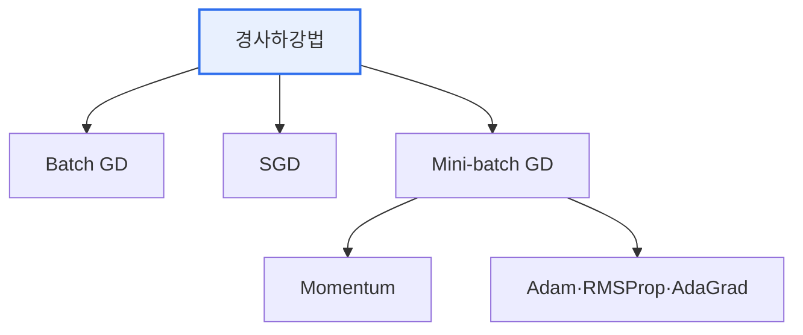

# 머신러닝 최적화 알고리즘(Optimization Algorithm)

## 1. 개요

### 가. 정의
> 머신러닝 모델의 **손실함수(Loss)를 최소화하는 파라미터(가중치)를 찾는** 알고리즘. 대부분 경사하강법(Gradient Descent)을 기반으로 한다.

최적화 알고리즘의 목표는 '**오차가 가장 작은 지점(최소값)을 효율적으로 찾는 것**'이다. 손실함수를 산으로 비유하면, 가장 낮은 골짜기를 향해 기울기(gradient)를 따라 내려가는 과정이다. 얼마나 크게(학습률), 어떤 방향(관성·적응)으로 내려가느냐에 따라 수렴 속도와 안정성이 달라진다.

## 2. 경사하강법 계열

## 3. 유형 및 장단점

| 알고리즘 | 원리 | 장점 | 단점 |
|---|---|---|---|
| **Batch GD** | 전체 데이터로 1회 갱신 | 안정적 수렴 | 대용량서 느림·메모리 부담 |
| **SGD** | 샘플 1개씩 갱신 | 빠름·온라인 학습 | 진동 심함 |
| **Mini-batch GD** | 미니배치 단위 갱신 | 속도·안정 균형(표준) | 배치 크기 튜닝 |
| **Momentum** | 관성 추가로 진동 완화 | 수렴 가속 | 하이퍼파라미터 |
| **AdaGrad** | 변수별 학습률 적응 | 희소 데이터 유리 | 학습률 급감 |
| **RMSProp** | 최근 기울기로 학습률 조정 | AdaGrad 단점 보완 | — |
| **Adam** | Momentum + RMSProp 결합 | **범용·빠른 수렴** | 일반화 이슈 가능 |

## 4. 시사점
- 실무 기본값은 **Adam**(빠른 수렴), 일반화 중요 시 SGD+Momentum
- 학습률(스케줄링·워밍업)이 성능의 핵심 변수
- 지역 최소·안장점 회피, 배치 크기·정규화와 함께 튜닝

---

> **한 줄 요약**: 머신러닝 최적화는 손실을 최소화하는 파라미터를 찾는 경사하강법 계열로, *SGD·Momentum·AdaGrad·RMSProp·Adam* 이 속도·안정·적응성의 트레이드오프를 가지며 Adam이 범용 기본값이다.
