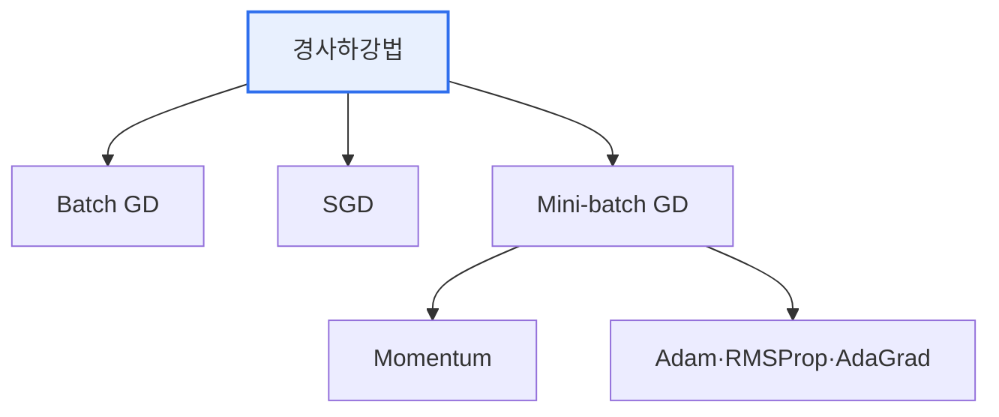

# 머신러닝 최적화 알고리즘(Optimization Algorithm)

## 1. 개요

### 가. 정의
> 머신러닝 모델의 **손실함수(Loss)를 최소화하는 파라미터(가중치)를 찾는** 알고리즘. 대부분 손실함수의 기울기를 따라 내려가는 경사하강법(Gradient Descent)을 기반으로 한다.

최적화 알고리즘을 이해하는 직관은 '**안개 낀 산에서 가장 낮은 골짜기를 찾아 내려가는 것**'이다. 손실함수는 파라미터에 따라 오차가 얼마인지를 나타내는 지형이고, 그 지형에서 가장 낮은 지점(최소 오차)을 찾는 것이 학습이다. 각 지점에서 기울기(gradient)는 가장 가파르게 올라가는 방향을 알려주므로, 그 반대 방향으로 내려가면 오차가 줄어든다. 여기서 '한 걸음을 얼마나 크게 내딛을지(학습률)', '어떤 방향으로 관성을 줄지', '변수마다 보폭을 다르게 할지'가 알고리즘마다 다르며, 이 차이가 수렴 속도와 안정성을 결정한다. 잘못하면 골짜기를 지나쳐 진동하거나(학습률 과대), 너무 느리게 내려가거나(과소), 얕은 웅덩이(지역 최소)에 갇힌다.

### 나. 필요성
딥러닝 모델은 수백만~수십억 개의 파라미터를 가지므로, 최적해를 수식으로 한 번에 구할 수 없다. 반복적으로 조금씩 개선하는 최적화 알고리즘이 필수이며, 그 효율이 학습 시간과 최종 성능을 좌우한다.

## 2. 경사하강법 계열

경사하강법은 한 번 갱신에 데이터를 얼마나 쓰느냐로 나뉜다. **Batch GD** 는 전체 데이터로 기울기를 계산해 안정적이지만 대용량에서 느리다. **SGD** 는 샘플 하나씩 갱신해 빠르지만 방향이 요동친다. **Mini-batch GD** 는 적당한 크기의 묶음으로 갱신해 속도와 안정의 균형을 맞춘 표준 방식이다. 여기에 개선 기법들이 더해지는데, **Momentum** 은 이전 방향의 관성을 더해 진동을 줄이고, **AdaGrad·RMSProp** 은 변수마다 학습률을 적응적으로 조절하며, **Adam** 은 Momentum과 RMSProp을 결합한 범용 기법이다.

## 3. 유형 및 장단점

| 알고리즘 | 원리 | 장점 | 단점 |
|---|---|---|---|
| **Batch GD** | 전체 데이터로 갱신 | 안정적 수렴 | 대용량서 느림·메모리 부담 |
| **SGD** | 샘플 1개씩 갱신 | 빠름·온라인 학습 | 진동 심함 |
| **Mini-batch GD** | 미니배치 단위 갱신 | 속도·안정 균형(표준) | 배치 크기 튜닝 |
| **Momentum** | 관성으로 진동 완화 | 수렴 가속 | 하이퍼파라미터 추가 |
| **AdaGrad** | 변수별 학습률 적응 | 희소 데이터 유리 | 학습률 급감 |
| **RMSProp** | 최근 기울기로 학습률 조정 | AdaGrad 단점 보완 | — |
| **Adam** | Momentum + RMSProp | **범용·빠른 수렴** | 일반화 이슈 가능 |

## 4. 고려사항 및 시사점

1. **실무 기본값은 Adam**이다. 빠르고 안정적인 수렴으로 대부분의 딥러닝에서 우선 선택되지만, 일반화 성능이 중요한 경우 SGD+Momentum이 더 나은 결과를 내기도 한다.
2. **학습률이 가장 중요한 하이퍼파라미터**다. 학습률 스케줄링(점진 감소)·워밍업(초반 서서히 증가)으로 학습 초·중·후반에 맞게 보폭을 조절하는 것이 성능의 핵심이다.
3. **지역 최소·안장점 회피**를 고려한다. 고차원에서는 완전한 최소보다 안장점이 문제인데, Momentum·Adam의 관성이 이를 빠져나오는 데 도움을 주며, 배치 크기·정규화와 함께 조율해야 한다.

---

> **한 줄 요약**: 머신러닝 최적화는 손실을 최소화하는 파라미터를 기울기 반대 방향으로 찾는 경사하강법 계열로, *SGD·Momentum·AdaGrad·RMSProp·Adam* 이 속도·안정·적응성의 트레이드오프를 가지며 Adam이 범용 기본값이고 학습률 조절이 성능을 좌우한다.
