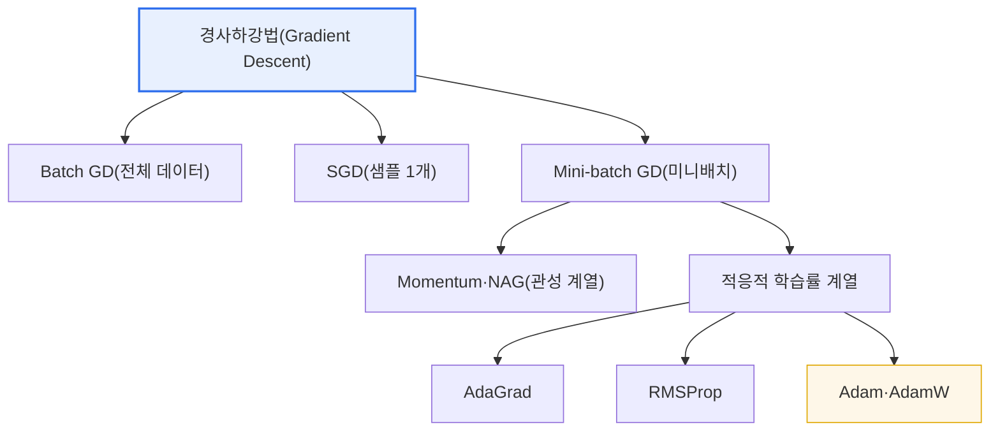

# 머신러닝 최적화 알고리즘(Optimization Algorithm)

## 1. 개요

### 가. 정의

> **머신러닝 최적화 알고리즘**은 모델의 **손실함수(Loss Function)를 최소화하는 파라미터(가중치·편향)를 반복적으로 찾아가는** 절차다. 대부분 손실함수의 기울기(gradient)를 이용해 오차가 줄어드는 방향으로 파라미터를 갱신하는 경사하강법(Gradient Descent)을 기반으로 한다.

최적화 알고리즘을 이해하는 가장 좋은 직관은 '**안개 낀 산에서 가장 낮은 골짜기를 찾아 내려가는 것**'이다. 손실함수는 파라미터 값에 따라 예측 오차가 얼마인지를 나타내는 지형(loss landscape)이고, 학습이란 그 지형에서 가장 낮은 지점(최소 오차)을 찾는 일이다. 각 지점에서 기울기는 가장 가파르게 '올라가는' 방향을 알려주므로, 그 반대 방향으로 한 걸음씩 내려가면 오차가 줄어든다.

여기서 알고리즘마다 달라지는 것은 세 가지 선택이다. 첫째 '한 걸음을 얼마나 크게 내딛을지'(학습률, learning rate), 둘째 '이전에 내려오던 방향의 관성을 얼마나 유지할지'(모멘텀), 셋째 '파라미터마다 보폭을 다르게 줄지'(적응적 학습률)이다. 이 세 선택을 어떻게 조합하느냐가 수렴 속도와 안정성을 결정한다. 학습률이 너무 크면 골짜기를 지나쳐 진동하거나 발산하고, 너무 작으면 수렴이 지나치게 느리며, 지형이 울퉁불퉁하면 얕은 웅덩이(지역 최소, local minimum)나 평평한 안장점(saddle point)에 갇힐 수 있다. 최적화 알고리즘의 발전사는 곧 이 세 가지 문제를 어떻게 완화해 왔는가의 역사다.

### 나. 등장 배경과 필요성

전통적 통계 모델은 정규방정식처럼 최적해를 수식으로 한 번에 구할 수 있는 경우가 많았다. 그러나 딥러닝 모델은 수백만~수천억 개의 파라미터를 가지며 손실함수가 고도로 비선형·비볼록(non-convex)이어서, 닫힌 형태의 해를 구하는 것이 계산적으로 불가능하다. 예컨대 대형 언어모델은 파라미터가 수십억~수천억 개에 달해 역행렬 계산 방식은 아예 성립하지 않는다. 따라서 **초기값에서 출발해 조금씩 개선하는 반복적(iterative) 최적화**가 유일한 현실적 방법이며, 그 효율이 학습에 드는 시간·비용과 최종 모델 성능을 직접 좌우한다.

또한 데이터 규모가 커지면서 전체 데이터를 한 번에 처리하는 방식이 한계에 부딪혔다. 수백만~수십억 건의 학습 데이터를 매 갱신마다 전부 훑는 것은 메모리·연산 측면에서 감당하기 어렵기 때문에, 데이터의 일부만 표본으로 사용해 기울기를 추정하는 **확률적(stochastic)·미니배치 방식**이 표준이 되었다. 현대 최적화 알고리즘은 이 '표본 기반 추정'의 잡음을 어떻게 다루느냐를 중심으로 설계된다.

결국 최적화 알고리즘은 학습의 '엔진'에 해당한다. 같은 모델 구조와 데이터라도 어떤 최적화기와 학습률 전략을 쓰느냐에 따라 학습이 며칠 걸리던 것이 몇 시간으로 줄기도 하고, 아예 수렴하지 못하거나 반대로 훨씬 높은 정확도에 도달하기도 한다. 그만큼 최적화는 딥러닝 성능·비용을 좌우하는 핵심 축이다.

## 2. 경사하강법의 원리와 계열

경사하강법의 갱신 규칙은 본질적으로 하나의 식으로 요약된다. 새로운 가중치는 현재 가중치에서 '학습률 × 손실함수의 기울기'를 뺀 값이다(θ ← θ − η∇L). 여기서 η(에타)가 학습률, ∇L이 기울기다. 이 단순한 식을 어떻게 확장·보완하느냐에 따라 계열이 갈린다. 아래는 경사하강법 계열의 전체 구조도다.

```mermaid
flowchart TB
  G["경사하강법(Gradient Descent)"] --> B["Batch GD(전체 데이터)"]
  G --> S["SGD(샘플 1개)"]
  G --> M["Mini-batch GD(미니배치)"]
  M --> Mo["Momentum·NAG(관성 계열)"]
  M --> Ad["적응적 학습률 계열"]
  Ad --> AG["AdaGrad"]
  Ad --> RM["RMSProp"]
  Ad --> AM["Adam·AdamW"]
  style G fill:#e8f0fe,stroke:#2f6fed,stroke-width:2px
  style AM fill:#fef7e8,stroke:#e0a800
```

경사하강법은 우선 **한 번의 갱신에 데이터를 얼마나 쓰느냐**로 나뉜다. **Batch GD** 는 전체 데이터로 기울기를 계산하므로 방향이 정확하고 수렴이 안정적이지만, 데이터가 클수록 한 걸음마다 전체를 훑어야 해 매우 느리고 메모리 부담이 크다. 예를 들어 100만 건의 데이터가 있으면 파라미터를 한 번 갱신하기 위해 100만 건 전부의 기울기를 평균 내야 하므로, 한 걸음을 내딛는 데 드는 비용이 지나치게 크다.

**SGD(확률적 경사하강법)** 는 반대로 샘플 하나마다 갱신해 매우 빠르고 온라인 학습(데이터가 흘러들어오는 대로 즉시 학습)이 가능하지만, 표본 하나의 기울기는 전체 기울기의 매우 거친 추정치여서 방향이 크게 요동친다. 이 요동은 단점이면서도, 역설적으로 얕은 지역 최소를 흔들어 빠져나오게 하는 정규화 효과를 주기도 한다.

**Mini-batch GD** 는 32·64·256 같은 적당한 크기의 묶음(배치)으로 갱신해 속도와 안정성의 균형을 맞춘 방식으로, 오늘날 딥러닝의 사실상 표준이다. 배치 하나의 기울기는 전체의 불편(unbiased) 추정치이면서 잡음이 SGD보다 작고, 무엇보다 배치 단위 행렬 연산이 GPU의 대규모 병렬 처리와 정확히 맞아떨어져 하드웨어 활용도가 높다. 즉 미니배치는 통계적 이유와 하드웨어적 이유 양쪽에서 표준이 된 것이다.

### 가. 관성(Momentum) 계열

미니배치의 잡음과 지형의 굴곡 문제를 완화하기 위해 등장한 것이 **모멘텀**이다. 물리적 관성처럼, 이전 갱신 방향을 일정 비율(보통 0.9)로 누적해 현재 갱신에 더한다. 이렇게 하면 골짜기의 완만한 방향으로는 속도가 붙어 가속되고, 좌우로 진동하는 성분은 서로 상쇄되어 줄어든다. 그 결과 좁고 긴 골짜기(ravine) 지형에서 지그재그 없이 빠르게 바닥을 향해 미끄러져 내려간다.

모멘텀을 한 단계 개선한 것이 **NAG(Nesterov Accelerated Gradient)** 다. NAG는 현재 위치가 아니라 관성으로 '먼저 이동할 예상 위치'에서 기울기를 계산한다. 즉 한 발 앞을 내다보고 방향을 교정하므로, 골짜기를 지나칠 것 같으면 미리 감속해 진동을 더 잘 억제한다. 이 '예견(lookahead)' 성질 덕분에 볼록 문제에서 이론적 수렴 속도가 더 빠른 것으로 알려져 있다.

관성 계열은 지역 최소·안장점 탈출에도 도움을 준다. 기울기가 거의 0인 평평한 안장점에서 순수 경사하강법은 멈춰 버리지만, 관성이 있으면 이전 속도로 그 지점을 관통해 빠져나갈 수 있기 때문이다. 다만 관성이 과하면 최소점을 지나쳐 다시 진동할 수 있으므로, 모멘텀 계수와 학습률을 함께 조율해야 한다.

실제 사례로, 이미지 분류의 표준 벤치마크인 이미지넷(ImageNet) 학습에서 ResNet 계열 모델은 오랫동안 'SGD + Momentum(계수 0.9) + 단계적 학습률 감쇠'조합으로 학습되어 왔다. 순수 SGD만으로는 수렴이 느리고 진동이 크지만, 모멘텀을 더하면 좁고 긴 손실 골짜기를 따라 안정적으로 가속되어 수렴이 빨라지고 최종 정확도도 개선된다. 이는 관성이 단순한 속도 향상 기법을 넘어 최종 일반화 성능에까지 기여함을 보여 주는 대표적 예다.

### 나. 적응적 학습률(Adaptive) 계열

또 다른 개선 축은 **파라미터마다 학습률을 다르게 조절**하는 것이다. **AdaGrad** 는 각 파라미터가 지금까지 받아 온 기울기 제곱의 누적합으로 학습률을 나눈다. 자주 갱신된 파라미터는 보폭을 줄이고, 드물게 갱신된 파라미터(예: 희소한 단어 임베딩)는 큰 보폭을 유지한다. 덕분에 희소 데이터(sparse data)에서 특히 유리하다. 그러나 누적합이 계속 커지기만 하므로 학습이 진행될수록 학습률이 0에 가깝게 급감해 학습이 조기에 멈추는 단점이 있다.

**RMSProp** 은 이 급감 문제를 해결한다. 기울기 제곱을 무한정 누적하는 대신 **최근 값에 지수가중이동평균**을 적용해, 과거를 서서히 잊고 최근 기울기 크기에 맞춰 학습률을 조정한다. 그 결과 학습 후반에도 적절한 보폭을 유지하며, 비정상(non-stationary)·비볼록 지형에서 안정적으로 동작해 순환신경망 학습 등에 널리 쓰였다.

**Adam(Adaptive Moment Estimation)** 은 오늘날 가장 널리 쓰이는 범용 최적화기로, **모멘텀(1차 모멘트, 기울기의 평균)과 RMSProp(2차 모멘트, 기울기 제곱의 평균)을 결합**한다. 즉 방향의 관성과 파라미터별 적응적 학습률을 동시에 취하며, 학습 초기의 편향을 보정하는 항까지 갖췄다. 하이퍼파라미터 기본값(η=0.001, β₁=0.9, β₂=0.999)으로도 대부분의 문제에서 빠르고 안정적으로 수렴해 딥러닝의 기본 선택지가 되었다. 한편 Adam은 가중치 감쇠(weight decay)를 부정확하게 적용하는 문제가 있어, 이를 분리해 바로잡은 **AdamW** 가 트랜스포머·대형 언어모델 학습의 사실상 표준으로 자리 잡았다.

### 다. 갱신 규칙과 하이퍼파라미터의 직관

세 계열의 갱신 규칙을 한자리에서 비교하면 차이가 분명해진다. 순수 경사하강법은 `θ ← θ − η·g`(g는 기울기)로 오직 현재 기울기만 본다. 모멘텀은 `v ← βv + g; θ ← θ − η·v`로 과거 방향 v를 누적한다. 적응적 계열은 `θ ← θ − (η / √(누적 기울기제곱 + ε))·g`처럼 분모에 기울기 크기를 두어 파라미터마다 보폭을 자동 조절한다. Adam은 이 두 아이디어를 한 식에 합친 것으로 볼 수 있다.

이 식들에서 실무자가 만지는 손잡이는 결국 학습률 η와 모멘텀 계수 β, 그리고 수치 안정을 위한 작은 상수 ε이다. η는 '보폭'이라 가장 민감하고, β는 보통 0.9 부근에서 잘 동작하며, ε(예: 1e-8)은 0으로 나누는 것을 막는 안전장치라 큰 튜닝 대상이 아니다. 이처럼 각 하이퍼파라미터가 갱신 식의 어느 자리에서 무슨 역할을 하는지 이해하면, 학습이 발산하거나 정체될 때 무엇을 조절해야 하는지 진단할 수 있다.

즉 최적화기 선택은 "현재 기울기만 볼 것인가, 과거 방향을 관성으로 더할 것인가, 파라미터별로 보폭을 나눌 것인가, 이 셋을 다 합칠 것인가"라는 설계 결정으로 환원된다. 이 관점을 가지면 새로운 최적화기가 등장해도 그것이 이 세 축 중 무엇을 어떻게 변형했는지로 빠르게 이해할 수 있다.

## 3. 유형별 비교

아래 표는 계열별 원리와 장단점을 정리한 것이다. 다만 표는 요약일 뿐이고, 실제 선택은 '왜 그런 차이가 나는가'에 대한 이해에서 나온다.

| 알고리즘 | 원리 | 장점 | 단점 |
|---|---|---|---|
| **Batch GD** | 전체 데이터로 갱신 | 정확·안정적 수렴 | 대용량서 느림·메모리 부담 |
| **SGD** | 샘플 1개씩 갱신 | 빠름·온라인 학습 | 방향 진동 심함 |
| **Mini-batch GD** | 미니배치 단위 갱신 | 속도·안정 균형(표준) | 배치 크기 튜닝 필요 |
| **Momentum/NAG** | 관성으로 진동 완화·가속 | 수렴 가속·안장점 탈출 | 모멘텀 계수 추가 |
| **AdaGrad** | 기울기 제곱 누적으로 학습률 조정 | 희소 데이터 유리 | 학습률 급감·조기 정지 |
| **RMSProp** | 최근 기울기로 학습률 조정 | AdaGrad 급감 보완 | 학습률 기본값 민감 |
| **Adam / AdamW** | Momentum + RMSProp | **범용·빠른 수렴** | 일반화 저하 가능(AdamW로 보완) |

이 비교에서 실무적으로 가장 중요한 대비는 **Adam vs. SGD+Momentum**이다. Adam은 수렴이 빠르고 하이퍼파라미터에 덜 민감해 시제품 개발·연구 반복에 유리하다. 반면 이미지 분류 같은 과제에서는 **SGD+Momentum이 최종 일반화(테스트 정확도)에서 더 우수한 결과**를 내는 경우가 많다고 알려져 있다. 그 이유로는, SGD의 큰 잡음이 손실 지형의 '평평하고 넓은 최소(flat minima)'로 모델을 이끌어 일반화에 유리하게 작용하는 반면, Adam은 좁고 가파른 최소로 수렴해 과적합 위험이 있다는 가설이 제시된다. 실제로 대형 이미지넷 학습에서는 SGD+Momentum에 학습률 스케줄을 결합하는 방식이 오랫동안 표준이었고, 트랜스포머 계열에서는 AdamW가 표준이라는 점은 '문제 유형에 따라 최적 알고리즘이 다르다'는 것을 보여 준다.

이 대비를 실감할 수 있는 또 다른 예가 트랜스포머 계열의 학습이다. BERT·GPT 같은 모델은 학습 초기 파라미터가 극도로 불안정해 순수 SGD로는 사실상 수렴시키기 어렵고, AdamW에 선형 워밍업(예: 초기 1만 스텝 동안 학습률을 0에서 목표치까지 선형 증가)과 이후 감쇠를 결합해야 안정적으로 학습된다. 반대로 동일한 AdamW 설정을 잔차 연결이 강한 소형 CNN에 그대로 쓰면 오히려 SGD+Momentum보다 테스트 정확도가 몇 %p 낮게 나오기도 한다. 이처럼 '아키텍처·데이터·규모의 조합'이 최적 알고리즘을 결정하며, 정답은 벤치마크 비교를 통해 경험적으로 찾는 것이 원칙이다.

두 번째로 주목할 대비는 **배치 크기와 학습률의 관계**다. 배치 크기를 키우면 기울기 추정이 정확해져 학습이 안정되지만 잡음이 줄어 일반화가 나빠질 수 있고, 병렬 효율은 좋아진다. 경험적으로 배치 크기를 k배 키우면 학습률도 대략 k배(선형 스케일링) 또는 √k배 키우는 것이 좋다고 알려져 있는데, 이는 배치가 커질수록 한 걸음의 방향이 더 믿을 만해져 보폭을 키울 수 있기 때문이다. 대규모 분산 학습에서 수천 개 GPU로 배치를 크게 키울 때 워밍업과 함께 이 규칙을 적용한다.

## 4. 심화: 학습률 스케줄링과 최신 동향

실무에서 최적화 성능을 가르는 결정적 요소는 알고리즘 선택 못지않게 **학습률 스케줄링**이다. 고정 학습률보다, 초반에 학습률을 서서히 올리는 **워밍업(warmup)** 과 이후 점진적으로 낮추는 **감쇠(decay)** 를 결합하는 방식이 널리 쓰인다. 워밍업은 학습 초기 파라미터가 불안정할 때 큰 보폭으로 발산하는 것을 막고, 코사인 감쇠(cosine annealing) 같은 후반 감쇠는 최소점 근처에서 보폭을 줄여 정밀하게 수렴하도록 돕는다. 트랜스포머 학습에서 '선형 워밍업 후 코사인 감쇠'는 거의 표준 절차가 되었다.

최근 동향으로는 대형 모델 학습을 겨냥한 최적화기들이 활발히 연구된다. **LAMB**·**LARS** 는 배치 크기를 수만 규모로 키운 초대형 분산 학습에서 층별 학습률을 조정해 안정성을 확보하며, BERT 학습 시간을 크게 단축한 사례로 알려져 있다. 또한 옵티마이저 상태(모멘트 추정치)가 파라미터의 몇 배에 달하는 메모리를 차지하는 문제를 완화하기 위해, 8비트로 옵티마이저 상태를 양자화하는 **8-bit Adam**, 상태를 저계수(low-rank)로 근사하는 **Adafactor** 등 메모리 효율적 기법이 대형 언어모델 학습에 쓰인다. 이들은 모두 "제한된 자원으로 더 큰 모델을 학습한다"는 현실적 요구에서 나온 것으로, 최적화가 단순 이론을 넘어 시스템·하드웨어와 맞물리는 영역임을 보여 준다.

또한 최적화는 **정규화·초기화·배치 정규화**와 떼어 놓고 볼 수 없다. 배치 정규화(BatchNorm)나 층 정규화(LayerNorm)는 손실 지형을 매끄럽게 만들어 더 큰 학습률을 안전하게 쓸 수 있게 하고, 적절한 가중치 초기화(He·Xavier)는 초기 기울기 소실·폭발을 막아 최적화가 원활히 시작되도록 돕는다. 즉 좋은 최적화 결과는 알고리즘 하나가 아니라 이 요소들의 조합에서 나온다.

실무에서 학습이 잘 진행되는지는 손실 곡선(loss curve)을 통해 진단한다. 손실이 발산하거나 급격히 튀면 학습률이 너무 큰 것이고, 지나치게 완만하게 줄면 학습률이 작거나 국소 정체에 빠진 것이다. 훈련 손실은 계속 줄지만 검증 손실이 다시 오르기 시작하면 과적합의 신호이므로 조기 종료(early stopping)를 고려한다. 이처럼 최적화는 '설정하고 끝'이 아니라 학습 과정을 관찰하며 학습률·배치·정규화를 되먹임으로 조정하는 반복적 튜닝 작업이다. 이 되먹임 감각이 최적화 알고리즘 지식을 실제 성능으로 바꾸는 핵심 역량이다.

## 5. 고려사항 및 시사점

1. **실무 기본값은 Adam/AdamW이되, 문제 유형을 고려한다.** 빠르고 안정적인 수렴으로 대부분의 딥러닝에서 우선 선택되지만, 이미지 분류처럼 일반화가 중요한 과제에서는 SGD+Momentum이 더 나은 테스트 성능을 내기도 한다. 트랜스포머·LLM에는 AdamW가 사실상 표준이다. '만능 최적화기는 없다'는 관점에서 과제·데이터 특성에 맞춰 선택·비교하는 전략이 필요하다.

2. **학습률과 스케줄링이 가장 중요한 하이퍼파라미터다.** 최적화기 종류보다 학습률의 크기와 시간에 따른 조절(워밍업·코사인 감쇠 등)이 성능을 좌우하는 경우가 많다. 학습률 탐색(LR range test)과 스케줄 설계에 우선적으로 자원을 투입하는 것이 효율적이다.

3. **지역 최소·안장점보다 일반화가 핵심 관심사다.** 고차원 비볼록 지형에서는 완전한 전역 최소보다 안장점과 '평평한 최소 대 뾰족한 최소'의 문제가 더 본질적이다. 관성·적응적 학습률로 안장점을 탈출하되, 최종 목표는 훈련 손실 최소화가 아니라 검증·테스트 성능(일반화)이라는 점을 잊지 않고 조기 종료·정규화와 함께 조율해야 한다.

4. **자원 제약과 최적화 설계를 함께 고려한다.** 대형 모델에서는 옵티마이저 상태의 메모리 사용량, 분산 학습 시 배치 크기·통신 비용, 혼합정밀도(mixed precision)와의 상호작용이 최적화기 선택에 영향을 준다. 8-bit Adam·Adafactor 등 메모리 효율 기법과 배치-학습률 스케일링 규칙을 이해하는 것이 대규모 학습의 성패를 가른다.

5. **재현성과 실험 관리를 확보한다.** 최적화는 난수 초기화·데이터 순서·배치 구성에 따라 결과가 달라지므로, 시드 고정·하이퍼파라미터 기록·실험 추적 도구를 통한 체계적 관리가 필수다. 기술사 관점에서는 개별 알고리즘 암기보다 '왜 그 알고리즘이 그 문제에 적합한가'를 트레이드오프 관점에서 설명하는 역량이 중요하다.

## 참고자료

- Kingma & Ba, "Adam: A Method for Stochastic Optimization" — https://arxiv.org/abs/1412.6980
- Loshchilov & Hutter, "Decoupled Weight Decay Regularization (AdamW)" — https://arxiv.org/abs/1711.05101
- Ruder, "An overview of gradient descent optimization algorithms" — https://arxiv.org/abs/1609.04747

---

> **한 줄 요약**: 머신러닝 최적화는 손실을 최소화하는 파라미터를 기울기 반대 방향으로 반복 탐색하는 경사하강법 계열로, *데이터 사용량(Batch·SGD·Mini-batch)·관성(Momentum·NAG)·적응적 학습률(AdaGrad·RMSProp·Adam/AdamW)* 의 트레이드오프를 가지며, Adam/AdamW가 범용 기본값이지만 문제 유형과 학습률 스케줄링이 최종 성능을 좌우한다.
