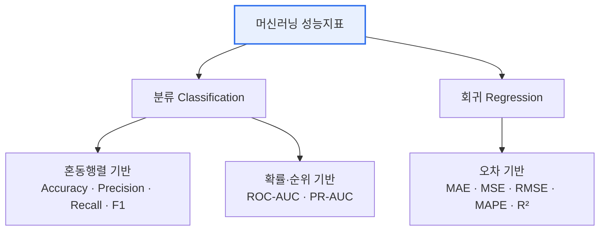

# 머신러닝(Machine Learning) 성능지표

## 1. 개요

### 가. 정의
> 학습된 모델의 **예측 성능을 정량적으로 측정·비교**하기 위한 지표로, 문제 유형(분류/회귀)과 비즈니스 목적에 따라 적합한 지표를 선택해야 한다.

성능지표는 모델이 "얼마나 잘 맞히는가"를 하나의 숫자로 요약해 학습·선택의 판단 기준을 제공한다. 그러나 단일 숫자는 언제나 정보를 압축하면서 무언가를 감춘다. 예컨대 정확도(Accuracy) 하나만 보면 데이터가 불균형할 때 모델의 실제 무능을 가릴 수 있다. 따라서 지표를 **왜, 언제 쓰는지**를 이해하고 여러 지표를 함께 보는 것이 핵심이다.

### 나. 등장 배경 및 필요성
모델 개발은 학습·하이퍼파라미터 튜닝·모델 선택이라는 수많은 의사결정의 연속인데, 이를 객관적으로 비교하려면 공통의 잣대가 필요하다. 또한 같은 오분류라도 **비용이 다르다**. 암을 놓치는 것(FN)과 정상인을 환자로 오진하는 것(FP)의 대가가 다르듯, 비즈니스 목적에 따라 최적화해야 할 지표가 달라진다. 성능지표는 이런 목적별 최적화를 가능하게 하고, 데이터 불균형·과적합 같은 문제를 진단해 모델의 **일반화 성능**을 판단하는 근거가 된다.

## 2. 지표 분류 체계



성능지표는 예측 대상이 범주(class)냐 연속값이냐에 따라 **분류 지표**와 **회귀 지표**로 갈린다. 분류 지표는 다시 예측이 맞았는지 세는 혼동행렬 기반 지표와, 임계값과 무관하게 모델의 순위 매김 능력을 보는 확률·순위 기반 지표로 나뉜다. 회귀 지표는 예측값과 실제값의 오차 크기를 다양한 방식으로 집계한다.

## 3. 혼동 행렬 (Confusion Matrix)

분류 지표는 대부분 혼동행렬에서 파생된다. 혼동행렬은 예측과 실제의 조합을 네 칸으로 나눈 2×2 표로, 여기서 나오는 TP·FP·FN·TN의 관계를 이해하면 모든 분류 지표를 유도할 수 있다. FP를 통계학의 **1종 오류**(정상을 양성으로 잘못 판단), FN을 **2종 오류**(양성을 놓침)로 대응시키면 오분류의 성격이 분명해진다.

| 구분 | 실제 Positive | 실제 Negative |
|---|---|---|
| **예측 Positive** | TP (True Positive) | FP (False Positive, 1종 오류) |
| **예측 Negative** | FN (False Negative, 2종 오류) | TN (True Negative) |

## 4. 분류(Classification) 성능지표

각 지표는 혼동행렬의 어느 부분을 강조하느냐가 다르다. 정밀도(Precision)는 "양성이라 예측한 것 중 진짜 양성"을 보므로 **잘못된 양성(FP)의 비용**이 클 때 중요하고, 재현율(Recall)은 "진짜 양성 중 놓치지 않은 비율"을 보므로 **놓침(FN)의 비용**이 클 때 중요하다. F1은 이 둘의 조화평균으로, 어느 한쪽으로 치우치면 값이 크게 떨어지기 때문에 불균형 데이터에서 균형을 평가하기에 좋다.

| 지표 | 공식 | 의미 | 활용 상황 |
|---|---|---|---|
| **정확도** Accuracy | `(TP+TN) / 전체` | 전체 중 맞게 예측한 비율 | 클래스 균형 데이터 |
| **정밀도** Precision | `TP / (TP+FP)` | Positive 예측 중 실제 정답 비율 | FP 비용 큰 경우(스팸 분류) |
| **재현율** Recall(민감도) | `TP / (TP+FN)` | 실제 Positive를 놓치지 않은 비율 | FN 비용 큰 경우(암 진단) |
| **특이도** Specificity | `TN / (TN+FP)` | 실제 Negative를 맞힌 비율 | 정상 판별 중요 시 |
| **F1 Score** | `2·(P·R) / (P+R)` | 정밀도·재현율의 조화평균 | 불균형 데이터, P·R 균형 |
| **ROC-AUC** | ROC 곡선 아래 면적 | 임계값 전반의 분류 능력(0.5~1) | 임계값 독립적 종합 평가 |
| **PR-AUC** | Precision-Recall 곡선 면적 | 소수 클래스 성능 | 심한 불균형 데이터 |

> **Precision-Recall Trade-off**: 분류 임계값(threshold)을 낮추면 더 많은 것을 양성으로 판정해 재현율↑·정밀도↓, 높이면 정밀도↑·재현율↓가 된다. 두 지표는 근본적으로 상충하므로, 목적에 맞는 균형점(임계값)을 정하는 것이 실무의 핵심이다.

ROC-AUC와 PR-AUC는 특정 임계값이 아니라 **임계값 전체 범위**에서의 성능을 하나로 요약한다. ROC-AUC는 임계값에 독립적인 종합 평가에 유용하지만, 음성이 압도적으로 많은 **심한 불균형** 데이터에서는 낙관적으로 보일 수 있어 이때는 PR-AUC가 더 정직한 지표가 된다.

### ROC 곡선 (예시)

```chart
{
  "type": "line",
  "data": {
    "datasets": [
      {
        "label": "모델 ROC (AUC ≈ 0.9)",
        "data": [{"x":0,"y":0},{"x":0.05,"y":0.55},{"x":0.1,"y":0.72},{"x":0.2,"y":0.85},{"x":0.4,"y":0.93},{"x":0.6,"y":0.97},{"x":1,"y":1}],
        "borderColor": "#2f6fed",
        "backgroundColor": "rgba(47,111,237,0.12)",
        "fill": true,
        "tension": 0.3
      },
      {
        "label": "랜덤 기준선 (AUC = 0.5)",
        "data": [{"x":0,"y":0},{"x":1,"y":1}],
        "borderColor": "#9aa4b2",
        "borderDash": [6, 4],
        "pointRadius": 0,
        "fill": false
      }
    ]
  },
  "options": {
    "plugins": { "legend": { "position": "bottom" }, "title": { "display": true, "text": "ROC 곡선 — 좌상단에 가까울수록 우수" } },
    "scales": {
      "x": { "type": "linear", "min": 0, "max": 1, "title": { "display": true, "text": "FPR (1 − 특이도)" } },
      "y": { "min": 0, "max": 1, "title": { "display": true, "text": "TPR (재현율)" } }
    }
  }
}
```

ROC 곡선은 임계값을 연속으로 바꾸며 재현율(TPR)과 오탐율(FPR)의 관계를 그린 것으로, 곡선이 **좌상단에 가까울수록** 우수하다. 곡선 아래 면적(AUC)이 0.5면 무작위 추측 수준, 1에 가까울수록 완벽한 분류에 가깝다.

## 5. 회귀(Regression) 성능지표

회귀 지표는 오차를 어떻게 다루느냐에서 성격이 갈린다. MAE는 오차의 절댓값을 평균하므로 이상치에 강건하고 해석이 직관적인 반면, MSE·RMSE는 오차를 제곱해 **큰 오차에 더 큰 페널티**를 주므로 이상치에 민감하다. 그래서 큰 오차를 특히 피하고 싶다면 RMSE를, 이상치의 영향을 줄이고 싶다면 MAE를 본다.

| 지표 | 공식(개념) | 특징 |
|---|---|---|
| **MAE** (평균절대오차) | `mean(|y − ŷ|)` | 이상치에 덜 민감, 해석 직관적 |
| **MSE** (평균제곱오차) | `mean((y − ŷ)²)` | 큰 오차에 큰 페널티, 이상치 민감 |
| **RMSE** (평균제곱근오차) | `√MSE` | 원 단위로 복원, 실무 표준 지표 |
| **MAPE** (평균절대백분율오차) | `mean(|y − ŷ| / |y|)·100` | 비율(%)로 비교, 0 근처 값에 취약 |
| **R²** (결정계수) | `1 − SS_res/SS_tot` | 설명력(0~1), 1에 가까울수록 우수 |

RMSE는 제곱근을 취해 예측 대상과 같은 단위로 돌아오므로 실무에서 표준처럼 쓰이고, R²는 모델이 데이터 분산을 얼마나 설명하는지를 0~1로 나타내 서로 다른 스케일의 문제를 비교할 때 유용하다.

## 6. 고려사항 및 시사점 (지표 선택 가이드)

기술사 관점에서 성능지표 선택은 **비즈니스 비용 구조를 수식으로 번역**하는 작업이다. 지표를 잘못 고르면 잘 맞히는 것처럼 보이는 무용한 모델을 배포하게 된다.

1. **데이터 불균형** 시 Accuracy는 왜곡되므로 F1·PR-AUC를 사용한다(예: 99%가 정상인 사기 탐지).
2. **FN 비용이 큰 도메인**(의료·보안)은 놓침을 줄이는 Recall을 우선한다.
3. **FP 비용이 큰 도메인**(스팸·추천)은 오탐을 줄이는 Precision을 우선한다.
4. 임계값에 독립적인 종합 평가가 필요하면 ROC-AUC를 본다.
5. 회귀는 RMSE(민감)와 MAE(강건)를 함께 보고, 스케일 간 비교엔 R²·MAPE를 활용한다.
6. **단일 지표 맹신은 금물**이며, 여러 지표를 교차 확인하고 교차검증(cross-validation)으로 일반화 성능을 확인해야 한다.

---

> **한 줄 요약**: 성능지표는 *분류(혼동행렬 기반 + 확률·순위 기반)* 와 *회귀(오차 기반)* 로 나뉘며, 데이터 특성과 오분류 비용 구조에 맞는 지표를 선택하고 여러 지표를 교차 확인하는 것이 핵심이다.
