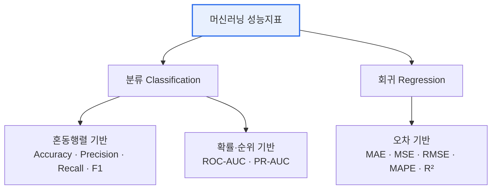

# 머신러닝(Machine Learning) 성능지표

## 1. 개요

### 가. 정의
> 학습된 모델의 **예측 성능을 정량적으로 측정·비교**하기 위한 지표. 문제 유형(분류/회귀)과 비즈니스 목적에 따라 적합한 지표를 선택해야 한다.

### 나. 필요성
- 모델 **학습·선택·하이퍼파라미터 튜닝**의 객관적 기준 제공
- 비즈니스 목적(정밀도 vs 재현율)에 맞춘 최적화
- **데이터 불균형·과적합** 진단 및 일반화 성능 평가

## 2. 지표 분류 체계



## 3. 혼동 행렬 (Confusion Matrix)

분류 성능지표 산출의 기준이 되는 2×2 행렬.

| 구분 | 실제 Positive | 실제 Negative |
|---|---|---|
| **예측 Positive** | TP (True Positive) | FP (False Positive, 1종 오류) |
| **예측 Negative** | FN (False Negative, 2종 오류) | TN (True Negative) |

## 4. 분류(Classification) 성능지표

| 지표 | 공식 | 의미 | 활용 상황 |
|---|---|---|---|
| **정확도** Accuracy | `(TP+TN) / 전체` | 전체 중 맞게 예측한 비율 | 클래스 균형 데이터 |
| **정밀도** Precision | `TP / (TP+FP)` | Positive 예측 중 실제 정답 비율 | **FP 비용 큰 경우**(스팸 분류) |
| **재현율** Recall(민감도) | `TP / (TP+FN)` | 실제 Positive를 놓치지 않은 비율 | **FN 비용 큰 경우**(암 진단) |
| **특이도** Specificity | `TN / (TN+FP)` | 실제 Negative를 맞힌 비율 | 정상 판별 중요 시 |
| **F1 Score** | `2·(P·R) / (P+R)` | 정밀도·재현율의 조화평균 | **불균형 데이터**, P·R 균형 |
| **ROC-AUC** | ROC 곡선 아래 면적 | 임계값 전반의 분류 능력(0.5~1) | 임계값 독립적 종합 평가 |
| **PR-AUC** | Precision-Recall 곡선 면적 | 소수 클래스 성능 | **심한 불균형** 데이터 |

> **Precision-Recall Trade-off**: 분류 임계값(threshold)을 낮추면 재현율↑·정밀도↓, 높이면 정밀도↑·재현율↓. 목적에 맞는 균형점 선택이 핵심.

### ROC 곡선 (예시)

```chart
{
  "type": "line",
  "data": {
    "datasets": [
      {
        "label": "모델 ROC (AUC ≈ 0.9)",
        "data": [{"x":0,"y":0},{"x":0.05,"y":0.55},{"x":0.1,"y":0.72},{"x":0.2,"y":0.85},{"x":0.4,"y":0.93},{"x":0.6,"y":0.97},{"x":1,"y":1}],
        "borderColor": "#2f6fed",
        "backgroundColor": "rgba(47,111,237,0.12)",
        "fill": true,
        "tension": 0.3
      },
      {
        "label": "랜덤 기준선 (AUC = 0.5)",
        "data": [{"x":0,"y":0},{"x":1,"y":1}],
        "borderColor": "#9aa4b2",
        "borderDash": [6, 4],
        "pointRadius": 0,
        "fill": false
      }
    ]
  },
  "options": {
    "plugins": { "legend": { "position": "bottom" }, "title": { "display": true, "text": "ROC 곡선 — 좌상단에 가까울수록 우수" } },
    "scales": {
      "x": { "type": "linear", "min": 0, "max": 1, "title": { "display": true, "text": "FPR (1 − 특이도)" } },
      "y": { "min": 0, "max": 1, "title": { "display": true, "text": "TPR (재현율)" } }
    }
  }
}
```

## 5. 회귀(Regression) 성능지표

| 지표 | 공식(개념) | 특징 |
|---|---|---|
| **MAE** (평균절대오차) | `mean(|y − ŷ|)` | 이상치에 **덜 민감**, 해석 직관적 |
| **MSE** (평균제곱오차) | `mean((y − ŷ)²)` | 큰 오차에 **큰 페널티**, 이상치 민감 |
| **RMSE** (평균제곱근오차) | `√MSE` | 원 단위 복원, 실무 표준 지표 |
| **MAPE** (평균절대백분율오차) | `mean(|y − ŷ| / |y|)·100` | **비율(%)** 로 비교, 0 근처 값에 취약 |
| **R²** (결정계수) | `1 − SS_res/SS_tot` | 설명력(0~1), 1에 가까울수록 우수 |

## 6. 시사점 (지표 선택 가이드)

1. **데이터 불균형** 시 Accuracy는 왜곡 → **F1·PR-AUC** 사용 (예: 사기 탐지 99% 정상)
2. **FN 비용 큰 도메인**(의료·보안) → **Recall** 우선
3. **FP 비용 큰 도메인**(스팸·추천) → **Precision** 우선
4. 임계값에 독립적인 종합 평가 → **ROC-AUC**
5. 회귀는 **RMSE(민감)** 와 **MAE(강건)** 를 함께 보고, 스케일 비교엔 **R²·MAPE**
6. 단일 지표 맹신 금지 — **여러 지표 교차 확인** + 검증 데이터(교차검증)로 일반화 성능 확인

---

> **한 줄 요약**: 성능지표는 *분류(혼동행렬 기반 + 확률 기반)* 와 *회귀(오차 기반)* 로 나뉘며, **데이터 특성과 오분류 비용**에 맞는 지표를 선택하는 것이 핵심이다.
