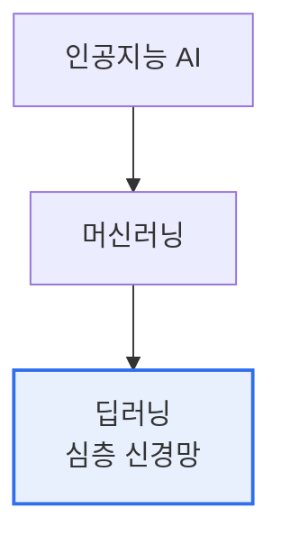

# 머신러닝(Machine Learning)과 딥러닝(Deep Learning) 차이

## 1. 개요

### 가. 정의
> **머신러닝**은 데이터로부터 규칙·패턴을 학습해 예측·분류하는 AI 기법의 총칭이고, **딥러닝**은 다층 인공신경망(심층 신경망)을 사용하는 머신러닝의 한 분야다.

관계를 명확히 하면 **AI ⊃ 머신러닝 ⊃ 딥러닝**의 포함 구조다. 가장 큰 차이는 '**특징(Feature)을 누가 만드는가**'다. 전통 머신러닝은 사람이 도메인 지식으로 특징을 설계(Feature Engineering)해야 하지만, 딥러닝은 데이터에서 특징을 **스스로 학습(표현학습)** 한다는 점이 핵심 구별점이다.

## 2. 포함 관계

## 3. 비교

| 구분 | 머신러닝 | 딥러닝 |
|---|---|---|
| **특징 추출** | 사람이 설계(수작업) | 모델이 자동 학습 |
| **데이터량** | 상대적으로 적어도 가능 | 대량 데이터 필요 |
| **연산자원** | 낮음(CPU 가능) | 높음(GPU/HBM 필수) |
| **모델** | 결정트리·SVM·랜덤포레스트 | CNN·RNN·Transformer |
| **해석성** | 상대적으로 높음 | 낮음(블랙박스) |
| **적합** | 정형·소규모 데이터 | 이미지·음성·자연어(비정형) |

## 4. 시사점
- 데이터량·문제 특성에 따라 선택 — 소규모·정형은 머신러닝이 효율적
- 딥러닝은 비정형(이미지·NLP)에서 압도적, 그러나 자원·해석성 부담
- XAI로 딥러닝 해석성 한계 보완, 파운데이션 모델로 데이터 부담 완화

---

> **한 줄 요약**: 딥러닝은 머신러닝의 부분집합으로, 사람이 특징을 설계하는 머신러닝과 달리 *심층 신경망이 특징을 자동 학습* 하며 대량 데이터·GPU를 요구하나 비정형 데이터에서 뛰어나다.
