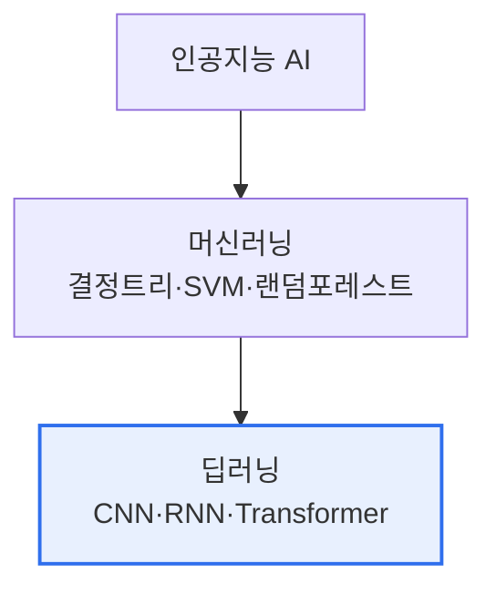

# 머신러닝(Machine Learning)과 딥러닝(Deep Learning) 차이

## 1. 개요

### 가. 정의
> **머신러닝**은 데이터로부터 규칙·패턴을 스스로 학습해 예측·분류하는 AI 기법의 총칭이고, **딥러닝**은 다층 인공신경망(심층 신경망)을 사용하는 머신러닝의 한 세부 분야다.

두 개념의 관계는 **AI ⊃ 머신러닝 ⊃ 딥러닝** 의 포함 구조로, 딥러닝은 머신러닝의 부분집합이다. 둘을 가르는 가장 결정적인 차이는 '**특징(Feature)을 누가 만드는가**'이다. 전통 머신러닝에서는 사람이 도메인 지식을 동원해 "무엇이 예측에 중요한 변수인가"를 직접 설계해야 한다(Feature Engineering). 예를 들어 고양이 사진을 분류하려면 사람이 '귀 모양·수염 개수' 같은 특징을 정의해줘야 했다. 반면 딥러닝은 원본 데이터(픽셀)를 그대로 넣으면 **신경망의 층들이 저수준 특징(선·모서리)에서 고수준 특징(귀·얼굴)까지 스스로 학습**한다. 이 '표현 학습(Representation Learning)' 능력이 딥러닝의 혁신이다.

### 나. 등장 배경
딥러닝은 개념 자체는 오래되었으나 세 조건이 갖춰지며 폭발했다. 첫째 **대량 데이터**(인터넷·모바일), 둘째 **GPU 병렬 연산**으로 대규모 학습이 가능해졌고, 셋째 **알고리즘 발전**(ReLU·드롭아웃·Transformer)이 심층망 학습의 난제를 풀었다. 이 삼박자가 이미지·음성·자연어에서 사람 수준의 성능을 만들었다.

## 2. 포함 관계

## 3. 비교

머신러닝과 딥러닝은 특징 추출 방식뿐 아니라 데이터·자원·해석성에서 뚜렷이 갈린다. 머신러닝은 사람이 특징을 정제해주므로 **적은 데이터로도 학습**되고 CPU로도 돌아가며, 모델(결정트리 등)이 규칙 형태라 **해석이 쉽다**. 딥러닝은 특징을 스스로 찾는 대신 **방대한 데이터와 GPU·HBM 같은 고성능 연산**을 요구하고, 수백만 파라미터가 얽혀 있어 왜 그런 판단을 했는지 알기 어려운 **블랙박스**가 된다. 대신 이미지·음성·자연어 같은 비정형 데이터에서는 딥러닝이 압도적이다.

| 구분 | 머신러닝 | 딥러닝 |
|---|---|---|
| **특징 추출** | 사람이 설계(수작업) | 모델이 자동 학습(표현학습) |
| **데이터량** | 적어도 가능 | 대량 필요 |
| **연산 자원** | 낮음(CPU 가능) | 높음(GPU/HBM 필수) |
| **대표 모델** | 결정트리·SVM·랜덤포레스트 | CNN·RNN·Transformer |
| **해석성** | 상대적으로 높음 | 낮음(블랙박스) |
| **적합 데이터** | 정형·소규모 | 이미지·음성·자연어(비정형) |

예컨대 은행의 신용평가처럼 표(정형) 데이터가 수천 건이고 '왜 거절됐는지' 설명이 필요한 문제는 머신러닝(로지스틱회귀·XGBoost)이 적합하고, 수백만 장의 의료 영상에서 병변을 찾는 문제는 딥러닝(CNN)이 적합하다.

## 4. 고려사항 및 시사점

1. **데이터량·문제 특성에 따른 선택**이 핵심이다. 딥러닝이 항상 우월한 것이 아니라, 정형·소규모 데이터에서는 머신러닝이 더 빠르고 정확하며 해석까지 제공한다.
2. **해석성의 한계**는 딥러닝의 실무 도입 장벽이다. 금융·의료 등 규제 분야에서는 XAI(설명가능 AI)로 판단 근거를 제시해 이 한계를 보완한다.
3. **데이터·자원 부담**은 파운데이션 모델·전이학습으로 완화되고 있다. 대규모로 사전학습된 모델을 소량 데이터로 미세조정하면 딥러닝의 진입장벽이 크게 낮아진다.

---

> **한 줄 요약**: 딥러닝은 머신러닝의 부분집합으로, 사람이 특징을 설계하는 머신러닝과 달리 *심층 신경망이 특징을 자동 학습(표현학습)* 하며, 대량 데이터·GPU를 요구하고 해석성이 낮은 대신 비정형 데이터에서 뛰어나 문제 특성에 맞게 선택해야 한다.
