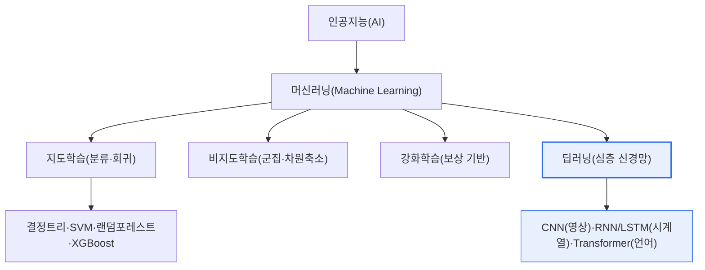

# 머신러닝(Machine Learning)과 딥러닝(Deep Learning) 차이

## 1. 개요

### 가. 정의
> **머신러닝**은 명시적 규칙을 사람이 일일이 프로그래밍하지 않고, **데이터로부터 규칙·패턴을 스스로 학습**해 예측·분류·군집화를 수행하는 인공지능 기법의 총칭이다.
>
> **딥러닝**은 **다층 인공신경망(심층 신경망, Deep Neural Network)** 을 사용하여, 원본 데이터로부터 저수준에서 고수준까지의 특징을 계층적으로 자동 학습하는 **머신러닝의 한 세부 분야**다.

### 나. 포함 관계와 본질적 차이
두 개념의 관계는 **AI ⊃ 머신러닝 ⊃ 딥러닝** 의 포함 구조로, 딥러닝은 머신러닝의 부분집합이다. 따라서 "머신러닝과 딥러닝 중 무엇이 더 우수한가"라는 질문은 성립하지 않으며, 정확히는 "머신러닝이라는 큰 틀 안에서 전통적 기법과 심층 신경망 기법이 어떤 조건에서 각각 유리한가"를 묻는 것이 옳다.

둘을 가르는 가장 결정적인 차이는 **"특징(Feature)을 누가 만드는가"** 이다. 전통 머신러닝에서는 사람이 도메인 지식을 동원해 "무엇이 예측에 중요한 변수인가"를 직접 설계해야 한다. 이를 **특징 공학(Feature Engineering)** 이라 하며, 모델 성능의 대부분이 이 단계의 품질에 좌우된다. 예를 들어 고양이 사진을 분류하려면 과거에는 사람이 '귀의 모양·수염의 개수·눈의 위치' 같은 특징을 수치로 정의해 주어야 했다. 즉 전통 머신러닝의 성패는 "얼마나 좋은 특징을 사람이 뽑아내느냐"에 달려 있었다.

반면 딥러닝은 원본 데이터(예: 이미지의 픽셀)를 그대로 입력하면 **신경망의 층들이 스스로 특징을 발견**한다. 앞쪽 층은 선·모서리 같은 저수준 특징을, 중간 층은 눈·귀 같은 부분 형태를, 뒤쪽 층은 고양이 얼굴 같은 고수준 개념을 학습한다. 이렇게 데이터로부터 표현 자체를 학습하는 능력을 **표현 학습(Representation Learning)** 이라 하며, 이것이 딥러닝이 이미지·음성·자연어 같은 비정형 데이터에서 혁신을 일으킨 근본 원리다.

### 다. 등장 배경과 필요성
딥러닝의 뿌리인 인공신경망과 오차역전파(Backpropagation) 개념은 이미 1980년대에 정립되었으나 오랫동안 실용화되지 못했다. 이는 (1) 학습할 데이터가 부족했고, (2) 다층 신경망을 학습시킬 연산 자원이 없었으며, (3) 층이 깊어지면 기울기가 사라지는 **기울기 소실(Vanishing Gradient)** 문제로 학습 자체가 어려웠기 때문이다.

이 세 장벽이 2010년대에 동시에 무너지며 딥러닝이 폭발했다. 첫째 **대량 데이터**가 인터넷·모바일·센서를 통해 축적되었고(예: ImageNet 데이터셋의 약 1,400만 장 라벨링 이미지), 둘째 **GPU 병렬 연산**이 대규모 행렬 연산을 가능하게 했으며, 셋째 **알고리즘 혁신**(ReLU 활성화 함수, Dropout, Batch Normalization, 그리고 2017년 Transformer 구조)이 기울기 소실과 과적합 문제를 풀었다. 이 삼박자가 2012년 ImageNet 대회에서 딥러닝(AlexNet)이 오차율을 획기적으로 낮춘 사건을 기점으로, 이미지·음성·자연어에서 사람 수준의 성능을 만들어 냈다.

## 2. 계층 구조와 기술 지형

아래 개념도는 AI–머신러닝–딥러닝의 포함 관계와 각 계층의 대표 기법을 보여준다. 머신러닝은 다시 학습 방식에 따라 지도·비지도·강화 학습으로 나뉜다.

```mermaid
flowchart TB
  AI["인공지능(AI)"] --> ML["머신러닝(Machine Learning)"]
  ML --> SUP["지도학습(분류·회귀)"]
  ML --> UNS["비지도학습(군집·차원축소)"]
  ML --> RL["강화학습(보상 기반)"]
  ML --> DL["딥러닝(심층 신경망)"]
  SUP --> CLS["결정트리·SVM·랜덤포레스트·XGBoost"]
  DL --> DNN["CNN(영상)·RNN/LSTM(시계열)·Transformer(언어)"]
  style DL fill:#e8f0fe,stroke:#2f6fed,stroke-width:2px
  style DNN fill:#e8f0fe,stroke:#2f6fed
```

### 가. 전통 머신러닝의 파이프라인
전통 머신러닝은 명확히 분리된 단계로 구성된다. 원시 데이터 수집 → **전처리·특징 공학(사람 주도)** → 모델 학습 → 평가 → 배포의 흐름을 따르며, 이 중 특징 공학이 성능의 병목이자 핵심이다. 예를 들어 이상거래 탐지에서 "직전 1시간 결제 횟수, 평소 결제 지역과의 거리" 같은 파생 변수를 사람이 설계해 넣어야 한다.

전통 머신러닝의 강점은 **적은 데이터로도 동작**하고, 결정트리·로지스틱회귀처럼 모델이 규칙 형태여서 **판단 근거를 사람이 해석**할 수 있다는 점이다. 또한 CPU만으로도 학습이 가능해 인프라 부담이 작다. 정형(테이블) 데이터가 중심인 금융·제조 품질관리·수요예측 등에서는 여전히 XGBoost·LightGBM 같은 부스팅 계열이 딥러닝보다 우수하거나 대등한 경우가 많다.

### 나. 딥러닝의 학습 원리
딥러닝은 특징 공학 단계를 신경망 내부로 흡수한다. 아래 흐름은 심층 신경망이 순전파(예측)와 역전파(오차 기반 가중치 갱신)를 반복하며 스스로 특징 표현을 학습하는 과정을 보여준다.

```mermaid
flowchart LR
  IN["원본 데이터(픽셀·음성·텍스트)"] --> H1["은닉층 1(저수준: 선·모서리)"]
  H1 --> H2["은닉층 2(중수준: 부분 형태)"]
  H2 --> H3["은닉층 N(고수준: 개념·의미)"]
  H3 --> OUT["출력(분류·예측)"]
  OUT -. "오차 역전파(가중치 갱신)" .-> H3
  H3 -. 역전파 .-> H2
  H2 -. 역전파 .-> H1
```

딥러닝의 학습은 예측값과 정답의 차이(손실, Loss)를 계산하고, 그 오차를 출력층에서 입력층 방향으로 되돌려 보내며(오차역전파) 각 층의 가중치를 **경사하강법(Gradient Descent)** 으로 조금씩 조정하는 과정을 수백만~수십억 회 반복하는 것이다. 층이 깊고 넓을수록 표현력이 커지지만, 그만큼 학습에 방대한 데이터와 연산이 필요하다. 이 때문에 딥러닝은 **GPU·HBM(고대역폭 메모리)** 같은 고성능 하드웨어를 사실상 전제로 한다.

### 다. 딥러닝의 대표 구조와 적용
딥러닝은 데이터 형태에 따라 특화된 구조를 사용한다. **CNN**(합성곱 신경망)은 지역적 패턴을 포착해 영상·의료 이미지 분석에, **RNN/LSTM**은 순서 정보를 다뤄 시계열·음성에, **Transformer**는 어텐션 기법으로 문맥 전체를 병렬 처리해 자연어·대규모 언어모델(LLM)에 쓰인다. 특히 2017년 발표된 Transformer는 오늘날 GPT·BERT 계열 거대 언어모델의 공통 기반이 되어, 딥러닝을 생성형 AI 시대로 이끈 결정적 구조다.

각 구조가 특정 데이터에 강한 이유도 표현 학습의 관점에서 설명된다. CNN은 필터(커널)를 이미지 전역에 공유하여 "위치가 달라도 같은 패턴은 같은 특징"이라는 **평행이동 불변성**을 자동으로 학습하므로, 사람이 픽셀 특징을 설계하던 과거 방식보다 압도적으로 우수하다. RNN·LSTM은 이전 시점의 출력을 다음 시점 입력으로 되먹여 **시간적 문맥**을 기억하지만, 긴 시퀀스에서 기울기 소실이 재발하는 한계가 있었고, Transformer의 어텐션은 이를 극복해 문장 내 모든 단어 쌍의 관계를 한 번에 병렬 계산함으로써 장거리 의존성과 학습 속도를 동시에 개선했다. 이처럼 딥러닝의 발전사는 "어떤 데이터 구조를 신경망이 스스로 잘 표현하도록 만드느냐"의 진화 과정으로 이해할 수 있다.

### 라. 개발·운영 방식의 차이
두 접근은 개발과 운영(MLOps) 방식에서도 갈린다. 전통 머신러닝은 특징 공학–모델 선택–하이퍼파라미터 튜닝이 비교적 짧은 주기로 반복되고, 학습이 가벼워 재현·디버깅이 용이하다. 반면 딥러닝은 대규모 분산 학습, GPU 클러스터 스케줄링, 실험 추적, 대용량 데이터 버전 관리 등 훨씬 무거운 파이프라인을 요구한다. 따라서 딥러닝 도입은 알고리즘 선택을 넘어 데이터·인프라·운영 체계 전반의 준비도를 함께 고려해야 하며, 이 준비가 부족하면 성능이 좋아도 실서비스 안정화에 실패하기 쉽다.

## 3. 상세 비교와 사례

머신러닝과 딥러닝은 특징 추출 방식뿐 아니라 데이터·자원·해석성·개발 방식 전반에서 갈린다. 그 차이는 단순 우열이 아니라 **문제의 성격(데이터 종류·양·설명 요구)** 에 따른 적합성의 문제다. 아래에서는 항목별로 "왜 그런 차이가 생기는지"와 "실무에서 무엇을 의미하는지"를 함께 설명한다.

### 가. 데이터량과 성능 곡선의 차이
전통 머신러닝은 데이터가 어느 수준을 넘으면 성능이 완만하게 포화되는 경향이 있다. 사람이 만든 특징의 표현력에 상한이 있기 때문이다. 반면 딥러닝은 모델 규모와 데이터가 함께 커질수록 성능이 계속 향상되는 **규모의 법칙(Scaling Law)** 을 보이는데, 이것이 거대 언어모델이 데이터·파라미터를 키우는 방향으로 발전한 이론적 근거다. 다만 데이터가 수천 건 수준으로 적으면 딥러닝은 과적합에 빠져 전통 머신러닝보다 오히려 열등해진다. 따라서 "가용 데이터 규모"가 두 접근을 가르는 1차 판단 기준이 된다.

### 나. 자원·비용과 해석성의 상충
딥러닝의 높은 성능은 GPU·전력·학습 시간이라는 비용을 대가로 얻어진다. 수백만~수십억 파라미터를 학습·서빙하려면 상당한 인프라가 필요하며, 이는 곧 총소유비용(TCO) 부담으로 이어진다. 동시에 파라미터가 복잡하게 얽혀 판단 근거를 사람이 추적하기 어려운 블랙박스가 되어, 규제·감사·책임 소재가 중요한 도메인에서는 도입 장벽이 된다. 반대로 전통 머신러닝은 비용이 낮고 규칙 형태로 해석이 쉬워, "정확도는 다소 낮아도 설명이 가능한" 쪽이 요구되는 영역에서 여전히 우위를 갖는다.

| 구분 | 전통 머신러닝 | 딥러닝 |
|---|---|---|
| **특징 추출** | 사람이 설계(Feature Engineering) | 모델이 자동 학습(표현학습) |
| **데이터량** | 상대적으로 적어도 가능(수천~수만) | 대량 필요(수십만~수억) |
| **연산 자원** | 낮음(CPU 가능) | 높음(GPU/HBM 사실상 필수) |
| **학습 시간** | 짧음 | 김(수시간~수주) |
| **대표 모델** | 결정트리·SVM·랜덤포레스트·XGBoost | CNN·RNN/LSTM·Transformer |
| **해석성** | 상대적으로 높음(규칙 형태) | 낮음(블랙박스) |
| **적합 데이터** | 정형·소규모 | 비정형(이미지·음성·자연어) |

이 표의 각 항목은 서로 인과로 얽혀 있다. 딥러닝이 대량 데이터를 요구하는 이유는, 사람이 특징을 주지 않는 대신 방대한 예시에서 특징을 통계적으로 스스로 찾아야 하기 때문이다. 파라미터가 수백만~수십억 개에 이르니 이를 지탱할 데이터와 연산이 커지고, 그 결과 "왜 그런 판단을 했는지"를 사람이 추적하기 어려운 **블랙박스**가 된다. 반대로 전통 머신러닝은 사람이 특징을 정제해 주므로 적은 데이터로도 학습되고, 모델 구조가 단순해 해석이 쉬운 대신, 비정형 데이터에서는 사람이 좋은 특징을 뽑아내기 어려워 성능 한계에 부딪힌다.

### 다. 개발 생산성과 유지보수 관점
전통 머신러닝은 특징의 의미가 명확해 오류 원인을 특정하기 쉽고, 데이터 분포가 바뀌었을 때 어떤 변수가 영향을 주는지 진단하기 수월하다. 딥러닝은 성능 저하의 원인이 데이터·구조·하이퍼파라미터 어디에 있는지 파악하기 어려워 실험적 튜닝에 많은 시간이 소요된다. 따라서 조직의 데이터 과학 성숙도가 낮을수록 전통 머신러닝으로 빠르게 가치를 검증한 뒤, 데이터·인프라가 갖춰지면 딥러닝으로 확장하는 단계적 접근이 실무적으로 유효하다.

**구체 사례 세 가지**로 선택 기준을 정리할 수 있다. 첫째, 은행 신용평가는 수천~수만 건의 정형 데이터이고 "왜 대출이 거절됐는지"를 규제상 설명해야 하므로, 로지스틱회귀·XGBoost 같은 전통 머신러닝이 적합하다. 둘째, 수십만 장의 흉부 X-ray에서 병변을 탐지하는 과제는 픽셀이라는 비정형 데이터이고 데이터가 풍부하므로 CNN 기반 딥러닝이 압도적으로 우수하다. 셋째, 고객 문의 자동 응대는 자연어 문맥 이해가 핵심이므로 Transformer 기반 LLM이 적합하다. 즉 데이터가 정형·소량이고 설명이 필요하면 전통 머신러닝, 데이터가 비정형·대량이고 성능이 최우선이면 딥러닝이라는 실무 판단 기준이 도출된다.

## 4. 심화 — 해석가능성·전이학습·파운데이션 모델

딥러닝의 실무 확산은 두 가지 최신 흐름으로 그 약점을 빠르게 보완하고 있어, 기술사 관점에서 함께 다루어야 한다.

첫째, **설명가능 AI(XAI)** 다. 금융·의료·공공처럼 규제가 강한 영역에서는 "정확하지만 설명 불가능한" 딥러닝을 그대로 쓰기 어렵다. 이를 보완하기 위해 특정 예측에 각 입력 변수가 얼마나 기여했는지 사후적으로 설명하는 **LIME·SHAP**, 이미지에서 모델이 주목한 영역을 시각화하는 **Grad-CAM** 등이 활용된다. EU AI Act 등 규제가 고위험 AI에 설명 의무를 부과하는 흐름과 맞물려, 해석성은 딥러닝 도입의 필수 요건이 되고 있다.

둘째, **전이학습(Transfer Learning)과 파운데이션 모델**이다. 과거 딥러닝의 진입장벽이던 "대량 데이터·막대한 연산" 문제는, 대규모로 사전학습(pre-training)된 범용 모델을 가져와 소량의 도메인 데이터로 **미세조정(fine-tuning)** 하는 방식으로 크게 완화되었다. 예컨대 수억 장으로 사전학습된 영상 모델이나 거대 언어모델을, 특정 병원의 수백 장 데이터만으로 재학습해 실용 성능을 얻을 수 있다. 이로써 딥러닝은 소수 빅테크의 전유물에서 벗어나 일반 기업도 활용 가능한 기술로 확산되고 있으며, 이는 **AutoML**(모델 탐색 자동화)과 함께 전통 머신러닝과 딥러닝의 개발 방식 경계를 흐리고 있다.

## 5. 고려사항 및 시사점 (기술사 관점)

1. **문제 특성 기반 기술 선택 전략**: 딥러닝이 항상 우월하다는 오해를 경계해야 한다. 정형·소규모 데이터에서는 전통 머신러닝(특히 부스팅 계열)이 더 빠르고 정확하며 해석까지 제공한다. 데이터 종류·규모·설명 요구를 기준으로 선택하는 것이 핵심이다.

2. **해석성과 규제 대응의 트레이드오프**: 성능(딥러닝)과 설명가능성(전통 ML)은 흔히 상충하므로, 고위험·규제 영역에서는 XAI 기법을 결합하거나 해석 가능한 모델을 우선 검토하는 등 트레이드오프를 명시적으로 관리해야 한다.

3. **데이터·인프라 투자와 TCO**: 딥러닝은 GPU/HBM·전력·MLOps 파이프라인 등 총소유비용(TCO)이 크므로, 전이학습·경량화(양자화·프루닝)·클라우드 활용으로 비용을 통제하는 전략이 필요하다.

4. **데이터 거버넌스와 편향 관리**: 두 기법 모두 학습 데이터의 편향을 그대로 학습하므로, 데이터 품질·대표성·개인정보 보호를 포함한 거버넌스 체계와 지속적 성능 모니터링(데이터 드리프트 대응)이 필수다.

5. **연계 기술과 조직 역량**: 딥러닝의 실효성은 MLOps(재학습·배포 자동화), 생성형 AI(LLM) 활용, 그리고 도메인 전문가와 데이터 과학자의 협업 체계에 좌우되므로, 알고리즘 선택을 넘어 조직 차원의 AI 운영 역량 확보를 함께 고려해야 한다.

## 참고자료
- Krizhevsky et al., "ImageNet Classification with Deep CNNs"(AlexNet, NeurIPS 2012): https://papers.nips.cc/paper_files/paper/2012/hash/c399862d3b9d6b76c8436e924a68c45b-Abstract.html
- Vaswani et al., "Attention Is All You Need"(Transformer, 2017): https://arxiv.org/abs/1706.03762
- EU AI Act(고위험 AI 투명성·설명 의무): https://artificialintelligenceact.eu/

---

> **한 줄 요약**: 딥러닝은 머신러닝의 부분집합으로, 사람이 특징을 설계하는 전통 머신러닝과 달리 *심층 신경망이 특징을 계층적으로 자동 학습(표현학습)* 하며, 대량 데이터·GPU를 요구하고 해석성이 낮은 대신 비정형 데이터에서 뛰어나, 데이터 종류·규모·설명 요구 등 문제 특성에 맞게 선택해야 하고 XAI·전이학습으로 약점을 보완하고 있다.
