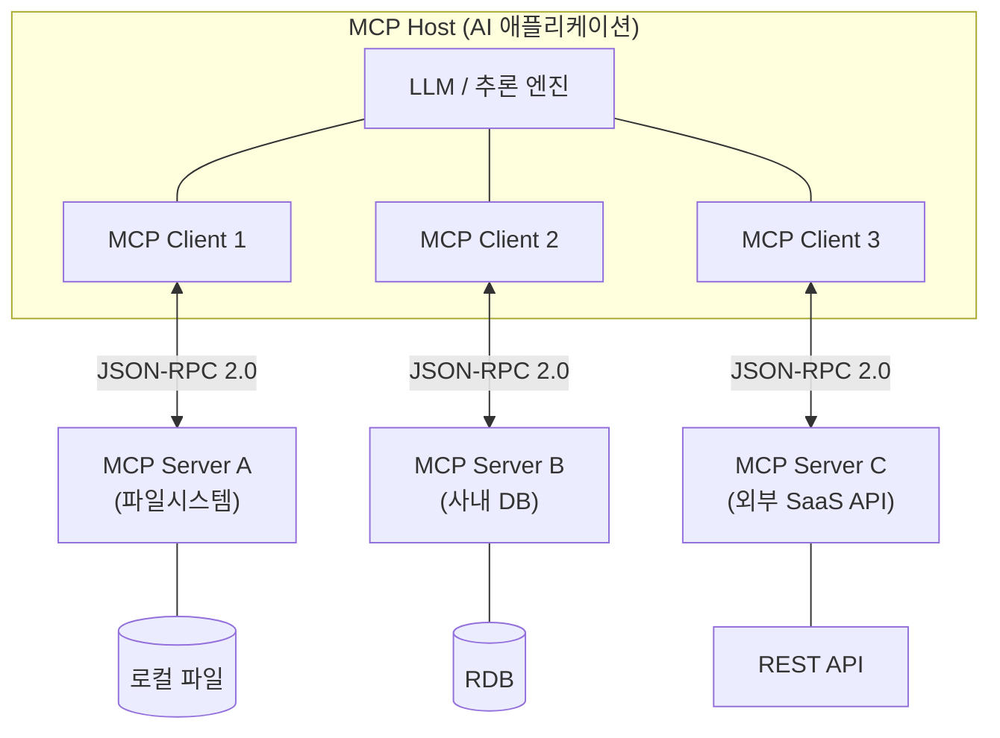
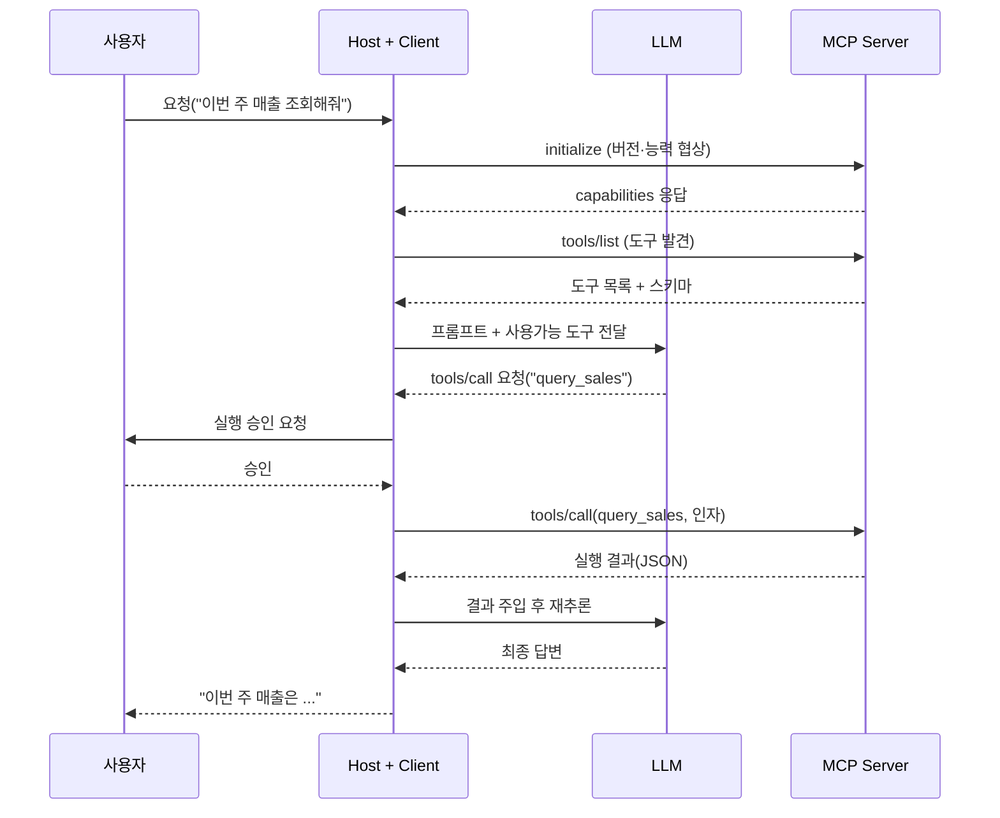

# MCP(Model Context Protocol)

## 1. 개요

> **정의**: MCP(Model Context Protocol)는 LLM 기반 AI 애플리케이션이 외부 도구·데이터·프롬프트와 같은 컨텍스트를 **표준화된 방식으로 연결**하기 위해 제안된 개방형 프로토콜로, JSON-RPC 2.0 메시지 규약 위에서 **Host–Client–Server** 구조로 동작하는 "AI를 위한 통합 인터페이스"이다.

생성형 AI가 실제 업무에 투입되면서 가장 큰 병목은 모델의 성능 자체가 아니라 **모델이 기업 내부 데이터·시스템·도구에 안전하게 접근할 방법의 부재**였다. LLM은 학습 시점 이후의 정보를 알지 못하고(지식 단절), 사내 DB·파일·SaaS·사내 API와 격리되어 있어 그대로는 "회의록을 요약해 Jira에 티켓을 만들라"는 요구를 수행할 수 없다. 종래에는 이를 해결하기 위해 애플리케이션마다 자체 함수 호출(Function Calling) 스키마를 정의하고 각 데이터 소스마다 커넥터를 개별 구현했는데, 이는 이른바 **M×N 통합 문제**를 낳았다. 즉 M개의 AI 애플리케이션과 N개의 도구를 잇기 위해 M×N개의 맞춤 연동을 매번 새로 만들어야 하며, 도구 하나가 바뀌면 이를 사용하는 모든 애플리케이션을 고쳐야 하는 유지보수 지옥이 발생한다.

MCP는 이 문제를 **USB-C에 비유되는 "표준 포트"**로 해결한다. 도구 제공자는 MCP 서버를 한 번만 구현해 두면 MCP를 지원하는 모든 AI 애플리케이션(Host)이 이를 재사용할 수 있고, AI 애플리케이션 개발자는 MCP 클라이언트만 탑재하면 생태계의 수많은 서버에 즉시 연결할 수 있다. 결과적으로 통합 복잡도가 **M×N에서 M+N으로** 감소하며, 도구와 모델의 결합도가 낮아져 각자 독립적으로 진화할 수 있게 된다. 이 개방성 덕분에 MCP는 특정 벤더 제품이 아니라 여러 IDE·에이전트 프레임워크·상용 어시스턴트가 공통으로 채택하는 사실상의 연동 표준으로 빠르게 확산되고 있다.

MCP의 특징은 다음과 같이 정리된다. 첫째, **개방형·모델 비종속 표준**으로 특정 LLM이나 벤더에 묶이지 않는다. 둘째, **JSON-RPC 2.0** 기반의 명확한 메시지 규약과 능력 협상(capability negotiation)을 통해 상호운용성을 보장한다. 셋째, 도구뿐 아니라 **리소스(데이터)와 프롬프트(템플릿)까지** 컨텍스트의 3요소를 표준화한다. 넷째, 로컬(stdio)과 원격(HTTP) **전송 계층을 분리**해 배포 형태에 유연하다.

## 2. MCP 전체 구조와 구성요소

MCP는 사용자와 마주하는 AI 애플리케이션인 **Host**, 그 안에서 서버 하나와 1:1 세션을 유지하는 **Client**, 실제 도구·데이터를 노출하는 **Server**의 3계층으로 구성된다. Host는 여러 개의 Client를 생성해 서로 다른 Server에 병렬로 연결하며, 각 Client-Server 쌍은 독립된 보안 경계를 형성한다.

**가. Host(호스트)** — Host는 Claude Desktop, Cursor·VS Code 같은 IDE, 자율 에이전트처럼 **최종 사용자가 직접 상호작용하는 AI 애플리케이션**이다. LLM 호출을 조율하고, 사용자에게 권한 승인(consent) UI를 제공하며, 여러 Client의 생명주기를 생성·종료까지 관리한다.

Host의 핵심 책임은 **보안 정책의 집행 지점(Policy Enforcement Point)**이라는 데 있다. 서버가 노출한 도구를 모델이 무분별하게 호출하지 못하도록, 실제 실행 전에 사용자 확인을 받거나 정책에 따라 차단하는 것이 Host의 역할이다. 예컨대 모델이 "파일 삭제" 도구를 호출하려 하면 Host가 사용자에게 승인을 요청하고, 승인 없이는 서버로 요청이 전달되지 않는다. 서버·모델을 신뢰 경계 밖에 두고 통제를 Host에 집중시킨 이 구조가 MCP 보안 모델의 출발점이다.

**나. Client(클라이언트)** — Client는 Host 내부에 임베드되어 **하나의 Server와 상태를 갖는(stateful) 세션을 유지**하는 중개자다. 연결 초기화 시 프로토콜 버전과 지원 기능을 교환하는 **능력 협상(capability negotiation)**을 수행하고, 서버가 제공하는 도구·리소스·프롬프트 목록을 발견(discovery)하며, 모델이 결정한 도구 호출을 서버로 전달하고 그 결과와 알림(notification)을 처리해 다시 모델에게 돌려준다.

Client와 Server가 반드시 1:1로 대응한다는 제약은 단순한 구현 규칙이 아니라 **격리(isolation) 장치**다. 서로 다른 신뢰 수준의 서버가 같은 세션을 공유하지 않으므로, 신뢰도가 낮은 외부 서버가 사내 DB 서버의 컨텍스트나 자격증명에 접근하는 것을 구조적으로 차단한다. 여러 서버를 조합할 때 발생하는 혼동된 대리자(confused deputy) 위험을 줄이는 1차 방어선이 여기서 형성된다.

**다. Server(서버)** — Server는 특정 기능을 캡슐화해 표준 인터페이스로 노출하는 **독립 프로세스**다. 사내 파일시스템, 데이터베이스, Git 저장소, 외부 결제 API 등 무엇이든 서버로 감쌀 수 있으며, 서버는 자신이 감싼 시스템의 인증·권한만 관리하면 되고 어떤 모델이 붙는지는 알 필요가 없다.

이 캡슐화 덕분에 서버는 특정 AI 애플리케이션과 무관하게 재사용·배포되며, 도구 로직이 바뀌어도 인터페이스(스키마)만 유지하면 소비 측을 고치지 않아도 된다. 서버는 클라이언트에게 **도구·리소스·프롬프트** 세 범주의 능력(primitive)을 제공하는데, 이 3요소의 구분이 MCP 설계의 핵심이므로 아래에서 별도로 상술한다.

MCP의 요소별 책임과 통제 주체를 표로 정리하면 다음과 같다. 단, 표는 요약일 뿐이며 각 요소가 왜 그렇게 분리되었는지는 위 문단의 설명이 본질이다.

| 구성요소 | 역할 | 통제 주체 | 대표 예시 |
|---|---|---|---|
| Host | LLM 조율·권한 승인·세션 관리 | 사용자 | Claude Desktop, Cursor, 자율 에이전트 |
| Client | 서버와 1:1 세션·능력 협상·메시지 중계 | Host | Host 내부 커넥터 모듈 |
| Server | 도구·리소스·프롬프트 노출 | 서버 개발자 | 파일시스템/DB/GitHub 서버 |

## 3. 서버 3대 프리미티브와 통신 절차

**가. 도구(Tools) — 모델 제어(model-controlled)** — 도구는 모델이 스스로 판단해 호출하는 **실행 가능한 함수**다. 각 도구는 이름·설명·입력 스키마(JSON Schema)를 갖고, 모델은 이 메타데이터만 보고 어떤 도구를 어떤 인자로 부를지 결정한다. 따라서 도구의 자연어 설명(description)은 단순 문서가 아니라 모델의 선택에 직접 영향을 주는 **실행 가능한 사양**에 가깝다.

도구는 "이메일 전송", "SQL 실행", "코드 실행"처럼 상태를 바꾸는 부작용(side effect)을 동반하는 경우가 많다. 이 때문에 MCP는 도구 실행을 모델이 임의로 확정하지 못하게 하고, Host가 실행 직전에 사용자 승인을 받도록 하는 **인간 개입(HITL)** 패턴을 권장한다. 예를 들어 `create_issue(title, body)` 도구를 노출하면 모델이 회의 요약으로부터 이슈 생성을 *제안*하고, 실제 생성은 사용자가 승인 버튼을 눌러야 일어나도록 설계할 수 있다. 이 분리가 자동화의 편의와 통제 가능성을 동시에 확보한다.

**나. 리소스(Resources) — 애플리케이션 제어(application-controlled)** — 리소스는 파일·DB 레코드·로그·이미지처럼 모델에게 **읽기 컨텍스트로 제공되는 데이터**다. 각 리소스는 URI로 식별되고 부작용이 없다는 점에서 도구와 근본적으로 구분된다. 도구가 "행위"라면 리소스는 "지식"이다.

어떤 리소스를 컨텍스트에 넣을지는 모델이 아니라 애플리케이션(또는 사용자)이 결정한다는 점이 중요하다. 이는 모델이 접근 가능한 데이터 범위를 애플리케이션이 통제함으로써 **불필요한 정보 노출과 컨텍스트 오염을 막기 위한** 설계다. 예컨대 사용자가 특정 설계 문서를 선택해 대화에 첨부하면 Host가 해당 리소스를 서버에서 읽어 프롬프트에 삽입하며, 선택되지 않은 문서는 모델의 시야에 들어오지 않는다. 이 방식은 RAG의 검색-주입 흐름과도 자연스럽게 결합된다.

**다. 프롬프트(Prompts) — 사용자 제어(user-controlled)** — 프롬프트는 서버가 미리 정의해 제공하는 **재사용 가능한 템플릿·워크플로우**다. 슬래시 명령이나 버튼 형태로 사용자에게 노출되어, 복잡하고 반복적인 지시를 표준화한다. 예를 들어 "코드 리뷰" 프롬프트는 리뷰 관점(보안·성능·가독성)과 출력 형식을 담은 템플릿을 제공해 매번 동일한 품질의 리뷰를 유도한다.

이처럼 **제어 주체(모델/애플리케이션/사용자)를 3요소로 명확히 나눈 것**이 MCP의 안전성과 예측가능성을 높이는 핵심 설계다. 부작용이 큰 행위는 모델이 제안하되 사용자가 승인하고, 데이터 노출 범위는 애플리케이션이 통제하며, 반복 워크플로우는 사용자가 명시적으로 호출한다는 원칙이 프로토콜 수준에 내재되어 있어, 자율성과 통제 사이의 균형이 개별 구현의 재량이 아니라 표준의 일부가 된다.

통신은 JSON-RPC 2.0 위에서 초기화→발견→실행의 순서로 이뤄진다. 아래 시퀀스는 도구 호출의 대표 흐름이다.

전송 계층(transport)은 배포 형태에 따라 선택한다. **stdio**는 Host와 동일 머신에서 서버를 로컬 프로세스로 띄워 표준입출력으로 통신하며, 지연이 낮고 네트워크 노출이 없어 로컬 파일·개발도구 접근에 적합하다. **HTTP 기반 전송**(스트리밍 지원)은 원격 서버에 네트워크로 접속할 때 사용하며, 최근 규격은 별도 상태 저장 없이 일반 HTTP 인프라(로드밸런서·서버리스)에서도 확장되도록 **무상태(stateless) 코어**를 지향하고 있다. 두 전송의 특성과 통제 포인트는 다음과 같다.

| 구분 | stdio(로컬) | HTTP(원격) |
|---|---|---|
| 배치 | Host와 동일 호스트, 자식 프로세스 | 네트워크 너머 별도 서버 |
| 지연/노출 | 낮음 / 네트워크 미노출 | 상대적 높음 / 공개 접점 |
| 인증 | 로컬 프로세스 신뢰 | OAuth 2.1/OIDC 토큰 |
| 적합 사례 | 파일시스템·IDE·터미널 | SaaS·사내 공용 API |

원격 서버에 대해서는 OAuth 2.1/OIDC에 정렬된 인가 체계가 규격에 포함되어, 토큰 기반 접근통제와 표준 자격증명 흐름을 적용할 수 있다. 이는 원격 배포에서 인증·인가를 각 서버가 제각각 구현하던 문제를 표준으로 수렴시키려는 시도로, 뒤에서 다룰 원격 서버 보안 취약점 대응과 직결된다.

## 4. 유사 개념과의 비교 및 적용 사례

MCP는 종종 Function Calling, RAG, 전통적 API와 혼동되지만, 해결하는 문제의 층위가 다르다. **Function Calling**은 특정 모델이 도구 호출 의도를 구조화된 형태로 출력하도록 하는 *모델 기능*인 반면, MCP는 그 도구를 **어떻게 발견·연결·실행할지를 표준화한 프로토콜 계층**이다. 즉 MCP는 Function Calling을 대체하는 것이 아니라, 그 위에서 도구 공급망을 표준화한다. **RAG**는 검색된 문서를 프롬프트에 넣어 지식을 보강하는 *기법*으로, MCP의 리소스 프리미티브가 RAG의 데이터 공급 경로가 될 수 있다는 점에서 상호보완적이다. **전통적 REST API**와 비교하면, REST가 사람·프로그램을 위한 범용 인터페이스라면 MCP는 **LLM이 자율적으로 도구를 탐색·사용하도록 설계된, 능력 발견과 컨텍스트 의미(semantics)를 내장한** 인터페이스라는 점이 결정적 차이다.

| 구분 | MCP | Function Calling | 전통적 API(REST) |
|---|---|---|---|
| 계층 | 연동 프로토콜(표준) | 모델의 도구호출 기능 | 범용 서비스 인터페이스 |
| 발견 | 런타임 동적 발견 | 사전 정의 스키마 | 문서 기반 정적 |
| 대상 | LLM 에이전트 | 단일 모델 | 사람·프로그램 |
| 재사용성 | M+N (높음) | 앱별 개별 정의 | 앱별 개별 연동 |

특히 REST API와의 비교에서 한 가지를 더 짚을 필요가 있다. 잘 만들어진 REST API가 이미 존재하더라도 그것을 그대로 LLM에게 던지면, 엔드포인트 수십 개와 파라미터의 의미를 모델이 매번 프롬프트에서 해석해야 하고 인증·페이지네이션·오류 처리가 제각각이라 신뢰성이 떨어진다. MCP 서버는 이 REST API를 **모델이 이해하기 쉬운 소수의 의미 있는 도구로 재구성**하고 발견·인증·오류 규약을 표준화하는 "어댑터" 역할을 한다. 즉 MCP는 기존 API를 대체하는 것이 아니라 그 위에 **LLM 친화적 계층**을 얹는다고 이해하는 것이 정확하다.

이 차이가 만드는 실무적 함의는 **"한 번 만든 서버의 재사용"**이다. 예컨대 어떤 조직이 사내 규정 문서를 노출하는 MCP 서버를 하나 구축하면, 개발자는 IDE 어시스턴트에서, 기획자는 데스크톱 챗봇에서, 운영팀은 자동화 에이전트에서 **동일 서버를 그대로** 활용한다. 구체적 적용 사례로는 (1) **소프트웨어 개발**에서 IDE 에이전트가 GitHub·파일시스템·터미널 MCP 서버에 연결해 이슈 조회부터 코드 수정·테스트 실행까지 수행하는 경우, (2) **엔터프라이즈 지식 검색**에서 사내 위키·티켓·DB를 각각 서버로 감싸 하나의 어시스턴트가 여러 지식원을 교차 질의하는 경우, (3) **업무 자동화**에서 캘린더·메신저·CRM 서버를 조합해 "고객 미팅을 잡고 요약을 CRM에 기록"하는 다단계 워크플로우를 구성하는 경우가 대표적이다. 세 사례 모두 서버가 독립적으로 재사용되어 통합 비용이 선형(M+N)에 머무는 이점을 공유한다.

## 5. 심화: 최신 동향과 보안 위협·표준 대응

MCP는 2024년 말 공개된 이후 규격이 빠르게 개정되며, 원격 서버 인가(OAuth 2.1 정렬), 스트리밍이 가능한 HTTP 전송, 무상태 코어, 서버 렌더 UI(MCP Apps)와 장시간 작업(Tasks) 확장 등 **엔터프라이즈 운영에 필요한 요소**가 지속적으로 보강되고 있다. 다만 규격이 활발히 진화 중이므로 특정 버전의 세부 기능은 공식 사양을 확인해 적용하는 것이 바람직하다.

생태계 측면에서는 파일시스템·Git·데이터베이스·검색 등 다양한 참조 서버가 공개되고, 서버를 등록·검색하는 **레지스트리**와 여러 IDE·에이전트 프레임워크의 클라이언트 지원이 늘면서 "서버를 설치하듯 도구를 붙이는" 사용 경험이 자리 잡고 있다. 이는 과거 패키지 매니저가 라이브러리 재사용을 폭발적으로 늘린 것과 유사한 네트워크 효과를 도구 연동 영역에서 재현할 잠재력을 가진다. 다만 검증되지 않은 서버가 손쉽게 유통될 수 있다는 점은 곧바로 보안 문제로 이어진다.

주목할 지점은 **보안**이다. 표준화된 도구 연결은 편의성만큼 새로운 공격면(attack surface)을 만든다. 학계·업계에서 제기된 주요 위협은 다음과 같다.

- **도구 설명 주입(tool poisoning / prompt injection)**: 서버가 도구 설명이나 반환값에 악의적 지시를 심어 모델의 행동을 탈취하는 공격. 모델이 설명을 그대로 신뢰하므로, 겉보기엔 정상인 도구가 내부적으로 데이터 유출을 유도할 수 있다.
- **과도한 권한과 혼동된 대리자(confused deputy)**: 모델이 여러 서버의 능력을 조합하는 과정에서 의도치 않은 권한 상승·교차 서버 데이터 유출이 발생. 신뢰도가 낮은 서버가 다른 서버의 결과를 가로채도록 유도하는 방식이 대표적이다.
- **원격 서버 인증·토큰 관리 취약점**: 실제 배포된 원격 MCP 서버들에서 인증 미흡·토큰 노출·과도한 스코프 사례가 관측되었다. 토큰 탈취 시 서버가 감싼 백엔드 전체가 위험에 노출된다.

이에 대한 대응으로 **Host 단의 사용자 승인(HITL)**, 최소권한 원칙에 따른 도구·리소스 범위 제한, 서명·출처 검증을 통한 신뢰 서버 화이트리스트, 감사 로깅, OAuth 기반 토큰 수명·스코프 최소화가 권고된다. 즉 MCP는 "연결의 표준"을 제공할 뿐 안전은 Host·서버 운영자의 **제로 트러스트적 통제 설계**에 달려 있다.

## 6. 고려사항 및 시사점 (기술사 관점)

- **표준 채택 전략**: MCP는 벤더 종속을 줄이는 개방형 표준이라는 점에서 도입 가치가 크나, 규격이 진화 중이므로 조직은 **버전 호환성·하위호환 정책**을 정하고, 내부 표준 서버 카탈로그와 게이트웨이를 두어 통제된 확산을 꾀해야 한다.
- **보안·거버넌스 트레이드오프**: 도구 자동 연결의 생산성과 공격면 확대는 상충한다. **최소권한·사용자 승인·서버 신뢰 검증·감사**를 기본값으로 삼고, 민감 도구는 승인 게이트를 강제하는 등 편의성과 안전성의 균형점을 조직 리스크 성향에 맞춰 설계해야 한다.
- **연계 기술과의 조합**: MCP는 RAG(리소스 공급), 에이전트 프레임워크(도구 오케스트레이션), API 게이트웨이(인증·레이트리밋), 관측성(호출 추적)과 결합될 때 효과가 극대화된다. 단독 기술이 아니라 **AI 플랫폼 아키텍처의 연결 계층**으로 위치시켜야 한다.
- **전망과 대응**: 도구·데이터 연동이 표준화되면 경쟁력은 "연결 여부"가 아니라 **양질의 서버(도메인 지식·통제)를 얼마나 확보·운영하느냐**로 이동한다. 조직은 내부 데이터·업무를 MCP 서버로 자산화하고, 레지스트리·서버 품질/보안 인증 체계를 선제적으로 준비할 필요가 있다.
- **국내 공공·기업 적용 관점**: 망분리·개인정보보호 환경에서는 원격 서버의 국외 이전·토큰 관리·로깅 요건이 규제(개인정보보호법·CSAP 등)와 충돌할 수 있으므로, 온프레미스 stdio 서버 우선 적용과 데이터 반출 통제를 함께 검토해야 한다.

## 참고자료
- Model Context Protocol, Architecture overview — https://modelcontextprotocol.io/docs/2026-07-28/learn/architecture
- Model Context Protocol Blog, "The 2026-07-28 Specification" — https://blog.modelcontextprotocol.io/posts/2026-07-28/
- CodiLime, "Model Context Protocol (MCP) explained" — https://codilime.com/blog/model-context-protocol-explained/
- MCPSecBench: A Systematic Security Benchmark for Model Context Protocols (arXiv:2508.13220) — https://arxiv.org/pdf/2508.13220

---
> **한 줄 요약**: MCP는 LLM 애플리케이션과 외부 도구·데이터·프롬프트를 Host–Client–Server 구조와 JSON-RPC 2.0로 표준 연결해 M×N 통합 문제를 M+N으로 줄이는 "AI를 위한 USB-C" 개방형 프로토콜이며, 그 안전성은 최소권한·사용자 승인 등 Host·서버의 통제 설계에 달려 있다.
