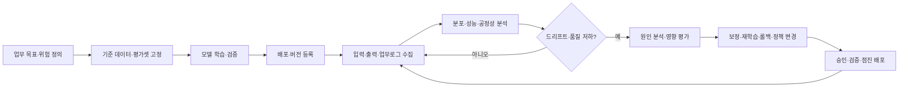
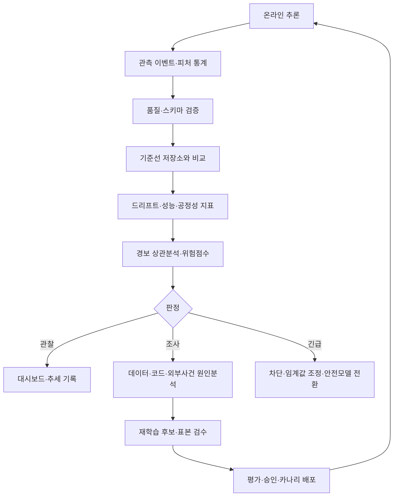

# AI 모델 드리프트(Model Drift)와 데이터 드리프트(Data Drift) 관리

## 1. 개요

> **정의:** AI 모델 드리프트 관리는 운영 환경의 입력·정답·예측·업무 맥락이 학습 시점과 달라지면서 발생하는 데이터 드리프트, 개념 드리프트, 예측 드리프트와 모델 성능 저하를 지속적으로 관찰하고 원인을 분석하여 재학습·보정·롤백·업무정책 변경으로 대응하는 전 생애주기 관리 활동이다.

머신러닝 모델은 과거 데이터에서 추출한 통계적 관계를 현재 업무에 적용한다. 그러나 고객 행동, 계절성, 센서 환경, 정책, 경쟁 상황, 공격 패턴은 계속 변한다. 학습 데이터가 당시에는 대표성을 가졌더라도 배포 후 시간이 지나면 입력 분포가 바뀌거나 입력과 정답의 관계가 바뀌어 모델의 판단이 낡을 수 있다.

드리프트는 단순한 장애와 다르다. 서버가 정상 응답하고 지연시간도 기준 안에 있어도, 추천 모델이 예전 상품만 추천하거나 사기 탐지 모델의 미탐률이 높아질 수 있다. 즉, 전통적 APM이 측정하는 시스템 상태와 AI 품질 상태 사이에 별도의 관측 계층이 필요하다.

또한 입력 분포가 변했다는 사실만으로 모델 성능이 저하되었다고 단정해서는 안 된다. 계절에 따른 정상적인 변화일 수도 있고, 모델이 새로운 분포에서도 잘 일반화할 수도 있다. 반대로 입력 분포가 거의 그대로여도 사기 수법이나 정책이 바뀌어 입력-정답 관계가 변하면 성능이 떨어질 수 있다.

따라서 기술사 답안에서는 드리프트를 하나의 임계치로 잡는 문제로 쓰기보다 기준 데이터와 관측 데이터의 정의, 라벨 지연, 통계 검정, 업무 영향, 대응 권한과 승인 절차를 연결해야 한다. 목표는 경보를 많이 만드는 것이 아니라 의미 있는 변화를 식별하고 적절한 조치를 실행하는 것이다.

## 2. 발생 배경과 관리 대상

운영 데이터는 학습 데이터와 다른 경로로 들어온다. 학습 데이터는 정제·라벨링·검수된 과거 스냅샷인 반면, 운영 데이터는 실시간 이벤트, 누락값, 새 범주, 사용자의 전략적 행동을 포함한다. 데이터 수집 시스템의 스키마 변경이나 피처 계산 로직 변경만으로도 분포가 달라질 수 있다.

드리프트의 원인은 자연적 변화와 시스템 변화, 적대적 변화로 나눌 수 있다. 자연적 변화에는 계절성, 인구구성 변화, 경기 변동이 포함된다. 시스템 변화에는 센서 교체, 앱 UI 변경, ETL 오류, 피처 정의 변경이 포함된다. 적대적 변화에는 사기 공격자의 전략 변경, 모델을 우회하려는 입력 조작이 포함된다.

관리 대상은 입력 피처에 한정되지 않는다. 라벨과 예측 결과, 공정성 그룹별 성능, 사용자 피드백, 비용과 지연시간, 정책 위반률, 사람이 모델 출력을 수정한 비율까지 함께 보아야 실제 업무 품질을 설명할 수 있다.

| 관측 대상 | 확인 질문 | 대표 신호 | 데이터 확보 시점 |
|---|---|---|---|
| 입력 데이터 | 학습·기준 데이터와 분포가 달라졌는가? | 평균, 분산, 범주 비율, 결측률 | 추론 직전·직후 |
| 피처 관계 | 피처 간 관계와 상관구조가 바뀌었는가? | 상관계수, 공분산, 임베딩 군집 | 배치·스트리밍 |
| 정답 라벨 | 실제 결과의 비율과 분포가 변했는가? | 클래스 비율, 지연 라벨 품질 | 업무 완료 후 |
| 예측 결과 | 모델 출력의 분포가 움직였는가? | 점수·클래스·거부율 | 추론 시점 |
| 성능 | 실제 정답 기준 품질이 유지되는가? | 정확도, F1, AUC, RMSE | 라벨 도착 후 |
| 업무 맥락 | 모델의 의사결정이 목적에 맞는가? | 전환율, 손실, 민원, 수동개입률 | 업무 시스템 연계 |

위 표의 항목은 서로 대체되지 않는다. 입력 데이터가 변해도 성능이 유지될 수 있고, 입력이 유지되어도 라벨 관계가 바뀔 수 있다. 또한 높은 AUC가 특정 고객군의 재현율을 보장하지 않으므로 전체 지표와 그룹별 지표를 함께 기록해야 한다.

## 3. 드리프트 유형과 작동 원리

### 3.1 데이터 드리프트와 공변량 드리프트

데이터 드리프트는 입력 변수의 주변 분포가 기준 기간과 달라지는 현상이다. 공변량 드리프트는 특히 입력 분포 \(P(X)\)가 변하지만 조건부 분포 \(P(Y|X)\)는 변하지 않는 경우를 말한다. 예를 들어 온라인 쇼핑몰의 방문자 연령대가 바뀌었지만 연령과 구매의 관계가 그대로라면 공변량 드리프트로 볼 수 있다.

이 변화는 모델에 위험일 수도 있고 기회일 수도 있다. 새로운 고객군이 유입되었는데 모델이 학습되지 않은 범주라면 성능이 나빠질 수 있지만, 모델이 충분히 일반화했다면 단순 경보는 운영팀의 피로만 높인다. 따라서 분포 차이와 검증 라벨 기반 성능을 함께 분석해야 한다.

연속형 변수에는 평균·분산·분위수·Wasserstein 거리·KS 검정 등을 적용할 수 있다. 범주형 변수에는 빈도 비교와 카이제곱 검정, 전체 분포에는 PSI나 Jensen-Shannon divergence를 활용할 수 있다. 표본 수가 매우 크면 작은 차이도 통계적으로 유의해지므로 효과 크기와 업무 임계치를 같이 설정한다.

### 3.2 개념 드리프트

개념 드리프트는 입력과 정답 사이의 관계가 바뀌는 현상으로, \(P(Y|X)\)가 변하는 것이 핵심이다. 같은 거래 특성을 가진 결제가 과거에는 정상이고 현재에는 도난 카드일 수 있다. 사기범의 행동 변화나 규제 정책 변경은 모델이 학습한 관계를 빠르게 무효화한다.

개념 드리프트는 정답 라벨이 있어야 직접 확인하기 쉽다. 그러나 금융 승인 결과, 고객의 실제 이탈, 설비 고장처럼 라벨이 늦게 도착하거나 관측되지 않는 경우가 많다. 이때는 프록시 지표와 후행 라벨을 결합하고, 라벨이 확보된 뒤 과거 경보의 정확도를 역평가한다.

개념 드리프트의 조기 신호는 입력 분포보다 예측-결과 관계에서 나타난다. 예측 점수는 정상인데 실제 손실이나 민원이 늘거나, 같은 점수 구간의 양성 비율이 변화하면 조건부 관계가 달라졌을 가능성이 있다. 기준 기간을 무조건 학습 시점으로만 두지 말고 최근 정상 운영 구간과도 비교한다.

### 3.3 예측 드리프트와 라벨 드리프트

예측 드리프트는 모델 출력의 분포가 변하는 현상이다. 분류 모델의 양성 판정률, 회귀 모델의 예측값 분위수, 생성형 모델의 거절률·응답길이·주제 비율이 예가 된다. 예측 드리프트는 빠르게 계산할 수 있지만, 출력 변화만으로 정확도 저하 원인을 확정할 수는 없다.

라벨 드리프트 또는 사전확률 드리프트는 \(P(Y)\)가 변하는 현상이다. 유행성 질환 예측에서 실제 양성 비율이 늘거나, 쇼핑몰에서 할인 기간에 구매 비율이 높아지는 경우가 해당한다. 라벨 비율 변화는 입력의 대표성 변화와 함께 나타날 수 있으므로 각 드리프트를 독립적으로 관측한다.

드리프트 유형은 배타적인 분류가 아니다. 입력 분포와 라벨 분포가 동시에 바뀌거나, 출력 분포 변화가 피처 계산 오류에서 시작될 수 있다. 운영센터는 경보 이름만 보고 재학습을 실행하지 말고 데이터 계보, 코드 배포, 정책 변경, 외부 사건을 원인 후보로 함께 조사해야 한다.

| 유형 | 변하는 대상 | 라벨 필요 여부 | 대표 원인 | 우선 대응 |
|---|---|---:|---|---|
| 데이터 드리프트 | 입력 \(P(X)\) | 아니오 | 고객군·계절·센서 변화 | 분포 점검·표본 검증 |
| 공변량 드리프트 | 입력, 관계는 가정상 유지 | 아니오 | 유입 모집단 변화 | 일반화 성능 확인 |
| 개념 드리프트 | 관계 \(P(Y|X)\) | 대체로 필요 | 공격·정책·업무 변화 | 라벨 분석·재학습 |
| 예측 드리프트 | 출력 \(P(\hat{Y})\) | 아니오 | 입력 변화·임계값 변화 | 출력·임계값 점검 |
| 라벨 드리프트 | 실제 결과 \(P(Y)\) | 예 | 사건 빈도·시장 변화 | 기준률·캘리브레이션 점검 |
| 스키마 드리프트 | 데이터 구조·타입 | 아니오 | ETL·API 계약 변경 | 파이프라인 차단·복구 |

## 4. 생명주기와 기준선 설계

드리프트 관리는 모델을 배포한 뒤 시작하는 부가 기능이 아니다. 요구사항 단계에서 허용 가능한 성능 저하와 라벨 지연을 정의하고, 학습 단계에서 기준 데이터와 평가셋을 고정하며, 배포 단계에서 관측 필드를 연결해야 한다. 운영 단계의 경보가 재학습과 승인으로 이어질 때 비로소 폐쇄형 관리가 된다.

기준선은 하나의 숫자가 아니라 비교 규칙의 묶음이다. 학습 데이터의 피처 분포, 검증 데이터의 성능, 최근 정상 운영 기간의 출력 분포, 그룹별 품질, 업무 KPI를 버전과 함께 보관한다. 기준 기간을 잘못 잡으면 계절성을 드리프트로 오인하거나 이미 오염된 운영 데이터를 정상으로 학습할 수 있다.

기준선에는 유효기간도 필요하다. 장기간 운영된 모델이 최초 학습 데이터와만 계속 비교되면 정상적인 장기 추세도 항상 경보가 된다. 학습 기준선과 최근 정상 기준선을 병행하고, 계절별 기준이나 롤링 윈도우를 사용하되 기준선 갱신 승인 기록을 남긴다.

수집 로그에는 모델 버전, 피처 버전, 입력 시각, 예측 시각, 예측값, 확률 또는 신뢰도, 추론 경로, 업무 결과, 라벨 도착 시각을 포함한다. 개인정보와 민감정보는 원문을 무조건 저장하지 말고 토큰화·집계·접근통제로 보호한다. 관측성이 높아질수록 개인정보 위험도 함께 커진다는 점을 고려해야 한다.

## 5. 탐지 지표와 분석 방법

### 5.1 통계적 분포 비교

PSI는 구간별 기준 비율과 관측 비율의 차이를 로그 비율과 함께 합산하는 방식으로 분포 이동을 요약한다. 구현과 설명이 쉬워 운영 대시보드에 많이 쓰이지만, 구간화 방식과 기준 분포에 민감하며 모든 업무에서 동일한 경보 기준을 적용할 수는 없다.

Jensen-Shannon divergence는 두 분포의 대칭적 차이를 측정하여 확률 분포 비교에 활용할 수 있다. Wasserstein 거리는 분포의 질량을 이동시키는 비용 관점에서 연속형 변수의 변화를 해석하기 쉽다. KS 검정은 두 연속형 표본이 같은 분포인지 검정하지만, 큰 표본에서 사소한 차이도 유의하게 판단할 수 있다.

범주형 피처에서는 카이제곱 검정과 범주별 비율 차이를 사용한다. 새로운 범주가 등장하거나 결측 범주가 급증하면 통계 검정 이전에 데이터 계약 위반으로 처리해야 한다. 다중 피처를 동시에 검사할 때는 다중 비교로 인한 오탐을 줄이기 위해 효과 크기, 보정 방법, 중요 피처 우선순위를 정한다.

### 5.2 성능·공정성·업무 지표

라벨이 확보되면 정확도 하나가 아니라 업무 목적에 맞는 지표를 계산한다. 불균형 분류에서는 정밀도·재현율·F1·PR-AUC를 확인하고, 비용이 다른 오류에는 기대손실과 혼동행렬을 사용한다. 확률을 의사결정에 쓰는 경우에는 Brier score와 캘리브레이션도 살펴야 한다.

모델의 전체 성능이 유지되어도 그룹별 재현율이나 거짓양성률이 악화될 수 있다. 성별·연령·지역·장애 여부처럼 법적·윤리적 고려가 필요한 그룹은 최소 수의 표본과 개인정보 보호를 함께 검토하며, 그룹을 과도하게 세분화하여 재식별 위험을 만들지 않는다.

업무 지표는 모델 지표와 연결해야 한다. 추천 모델에서는 클릭률만 아니라 장기 유지율과 고객 불만을 보고, 사기 모델에서는 탐지율만 아니라 정상 고객 차단과 조사 비용을 본다. 기술적 경보가 업무 손실로 이어지는 경로를 정의하면 재학습 우선순위를 합리적으로 정할 수 있다.

| 측정 계층 | 예시 지표 | 장점 | 주의점 |
|---|---|---|---|
| 데이터 | PSI, KS, JS, Wasserstein, 결측률 | 라벨 없이 빠른 감시 | 성능 저하를 직접 증명하지 않음 |
| 모델 출력 | 클래스 비율, 점수 분포, 엔트로피 | 추론 직후 계산 가능 | 임계값·트래픽 변화 영향 |
| 모델 성능 | F1, PR-AUC, RMSE, Brier | 품질을 직접 평가 | 라벨 지연·비용 |
| 공정성 | 그룹별 TPR/FPR, 격차 | 영향받는 집단 확인 | 그룹 표본·법적 기준 필요 |
| 업무 | 손실, 전환, 민원, 수동개입 | 경영 영향 설명 | 외부 요인 혼재 |
| 운영 | 지연, 오류율, 비용, 자원 | 시스템 원인 분리 | AI 품질과 동일하지 않음 |

## 6. 탐지·판정·대응 아키텍처

드리프트 모니터링은 수집기, 기준 저장소, 통계 계산기, 경보 엔진, 분석 대시보드, 대응 오케스트레이터의 조합으로 구성한다. 배치 모델은 시간창 단위로 계산하고, 실시간 모델은 스트리밍 집계와 샘플링을 사용한다. 모든 요청 원문을 보관하지 않아도 핵심 통계와 추적 ID를 남기면 비용과 개인정보를 줄일 수 있다.

경보 엔진은 단일 임계값보다 다중 신호를 조합해야 한다. 예를 들어 입력 PSI가 상승했지만 성능과 업무 지표가 유지되면 관찰 상태로 두고, 입력 변화와 그룹별 재현율 저하가 동시에 나타나면 조사 상태로 올린다. 라벨 지연이 긴 업무에서는 선행지표와 후행지표를 분리하여 경보의 확실성을 표시한다.

판정은 알림, 조사, 완화, 중단의 네 단계로 설계할 수 있다. 알림은 추세를 기록하고 담당자에게 전달하는 단계다. 조사는 데이터 품질, 코드 변경, 외부 사건을 확인하는 단계다. 완화는 임계값 조정, 보수적 정책, 사람 검토, 안전모델 전환을 적용하는 단계이고, 중단은 고위험 자동 결정을 차단하고 이전 버전으로 롤백하는 단계다.

대응 자동화에는 권한 경계가 필요하다. 낮은 위험의 통계 경보가 자동으로 대시보드에 기록되는 것과, 고위험 모델이 자동 재학습되어 고객 승인 업무에 투입되는 것은 다르다. 재학습 데이터의 승인자, 모델 릴리스 책임자, 롤백 권한자를 분리하고 모든 조치에 근거와 결과를 남긴다.

## 7. 재학습·보정·롤백 전략

재학습은 드리프트의 기본 대응처럼 보이지만 항상 정답은 아니다. 피처 파이프라인 오류나 라벨 오류가 원인인데 재학습하면 문제를 새로운 모델에 다시 주입할 수 있다. 먼저 데이터 계약, 코드 변경, 원천 시스템, 라벨 생성 규칙을 확인한 뒤 학습 데이터의 대표성과 품질을 평가한다.

재학습 데이터는 최근 데이터만 모으거나 과거 데이터만 유지하는 양자택일이 아니다. 최근성, 계절성, 희귀 사례, 안전 사례를 가중하고 시간순 분할로 미래 정보가 과거 학습에 새어 들어가지 않게 한다. 새 데이터와 기존 데이터의 혼합 비율은 성능·공정성·안정성 검증으로 결정한다.

온라인 학습은 빠르게 적응할 수 있지만 오염 데이터와 이상 이벤트를 즉시 학습하는 위험이 있다. 고위험 업무에서는 승인된 배치 재학습과 카나리 모델을 우선하고, 온라인 업데이트가 필요하면 데이터 품질 게이트와 롤백 가능한 체크포인트를 둔다.

모델 보정은 임계값, 캘리브레이션, 규칙 계층을 조정하여 빠르게 업무 위험을 줄이는 방법이다. 그러나 임계값을 바꾸면 정밀도와 재현율, 그룹별 오류, 고객 경험이 함께 변하므로 변경 전후를 비교해야 한다. 보정이 임시 조치인지 영구 정책인지 만료 시점도 명시한다.

롤백은 모델 파일만 되돌리는 작업이 아니다. 피처 코드, 스키마, 기준선, 모델, 정책, 인덱스와 배포 설정을 호환되는 릴리스 묶음으로 복원해야 한다. 복구 전에 이전 버전이 현재 데이터에 어떤 위험을 갖는지 확인하고, 단계적 트래픽 전환으로 복구 후 이상을 재확인한다.

## 8. 비교: 드리프트와 인접 개념

데이터 품질 저하는 결측·형식·범위·중복처럼 데이터 자체의 기대 조건 위반을 뜻하는 경우가 많다. 드리프트는 데이터가 형식상 유효하더라도 기준 분포나 관계가 시간에 따라 달라지는 현상이다. 품질 검증은 드리프트 모니터링의 전제이지만 둘은 같은 지표가 아니다.

데이터 스큐는 학습과 서빙 사이의 불일치를 강조하고, 드리프트는 시간 또는 운영 조건에 따른 변화에 초점을 둔다. 피처 계산 코드가 학습과 서빙에서 다르면 스큐이면서 동시에 이후 분포 변화를 만들 수 있다. 따라서 MLOps에서는 스큐 검사와 시간 기반 드리프트 검사를 모두 둔다.

개념 드리프트와 데이터 중독도 구분해야 한다. 개념 드리프트는 공격 의도가 없어도 현실의 관계가 바뀌는 현상인 반면, 데이터 중독은 공격자가 학습·검색 데이터의 무결성을 의도적으로 훼손한다. 중독이 성공하면 드리프트처럼 보일 수 있으므로 보안 로그와 데이터 계보를 함께 조사한다.

| 구분 | 변화의 관점 | 대표 질문 | 대응 초점 |
|---|---|---|---|
| 데이터 품질 저하 | 유효성·완전성 | 값이 규칙을 지키는가? | 파이프라인 차단·정제 |
| 데이터 스큐 | 학습-서빙 차이 | 같은 피처 계산인가? | 코드·스키마 정합 |
| 데이터 드리프트 | 입력 분포 시간 변화 | 모집단이 달라졌는가? | 기준선·표본 검증 |
| 개념 드리프트 | 입력-정답 관계 변화 | 같은 입력이 다른 결과인가? | 라벨·재학습 |
| 예측 드리프트 | 출력 분포 변화 | 판정 비율이 변했는가? | 임계값·원인 분석 |
| 데이터 중독 | 의도적 무결성 공격 | 누가 무엇을 오염시켰는가? | 격리·포렌식·재현 |

## 9. 사례: 가상 온라인 결제 사기 탐지 모델

가상의 전자상거래 기업이 결제 승인 시점에 사기 확률을 계산하는 모델을 운영한다고 하자. 학습 당시에는 카드번호 도용, 해외 IP, 반복 결제 패턴을 중심으로 탐지했고, 최근 30일 정상 운영 데이터로 입력 분포와 출력 분포를 관찰한다. 사기 라벨은 카드사 이의제기와 조사 결과가 반영된 뒤 약 14일 후 도착한다.

운영 1개월 후 해외 거래 비율이 8%에서 18%로 상승하고, 신규 모바일 지문 비율도 12%에서 31%로 변했다. 입력 분포 경보는 발생했지만 전체 승인율과 고객 불만은 기준 범위였다. 이 경우 휴가철 해외 거래 증가라는 정상 계절성 가능성을 먼저 확인하고, 바로 모델을 교체하지 않는다.

14일 후 라벨이 유입되자 특정 모바일 지문 그룹에서 재현율이 92%에서 71%로 떨어지고, 미탐으로 인한 손실이 1주일 동안 18% 증가한 것으로 나타났다. 동시에 같은 점수 구간의 실제 사기 비율이 달라져 개념 드리프트 후보가 되었다. 보안팀은 최근 공격 패턴과 피처 계산 변경 이력을 확인한다.

조사 결과 공격자가 정상 결제처럼 보이는 분할 결제와 신규 기기 조합을 사용하고 있었고, 해당 특징의 상호작용을 모델이 충분히 학습하지 못한 것으로 가정한다. 우선 고위험 점수 구간은 추가 사람 검토로 전환하고, 기존 모델의 안전 임계값을 임시 적용한다. 이 조치는 재학습 완료 전 손실을 줄이는 완화책이지 성능 개선의 증거는 아니다.

재학습에는 최근 공격 사례, 과거 정상 사례, 계절별 검증셋, 신규 모바일 지문군을 포함한다. 시간순 검증으로 미래 정보를 차단하고, 전체 PR-AUC뿐 아니라 해외·모바일·신규 고객 그룹의 재현율과 정상 고객 차단률을 비교한다. 카나리 트래픽에서 10%를 먼저 처리한 뒤 업무 손실과 민원을 확인하고 전체 배포한다.

| 단계 | 관찰·결정 | 증거 | 통제 |
|---|---|---|---|
| 1. 탐지 | 해외 거래·기기 피처 분포 변화 | 피처 비율·PSI 추세 | 계절성 비교 |
| 2. 확인 | 라벨 도착 후 그룹별 재현율 저하 | 혼동행렬·손실 | 개념 드리프트 판정 |
| 3. 완화 | 고위험 건 사람 검토 전환 | 승인·거절 로그 | 임시 임계값·안전정책 |
| 4. 개선 | 최근 공격 패턴 포함 재학습 | 시간순 검증 결과 | 데이터 승인·모델 등록 |
| 5. 배포 | 10% 카나리 후 확대 | 업무 KPI·오류율 | 승인·롤백 계획 |
| 6. 회고 | 탐지 지연과 비용 분석 | MTTD·MTTR·손실 | 기준선·피처 개선 |

이 사례에서 중요한 점은 입력 경보가 발생한 날과 실제 성능 저하를 확인한 날 사이에 14일의 라벨 지연이 있었다는 것이다. 기술사는 경보 시점, 판정 시점, 완화 시점, 재학습 완료 시점을 분리하고 지연시간을 서비스 수준 목표로 관리해야 한다.

## 10. 심화: MLOps·LLMOps와 최신 모니터링 관점

NIST의 배포 후 AI 시스템 모니터링 논의는 기능성·운영성·인간 요인 관측을 구분하고, 사전 평가와 사후 관측을 연결하는 피드백 루프가 필요하다고 본다. 이는 모델 지표만 대시보드에 올리는 방식에서 벗어나 사용 맥락, 사용자 영향, 장기 변화와 불확실성까지 살피라는 의미다.

Google의 머신러닝 운영 가이드는 서빙 데이터의 학습 데이터 대비 스큐·드리프트, 예측 품질, 로그와 알림을 파이프라인 단계별로 관찰할 것을 강조한다. 따라서 모델 저장소에 버전만 남기는 것보다 데이터 수집·서빙·업무 결과의 추적성을 연결하는 설계가 중요하다.

클라우드 모델 모니터링 서비스는 보통 기준 분포를 계산한 뒤 운영 분포와 통계적 거리 또는 검정 결과를 비교하고 임계값 초과 시 알림을 발생시킨다. 이 기능은 빠른 시작에 유용하지만 기준 데이터의 대표성, 표본 크기, 라벨 지연, 임계값의 업무 의미를 조직이 별도로 검증해야 한다.

LLMOps에서는 전통적인 입력 피처의 드리프트만으로 답변 품질을 설명하기 어렵다. 검색 문서의 주제와 신선도, 검색 적중률, 근거 인용률, 응답 거절률, 응답 길이, 사용자 피드백, 도구 호출 실패, 비용과 지연시간을 함께 관찰한다. 생성 결과는 비결정적일 수 있으므로 고정 평가셋, 모델 기반 평가, 사람 평가, 업무 결과를 조합한다.

모니터링 결과는 AI 거버넌스와 연결되어야 한다. 모델 카드와 데이터 카드에 기준선·한계·재평가 주기를 기록하고, 영향이 큰 시스템은 변경 승인과 사고 보고 절차를 둔다. 드리프트 경보를 받았는데도 조치하지 않는 운영은 경보가 없는 것과 같은 위험을 만든다.

예상 출제에서는 “AI 모델 성능 저하 원인과 MLOps 모니터링 방안”, “데이터 품질·AI 신뢰성·재학습 거버넌스”, “생성형 AI 운영에서 드리프트와 평가”를 연결할 수 있다. 답안은 유형 정의, 기준선·지표, 개념도, 사례, 자동화와 사람의 승인, 개인정보·공정성·보안 시사점 순서로 구성하면 논리적이다.

## 11. 고려사항 및 시사점

### 11.1 통계적 유의성과 업무적 유의성의 균형

표본이 많으면 작은 분포 차이도 유의한 결과가 된다. 반대로 표본이 적으면 실제로 중요한 변화가 검정에서 드러나지 않을 수 있다. 통계량만으로 자동 조치하지 말고 효과 크기, 지속시간, 업무 영향, 신뢰구간을 함께 사용한다.

### 11.2 기준선과 계절성의 분리

최근 정상 기간을 기준으로 삼으면 계절성에 적응할 수 있지만, 이미 성능이 저하된 기간을 정상으로 채택할 위험이 있다. 학습 기준선, 최근 정상 기준선, 계절 기준선을 함께 보관하고 갱신 승인과 만료 정책을 둔다.

### 11.3 라벨 지연과 조기경보 설계

정답 라벨이 늦게 도착하는 업무는 입력·출력·업무 프록시를 먼저 보고 후행 라벨로 경보 정확도를 검증한다. 조기경보를 성능 확정 경보처럼 표현하지 말고 “조사 필요”, “성능 확인”, “긴급 완화” 등 상태를 구분한다.

### 11.4 자동 재학습의 안전장치

자동 재학습은 변화에 빠르게 대응하지만 오염 데이터와 잘못된 라벨을 확대할 수 있다. 승인된 데이터셋, 재현 가능한 파이프라인, 독립 검증셋, 모델 레지스트리, 카나리 배포, 즉시 롤백을 필수 조건으로 둔다.

### 11.5 개인정보와 공정성의 동시 보호

피처와 그룹별 성능을 상세하게 보관할수록 민감정보가 남을 수 있다. 최소수집, 가명화, 집계, 접근권한, 보존기간, 재식별 위험 평가를 적용한다. 공정성 평가도 단순한 숫자 맞추기가 아니라 업무 목적과 법·윤리 기준에 맞게 설명한다.

### 11.6 보안 공격과 자연 변화의 구분

공격자가 탐지기를 피하려고 정상 분포처럼 행동하거나 피드백을 조작하면 드리프트 경보가 보안 사건의 일부가 될 수 있다. 데이터 계보, 계정 활동, 파이프라인 변경, 외부 위협정보와 모델 지표를 상관분석하고, 의심 데이터는 증거를 보존한 채 격리한다.

### 11.7 복구 가능성과 책임성

모델·데이터·피처 코드·정책의 버전을 함께 복구할 수 있어야 하며, 어떤 사람이 어떤 근거로 완화와 재학습을 승인했는지 남겨야 한다. RTO와 RPO뿐 아니라 경보 탐지시간, 원인분석시간, 정상화시간, 재발률을 AI 운영 성과지표로 관리한다.

## 12. 한 줄 답안 구성 전략

시험 답안은 “정의와 필요성 → 데이터·개념·예측 드리프트 유형 → 기준선과 생명주기 개념도 → 통계·성능·공정성·업무 지표 → 탐지·판정·대응 아키텍처 → 재학습·보정·롤백 → 사기 탐지 사례 → MLOps·LLMOps와 거버넌스 → 기술사 고려사항”의 흐름으로 전개한다.

## 참고자료

1. NIST, *Challenges to the monitoring of deployed AI systems*, https://nvlpubs.nist.gov/nistpubs/ai/NIST.AI.800-4.pdf
2. Google for Developers, *Productionization | Machine Learning*, https://developers.google.com/machine-learning/managing-ml-projects/production
3. Microsoft Learn, *Model monitoring in production - Azure Machine Learning*, https://learn.microsoft.com/en-us/azure/machine-learning/concept-model-monitoring?view=azureml-api-2
4. Google Cloud, *Introduction to Vertex AI Model Monitoring*, https://docs.cloud.google.com/gemini-enterprise-agent-platform/machine-learning/model-monitoring/overview

---

> **한 줄 요약**: AI 드리프트 관리는 입력·관계·출력·업무 맥락의 변화를 기준선과 라벨 지연까지 고려해 탐지하고, 검증 가능한 재학습·보정·롤백으로 연결하는 전 생애주기 거버넌스다.
