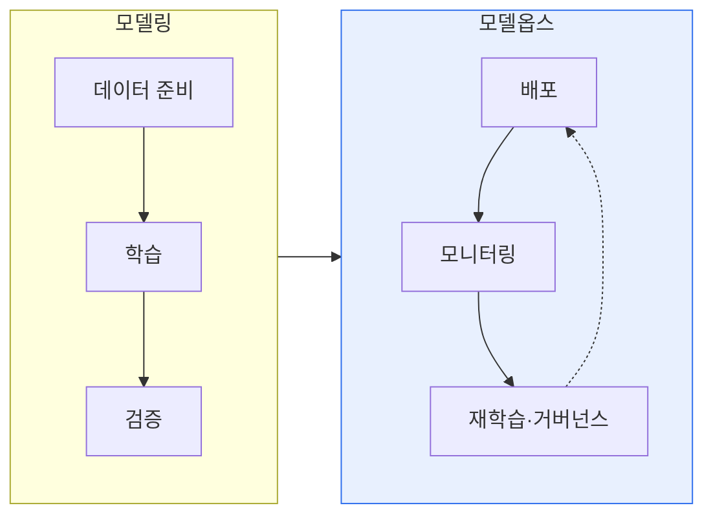

# 기계학습 모델링과 모델옵스(ModelOps)

## 1. 개요

### 가. 정의
> **모델링(Modeling)** 은 데이터로 기계학습 모델을 설계·학습·검증하는 개발 활동이고, **모델옵스(ModelOps)** 는 완성된 **모델을 운영 환경에 배포하고 지속적으로 관리·거버넌스**하는 운영 체계다.

두 개념을 함께 이해하는 핵심은 '**모델을 만드는 것과 운영하는 것은 다른 문제**'라는 데 있다. 데이터 과학자가 정확도 높은 모델을 만드는 것(모델링)이 끝이 아니다. 그 모델이 실제 서비스에서 지속적으로 가치를 내려면, 배포하고·성능을 감시하고·성능이 떨어지면 재학습하고·규제와 감사에 대응해야 한다. 모델옵스는 이 운영 전 과정을 표준화·자동화·거버넌스하는 체계다. MLOps가 주로 개발-배포의 기술적 자동화에 초점을 둔다면, 모델옵스는 여기에 더해 **비즈니스·리스크·규제 관점의 모델 거버넌스** 를 포괄하는 더 넓은 개념으로, 조직의 모든 분석 모델(ML뿐 아니라 규칙 기반·통계 모델까지)을 일관되게 관리하는 것을 지향한다.

### 나. 필요성
기업이 운영하는 모델이 늘어날수록, 배포되지 않거나 배포 후 방치되어 성능이 저하되는 문제가 커진다. 모델옵스는 모델을 신뢰할 수 있는 자산으로 지속 관리하기 위해 필요하다.

## 2. 모델링과 모델옵스

| 구분 | 모델링 | 모델옵스 |
|---|---|---|
| **초점** | 모델 개발(정확도) | 모델 운영·거버넌스 |
| **활동** | 데이터 준비·학습·검증·튜닝 | 배포·모니터링·재학습·감사 |
| **주체** | 데이터 과학자 | 운영·거버넌스 조직 |
| **관점** | 기술적 성능 | 비즈니스·리스크·규제 |

## 3. 모델옵스 주요 요소

| 요소 | 내용 |
|---|---|
| **배포·서빙** | 모델을 운영 환경에 제공(API·배치) |
| **모니터링** | 성능·데이터 드리프트·편향 감시 |
| **재학습(CT)** | 성능 저하 시 자동 재학습·재배포 |
| **모델 레지스트리** | 버전·메타데이터·계보 관리 |
| **거버넌스** | 승인·감사·설명가능성·규제 준수 |

## 4. 고려사항 및 시사점

1. **드리프트 감지·재학습이 운영의 핵심**이다. 실제 데이터가 학습 시점과 달라지면 성능이 조용히 무너지므로, 모니터링과 자동 재학습이 모델옵스의 중심이다.
2. **거버넌스 관점이 MLOps와의 차이**다. 모델옵스는 기술 자동화를 넘어 모델의 승인·감사·설명가능성·규제 준수까지 다뤄, 금융·의료 등 규제 산업에서 특히 중요하다.
3. **모든 분석 모델의 통합 관리**를 지향한다. ML 모델뿐 아니라 조직의 규칙·통계 모델까지 일관된 생명주기로 관리해, 모델 자산 전체의 신뢰성과 거버넌스를 확보한다.

---

> **한 줄 요약**: 모델링은 *모델을 개발(학습·검증)* 하는 활동, 모델옵스는 *모델을 배포·모니터링·재학습·거버넌스* 하는 운영 체계로, 드리프트 감지·재학습과 승인·감사·규제 준수를 통해 모델을 신뢰할 수 있는 자산으로 지속 관리한다.
