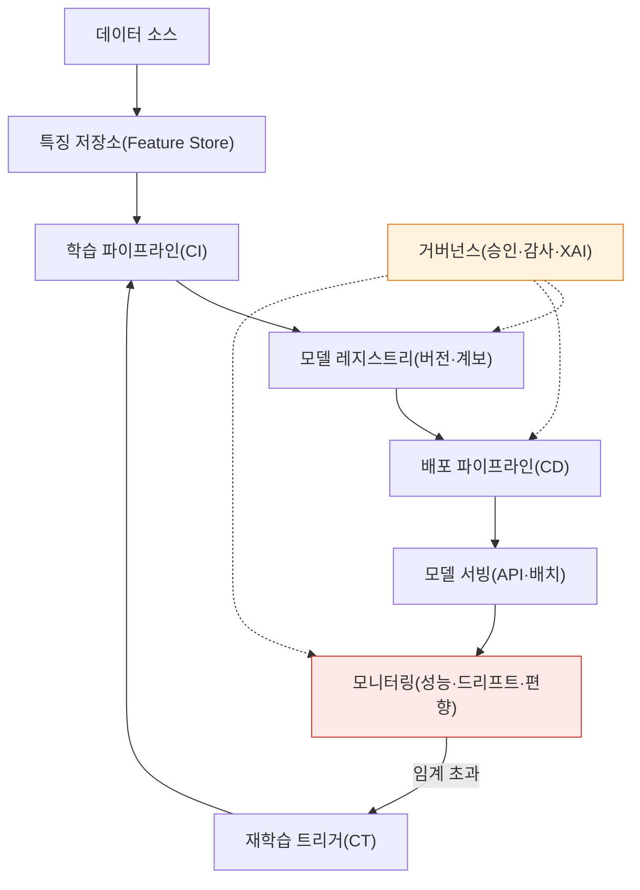

# 기계학습 모델링과 모델옵스(ModelOps)

## 1. 개요

### 가. 정의
> **모델링(Modeling)** 은 데이터로부터 문제를 정의하고 특징을 설계하며 알고리즘을 선택·학습·검증·튜닝하여 예측 성능을 확보하는 **개발(build) 활동**이고, **모델옵스(ModelOps)** 는 완성된 모델을 운영 환경에 **배포(deploy)하고 지속적으로 모니터링·재학습·거버넌스**하여 비즈니스 가치를 안정적으로 실현하는 **운영(operate)·통제 체계**다.

두 개념을 함께 이해하는 핵심은 '**모델을 만드는 것과 운영하는 것은 근본적으로 다른 문제**'라는 데 있다. 데이터 과학자가 실험실 데이터셋에서 정확도 95%의 모델을 만드는 것(모델링)은 여정의 절반일 뿐이다. 그 모델이 실제 서비스에서 지속적으로 가치를 내려면, 운영 시스템에 배포되어야 하고, 실데이터에서의 성능이 감시되어야 하며, 데이터 분포가 변하면 재학습되어야 하고, 규제 감사와 설명 요구에 대응해야 한다. 실제로 상당수의 분석 모델은 개발만 되고 배포되지 못하거나(이른바 '모델의 서랍 속 사장'), 배포된 뒤에도 방치되어 성능이 조용히 무너진다. 모델옵스는 바로 이 개발-운영의 간극(gap)을 메우기 위해 등장한, 모델 생명주기 전 과정을 **표준화·자동화·거버넌스**하는 체계다.

모델옵스는 MLOps와 자주 혼용되지만 결이 다르다. MLOps가 데이터·모델 파이프라인의 **기술적 자동화(CI/CD/CT)** 에 무게를 둔다면, 모델옵스는 여기에 더해 **비즈니스·리스크·규제 관점의 모델 거버넌스**를 포괄하는 더 넓은 개념으로, 조직이 운영하는 모든 의사결정 모델(머신러닝뿐 아니라 규칙 기반·통계·최적화 모델까지)을 일관된 원칙으로 통제하는 것을 지향한다. 가트너(Gartner)가 이 용어를 확산시킨 것도, 개별 데이터 과학 프로젝트의 성공을 넘어 '**엔터프라이즈 차원의 모델 자산 관리**'라는 조직 역량이 필요하다는 문제의식에서였다.

### 나. 등장 배경 및 필요성
모델옵스가 필요해진 배경은 세 가지 압력의 중첩으로 설명된다. 첫째, **규모의 압력**이다. 초기에는 조직당 모델이 한두 개였지만, AI가 전사로 확산되면서 수십~수백 개의 모델이 동시에 운영되기 시작했다. 사람이 수작업으로 각 모델의 성능을 챙기는 방식은 이 규모에서 붕괴한다. 둘째, **신뢰의 압력**이다. 모델은 배포 순간부터 열화하기 시작한다. 학습 시점의 데이터 분포와 운영 시점의 실데이터 분포가 어긋나는 드리프트(drift)가 발생하면, 정확도가 눈에 띄지 않게 떨어지고 잘못된 의사결정이 누적된다. 셋째, **규제의 압력**이다. EU AI Act, 금융 분야의 모델 리스크 관리(SR 11-7), 개인정보·공정성 규제가 강화되면서, 모델의 근거·편향·감사 이력을 증명하지 못하면 서비스 자체가 위법이 될 수 있다.

정리하면 모델옵스는 '만들어 놓은 모델을 **신뢰할 수 있는 자산으로 계속 살아 있게** 만드는' 운영 규율이며, AI가 실험을 넘어 기간 업무(mission-critical)로 들어온 시대의 필수 인프라다.

## 2. 모델링과 모델옵스의 관계 — 전체 생명주기

모델링과 모델옵스는 단절된 두 단계가 아니라, 하나의 폐루프(closed loop)로 맞물려 순환한다. 모델링은 이 루프의 '개발' 반원을, 모델옵스는 '운영' 반원을 담당하며, 운영에서 감지된 드리프트가 다시 모델링(재학습)의 입력이 되는 피드백 구조가 본질이다. 아래 다이어그램은 두 영역이 어떻게 연결되어 순환하는지를 보여준다.

```mermaid
flowchart LR
  subgraph M["모델링(개발)"]
    M1["문제 정의·데이터 준비"] --> M2["특징공학·학습"]
    M2 --> M3["검증·튜닝"]
  end
  subgraph O["모델옵스(운영)"]
    O1["배포·서빙"] --> O2["모니터링(성능·드리프트)"]
    O2 --> O3["재학습·거버넌스"]
  end
  M3 --> O1
  O3 -. "드리프트 감지 시 재학습 트리거" .-> M1
  style M fill:#eef7ee,stroke:#2e7d32
  style O fill:#e8f0fe,stroke:#2f6fed
```

위 그림에서 주목할 점은 두 가지다. 하나는 모델링의 산출물(검증된 모델)이 모델옵스의 입력이 되어 **책임이 이관(handoff)** 된다는 것이고, 다른 하나는 운영 중 감지된 이상이 다시 개발로 되먹임되어 **루프가 닫힌다(closed loop)** 는 것이다. 이 되먹임이 끊기면 모델은 배포 직후부터 열화만 하다 죽는다. 모델옵스의 존재 이유가 바로 이 루프를 자동으로, 통제 가능하게 계속 돌리는 데 있다.

두 영역의 성격 차이는 다음 표로 정리되지만, 표 이전에 그 차이가 '왜' 생기는지를 이해해야 한다. 모델링은 **탐색적(exploratory)** 이다. 어떤 특징과 알고리즘이 최선인지 미리 알 수 없어 수많은 실험을 반복하며, 성공 기준은 검증셋에서의 정확도 같은 기술 지표다. 반면 모델옵스는 **결정론적·통제 지향적(controlled)** 이다. 운영 환경에서는 재현성·안정성·감사가능성이 정확도만큼 중요하며, 성공 기준은 서비스 지연시간·가용성·비즈니스 KPI·규제 준수로 확장된다. 이 성격 차이가 아래의 활동·주체·관점 차이를 만든다.

| 구분 | 모델링(개발) | 모델옵스(운영) |
|---|---|---|
| **초점** | 예측 성능(정확도) 확보 | 안정 운영·거버넌스 |
| **성격** | 탐색적·실험 반복 | 결정론적·통제·자동화 |
| **주요 활동** | 데이터 준비·특징공학·학습·검증·튜닝 | 배포·모니터링·재학습·감사 |
| **주체** | 데이터 과학자·ML 엔지니어 | 운영(SRE)·거버넌스·리스크 조직 |
| **성공 지표** | 정확도·AUC·F1 등 기술 지표 | 지연·가용성·비즈니스 KPI·규제 준수 |
| **핵심 관점** | 기술적 성능 | 비즈니스·리스크·규제 |

## 3. 모델옵스의 아키텍처와 구성 요소

모델옵스를 실제로 구현하는 참조 아키텍처는 데이터·학습·배포·모니터링·거버넌스의 계층이 파이프라인으로 연결된 형태다. 아래 다이어그램은 CI(코드 통합)·CD(배포)·CT(지속 학습)의 세 자동화 축이 어떻게 레지스트리와 모니터링을 매개로 순환하는지를 세부적으로 보여준다.

```mermaid
flowchart TB
  DS["데이터 소스"] --> FE["특징 저장소(Feature Store)"]
  FE --> TR["학습 파이프라인(CI)"]
  TR --> REG["모델 레지스트리(버전·계보)"]
  REG --> CD["배포 파이프라인(CD)"]
  CD --> SRV["모델 서빙(API·배치)"]
  SRV --> MON["모니터링(성능·드리프트·편향)"]
  MON -->|"임계 초과"| CT["재학습 트리거(CT)"]
  CT --> TR
  GOV["거버넌스(승인·감사·XAI)"] -.-> REG
  GOV -.-> CD
  GOV -.-> MON
  style GOV fill:#fff3e0,stroke:#e67e22
  style MON fill:#fde8e8,stroke:#c0392b
```

**가. 배포·서빙(Deployment & Serving).** 검증된 모델을 운영 환경에서 소비 가능한 형태로 제공하는 단계다. 실시간 추론을 위한 온라인 API 서빙과 대량 예측을 위한 배치 서빙으로 나뉘며, 트래픽에 따라 자동 확장(auto-scaling)되도록 컨테이너·쿠버네티스 위에 얹는 것이 일반적이다. 배포의 핵심 원리는 '위험을 나누어 내보낸다'는 것이다. 새 모델을 전량 교체하면 문제가 생겼을 때 전체가 타격을 받으므로, **카나리(canary) 배포**로 소량 트래픽에만 먼저 노출하거나 **섀도(shadow) 배포**로 실서비스에 영향 없이 예측만 비교하고, 문제가 없을 때 점진 확대한다. 이 점진성이 운영 리스크를 결정적으로 낮춘다.

**나. 모니터링(Monitoring).** 모델옵스의 심장이다. 소프트웨어 모니터링이 지연·오류율 같은 시스템 지표를 보는 것과 달리, 모델 모니터링은 **예측의 품질 자체**를 본다. 여기에는 (1) 입력 데이터의 분포가 학습 때와 달라지는 **데이터 드리프트(data drift)**, (2) 입력-출력 관계 자체가 변하는 **개념 드리프트(concept drift)**, (3) 실제 정답이 도착한 뒤 측정하는 **성능 저하**, (4) 특정 집단에 불리해지는 **편향(bias)** 감시가 포함된다. 성능 저하가 위험한 이유는 '조용하다'는 데 있다. 시스템은 정상 동작하고 API도 200을 반환하지만, 예측만 서서히 틀려간다. 그래서 정답 지연(label delay)을 감안한 프록시 지표(입력 드리프트, 예측 분포 변화)로 조기 경보를 잡는 설계가 중요하다.

**다. 재학습(CT, Continuous Training).** 모니터링이 임계치를 넘는 열화를 감지하면 파이프라인이 자동으로 최신 데이터로 재학습하고 검증을 거쳐 재배포한다. 재학습 트리거는 정기 스케줄(예: 매주), 드리프트 임계 초과, 성능 지표 하락 등 정책으로 정의한다. 여기서 반드시 지켜야 할 원리는 '**자동 재학습이 자동 신뢰를 뜻하지 않는다**'는 것이다. 재학습된 모델이 기존 모델보다 반드시 낫다는 보장은 없으므로, 승격(promotion) 전에 챔피언-챌린저(champion-challenger) 비교와 검증 게이트를 두어 열화된 모델이 오히려 배포되는 사고를 막는다.

**라. 모델 레지스트리·거버넌스(Registry & Governance).** 모델 레지스트리는 모든 모델의 버전·학습 데이터·하이퍼파라미터·성능·계보(lineage)를 기록하는 '모델의 형상관리 창고'다. 거버넌스는 그 위에서 누가 어떤 근거로 어떤 모델을 승인·배포했는지, 예측이 왜 그렇게 나왔는지(설명가능성, XAI)를 추적·감사할 수 있게 한다.

레지스트리가 특히 중요한 이유는 모델의 재현성(reproducibility) 때문이다. 사고가 발생했을 때 "그 시점에 어떤 데이터로 학습된 어떤 버전의 모델이 어떤 입력을 받아 그런 결정을 내렸는가"를 정확히 복원할 수 없다면, 원인 규명도 개선도 불가능하다. 따라서 레지스트리는 코드·데이터·모델·환경의 네 축을 함께 버전 고정(pinning)하여, 언제든 특정 예측을 그대로 재현할 수 있어야 한다. 규제 산업에서는 이 계보와 감사 이력이 없으면 사고 발생 시 책임 규명과 소명이 불가능하므로, 거버넌스는 선택이 아니라 전제다.

## 4. 성숙도와 실무 적용 — MLOps 레벨과의 연계

모델옵스의 실무 수준은 흔히 자동화 성숙도로 구분된다.

**레벨 0(수동 프로세스)** 은 데이터 과학자가 노트북에서 학습한 모델을 스크립트·파일로 운영팀에 수작업으로 넘기는 단계다. 개발과 운영이 단절되어 배포가 드물고(분기·연 단위), 배포 후 모니터링이 없어 열화를 방치하며, 재현성도 확보되지 않는다.

**레벨 1(ML 파이프라인 자동화)** 은 데이터 검증·학습·검증·배포가 하나의 파이프라인으로 자동화되어, 드리프트가 감지되면 최신 데이터로 재학습(CT)이 자동으로 도는 단계다. 특징 저장소와 모델 레지스트리가 도입되어 실험의 재현성과 일관성이 확보된다.

**레벨 2(CI/CD 파이프라인 자동화)** 는 모델뿐 아니라 파이프라인 자체의 변경까지 코드로 관리·테스트·배포(CI/CD)되어, 여러 모델을 빠르고 안정적으로 반복 갱신할 수 있는 성숙 단계다. 이 단계에서 조직은 수십~수백 개 모델을 통제 가능한 상태로 동시에 운영할 수 있다.

구체적 산업 적용을 보면 그 필요성이 분명해진다.

금융의 신용평가·이상거래탐지(FDS) 모델은 사기 패턴이 계속 진화하므로(개념 드리프트) 재학습 없이는 수 주 만에 탐지율이 무너지며, 동시에 대출 거절의 근거를 설명·감사해야 하는 규제(모델 리스크 관리, SR 11-7) 대상이다. 이 영역에서 모델옵스는 '탐지율 유지'와 '규제 소명'이라는 두 목표를 동시에 떠받치는 인프라로 기능한다.

이커머스의 추천·수요예측 모델은 계절·유행·프로모션 변화로 데이터 드리프트가 상시 발생하므로, 지속 재학습의 주기와 품질이 곧 매출과 직결된다. 예컨대 신상품 출시나 특정 이벤트 직후에는 과거 데이터의 대표성이 급격히 떨어지므로, 드리프트 임계를 낮춰 재학습 빈도를 높이는 정책적 조정이 필요하다.

제조의 예측정비(predictive maintenance) 모델은 설비 노후에 따라 센서 신호 분포가 서서히 이동하므로, 드리프트 모니터링의 민감도가 오탐(불필요한 정비)과 미탐(설비 고장) 사이의 비용 균형을 좌우한다. 이 사례들의 공통점은 '한 번 잘 만든 모델'이 아니라 '**계속 잘 유지되는 모델**'이 가치를 낸다는 점이며, 그 유지 활동을 표준화·자동화한 것이 바로 모델옵스다.

## 5. 심화 — 최신 동향과 LLMOps로의 확장

최근 모델옵스 논의의 무게중심은 전통 머신러닝에서 **생성형 AI/거대언어모델(LLM)** 운영, 이른바 **LLMOps**로 확장되고 있다. LLM 운영은 기존 모델옵스와 원리는 같되 관리 대상이 달라진다. 첫째, 성능 지표가 정확도 대신 **환각(hallucination)·유해성·응답 품질**처럼 정성적이고 평가가 어려운 축으로 이동해, 사람 평가와 LLM-as-a-judge 기반 자동 평가 파이프라인이 새로운 모니터링 요소가 된다. 둘째, 재학습(파인튜닝) 대신 **프롬프트·검색증강(RAG)·컨텍스트** 를 형상관리하고 버전화하는 것이 핵심 통제 대상이 된다. 셋째, 토큰 단위 과금 구조 때문에 **비용(FinOps) 모니터링**이 성능 모니터링만큼 중요해진다.

거버넌스 측면에서는 규제가 기술을 견인하고 있다. EU AI Act는 고위험 AI에 대해 위험관리·데이터 거버넌스·기록보존·투명성·인간 감독을 의무화하는데, 이는 사실상 모델옵스의 모니터링·레지스트리·감사 기능을 법적으로 요구하는 것과 같다. 즉 모델옵스는 이제 '있으면 좋은 운영 효율'이 아니라 '없으면 위법이 될 수 있는 컴플라이언스 인프라'로 위상이 바뀌고 있다. (구체 규제 조항·시행 시점은 지속 개정 중이므로 적용 시 최신 원문 확인이 필요하다.)

## 6. 고려사항 및 시사점

기술사 관점에서 모델옵스 도입을 판단할 때는 다음을 종합적으로 고려해야 한다.

1. **드리프트 감지·재학습 정책이 운영의 성패를 가른다.** 모델은 배포 순간부터 열화하는 '부패하는 자산'이다. 따라서 무엇을(입력·예측·성능 어느 지표) 어느 임계로 감시하고, 언제(스케줄·이벤트) 재학습을 트리거할지의 정책 설계가 모델옵스의 실효를 결정한다. 정답 지연을 고려한 프록시 지표 설계가 특히 중요하다.

2. **거버넌스 관점이 MLOps와의 결정적 차이다.** 단순 기술 자동화를 넘어 승인 워크플로·감사 추적·설명가능성(XAI)·편향 통제를 포함해야 하며, 금융·의료·공공처럼 규제가 강한 산업일수록 이 거버넌스 역량이 도입의 1차 목표가 되어야 한다. 규제(EU AI Act 등)를 리스크가 아닌 설계 요구사항으로 선반영하는 전략이 유리하다.

3. **조직·문화와 R&R 재설계가 병행되어야 한다.** 모델옵스는 도구 도입만으로 완성되지 않는다. 데이터 과학·엔지니어링·운영·리스크 조직 간 책임 경계와 협업 프로세스(모델 인수인계, 승격 승인 주체)가 함께 정의되어야 하며, 이 조직적 정렬 없이는 최신 플랫폼도 레벨 0에 머문다.

4. **자동화의 트레이드오프를 통제해야 한다.** 자동 재학습·자동 배포는 속도를 주지만, 검증 게이트 없는 자동화는 열화 모델을 스스로 배포하는 사고로 이어진다. 챔피언-챌린저 비교·카나리 배포·롤백 전략으로 자동화의 이득과 안정성을 균형 있게 확보해야 한다.

5. **전사 통합 관리로 확장하는 로드맵을 가져야 한다.** ML 모델뿐 아니라 규칙·통계·LLM까지 하나의 레지스트리와 거버넌스로 통합해야 모델 자산 전체의 신뢰성이 확보된다. 개별 프로젝트 단위의 파편적 운영에서 엔터프라이즈 모델옵스 플랫폼으로의 단계적 전환 전략이 필요하다.

---

> **한 줄 요약**: 모델링은 *데이터로 모델을 개발(학습·검증)* 하는 활동, 모델옵스는 *배포·모니터링·재학습(CT)·거버넌스로 모델을 신뢰할 수 있는 자산으로 지속 관리* 하는 운영 체계로, 드리프트 감지와 재학습 정책·검증 게이트·감사 추적을 통해 규제 시대의 AI 운영을 뒷받침하며 최근 LLMOps로 확장되고 있다.
