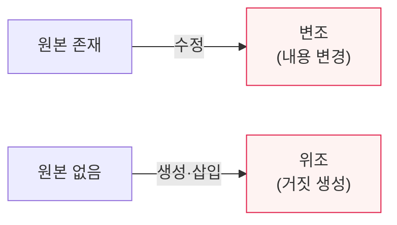

# 변조(Modification)와 위조(Fabrication)

## 1. 개요

### 가. 정의
> **변조(Modification)** 는 정상적으로 존재하는 데이터·메시지를 **불법적으로 수정·변경**하는 공격이고, **위조(Fabrication)** 는 존재하지 않던 데이터·메시지를 **거짓으로 새로 만들어 삽입**하는 공격이다. 둘 다 정보의 **무결성(Integrity)** 을 위협한다.

두 개념을 구분하는 핵심은 '**원본이 있느냐 없느냐**'이다. 변조는 원래 있던 것을 바꾸는 것이고(예: 송금액 100만원을 1000만원으로 수정), 위조는 원래 없던 것을 지어내는 것이다(예: 존재하지 않는 거래 내역을 만들어 삽입, 가짜 인증서 생성). 이 둘은 정보보안의 위협을 이해하는 기본 분류다. 보안 위협은 대개 **가로채기(기밀성 위협)·변조·위조·가로막기(가용성 위협)** 로 나뉘는데, 변조와 위조는 모두 데이터가 정확하고 진짜임을 보장하는 무결성을 깨뜨린다. 예를 들어 통신 중 메시지를 변조하면 받는 사람은 조작된 내용을 진짜로 믿고, 위조된 메시지를 삽입하면 하지도 않은 지시를 받은 것으로 오인한다. 그래서 변조·위조를 막는 것이 무결성 보안의 핵심이다.

### 나. 보안 위협 분류에서의 위치
| 위협 | 침해 속성 | 내용 |
|---|---|---|
| **가로채기(Interception)** | 기밀성 | 정보를 몰래 훔쳐봄 |
| **변조(Modification)** | 무결성 | 원본을 불법 수정 |
| **위조(Fabrication)** | 무결성·인증 | 없던 것을 거짓 생성·삽입 |
| **가로막기(Interruption)** | 가용성 | 서비스·전달 방해 |

## 2. 변조와 위조 비교

| 구분 | 변조(Modification) | 위조(Fabrication) |
|---|---|---|
| **원본** | 존재(수정) | 없음(새로 생성) |
| **행위** | 기존 데이터 변경 | 거짓 데이터 삽입 |
| **예** | 송금액·성적 변경 | 가짜 거래·인증서 생성 |
| **침해** | 무결성 | 무결성·인증 |

## 3. 대응 방안

변조·위조는 무결성·인증 기술로 막는다.

| 대응 | 내용 |
|---|---|
| **해시·MAC** | 무결성 검증(변조 탐지) |
| **전자서명** | 무결성 + 인증 + 부인방지(위조 방지) |
| **PKI·인증서** | 신원·진위 검증 |
| **접근통제·로그** | 무단 수정 차단·추적 |

## 4. 고려사항 및 시사점

1. **무결성 보장 기술의 핵심 역할**이다. 해시·MAC은 변조를 탐지하고, 전자서명은 위조까지 방지하므로, 데이터의 중요도에 맞게 이들을 적용해 무결성을 확보한다.
2. **위조에는 인증·부인방지가 필요**하다. 없던 것을 지어내는 위조는 "정당한 송신자가 만든 것인가"라는 인증과 "내가 안 만들었다"를 반박하는 부인방지가 있어야 막을 수 있어, 전자서명·PKI가 효과적이다.
3. **AI 시대 위조의 고도화**를 경계한다. 딥페이크·생성형 AI로 위조가 정교해지면서, 콘텐츠 진위를 검증하는 워터마킹·출처 증명(C2PA) 기술의 중요성이 커지고 있다.

---

> **한 줄 요약**: 변조는 *원본을 불법 수정*, 위조는 *없던 것을 거짓 생성* 하는 공격으로 둘 다 무결성을 위협하며, 해시·MAC(변조 탐지)·전자서명·PKI(위조 방지·인증·부인방지)로 대응하고 AI 시대 위조 고도화에 대비한다.
