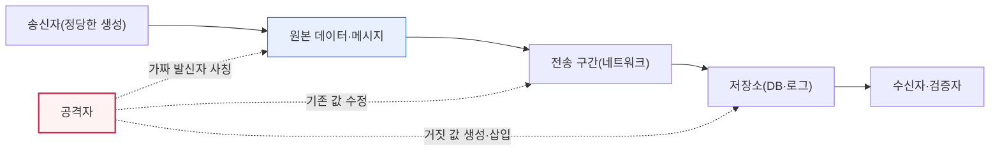
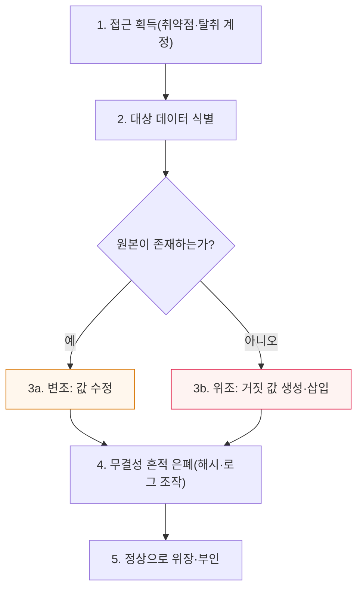

# 변조(Modification)와 위조(Fabrication)

## 1. 개요

### 가. 정의
> **변조(Modification)** 는 정상적으로 존재하는 데이터·메시지를 **불법적으로 수정·변경**하는 공격이고, **위조(Fabrication)** 는 존재하지 않던 데이터·메시지를 **거짓으로 새로 만들어 삽입**하는 공격이다. 둘 다 정보의 **무결성(Integrity)** 과 **인증성(Authenticity)** 을 위협한다.

두 개념을 가르는 핵심 질문은 '**원본이 있느냐 없느냐**'이다. 변조는 원래 존재하던 정당한 데이터를 몰래 바꾸는 행위로, 송금 지시서의 금액 100만 원을 1,000만 원으로 고치거나 성적 데이터베이스의 학점을 상향 조정하는 것이 전형적 사례다. 반면 위조는 원래 없던 것을 지어내 시스템에 끼워 넣는 행위로, 발생하지 않은 거래 내역을 만들어 원장에 삽입하거나 발급 사실이 없는 인증서·재직증명서를 정교하게 흉내 내 제출하는 것이 이에 해당한다. 얼핏 비슷해 보이지만, 방어 관점에서 이 구분은 결정적이다. 변조는 '무엇이 바뀌었는가'를 탐지하는 **무결성 검증**만으로도 상당 부분 대응되지만, 위조는 '이것을 정말 정당한 주체가 만들었는가'를 확인하는 **원천 인증(Origin Authentication)** 이 반드시 함께 있어야 막을 수 있기 때문이다.

이 둘은 정보보안 위협을 이해하는 가장 기본적인 분류 축을 이룬다. 고전적으로 보안 위협은 **가로채기(Interception, 기밀성 위협)·변조(무결성 위협)·위조(무결성·인증 위협)·가로막기(Interruption, 가용성 위협)** 네 가지로 나뉘는데(Stallings의 보안 위협 분류), 이 중 변조와 위조가 무결성 계열을 구성한다. 무결성이 깨지면 어떤 일이 벌어지는지는 실제 사고에서 잘 드러난다. 통신 구간에서 메시지가 변조되면 수신자는 조작된 내용을 진짜로 신뢰해 잘못된 의사결정을 내리고, 위조된 메시지가 삽입되면 발신하지도 않은 지시를 받은 것으로 오인해 자금을 이체하거나 권한을 부여한다. 대표적으로 **BEC(Business Email Compromise, 기업 이메일 침해)** 공격은 CEO를 사칭한 위조 메일과 송금 계좌를 바꾸는 변조를 결합해, FBI IC3 보고 기준 누적 수십억 달러 규모의 피해를 낳았다. 그래서 변조·위조를 막는 일은 곧 무결성 보안의 본체이며, 금융·의료·전자정부·공급망 등 데이터의 진위가 곧 신뢰인 모든 도메인에서 최우선 통제 대상이 된다.

### 나. 등장 배경과 필요성
변조·위조가 별도의 위협 범주로 정립된 배경에는 통신·거래의 디지털화가 있다. 종이 문서 시대에는 원본과 사본의 물리적 차이(인장, 필적, 용지)가 진위 판단의 근거였지만, 디지털 데이터는 완전 복제가 가능하고 흔적 없이 수정할 수 있어 '이 비트열이 원본이며 위·변조되지 않았다'를 물리적 특성으로 보장할 수 없다. 여기에 네트워크를 매개로 한 원격 거래가 보편화되면서, 상대를 대면 확인할 수 없는 상황에서 데이터의 무결성과 발신자의 진위를 **암호학적 증거**로 입증할 필요가 생겼다. 전자서명법·전자상거래법이 전자서명에 손글씨 서명과 동등한 법적 효력을 부여한 것도, 위·변조 방지가 단순한 기술 문제가 아니라 거래 안전성과 법적 책임의 토대이기 때문이다.

### 다. 보안 위협 분류에서의 위치
아래 표는 네 가지 고전 위협을 침해 속성 기준으로 정리한 것이다. 표는 위치 관계를 한눈에 보기 위한 보조 수단이며, 각 위협이 왜 그 속성을 침해하는지는 위 산문에서 설명한 바와 같다.

| 위협 | 침해 속성 | 내용 | 대표 사례 |
|---|---|---|---|
| **가로채기(Interception)** | 기밀성 | 정보를 몰래 훔쳐봄 | 패킷 스니핑, 도청 |
| **변조(Modification)** | 무결성 | 원본을 불법 수정 | 송금액·로그·펌웨어 변조 |
| **위조(Fabrication)** | 무결성·인증 | 없던 것을 거짓 생성·삽입 | 가짜 거래·위조 인증서·딥페이크 |
| **가로막기(Interruption)** | 가용성 | 서비스·전달 방해 | DoS/DDoS, 회선 절단 |

## 2. 변조와 위조의 구조적 이해

### 가. 공격 발생 지점과 흐름
변조와 위조는 데이터가 만들어지고(생성) 흐르며(전송) 머무는(저장) 전 구간에서 일어날 수 있다. 아래 전체 구조도는 정상 데이터 흐름 위에 두 공격이 어디서 개입하는지를 보여준다.

```mermaid
flowchart LR
  S["송신자(정당한 생성)"] --> DATA["원본 데이터·메시지"]
  DATA --> NET["전송 구간(네트워크)"]
  NET --> DB["저장소(DB·로그)"]
  DB --> R["수신자·검증자"]
  A["공격자"] -.->|"기존 값 수정"| NET
  A -.->|"거짓 값 생성·삽입"| DB
  A -.->|"가짜 발신자 사칭"| DATA
  style A fill:#fef3f2,stroke:#e11d48,stroke-width:2px
  style DATA fill:#e8f0fe,stroke:#2f6fed
```

이 그림에서 변조는 이미 흐르고 있는 실선(원본)에 개입해 값을 바꾸는 점선으로, 위조는 흐름과 무관하게 저장소나 채널에 새 값을 밀어 넣는 점선으로 표현된다. 실무적으로 전송 구간의 변조는 **중간자 공격(MITM)** 으로, 저장소의 변조·위조는 **권한 상승 후 데이터 조작**이나 **SQL Injection을 통한 레코드 삽입**으로 구체화된다. 공격 지점이 다르면 통제 지점도 달라지므로, 채널 보호(TLS)와 저장 무결성(해시·서명·감사로그)을 층위별로 함께 두어야 한다.

### 나. 공격자 관점의 수행 절차
공격자가 변조·위조를 성사시키려면 여러 단계를 거친다. 아래 세부 프로세스도는 전형적인 무결성 공격의 진행을 나타낸다.

```mermaid
flowchart TD
  A["1. 접근 획득(취약점·탈취 계정)"] --> B["2. 대상 데이터 식별"]
  B --> C{"원본이 존재하는가?"}
  C -->|"예"| M["3a. 변조: 값 수정"]
  C -->|"아니오"| F["3b. 위조: 거짓 값 생성·삽입"]
  M --> D["4. 무결성 흔적 은폐(해시·로그 조작)"]
  F --> D
  D --> E["5. 정상으로 위장·부인"]
  style M fill:#fff7ed,stroke:#d97706
  style F fill:#fef3f2,stroke:#e11d48
```

주목할 대목은 4단계의 **흔적 은폐**다. 공격자는 데이터를 바꾼 뒤 그에 대응하는 무결성 값(체크섬·해시)이나 접근 로그까지 손대려 한다. 만약 무결성 값이 공격자가 접근할 수 없는 곳(별도 키로 보호되는 MAC, 서명 검증 키, 쓰기 후 변경 불가한 WORM 로그)에 있다면 은폐가 실패하고 공격은 탐지된다. 즉 방어의 요체는 '**무결성 증거를 데이터와 분리해, 공격자가 함께 조작할 수 없게 만드는 것**'이다. 이 원리가 뒤에서 설명할 MAC·전자서명·불변 로그 설계의 공통 기반이다.

### 다. 변조와 위조 비교
| 구분 | 변조(Modification) | 위조(Fabrication) |
|---|---|---|
| **원본** | 존재(수정) | 없음(새로 생성) |
| **핵심 행위** | 기존 데이터 변경 | 거짓 데이터 삽입·사칭 |
| **일차 침해** | 무결성 | 무결성 + 인증성 |
| **대표 예** | 송금액·성적·펌웨어·로그 변경 | 가짜 거래·위조 인증서·딥페이크 |
| **탐지 기술** | 해시·MAC·체크섬 | 전자서명·인증서 검증·출처 증명 |
| **추가 필요 통제** | 변경 탐지 | 원천 인증·부인방지 |

표의 마지막 두 행이 실무적으로 가장 중요하다. 변조는 '바뀌었다'는 사실만 알아채면 되므로 해시·MAC 같은 무결성 검증으로 충분한 경우가 많다. 그러나 위조는 '이것을 만든 주체가 진짜인가'를 물어야 하므로, 대칭키 기반 MAC만으로는 부족하고(검증자와 생성자가 같은 키를 공유하면 서로를 부인할 수 없음), 발신자만이 가진 개인키로 서명하는 **전자서명**과 그 공개키의 신뢰를 보증하는 **PKI**가 필요하다. 차이가 생기는 이유는 신뢰 모델에 있다. MAC은 '키를 공유한 두 당사자 사이의 무결성'을, 서명은 '누구에게나 증명 가능한 발신자 귀속성'을 보장하기 때문이다.

## 3. 대응 방안

### 가. 무결성 검증 기술 — 해시와 MAC
변조 탐지의 1차 방어선은 **암호학적 해시함수**다. SHA-256 같은 해시는 데이터가 1비트만 바뀌어도 결과가 전혀 달라지는 **눈사태 효과(Avalanche Effect)** 를 가지므로, 원본의 해시값을 안전하게 보관해 두고 수신·검증 시점의 해시와 비교하면 변조 여부를 확정할 수 있다. 다만 단순 해시는 공격자가 데이터와 해시를 함께 바꿔 버리면 무력화되므로, 비밀키를 섞어 계산하는 **MAC(HMAC 등)** 을 사용해 '키를 모르는 공격자는 유효한 무결성 값을 만들 수 없게' 만든다. 예컨대 REST API 요청에 `HMAC-SHA256` 서명 헤더를 붙이면, 파라미터가 중간에 바뀌어도 서버가 즉시 거부한다. 다만 MAC은 키를 공유하는 방식이라 '제3자에게 발신자를 증명'하지는 못한다는 한계가 있고, 이 지점에서 전자서명이 필요해진다.

### 나. 원천 인증과 부인방지 — 전자서명과 PKI
위조까지 막으려면 **전자서명**이 답이다. 발신자는 메시지 해시를 자신의 **개인키**로 암호화(서명)하고, 검증자는 발신자의 **공개키**로 풀어 해시를 대조한다. 개인키는 발신자만 갖고 있으므로, 서명이 검증되면 '이 데이터는 위·변조되지 않았고(무결성) + 진짜 그 사람이 만들었으며(인증) + 나중에 부인할 수 없다(부인방지)'가 동시에 성립한다. 여기서 공개키가 정말 그 사람의 것인지를 보증하는 신뢰 사슬이 **PKI(공개키기반구조)** 와 **인증서**다. 브라우저가 HTTPS 사이트의 서버 인증서를 CA 체인으로 검증하는 것, 전자세금계산서·전자계약에 공인/공동 인증서 서명을 요구하는 것이 모두 위조 방지를 위한 원천 인증의 실제 적용이다.

### 다. 예방·탐지·추적 통제
기술적 무결성 검증만으로는 부족하고, **접근통제·감사로그·불변 저장**이 함께 작동해야 한다. 최소권한 원칙으로 데이터 수정 권한 자체를 좁히고, 모든 변경을 변경 불가능한(WORM·append-only) 로그에 남겨 사후 추적성을 확보한다. 블록체인·분산원장은 이 원리를 극단으로 밀어붙여, 이전 블록 해시를 다음 블록에 연쇄로 담아(해시 체이닝) 과거 기록의 사후 변조를 사실상 불가능하게 만든 위·변조 방지 구조다. 아래 표는 대응 기술을 계층별로 정리한 것이다.

| 계층 | 대응 기술 | 방어 대상 |
|---|---|---|
| **탐지(무결성)** | 해시(SHA-256)·HMAC·체크섬 | 변조 |
| **인증·부인방지** | 전자서명·PKI·인증서 | 위조 |
| **예방(접근)** | 접근통제·최소권한·MFA | 무단 수정·삽입 |
| **추적·불변** | 감사로그(WORM)·블록체인 | 사후 은폐 |
| **콘텐츠 진위** | 디지털 워터마킹·C2PA 출처 증명 | AI 위조(딥페이크) |

## 4. 심화 — AI 시대 위조의 고도화와 대응 표준

전통적 위조가 '없던 문서를 지어내는' 수준이었다면, 생성형 AI는 위조의 양상을 근본적으로 바꾸고 있다. **딥페이크**는 실존 인물의 얼굴·음성을 학습해 실제와 구분하기 어려운 영상·음성을 만들어 낸다. 2024년 홍콩에서는 CFO를 사칭한 딥페이크 화상회의로 약 2,500만 달러가 이체된 사건이 보고되었는데, 이는 '위조된 신원'이 실시간 상호작용으로까지 확장된 사례다. 문서·이미지 위조 역시 AI로 대량·정교화되어, 육안이나 단순 필터로는 진위를 가리기 어려워졌다.

이에 대응해 **콘텐츠 출처와 진위를 암호학적으로 증명**하려는 표준이 부상하고 있다. **C2PA(Coalition for Content Provenance and Authenticity)** 는 콘텐츠 생성·편집 이력을 전자서명된 메타데이터(Content Credentials)로 첨부해, 이미지·영상이 언제 누구에 의해 어떻게 만들어졌는지 검증 가능한 이력으로 남긴다. Adobe·Microsoft 등이 참여하며, 카메라·생성 AI 도구에 서명 삽입이 확산되는 추세다. 여기에 **디지털 워터마킹**(육안에 보이지 않게 출처 표식을 삽입)과 **AI 생성물 탐지 모델**이 보완적으로 결합한다. 다만 이들 기술은 워터마크 제거·재인코딩 공격에 취약할 수 있어 만능은 아니며, 아직 표준화·상호운용성이 진행 중이라 단정적 신뢰보다는 '다층 방어의 한 축'으로 보는 관점이 적절하다. 정보관리기술사 관점에서 이 영역은 기존 무결성 통제(서명·PKI)의 원리를 콘텐츠 진위 검증으로 확장한 것으로 이해하면 연결이 자연스럽다.

## 5. 고려사항 및 시사점

1. **중요도 기반의 무결성 통제 차등 적용**이 필요하다. 모든 데이터에 전자서명을 걸면 성능·운영 비용이 과도하므로, 단순 변조 탐지로 충분한 데이터는 해시·MAC으로, 발신자 귀속과 부인방지가 필요한 거래·계약·인증 데이터는 전자서명·PKI로 계층화하는 트레이드오프 설계가 요구된다.

2. **위조 방어는 반드시 인증·부인방지와 결합**해야 한다. 없던 것을 지어내는 위조는 '정당한 주체가 만든 것인가'를 묻지 않으면 막을 수 없으므로, 무결성만 보장하는 대칭키 MAC이 아니라 비대칭 서명 기반 원천 인증이 핵심이며, 이때 개인키 보관(HSM·키 수명주기 관리)이 전체 신뢰의 실질적 약점이 된다.

3. **무결성 증거의 분리·불변 보관**이 방어의 요체다. 공격자의 흔적 은폐(4단계)를 무력화하려면 무결성 값과 감사로그를 데이터와 다른 신뢰 경계(별도 키·WORM·분산원장)에 두어야 하며, 이 원칙이 지켜지지 않으면 어떤 알고리즘도 무의미해진다.

4. **AI 위조에 대비한 콘텐츠 출처 증명 체계로 확장**해야 한다. 딥페이크·생성형 위조가 정교해질수록 사후 탐지만으로는 한계가 있으므로, C2PA·워터마킹 같은 '생성 시점 서명(Provenance)' 기반 사전 통제로 무게중심을 옮기되, 제거 공격 가능성을 감안해 다층 방어로 설계하는 균형이 필요하다.

5. **법·제도와 기술의 정합성**을 확보해야 한다. 전자서명의 법적 효력, 전자문서 진본성 요건, 로그의 증거능력 등은 기술 통제가 법적 책임과 연결되는 지점이므로, 무결성 아키텍처 설계 시 관련 법규(전자서명법·전자문서법)와 감사·포렌식 요건을 함께 고려한 거버넌스가 뒷받침되어야 한다.

## 참고자료
- NIST, "Secure Hash Standard (SHS)", FIPS PUB 180-4
- NIST, "Digital Signature Standard (DSS)", FIPS PUB 186-5
- C2PA, "Content Credentials: Technical Specification" — https://c2pa.org/specifications/
- FBI IC3, "Business Email Compromise" — https://www.ic3.gov/

---

> **한 줄 요약**: 변조는 *원본을 불법 수정*(무결성 침해), 위조는 *없던 것을 거짓 생성·사칭*(무결성+인증 침해)하는 공격으로, 해시·MAC으로 변조를 탐지하고 전자서명·PKI로 위조를 방지하며, 무결성 증거의 분리·불변 보관과 AI 시대 딥페이크에 대응하는 C2PA·출처 증명 체계로 방어를 확장한다.
