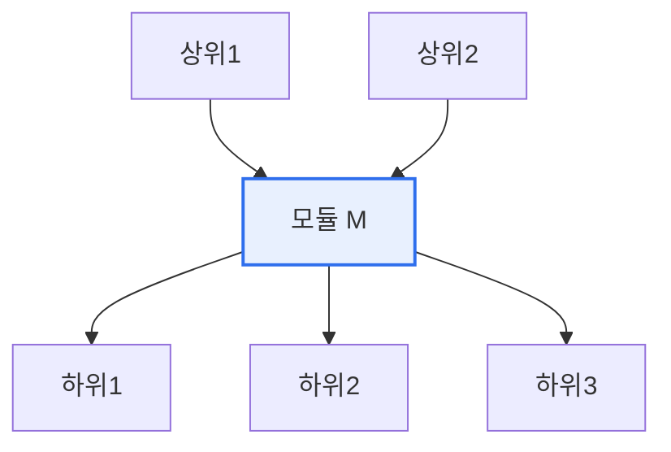

# 소프트웨어 모듈 — 응집도·결합도, Fan-in·Fan-out

## 1. 개요

### 가. 정의
> **모듈(Module)** 은 독립적으로 컴파일·재사용 가능한 소프트웨어의 기능 단위다. 좋은 모듈 설계의 척도가 **응집도(Cohesion, 모듈 내부의 관련성)** 와 **결합도(Coupling, 모듈 간 의존성)** 이며, 좋은 설계는 '**높은 응집도·낮은 결합도**'를 지향한다.

모듈 설계가 소프트웨어 품질의 핵심인 이유는 '**한 모듈의 변경이 시스템 전체에 미치는 영향**'을 결정하기 때문이다. 모듈이 잘 나뉘면 각각 독립적이어서 이해·수정·재사용·테스트가 쉽지만, 잘못 나뉘면 작은 변경도 연쇄 장애를 부른다. 이를 판단하는 두 척도가 응집도와 결합도다. 응집도는 "한 모듈 안의 요소들이 얼마나 하나의 목적을 위해 뭉쳐 있는가"이고, 결합도는 "모듈들이 서로 얼마나 얽혀 있는가"다. 이 둘은 동전의 양면처럼 함께 작동한다. 관련 기능을 한 모듈에 잘 모으면(높은 응집도), 자연스럽게 모듈 간 연결이 줄어(낮은 결합도) 독립성이 높아진다. 반대로 응집도가 낮으면(잡다한 기능이 섞임) 여기저기 참조가 늘어 결합도가 높아진다.

### 나. 필요성
소프트웨어가 커지고 오래 유지될수록 변경이 잦은데, 모듈 설계가 나쁘면 유지보수 비용이 폭증한다. 응집도·결합도는 변경에 강한 구조를 만드는 설계의 근본 원리다.

## 2. 응집도와 결합도

**응집도** 는 낮은 순(우연적)부터 높은 순(기능적)까지 단계가 있으며, 하나의 기능만 수행하는 **기능적 응집** 이 가장 바람직하다. **결합도** 는 강한 순(내용)부터 약한 순(자료)까지 있으며, 필요한 데이터만 주고받는 **자료 결합** 이 가장 바람직하다.

| 척도 | 나쁨 ← → 좋음 |
|---|---|
| **응집도** | 우연적 < 논리적 < 시간적 < 절차적 < 통신적 < 순차적 < **기능적**(최선) |
| **결합도** | 내용 > 공통 > 외부 > 제어 > 스탬프 > **자료**(최선) |

## 3. Fan-in과 Fan-out

모듈 간 호출 관계를 나타내는 지표가 팬인·팬아웃이다. **Fan-in** 은 특정 모듈을 호출하는 상위 모듈의 수(얼마나 많이 재사용되는가)이고, **Fan-out** 은 특정 모듈이 호출하는 하위 모듈의 수(얼마나 많은 것에 의존하는가)다.

| 지표 | 의미 | 바람직한 방향 |
|---|---|---|
| **Fan-in** | 나를 호출하는 상위 모듈 수 | **높을수록 좋음**(재사용성↑) |
| **Fan-out** | 내가 호출하는 하위 모듈 수 | **낮을수록 좋음**(의존↓, 복잡도↓) |

Fan-in이 높으면 그 모듈이 널리 재사용된다는 뜻(효율적)이고, Fan-out이 높으면 너무 많은 것에 의존해 복잡하고 변경에 취약하다는 뜻이다. 즉 **높은 Fan-in·낮은 Fan-out** 이 좋은 설계다.

## 4. 고려사항 및 시사점

1. **높은 응집도·낮은 결합도가 설계의 황금률**이다. 관련 기능을 한 모듈에 모으고 모듈 간 연결을 최소화하면, 독립성이 높아져 변경·재사용·테스트가 쉬워진다.
2. **Fan-in/out으로 구조 품질을 진단**한다. Fan-out이 과도한 모듈은 책임이 너무 많으니 분리하고, Fan-in이 높은 공통 모듈은 안정적으로 관리해 변경 영향을 통제한다.
3. **정보은닉·아키텍처와 연결**된다. 모듈 내부를 감추고 인터페이스로 소통(정보은닉)하면 자연히 결합도가 낮아지며, 이 원리가 MSA·계층형 아키텍처로 확장된다.

---

> **한 줄 요약**: 좋은 모듈 설계는 *높은 응집도(기능적)·낮은 결합도(자료)* 를 지향하며, *높은 Fan-in(재사용)·낮은 Fan-out(의존 최소)* 구조로 변경에 강하고 재사용·유지보수가 쉬운 소프트웨어를 만든다.
