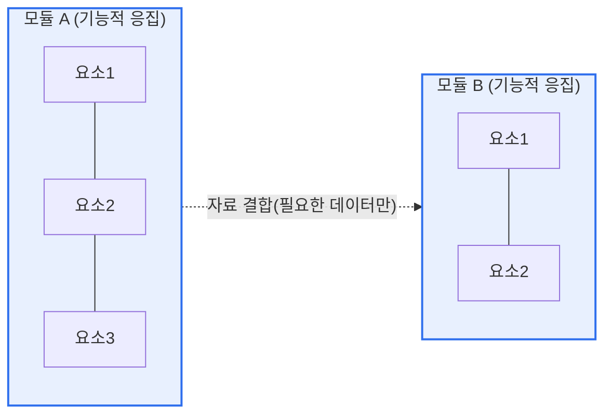
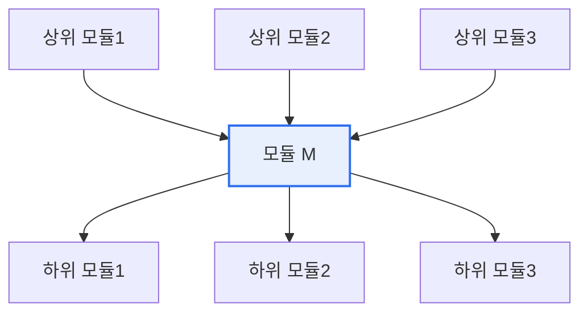

# 소프트웨어 모듈 — 응집도·결합도, Fan-in·Fan-out

## 1. 개요

### 가. 정의

> **모듈(Module)** 은 독립적으로 컴파일·재사용 가능한 소프트웨어의 기능 단위이며, 그 설계 품질을 정량·정성적으로 판별하는 두 축이 **응집도(Cohesion, 모듈 내부 요소의 관련성)** 와 **결합도(Coupling, 모듈 간 의존성)** 다. 좋은 설계는 예외 없이 '**높은 응집도(Strong Cohesion)·낮은 결합도(Loose Coupling)**'를 지향한다.

모듈 설계가 소프트웨어 품질의 근본인 이유는, 그것이 곧 '**한 모듈의 변경이 시스템 전체로 번지는 영향 범위(Ripple Effect)**'를 결정하기 때문이다. 소프트웨어는 만드는 비용보다 고쳐 쓰는 비용이 훨씬 크고(전체 생애비용의 60~80%가 유지보수), 유지보수 비용의 대부분은 '변경 한 건이 몇 개의 모듈을 함께 건드리게 만드는가'에 좌우된다. 모듈이 잘 나뉘면 각 모듈이 독립적이어서 이해·수정·재사용·단위테스트가 국소적으로 끝나지만, 잘못 나뉘면 사소한 요구사항 변경 하나가 연쇄 수정과 회귀 결함(Regression)을 부른다. 이 '나뉨의 좋고 나쁨'을 판정하는 두 척도가 바로 응집도와 결합도다.

두 척도는 서로 독립된 개념이 아니라 **동전의 양면처럼 연동**한다. 관련된 기능을 한 모듈에 제대로 모으면(응집도↑), 그 모듈이 스스로 완결되므로 다른 모듈을 덜 참조하게 되고(결합도↓) 자연히 독립성이 올라간다. 반대로 성격이 다른 잡다한 기능을 한 모듈에 욱여넣으면(응집도↓), 그 기능들이 저마다 바깥의 데이터·상태를 끌어다 쓰기 때문에 여기저기로 참조가 뻗어(결합도↑) 모듈이 시스템에 얽혀 든다. 즉 **응집도를 높이는 행위가 곧 결합도를 낮추는 행위**인 경우가 많다. 이것이 구조적 설계(Structured Design)에서 콘스탄틴(L. Constantine)과 요던(E. Yourdon)이 두 개념을 한 쌍으로 제시한 이유다.

### 나. 등장 배경과 필요성

1970년대 구조적 방법론이 등장하기 전에는 프로그램이 하나의 거대한 흐름(모놀리식 절차)으로 작성되어, 어디를 고치면 어디가 깨지는지 예측할 수 없는 '스파게티 코드'가 일반적이었다. 콘스탄틴·요던은 이를 극복하기 위해 프로그램을 기능 단위로 분할(Decomposition)하되, **분할의 질을 객관적으로 평가할 잣대**로 응집도·결합도를 제안했다. 소프트웨어가 커지고 오래 유지될수록 변경 빈도는 높아지는데, 이 두 척도는 '변경에 강한 구조'를 만드는 설계의 물리 법칙과도 같다. 오늘날 객체지향의 SRP(단일 책임 원칙), 마이크로서비스의 서비스 경계 설정, 정보은닉과 캡슐화 모두 결국 '높은 응집·낮은 결합'을 다른 언어로 다시 말한 것이다.

## 2. 모듈 독립성의 두 축 — 응집도와 결합도

모듈의 좋고 나쁨을 하나의 개념으로 묶으면 **모듈 독립성(Module Independence)** 이 되고, 이는 응집도와 결합도의 함수다. 아래 그림은 이상적인 상태 — 두 모듈이 각각 내부적으로 단단히 뭉쳐 있고(높은 응집도), 서로는 최소한의 데이터만 주고받는(낮은 결합도) 모습을 나타낸다.

```mermaid
flowchart LR
  subgraph A["모듈 A (기능적 응집)"]
    a1["요소1"] --- a2["요소2"] --- a3["요소3"]
  end
  subgraph B["모듈 B (기능적 응집)"]
    b1["요소1"] --- b2["요소2"]
  end
  A -.->|"자료 결합(필요한 데이터만)"| B
  style A fill:#e8f0fe,stroke:#2f6fed,stroke-width:2px
  style B fill:#e8f0fe,stroke:#2f6fed,stroke-width:2px
```

### 가. 응집도 — "한 모듈은 한 가지 일만 잘하라"

응집도는 "한 모듈 안의 요소(문장·함수·데이터)들이 얼마나 하나의 목적을 위해 뭉쳐 있는가"를 나타낸다. 응집도가 높다는 것은 그 모듈이 '무엇을 하는가'를 한 문장으로 설명할 수 있다는 뜻이다. 예컨대 `계좌잔액계산()` 처럼 단일 목적이 뚜렷하면 기능적 응집이다. 반대로 `공통유틸()` 안에 로그·암호화·날짜변환이 뒤섞여 있으면, 이름조차 '이것저것'이라는 뜻일 뿐이어서 응집도가 낮다.

응집도는 우연적(가장 나쁨)부터 기능적(가장 좋음)까지 **7단계**로 구분된다. 이 순서를 외우는 것보다 중요한 것은 '왜 위로 갈수록 좋아지는가'의 원리다. 아래로 갈수록 요소들의 결합 근거가 '우연히 같은 파일에 있어서' 수준으로 약하고, 위로 갈수록 '같은 데이터를 순차적으로 가공하기 때문에' 혹은 '단일 기능을 이루기 때문에'처럼 논리적 필연성이 강해진다. 필연성이 강할수록 그 모듈은 이유 있게 한 덩어리이므로 쪼갤 필요가 없고 변경 이유도 하나뿐이다(SRP와 정확히 일치).

| 응집도(낮음→높음) | 결합 근거 | 예시 |
|---|---|---|
| 우연적(Coincidental) | 아무 관련 없음 | 잡다한 함수를 모은 `Util` 클래스 |
| 논리적(Logical) | 성격만 유사, 실행은 플래그로 선택 | `처리(type)` 안에서 type별 분기 |
| 시간적(Temporal) | 같은 시점에 실행 | `초기화()`에서 로그·DB·캐시 세팅 |
| 절차적(Procedural) | 정해진 순서로 실행 | 순서만 공유, 데이터는 무관 |
| 통신적(Communicational) | 같은 데이터를 사용 | 같은 입력으로 여러 결과 산출 |
| 순차적(Sequential) | 앞 출력이 뒤 입력 | 파싱→검증→변환 파이프라인 |
| **기능적(Functional·최선)** | 단일 기능 완결 | `이자계산()` |

### 나. 결합도 — "모듈끼리는 최소한으로만 얽혀라"

결합도는 "모듈들이 서로 얼마나 깊이 의존하는가"다. 결합이 강할수록 한쪽의 내부 변경이 다른 쪽을 강제로 함께 고치게 만든다. 가장 나쁜 것은 **내용 결합(Content Coupling)** 으로, 한 모듈이 다른 모듈의 내부 코드나 지역 변수를 직접 건드리는 경우다. 이때는 상대의 구현을 바꾸는 순간 이쪽이 소리 없이 깨진다. 가장 좋은 것은 **자료 결합(Data Coupling)** 으로, 필요한 값만 매개변수로 주고받는 경우다. 인터페이스(무엇을 주고받는가)만 지키면 내부 구현은 자유롭게 바뀔 수 있어, 변경이 국소화된다.

결합도는 강한 순(내용)부터 약한 순(자료)까지 **6단계**다. 특히 실무에서 자주 문제 되는 것은 **제어 결합(Control Coupling)** — 상대 모듈의 내부 로직을 좌우하는 플래그를 넘기는 것(`정렬(data, true)`의 true가 오름/내림을 지시) — 과 **공통 결합(Common Coupling)** — 전역 변수를 여러 모듈이 공유해, 누가 값을 바꿨는지 추적 불가능해지는 것이다. 전역 상태 남용이 유지보수를 가장 크게 악화시키는 이유가 여기 있다.

| 결합도(강함→약함) | 의존 형태 | 문제점 |
|---|---|---|
| 내용(Content) | 상대 내부·지역변수 직접 접근 | 캡슐화 붕괴, 변경 시 무조건 파손 |
| 공통(Common) | 전역 변수 공유 | 변경 추적 불가, 부작용 확산 |
| 외부(External) | 외부 포맷·프로토콜·장치 공유 | 외부 변경에 동반 취약 |
| 제어(Control) | 제어 플래그 전달 | 호출자가 피호출자 내부를 앎 |
| 스탬프(Stamp) | 구조체 전체 전달(일부만 사용) | 불필요 필드 변경에 영향 |
| **자료(Data·최선)** | 필요한 값만 매개변수 전달 | 최소 의존, 변경 국소화 |

한 줄로 요약하면 응집도는 우연적 < 논리적 < 시간적 < 절차적 < 통신적 < 순차적 < **기능적**(최선), 결합도는 내용 > 공통 > 외부 > 제어 > 스탬프 > **자료**(최선) 순이며, 설계 목표는 **응집도는 아래에서 위로, 결합도는 왼쪽에서 오른쪽으로** 밀어 올리는 것이다.

### 다. 결합도를 낮추는 실무 기법

결합도는 저절로 낮아지지 않고 의도적 설계 기법으로 낮춘다. 첫째는 **인터페이스 최소화** 다. 구조체 전체를 넘기는 스탬프 결합 대신 정말 필요한 값만 매개변수로 전달하면 자료 결합으로 내려간다. 예컨대 `할인계산(주문객체전체)` 을 `할인계산(금액, 등급)` 으로 바꾸면, 주문 객체의 무관한 필드가 바뀌어도 이 함수는 영향받지 않는다. 둘째는 **제어 플래그 제거** 다. `처리(data, isAdmin)` 처럼 내부 분기를 좌우하는 플래그를 넘기는 대신 `관리자처리(data)`·`일반처리(data)` 로 나누면(다형성·전략 패턴), 호출자가 피호출자의 내부를 몰라도 되어 제어 결합이 사라진다.

셋째는 **전역 상태 배제** 다. 여러 모듈이 공유하는 전역 변수는 공통 결합의 원천이므로, 상태를 지역화하거나 명시적 의존성 주입(DI)으로 주고받아 '누가 언제 값을 바꿨는지'를 추적 가능하게 만든다. 넷째는 **정보은닉(Information Hiding)** 이다. 모듈 내부 자료구조와 알고리즘을 감추고 공개 인터페이스로만 소통하게 하면, 내부 구현이 바뀌어도 인터페이스가 유지되는 한 다른 모듈은 무영향이어서 결합이 근본적으로 약해진다. 이 네 기법은 모두 '한 모듈이 다른 모듈의 내부에 대해 아는 것을 줄인다'는 하나의 원리로 수렴한다.

## 3. Fan-in과 Fan-out — 구조의 재사용성과 복잡도 측정

응집도·결합도가 '모듈 하나의 품질'을 본다면, 팬인·팬아웃은 **모듈 간 호출 관계로 전체 구조(Structure Chart)의 형태**를 진단한다. **Fan-in** 은 특정 모듈을 호출하는 상위 모듈의 수(=얼마나 널리 재사용되는가)이고, **Fan-out** 은 특정 모듈이 호출하는 하위 모듈의 수(=얼마나 많은 것에 의존하는가)다.

```mermaid
flowchart TB
  U1["상위 모듈1"] --> M["모듈 M"]
  U2["상위 모듈2"] --> M
  U3["상위 모듈3"] --> M
  M --> D1["하위 모듈1"]
  M --> D2["하위 모듈2"]
  M --> D3["하위 모듈3"]
  style M fill:#e8f0fe,stroke:#2f6fed,stroke-width:2px
```

위 그림에서 모듈 M은 **Fan-in = 3, Fan-out = 3**이다. Fan-in이 높다는 것은 그 모듈이 여러 상위에서 공통으로 쓰인다는 뜻으로, 중복 코드를 줄이는 **재사용성의 지표**다. 잘 설계된 공통 라이브러리 함수(예: `날짜포맷()`, `로그기록()`)는 자연히 Fan-in이 높다. 반면 Fan-out이 높다는 것은 그 모듈이 제 일을 하기 위해 너무 많은 하위에 의존한다는 뜻으로, 책임이 과도하고(SRP 위반 신호) 복잡도가 높아 변경에 취약함을 나타낸다. 따라서 좋은 구조는 **높은 Fan-in·낮은 Fan-out**을 지향한다.

| 지표 | 의미 | 바람직한 방향 | 설계 함의 |
|---|---|---|---|
| **Fan-in** | 나를 호출하는 상위 모듈 수 | **높을수록 좋음** | 재사용성↑, 단 안정성 관리 필수 |
| **Fan-out** | 내가 호출하는 하위 모듈 수 | **낮을수록 좋음** | 의존·복잡도↓, 통상 7 이하 권고 |

다만 Fan-in이 높은 모듈은 '많은 곳이 의존하는 급소'이므로, 그 모듈을 잘못 바꾸면 파급이 크다는 양날의 성질이 있다. 그래서 Fan-in이 높은 공통 모듈일수록 인터페이스를 안정적으로 고정하고(자주 바꾸지 않고) 철저히 테스트해야 한다. 반대로 Fan-out이 지나치게 큰 모듈(예: Fan-out 10 이상)은 '컨트롤 타워형 과책임 모듈'일 가능성이 높으므로, 중간 계층을 두어 책임을 분산(Factoring)하는 리팩터링 대상이 된다.

## 4. 사례로 보는 적용 — 나쁜 설계에서 좋은 설계로

구체 사례로 이해하면 명확하다. 어느 커머스 시스템의 초기 `주문처리()` 모듈이 재고 차감, 결제 승인, 이메일 발송, 로그 적재, 통계 갱신을 한 함수 안에서 모두 수행했다고 하자. 이 모듈은 서로 다른 다섯 가지 변경 이유(재고 정책 변경, PG 교체, 메일 템플릿 수정, 로그 포맷 변경, 통계 항목 추가)를 가지므로 응집도가 낮고(논리적~시간적 수준), 그때마다 함수 전체를 건드려 회귀 위험이 컸다. 실제로 메일 템플릿 한 줄 수정이 결제 로직을 깨뜨리는 사고로 이어졌다.

이를 `재고차감()`·`결제승인()`·`알림발송()`·`이력기록()`으로 **기능적 응집** 단위로 분리하고, 상위 `주문처리()`가 이들을 자료 결합(필요한 주문 데이터만 매개변수로 전달)으로 호출하도록 바꾸면 각 모듈의 변경 이유가 하나로 좁혀진다. 이때 `이력기록()`·`알림발송()` 같은 공통 기능은 여러 상위(주문·환불·배송)에서 재사용되어 Fan-in이 3~4로 올라가고, `주문처리()`의 Fan-out은 4로 관리 가능한 수준에 머문다. 그 결과 한 팀의 경험상 배포 후 회귀 결함이 눈에 띄게 줄고, 단위테스트 작성이 모듈별로 독립적으로 가능해져 테스트 커버리지를 높이기 쉬워진다. 이처럼 응집도·결합도·팬인/팬아웃은 별개가 아니라 **하나의 좋은 분할이 동시에 세 지표를 개선**하는 방향으로 함께 움직인다.

## 5. 심화 — 객체지향·MSA로의 확장과 정량 측정

전통적 구조적 설계에서 태어난 이 개념들은 오늘날 더 넓은 맥락에서 재해석된다. **객체지향(OOP)** 에서 응집도는 클래스의 단일 책임(SRP)과 메서드·필드의 관련성으로 나타나며, LCOM(Lack of Cohesion of Methods) 같은 지표로 정량화한다 — 한 클래스의 메서드들이 공유 필드를 거의 안 쓰면 LCOM이 높아 '쪼개라'는 신호가 된다. 결합도는 디미터 법칙(Law of Demeter)과 의존성 역전 원칙(DIP)으로 관리하며, 인터페이스·의존성 주입(DI)으로 자료 결합에 가깝게 낮춘다. 널리 쓰이는 정적분석 도구(예: SonarQube 계열)는 순환 복잡도(Cyclomatic Complexity)와 결합도 지표(예: 유입/유출 결합 CE·CA)를 자동 측정해 '나쁜 모듈'을 조기에 드러낸다.

**마이크로서비스 아키텍처(MSA)** 로 오면 이 원리는 서비스 경계 설정 그 자체가 된다. 도메인 주도 설계(DDD)의 바운디드 컨텍스트(Bounded Context)는 '높은 응집' 경계를 긋는 작업이고, 서비스 간을 REST/gRPC/메시지 큐로 느슨히 잇는 것은 결합도를 자료 결합 수준으로 낮추는 것이다. 반대로 여러 서비스가 하나의 공유 데이터베이스를 직접 참조하면 이는 분산 환경의 '공통 결합'으로, MSA의 이점을 무너뜨리는 대표적 안티패턴(Shared Database)이다. 즉 모듈 수준에서 배운 '높은 응집·낮은 결합'이 스케일만 키운 채 서비스 수준에서 그대로 반복된다.

## 6. 고려사항 및 시사점 (기술사 관점)

1. **높은 응집·낮은 결합은 설계의 황금률이자 SRP·정보은닉의 다른 이름**이다. 관련 기능을 한 모듈에 모아 응집도를 올리면 참조가 줄어 결합도가 함께 내려간다. 두 척도를 따로 관리하려 하기보다, '이 모듈은 한 문장으로 무엇을 하는가'를 먼저 세우면 두 지표가 동시에 개선된다.

2. **Fan-in/out을 구조 진단의 조기 경보로 활용**해야 한다. Fan-out이 과도한 모듈(권고선 7 초과)은 책임을 나누고(Factoring), Fan-in이 높은 공통 모듈은 인터페이스를 안정적으로 고정하고 회귀 테스트를 강화해 변경 파급을 통제한다. 정적분석·구조 차트로 정기 측정해 리팩터링 우선순위를 정한다.

3. **트레이드오프를 인식한 과분할 경계**가 필요하다. 응집도만 좇아 모듈을 지나치게 잘게 쪼개면, 모듈 수와 호출 경로가 폭증해 오히려 전체 이해가 어려워지고(인지 결합 증가) 성능 오버헤드가 생긴다. 특히 MSA에서는 과도한 서비스 분해가 분산 트랜잭션·네트워크 지연·운영 복잡도를 키운다. '가능한 한 크게, 필요한 만큼만 작게'가 실무 균형점이다.

4. **정량 지표는 목적이 아니라 수단**임을 잊지 말아야 한다. LCOM·결합도 수치는 나쁜 냄새를 가리키는 신호일 뿐, 도메인 맥락 없이 수치만 맞추는 리팩터링은 무의미하다. 아키텍처 전략·변경 빈도·조직 구조(콘웨이의 법칙)와 함께 판단해, '자주 함께 바뀌는 것은 함께, 따로 바뀌는 것은 따로' 두는 원칙으로 수렴시키는 것이 기술사 관점의 설계 판단이다.

---

> **한 줄 요약**: 좋은 모듈 설계는 *높은 응집도(기능적)·낮은 결합도(자료)* 를 지향하고 *높은 Fan-in(재사용)·낮은 Fan-out(의존 최소)* 구조로 변경 영향을 국소화하며, 이 원리는 SRP·정보은닉을 거쳐 객체지향과 MSA의 서비스 경계 설정까지 스케일만 바꾼 채 그대로 관통한다.
