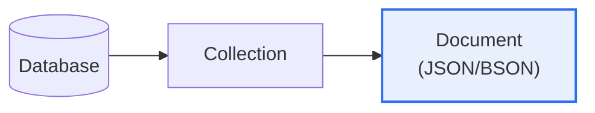

# MongoDB

## 1. 개요

### 가. 정의
> **MongoDB**는 데이터를 **JSON과 유사한 문서(Document, BSON) 형태로 저장**하는 대표적인 문서 지향(Document) NoSQL 데이터베이스다. 고정된 스키마 없이 유연하게 데이터를 다루며 수평 확장에 강하다.

MongoDB의 핵심 발상은 '**데이터를 테이블의 행이 아니라 자기 완결적인 문서로 다루자**'는 것이다. 관계형 데이터베이스는 데이터를 여러 테이블로 나누고 조인으로 연결하는데, 이는 정합성에 강하지만 스키마가 경직되고 대규모 확장이 어렵다. MongoDB는 관련 데이터를 하나의 문서 안에 통째로 담는다. 예를 들어 사용자와 그 주소·주문을 별도 테이블로 나누지 않고, 한 사용자 문서 안에 중첩해 저장한다. 그러면 조인 없이 한 번에 조회할 수 있어 빠르고, 필드를 자유롭게 추가·변경할 수 있어 유연하며(스키마리스), 데이터를 여러 서버에 나눠 저장(샤딩)해 대규모로 확장하기 쉽다. 이 특성 덕분에 요구가 자주 바뀌고 대용량·비정형 데이터를 다루는 웹·모바일·IoT 서비스에 적합하다. 다만 관계형의 강한 정합성(조인·트랜잭션)이 필요한 업무에는 덜 적합하다.

### 나. 필요성
빅데이터·웹 서비스의 확산으로 유연한 스키마와 대규모 수평 확장이 요구되면서, 관계형 DB의 경직성을 보완하는 문서형 NoSQL이 필요해졌다.

## 2. 구조 및 특징

MongoDB는 데이터베이스 > 컬렉션(테이블에 해당) > 문서(행에 해당)의 구조를 가지며, 각 문서는 필드-값 쌍의 BSON 형식이다.

| 특징 | 내용 |
|---|---|
| **문서 지향** | JSON/BSON 문서로 저장, 중첩·배열 표현 |
| **스키마 유연** | 고정 스키마 없음(필드 자유 추가) |
| **수평 확장** | 샤딩으로 분산 저장·확장 |
| **고가용성** | 복제셋(Replica Set)으로 이중화 |
| **인덱스·집계** | 다양한 인덱스, 집계 파이프라인 |

## 3. 관계형 DB와 비교

| 구분 | 관계형(RDB) | MongoDB |
|---|---|---|
| **데이터 모델** | 테이블·행(정형) | 문서(유연) |
| **스키마** | 고정 | 유연(스키마리스) |
| **관계** | 조인 | 문서 내 중첩·참조 |
| **확장** | 수직(스케일업) | 수평(샤딩) |
| **정합성** | 강한 ACID | 유연(문서 단위 원자성) |

## 4. 고려사항 및 시사점

1. **데이터 모델링이 성능을 좌우**한다. 문서에 중첩할지 참조할지(임베딩 vs 레퍼런싱)를 접근 패턴에 맞게 설계해야 하며, 잘못하면 문서가 비대해지거나 조회가 비효율적이 된다.
2. **강한 정합성 업무에는 신중**해야 한다. 최근 MongoDB도 다중 문서 트랜잭션을 지원하지만, 복잡한 조인·강한 트랜잭션이 핵심인 업무는 관계형이 여전히 적합하다.
3. **폴리글랏 퍼시스턴스**로 활용한다. 하나의 DB로 모든 것을 해결하기보다, 유연·대용량은 MongoDB, 정합성 중요 업무는 RDB로 데이터 특성에 맞게 병행하는 것이 현대적 접근이다.

---

> **한 줄 요약**: MongoDB는 *데이터를 JSON 유사 문서로 저장* 하는 문서형 NoSQL로, 유연한 스키마·수평 확장(샤딩)·고가용성(복제셋)이 강점이라 웹·비정형·대용량에 적합하되, 강한 정합성 업무는 관계형과 병행하는 것이 바람직하다.
