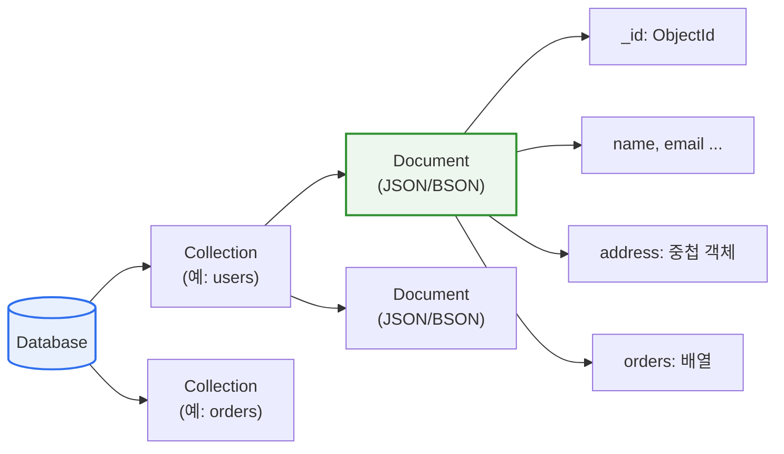
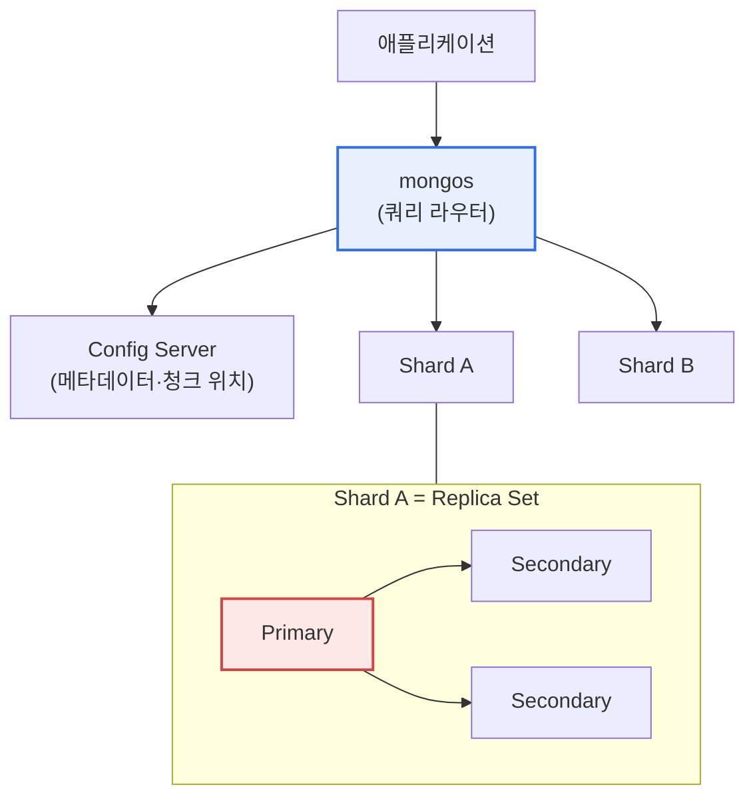

# MongoDB

## 1. 개요

### 가. 정의

> **MongoDB**는 데이터를 **JSON과 유사한 문서(Document, 내부 저장 형식은 BSON)** 형태로 저장하는 대표적인 문서 지향(Document-oriented) NoSQL 데이터베이스로, 고정된 스키마 없이 유연하게 데이터를 다루며 샤딩을 통한 수평 확장과 복제셋을 통한 고가용성을 기본으로 제공한다.

MongoDB의 핵심 발상은 "**데이터를 테이블의 행이 아니라 자기 완결적인 문서로 다루자**"는 것이다. 관계형 데이터베이스(RDB)는 데이터를 여러 테이블로 정규화해 나누고 조인으로 연결하는데, 이 방식은 정합성과 중복 제거에는 강하지만 스키마가 경직되고 대규모 수평 확장이 어렵다는 한계가 있다. 반면 MongoDB는 관련 데이터를 하나의 문서 안에 통째로 담는 것을 지향한다. 예를 들어 사용자와 그 주소·주문 이력을 별도 테이블로 나누지 않고, 한 사용자 문서 안에 배열·객체로 중첩해 저장한다. 그러면 조인 없이 한 번의 읽기로 조회할 수 있어 빠르고, 필드를 자유롭게 추가·변경할 수 있어 유연하며(스키마리스), 데이터를 여러 서버에 나눠 저장(샤딩)해 대규모로 확장하기 쉽다.

이러한 특성은 데이터 모델과 애플리케이션 객체 사이의 간극, 이른바 "임피던스 불일치(impedance mismatch)"를 줄인다는 점에서 특히 개발 생산성에 기여한다. 객체 지향 언어에서 다루는 중첩 객체 구조가 문서 형태와 그대로 맞아떨어지므로, 복잡한 ORM 매핑이나 다단계 조인 쿼리 없이도 애플리케이션 코드에서 다루는 그대로를 저장·조회할 수 있다. 이 덕분에 요구사항이 자주 바뀌고 대용량·반정형 데이터를 다루는 웹·모바일·IoT 서비스, 실시간 분석, 콘텐츠 관리 등에서 널리 채택된다. 다만 여러 문서에 걸친 강한 정합성(복잡한 조인·다중 테이블 트랜잭션)이 핵심인 회계·정산 같은 업무에는 상대적으로 덜 적합하다는 점은 명확히 인식해야 한다.

### 나. 등장 배경과 필요성

MongoDB는 2009년 등장했으며, 그 배경에는 2000년대 후반 웹 서비스의 폭발적 성장이 있다. 트래픽과 데이터가 수직 확장(스케일업)의 한계를 넘어서면서, 값싼 상용 서버를 여러 대 묶어 수평 확장(스케일아웃)하려는 요구가 커졌다. 동시에 애자일 개발이 확산되면서 스키마를 매번 마이그레이션해야 하는 관계형 모델의 경직성이 개발 속도를 떨어뜨리는 병목으로 지목되었다. 즉 MongoDB의 필요성은 "**유연한 스키마 + 대규모 수평 확장 + 개발 생산성**"이라는 세 가지 요구가 동시에 커진 데서 비롯한다. CAP 정리 관점에서 보면, MongoDB는 기본적으로 일관성(C)과 분할 내성(P)을 우선하되 설정으로 가용성·일관성 수준을 조절할 수 있는 유연한 절충을 취한다.

## 2. 데이터 모델과 저장 구조

MongoDB의 논리 구조는 관계형과 대응시켜 이해하면 명확하다. 데이터베이스(Database)는 여러 컬렉션(Collection)을 담는 최상위 단위이고, 컬렉션은 관계형의 테이블에 해당하지만 스키마를 강제하지 않는다. 컬렉션은 여러 문서(Document)를 담으며, 문서가 관계형의 행(Row)에 해당한다. 각 문서는 필드-값 쌍의 집합으로, 내부적으로는 BSON(Binary JSON) 형식으로 저장된다. BSON은 JSON을 이진화한 형식으로, 문자열·정수·불린뿐 아니라 날짜(Date), 이진 데이터, `ObjectId` 같은 추가 타입을 지원하고 파싱 속도와 저장 효율을 높인다.

```mermaid
flowchart LR
  DB[("Database")] --> C1["Collection<br/>(예: users)"]
  DB --> C2["Collection<br/>(예: orders)"]
  C1 --> D1["Document<br/>(JSON/BSON)"]
  C1 --> D2["Document<br/>(JSON/BSON)"]
  D1 --> F1["_id: ObjectId"]
  D1 --> F2["name, email ..."]
  D1 --> F3["address: 중첩 객체"]
  D1 --> F4["orders: 배열"]
  style DB fill:#e8f0fe,stroke:#2f6fed,stroke-width:2px
  style D1 fill:#eef7ee,stroke:#2f8f2f,stroke-width:2px
```

모든 문서는 `_id` 필드를 필수로 가지며, 지정하지 않으면 MongoDB가 12바이트 `ObjectId`(타임스탬프 + 머신 식별자 + 카운터)를 자동 생성해 전역 유일성을 보장한다. 이 `_id`에는 기본 인덱스가 자동으로 걸린다. 문서 하나의 최대 크기는 16MB로 제한되며, 이보다 큰 대용량 파일(이미지·동영상 등)은 GridFS라는 별도 규약으로 청크 단위로 나눠 저장한다. 문서 크기 제한은 무한정 커지는 배열 필드(unbounded array)를 막는 설계 가이드로도 작용한다.

문서 지향 모델의 강점은 "관련 데이터의 지역성(locality)"이다. 한 번에 함께 읽는 데이터가 물리적으로 한 문서에 모여 있으면 디스크 I/O가 줄어 조회가 빠르다. 반대로 자주 갱신되거나 여러 곳에서 공유되는 데이터를 무리하게 임베딩하면 문서가 비대해지고 갱신 비용이 커진다. 그래서 뒤에서 다룰 임베딩 대 레퍼런싱 선택이 MongoDB 모델링의 핵심 의사결정이 된다.

### 가. 주요 특징

| 특징 | 내용 | 원리·효과 |
|---|---|---|
| **문서 지향** | JSON/BSON 문서로 저장, 중첩·배열 표현 | 객체-문서 간 임피던스 불일치 감소 |
| **스키마 유연** | 고정 스키마 없음(필드 자유 추가) | 애자일 개발·잦은 변경에 대응 |
| **수평 확장** | 샤딩으로 분산 저장·확장 | 스케일아웃으로 대용량 처리 |
| **고가용성** | 복제셋(Replica Set)으로 이중화 | 자동 장애 조치(failover) |
| **인덱스·집계** | 다양한 인덱스, 집계 파이프라인 | 복잡한 조회·분석을 DB 내에서 처리 |

특징을 나열하는 데 그치지 않고 "왜 그런 특징이 가능한가"를 보면, 그 뿌리는 모두 문서 모델에 있다. 스키마 유연성은 컬렉션이 문서 구조를 강제하지 않기 때문에 나오고, 수평 확장은 문서에 샤드 키를 붙여 범위나 해시로 서버에 배분할 수 있기 때문에 가능하며, 고가용성은 문서 단위 복제가 상대적으로 단순하기 때문에 자동화하기 쉽다. 즉 MongoDB의 특징들은 서로 독립적인 기능이 아니라 문서 모델이라는 하나의 설계 선택에서 파생된 결과다.

## 3. 아키텍처: 복제셋과 샤딩

MongoDB의 운영 아키텍처는 크게 두 축, 즉 고가용성을 담당하는 복제셋(Replica Set)과 수평 확장을 담당하는 샤딩(Sharding)으로 구성된다. 이 둘은 함께 쓰이는데, 실제 프로덕션에서는 각 샤드가 그 자체로 하나의 복제셋인 구조가 표준이다.

```mermaid
flowchart TB
  App["애플리케이션"] --> R["mongos<br/>(쿼리 라우터)"]
  R --> CFG["Config Server<br/>(메타데이터·청크 위치)"]
  R --> S1["Shard A"]
  R --> S2["Shard B"]
  subgraph RS_A["Shard A = Replica Set"]
    P1["Primary"] --> Sec1["Secondary"]
    P1 --> Sec2["Secondary"]
  end
  S1 --- RS_A
  style R fill:#e8f0fe,stroke:#2f6fed,stroke-width:2px
  style P1 fill:#fde8e8,stroke:#d64545,stroke-width:2px
```

### 가. 복제셋(Replica Set)과 고가용성

복제셋은 동일한 데이터를 여러 노드에 복제해 두는 구조로, 쓰기를 받는 프라이머리(Primary) 한 대와 이를 복제하는 세컨더리(Secondary) 여러 대로 구성된다. 클라이언트의 쓰기는 프라이머리에서 처리되고, 변경 내역은 oplog(operation log)라는 특수 컬렉션에 기록되어 세컨더리로 비동기 전파된다. 프라이머리가 장애로 응답하지 않으면, 남은 노드들이 합의(election) 알고리즘으로 새 프라이머리를 선출한다. 이 자동 장애 조치(failover)는 보통 수초~수십초 안에 완료되어 서비스 중단을 최소화한다.

복제셋에서 중요한 개념이 "Write Concern"과 "Read Preference"다. Write Concern은 쓰기를 몇 개 노드가 확인해야 성공으로 간주할지 정한다. 예를 들어 `w:1`은 프라이머리만 확인하면 되고, `w:majority`는 과반 노드가 확인해야 하므로 더 안전하지만 지연이 커진다. 즉 정합성과 성능 사이의 절충을 애플리케이션이 직접 조절하는 셈이다. Read Preference는 읽기를 프라이머리에서만 할지, 세컨더리에서도 허용할지를 정해 읽기 부하를 분산한다. 다만 세컨더리는 복제 지연(replication lag) 탓에 약간 과거 데이터를 반환할 수 있어, 최신성이 중요한 조회는 프라이머리에서 읽어야 한다.

### 나. 샤딩(Sharding)과 수평 확장

샤딩은 하나의 큰 컬렉션을 샤드 키(Shard Key) 기준으로 여러 샤드에 나눠 저장하는 기법이다. 데이터를 청크(chunk) 단위로 쪼개 각 샤드에 분산하며, 청크가 특정 샤드에 몰리면 밸런서가 자동으로 재분배한다. 애플리케이션은 이 분산을 몰라도 되며, `mongos`라는 라우터가 쿼리를 적절한 샤드로 전달하고, Config Server가 어떤 청크가 어느 샤드에 있는지 메타데이터를 관리한다.

샤딩의 성패는 샤드 키 선택에 달렸다. 단조 증가하는 키(예: 타임스탬프)를 샤드 키로 쓰면 최신 쓰기가 항상 한 샤드에만 몰리는 "핫스팟"이 생겨 확장 효과가 사라진다. 그래서 카디널리티가 높고 값이 고르게 분산되며 쿼리 패턴과도 맞는 키를 골라야 한다. MongoDB는 이를 완화하기 위해 해시 샤딩과 여러 필드를 묶는 복합 샤드 키, 그리고 빠르게 증가하는 키를 흩뜨리는 해시 기반 분산 등을 제공한다. 샤드 키를 잘못 고르면 나중에 바로잡기가 매우 어렵기 때문에, 설계 초기에 접근 패턴을 충분히 분석하는 것이 중요하다.

## 4. 인덱스와 집계 파이프라인

MongoDB가 단순 키-값 저장소를 넘어 강력한 이유는 풍부한 인덱스와 집계 기능에 있다. 인덱스가 없으면 쿼리는 컬렉션 전체를 훑는 컬렉션 스캔(collection scan)을 수행해 데이터가 커질수록 급격히 느려진다. MongoDB는 단일 필드 인덱스뿐 아니라, 여러 필드를 묶는 복합 인덱스, 배열의 각 요소를 색인하는 멀티키 인덱스, 텍스트 검색용 인덱스, 위치 기반 조회용 지리공간(2dsphere) 인덱스, 그리고 일정 시간이 지나면 문서를 자동 삭제하는 TTL 인덱스 등을 지원한다. TTL 인덱스는 세션·로그·캐시처럼 수명이 정해진 데이터를 자동 만료시키는 데 유용하다.

집계 파이프라인(Aggregation Pipeline)은 여러 단계(stage)를 순차로 연결해 데이터를 변환·집계하는 프레임워크다. `$match`로 필터링하고 `$group`으로 그룹 집계하며 `$sort`로 정렬하고 `$lookup`으로 다른 컬렉션과 조인(관계형의 조인에 상응)하는 식으로, 복잡한 분석 쿼리를 DB 내부에서 처리한다. 유닉스 파이프처럼 앞 단계의 출력이 뒤 단계의 입력이 되는 구조라, 대용량 데이터를 애플리케이션으로 끌어오지 않고 서버 쪽에서 처리해 네트워크 비용을 줄인다.

## 5. 관계형 DB와의 비교: 차이가 생기는 이유

두 모델의 비교는 항목을 나열하는 것보다 "왜 그런 차이가 생기는지"를 이해하는 것이 중요하다. 근본 차이는 데이터 모델에서 출발한다. 관계형은 데이터를 정규화해 중복을 제거하고 조인으로 조합하므로 정합성에 유리하지만 조인 비용과 스키마 경직성을 감수한다. MongoDB는 관련 데이터를 문서에 모아 조인을 줄이는 대신 일부 중복을 허용하고 정합성 관리를 애플리케이션에 더 위임한다.

| 구분 | 관계형(RDB) | MongoDB | 차이의 이유 |
|---|---|---|---|
| **데이터 모델** | 테이블·행(정형) | 문서(유연) | 정규화 vs 지역성 우선 |
| **스키마** | 사전 고정(schema-on-write) | 유연(schema-on-read) | 컬렉션이 구조를 강제하지 않음 |
| **관계** | 조인 | 문서 내 중첩·참조($lookup) | 함께 읽는 데이터를 함께 저장 |
| **확장** | 주로 수직(스케일업) | 수평(샤딩) | 문서에 샤드 키로 분산 가능 |
| **정합성** | 강한 ACID | 문서 단위 원자성 + 다중 문서 트랜잭션(4.0+) | 초기엔 확장성 위해 정합성 완화 |
| **질의** | 표준 SQL | MQL·집계 파이프라인 | 문서 구조에 맞춘 질의 언어 |

실무적 함의는 "어느 것이 더 좋은가"가 아니라 "어떤 워크로드에 맞는가"다. 예를 들어 전자상거래에서 상품 카탈로그처럼 항목마다 속성이 제각각이고 자주 바뀌는 데이터는 MongoDB의 유연한 스키마가 유리하지만, 결제·정산처럼 여러 계정 잔액을 원자적으로 갱신해야 하는 업무는 관계형의 강한 트랜잭션이 더 안전하다. MongoDB도 4.0부터 복제셋 다중 문서 트랜잭션을, 4.2부터 샤딩 환경 분산 트랜잭션을 지원하게 되어 이 격차가 줄었지만, 트랜잭션을 남용하면 문서 모델의 성능 이점을 잃으므로 "필요한 곳에만" 쓰는 것이 원칙이다.

### 가. 임베딩 vs 레퍼런싱 (구체 사례)

모델링의 핵심 선택인 임베딩(embedding)과 레퍼런싱(referencing)을 블로그 서비스 사례로 보자. 게시글과 댓글의 관계에서, 댓글 수가 적고 항상 게시글과 함께 조회된다면 댓글을 게시글 문서 안에 배열로 임베딩하는 것이 유리하다. 조인 없이 한 번에 읽고, 문서 단위 원자적 갱신도 보장된다. 반대로 인기 게시글에 댓글이 수만 개 달릴 수 있다면, 16MB 문서 한계에 부딪히고 문서가 비대해져 갱신마다 큰 문서를 다시 써야 한다. 이 경우 댓글을 별도 컬렉션으로 분리하고 게시글 `_id`로 참조하는 레퍼런싱이 낫다. 즉 "함께 읽는가, 얼마나 커질 수 있는가, 얼마나 자주 갱신되는가"라는 접근 패턴이 선택 기준이며, 이 판단이 성능을 수십 배까지 좌우한다.

## 6. 심화: 최신 동향과 실무 적용

MongoDB는 초기의 순수 NoSQL 이미지를 넘어, 정합성과 분석 기능을 강화하며 범용 데이터 플랫폼으로 진화해 왔다. 앞서 언급한 다중 문서 ACID 트랜잭션(4.0/4.2) 지원이 대표적 전환점으로, "NoSQL은 트랜잭션이 없다"는 통념을 깼다. 이후 버전에서는 시계열(Time Series) 컬렉션을 도입해 IoT·모니터링 데이터를 효율적으로 저장·압축하고, 필드 단위 암호화(Client-Side Field Level Encryption, Queryable Encryption)로 민감정보를 클라이언트에서 암호화한 채 저장·조회하는 기능을 강화했다. 저장 엔진도 과거 MMAPv1에서 문서 단위 동시성 제어와 압축을 지원하는 WiredTiger로 표준이 바뀌어 쓰기 성능과 저장 효율이 개선되었다.

클라우드 측면에서는 관리형 서비스인 MongoDB Atlas가 주류가 되었다. Atlas는 자동 백업·확장·모니터링에 더해, 전문 검색을 위한 Atlas Search(Lucene 기반)와 벡터 검색(Atlas Vector Search)을 통합했다. 특히 벡터 검색은 생성형 AI의 RAG(검색 증강 생성) 파이프라인에서 임베딩을 저장·유사도 검색하는 용도로 주목받아, "운영 데이터와 벡터를 한 DB에서 다룬다"는 흐름을 만들었다. 실무 사례로는 대형 미디어·게임·전자상거래 기업들이 사용자 프로필, 실시간 세션, 상품 카탈로그처럼 스키마가 다양하고 대규모인 데이터에 MongoDB를 채택해 왔으며, 단일 뷰(Single View) 구축이나 실시간 개인화 추천 백엔드 등이 대표 활용 패턴이다. 한편 라이선스는 2018년 SSPL(Server Side Public License)로 바뀌어 클라우드 재판매에 제약이 생겼는데, 이 부분은 도입 시 라이선스 검토가 필요하다는 점에서 실무적으로 유의할 대목이다.

## 7. 고려사항 및 시사점

기술사 관점에서 MongoDB 도입은 단순히 "빠르고 유연한 DB"라는 인식을 넘어, 워크로드 특성과 정합성 요구를 종합적으로 판단하는 아키텍처 의사결정이어야 한다.

1. **데이터 모델링이 성능을 좌우한다.** 관계형처럼 정규화 규칙을 그대로 적용하기보다, 애플리케이션의 실제 접근 패턴(무엇을 함께 읽고 쓰는가)을 먼저 분석해 임베딩과 레퍼런싱을 결정해야 한다. 스키마리스라고 해서 설계가 필요 없는 것이 아니라, 오히려 접근 패턴 기반 설계가 더 중요해진다. 잘못된 모델링은 문서 비대화·조회 비효율로 이어져 하드웨어로도 보완하기 어렵다.

2. **샤드 키 선택은 되돌리기 어려운 결정이다.** 카디널리티·분산도·쿼리 패턴 정합성을 종합해 초기에 신중히 골라야 하며, 단조 증가 키로 인한 핫스팟을 피해야 한다. 확장이 필요해진 뒤에 샤드 키를 바꾸는 것은 대규모 데이터 이전을 수반하므로, 대용량이 예상되는 시스템은 설계 단계에서 샤딩 전략을 세워야 한다.

3. **정합성 수준을 워크로드에 맞게 조율한다.** Write Concern·Read Preference·트랜잭션을 통해 정합성과 성능·가용성을 세밀하게 절충할 수 있다. 금융·정산성 데이터는 `w:majority`와 트랜잭션으로 안전성을 확보하고, 로그·통계처럼 약간의 지연이 허용되는 데이터는 완화된 설정으로 성능을 취하는 등 데이터 등급별 차등 정책이 바람직하다.

4. **폴리글랏 퍼시스턴스로 접근한다.** 하나의 DB로 모든 것을 해결하기보다, 유연·대용량·반정형은 MongoDB, 강한 정합성·복잡한 조인은 RDB, 캐시·세션은 Redis 등으로 데이터 특성에 맞게 조합하는 것이 현대적 접근이다. MongoDB의 시계열·벡터 검색 확장은 이 조합의 폭을 넓히지만, 만능이 아님을 전제로 각 저장소의 강점을 조합하는 설계 역량이 핵심이다.

5. **운영·보안·라이선스 리스크를 함께 검토한다.** 복제셋·샤딩 운영은 관계형보다 노드 수가 많아 운영 복잡도가 높으므로 Atlas 같은 관리형 서비스 활용을 고려하고, 필드 단위 암호화·접근 통제로 민감정보를 보호하며, SSPL 라이선스가 자사 사업 모델(특히 SaaS 재판매)에 미치는 영향을 사전에 점검해야 한다.

## 참고자료

- MongoDB 공식 문서: https://www.mongodb.com/docs/manual/
- MongoDB Data Modeling: https://www.mongodb.com/docs/manual/data-modeling/
- MongoDB Sharding: https://www.mongodb.com/docs/manual/sharding/
- MongoDB Transactions: https://www.mongodb.com/docs/manual/core/transactions/

---

> **한 줄 요약**: MongoDB는 *데이터를 JSON 유사 문서(BSON)로 저장* 하는 문서형 NoSQL로, 스키마 유연성·샤딩 수평 확장·복제셋 고가용성이 강점이며, 임베딩/레퍼런싱 모델링과 샤드 키 선택이 성능을 좌우하고, 다중 문서 트랜잭션·시계열·벡터 검색으로 진화하되 강한 정합성 업무는 관계형과 폴리글랏으로 병행하는 것이 바람직하다.
