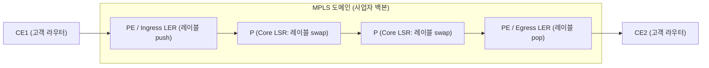
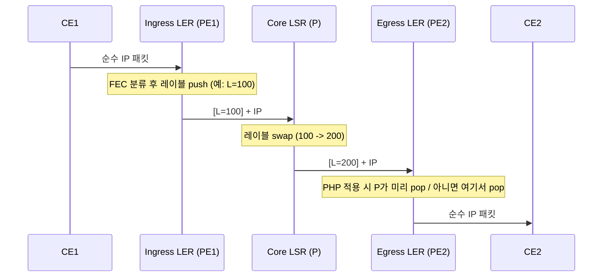

# MPLS(Multi-Protocol Label Switching)

## 1. 개요

> **MPLS(Multi-Protocol Label Switching)** 란 IP 패킷에 고정 길이의 **레이블(Label)** 을 부착하여, 라우터가 목적지 IP 주소의 최장 프리픽스 매칭(Longest Prefix Match) 대신 레이블 값만으로 고속 스위칭·경로 결정을 수행하도록 하는 **레이블 기반 패킷 전달(Label Switching) 기술**이다. 계층상 L2와 L3 사이에서 동작하여 흔히 **"Layer 2.5"** 기술로 불린다.

MPLS가 등장한 배경은 1990년대 후반 인터넷 트래픽 급증과 함께 드러난 **전통적 IP 라우팅의 세 가지 구조적 한계**에 있다. 첫째는 **성능 문제**다. 홉마다 라우터가 라우팅 테이블을 최장 프리픽스 매칭으로 조회하는 방식은 접두어(prefix)가 가변 길이라 하드웨어 가속이 어려웠고, 초기 라우터에서 병목이 되었다. MPLS는 20비트 고정 레이블을 정확 일치(exact match)로 조회하므로 ASIC 기반 라인레이트 스위칭이 쉬워진다. 물론 오늘날에는 TCAM 기반 하드웨어 포워딩이 보편화되어 순수 "속도 이점" 자체는 희석되었으나, 아래의 두 번째·세 번째 동기는 여전히 유효하다.

둘째는 **트래픽 엔지니어링(Traffic Engineering)의 부재**다. IGP(OSPF·IS-IS)는 항상 최단 경로(shortest path)만 선택하므로 특정 링크에 트래픽이 몰려 혼잡이 발생해도 여유 있는 우회 경로를 활용하지 못한다. MPLS는 목적지가 아닌 **경로(LSP)** 단위로 트래픽을 명시적으로 배치할 수 있어, 대역폭·지연·홉 제약을 반영한 경로 배정이 가능하다. 셋째는 **확장 가능한 VPN 서비스의 필요성**이다. 통신사업자가 다수 고객의 사설망을 하나의 백본에서 격리·수용하려면 고객별 라우팅 분리가 필요한데, MPLS/BGP L3VPN은 이를 오버레이 터널 없이 백본 코어의 상태를 최소화하며 실현한다. 이 세 동기 중 실제로 MPLS를 지배적 백본 기술로 만든 것은 **VPN과 TE**였다.

MPLS의 특징은 다음과 같이 정리된다. 이들 특징은 뒤에서 다룰 VPN·TE·CoS 서비스가 모두 성립하는 토대가 된다.

- **프로토콜 독립성(Multi-Protocol)**: 상위(IPv4/IPv6)와 하위(Ethernet·PPP·프레임릴레이·ATM) 계층을 가리지 않고 레이블로 캡슐화·전달한다. "Multi-Protocol"이라는 이름의 근거다.
- **연결지향(Connection-Oriented) 전달**: 무연결 IP와 달리 진입 전 LSP라는 논리 경로를 미리 설정하고 그 경로로만 전달한다.
- **코어 상태 최소화**: 정책·분류는 엣지(PE/LER)에 집중하고 코어(P/LSR)는 레이블 스위칭만 하여, 고객 수가 늘어도 코어 부담이 선형적으로 커지지 않는다.
- **캐리어급 기능 내장**: CoS/QoS(TC/EXP 비트), 트래픽 엔지니어링, FRR(50ms 복구) 등 통신사업자 백본에 필요한 기능을 표준으로 제공한다.

## 2. MPLS 구조와 핵심 개념

MPLS 도메인은 고객망(CE)과 사업자 백본(PE·P)으로 구성되며, 트래픽은 도메인 진입 시 레이블이 부착(push)되고 코어를 레이블 교체(swap)로 통과한 뒤 이탈 직전 제거(pop)된다. 전체 구조는 다음과 같다.

**가. 구성요소 — LER과 LSR.** MPLS 네트워크의 노드는 역할에 따라 나뉜다. **LER(Label Edge Router)** 는 도메인 경계에 위치하며 입구(Ingress)에서는 IP 패킷을 분류해 레이블을 부착하고, 출구(Egress)에서는 레이블을 벗겨 다시 순수 IP 라우팅으로 전달한다. 사업자망 관점에서 LER은 고객설비(CE)와 직접 맞닿는 **PE(Provider Edge)** 라우터에 해당한다. **LSR(Label Switching Router)** 은 코어에 위치하는 **P(Provider) 라우터**로, IP 헤더를 열어보지 않고 입력 레이블을 출력 레이블로 교체(swap)하며 전달만 담당한다. 이처럼 "복잡한 판단은 엣지에서 한 번, 코어는 단순 스위칭"이라는 **엣지-코어 분리** 철학이 MPLS 확장성의 핵심이다.

**나. FEC(Forwarding Equivalence Class).** FEC는 "동일한 방식(같은 LSP·같은 처리)으로 전달되어야 하는 패킷들의 집합"을 의미한다. Ingress LER은 도착한 패킷을 목적지 프리픽스, VPN 소속, CoS 등 정책에 따라 특정 FEC로 분류하고, 그 FEC에 매핑된 레이블을 부착한다. 즉 **분류는 입구에서 단 한 번** 이루어지고 이후 코어는 레이블만 본다. 예를 들어 "10.1.0.0/16으로 향하는 골드 등급 트래픽"을 하나의 FEC로 정의하면, 해당 조건의 모든 패킷은 동일한 경로·동일한 큐잉을 받는다.

**다. 레이블과 레이블 스택(Label Stack).** MPLS 레이블은 L2 헤더와 L3 헤더 사이에 삽입되는 32비트 **심(Shim) 헤더**이며 구조는 아래 표와 같다. 특히 **레이블 스택**은 여러 레이블을 중첩(push)할 수 있게 하여, 바깥 레이블은 백본 전달용(transport), 안쪽 레이블은 서비스 식별용(VPN·의사회선)으로 계층화하는 **터널 인 터널** 구조를 가능케 한다. 이것이 MPLS VPN의 근간이다.

| 필드 | 크기 | 설명 |
|------|------|------|
| Label | 20 bit | 레이블 값(0~1,048,575). 0~15는 예약 레이블(예: 0=IPv4 Explicit NULL, 3=Implicit NULL) |
| TC(EXP) | 3 bit | Traffic Class — CoS/QoS 우선순위 표시(DiffServ 매핑) |
| S(Bottom of Stack) | 1 bit | 스택 최하위 레이블이면 1 |
| TTL | 8 bit | Time To Live — 루프 방지 및 홉 카운트 |

**라. LSP(Label Switched Path).** LSP는 Ingress LER에서 Egress LER까지 특정 FEC의 패킷이 따라가는 **단방향 논리 경로**다. 양방향 통신을 위해서는 두 개의 LSP가 필요하다. LSP는 IGP 최단경로를 따르는 **홉바이홉(LDP 기반)** 방식과, 제약조건을 반영해 명시적으로 설정하는 **명시적 경로(RSVP-TE 기반)** 방식으로 나뉜다.

## 3. MPLS 동작 원리와 레이블 분배

MPLS 데이터 평면의 핵심 동작은 **push(부착)·swap(교체)·pop(제거)** 세 가지다. 아래 시퀀스는 하나의 패킷이 도메인을 통과하며 레이블이 어떻게 변하는지를 보여준다.

**가. 포워딩 절차와 PHP.** Ingress LER은 FEC에 매핑된 레이블을 push하고, 각 코어 LSR은 자신의 **LFIB(Label Forwarding Information Base)** 를 조회하여 입력 레이블을 출력 레이블로 swap한다. Egress LER은 마지막 레이블을 pop하고 IP 라우팅으로 되돌린다. 이때 **PHP(Penultimate Hop Popping)** 기법이 흔히 적용되는데, 마지막에서 두 번째(penultimate) LSR이 미리 레이블을 제거해 Egress LER이 "pop 후 다시 IP 조회"라는 이중 조회를 하지 않도록 한다. Egress는 예약 레이블 **3(Implicit NULL)** 을 광고함으로써 "너는 레이블을 벗기고 순수 IP로 보내라"고 이웃에게 지시한다.

각 LSR의 스위칭 판단은 **LFIB**라는 단순한 조회 테이블로 이루어진다. 예를 들어 어떤 코어 LSR의 LFIB가 아래와 같다면, 입력 인터페이스로 레이블 100이 들어올 때 이를 200으로 교체(swap)해 인터페이스 If2로 내보내고, 레이블 300은 pop 후 IP 전달한다. 이처럼 "입력 레이블 → (연산, 출력 레이블, 출력 포트)"의 정확일치 조회만 하므로 하드웨어 가속과 라인레이트 처리가 용이하다.

| 입력 레이블 | 연산 | 출력 레이블 | 출력 인터페이스 |
|-------------|------|-------------|------------------|
| 100 | swap | 200 | If2 |
| 150 | swap | 250 | If3 |
| 300 | pop | (없음, IP 전달) | If1 |

**다. TTL과 루프 방지.** MPLS 레이블에도 8비트 TTL이 있어, IP TTL과 유사하게 홉마다 1씩 감소시켜 루프를 방지한다. Ingress에서 IP TTL을 레이블 TTL로 복사(uniform mode)하거나 독립적으로 다룰(pipe mode) 수 있으며, TTL이 0이 되면 패킷을 폐기한다. 이는 잘못된 LSP 설정이나 일시적 경로 불일치 상황에서 패킷이 무한 순환하는 것을 막는 안전장치다.

**라. 레이블 분배 프로토콜.** 레이블-FEC 매핑 정보를 라우터 간에 교환하려면 별도의 시그널링 프로토콜이 필요하다. 대표적으로 세 가지가 쓰인다. **LDP(Label Distribution Protocol)** 는 IGP가 계산한 경로를 그대로 따라 홉바이홉으로 레이블을 분배하며 설정이 단순해 기본 전달망에 널리 쓰이지만 대역폭 예약·TE는 지원하지 못한다. **RSVP-TE**(RSVP의 확장)는 대역폭·우선순위·명시경로 제약을 반영해 LSP를 설정하며 TE와 **FRR(Fast ReRoute)** 의 기반이 된다. **MP-BGP(Multiprotocol BGP)** 는 L3VPN에서 고객 경로에 VPN 레이블을 실어 PE 간에 전파하는 역할을 한다. 정리하면 **"전달망 레이블은 LDP/RSVP-TE, 서비스(VPN) 레이블은 MP-BGP"** 로 역할이 나뉜다.

**마. 제어 평면과 데이터 평면의 분리.** MPLS는 경로·레이블을 계산·분배하는 제어 평면(IGP+LDP/RSVP-TE/BGP)과, 실제 패킷을 스위칭하는 데이터 평면(LFIB 기반 push/swap/pop)이 분리되어 있다. 이 분리 덕분에 데이터 평면은 단순·고속으로 유지되고, 제어 평면의 정책만 바꿔 다양한 서비스(VPN·TE·CoS)를 얹을 수 있다. 후술할 세그먼트 라우팅과 SDN 통합은 바로 이 제어 평면을 단순화·중앙집중화하려는 흐름이다.

## 4. 주요 응용: MPLS VPN과 트래픽 엔지니어링

**가. MPLS L3VPN(BGP/MPLS IP VPN, RFC 4364).** 가장 성공적인 MPLS 응용이다. 사업자는 PE 라우터에 고객별 **VRF(Virtual Routing and Forwarding)** 테이블을 두어 고객 라우팅을 물리적으로 한 장비 안에서 논리적으로 격리한다. 서로 다른 고객이 동일한 사설 IP 대역(예: 10.0.0.0/8)을 써도 충돌하지 않도록 **RD(Route Distinguisher)** 를 프리픽스 앞에 붙여 전역 유일한 VPNv4 경로로 만들고, **RT(Route Target)** 로 어떤 VRF가 그 경로를 가져갈지(수출입 정책)를 제어한다. 전달 시에는 **2단 레이블 스택**을 사용한다 — 바깥(transport) 레이블은 목적지 PE까지의 LSP를 지정하고, 안쪽(VPN) 레이블은 그 PE에서 어느 VRF·어느 고객으로 보낼지를 지정한다. 이 구조 덕에 **코어 P 라우터는 고객 경로를 전혀 알 필요가 없어**(바깥 레이블만 스위칭) 수천 고객을 수용해도 코어 상태가 폭증하지 않는다. 이것이 IPSec 오버레이 대비 MPLS VPN의 결정적 확장성 우위다.

구체적인 전달 흐름을 수치로 살펴보면 이해가 명확해진다. 고객 A(서울지사, 10.1.0.0/24)가 같은 고객 A(부산지사, 10.2.0.0/24)로 패킷을 보낸다고 하자. ① 서울 CE는 목적지 10.2.0.1 패킷을 접속 PE1로 보낸다. ② PE1은 해당 VRF에서 목적지를 조회해, 원격 PE2가 광고한 **VPN 레이블(예: 안쪽 L=50)** 을 push하고, 다시 PE2까지 도달하기 위한 **transport 레이블(예: 바깥 L=100)** 을 그 위에 push한다(스택 `[100][50]`). ③ 코어 P 라우터들은 오직 바깥 레이블 100만 보고 swap(100→200→…)하며 전달하고, 고객 경로 10.2.0.0/24는 전혀 알지 못한다. ④ PE2 직전 P 라우터는 PHP로 바깥 레이블을 pop해 `[50]`만 남긴다. ⑤ PE2는 안쪽 레이블 50으로 "이 패킷은 고객 A의 부산 VRF행"임을 식별해 IP 라우팅으로 부산 CE에 전달한다. 이처럼 **바깥 레이블은 위치(어느 PE), 안쪽 레이블은 소속(어느 고객·VRF)** 을 나누어 담당하므로, 수천 개 고객 VPN을 코어 상태 증가 없이 수용할 수 있다.

**나. MPLS L2VPN(의사회선, Pseudowire).** L3가 아닌 L2 프레임(이더넷 등)을 백본 너머로 그대로 전달하는 서비스다. 두 지점을 잇는 점대점 방식의 **VPWS(Virtual Private Wire Service)** 와, 여러 지점을 하나의 브로드캐스트 도메인처럼 잇는 다중점 방식의 **VPLS(Virtual Private LAN Service)** 로 나뉜다. 기업이 지사 간 동일 L2 세그먼트(예: 데이터센터 확장, DCI)를 요구할 때 활용된다.

**다. 트래픽 엔지니어링(MPLS-TE)과 FRR.** RSVP-TE는 **CSPF(Constrained Shortest Path First)** 로 "50Mbps 이상 여유·특정 링크 회피" 같은 제약을 만족하는 경로를 계산해 명시적 LSP를 설정한다. 이를 통해 IGP 최단경로가 유발하는 특정 링크 혼잡을 회피하고 백본 활용률을 높인다. 여기에 **FRR(Fast ReRoute)** 은 링크·노드 장애 시 사전 계산된 백업 LSP로 트래픽을 국소 우회시켜 통상 **50ms 이내** 복구를 달성한다. 이는 IGP 재수렴(수백 ms~수 초)보다 훨씬 빨라, 음성·영상 등 실시간 트래픽의 캐리어급 가용성(99.999%) 요구를 충족한다.

| 응용 | 시그널링 | 핵심 메커니즘 | 대표 용도 |
|------|----------|---------------|-----------|
| L3VPN | MP-BGP(VPNv4) | VRF·RD·RT, 2단 레이블 | 기업 지사 간 사설 WAN |
| L2VPN(VPWS/VPLS) | LDP/BGP | 의사회선, MAC 학습(VPLS) | DCI, L2 확장 |
| MPLS-TE | RSVP-TE | CSPF, 대역폭 예약, FRR | 백본 혼잡 회피·고가용성 |
| 기본 전달 | LDP | 홉바이홉 LSP | 단순 코어 스위칭 |

## 5. 비교 — 인접 기술과의 차이 및 함의

**가. 전통적 IP 라우팅 vs MPLS.** IP 라우팅은 홉마다 목적지 주소를 **최장 프리픽스 매칭**으로 독립 판단하는 무연결(connectionless) 방식이라 경로 제어가 불가능하다. MPLS는 입구에서 한 번 분류한 뒤 **레이블 정확일치**로 경로(LSP)를 따르는 연결지향 방식이라 TE·VPN·CoS가 가능하다. 차이가 생기는 근본 이유는 "판단 위치"에 있다 — IP는 매 홉이 판단하고, MPLS는 엣지가 판단하고 코어는 실행만 한다. 이 위임 구조가 코어 단순화와 서비스 다양성을 동시에 낳는다.

| 구분 | 전통적 IP 라우팅 | MPLS |
|------|------------------|------|
| 전달 판단 | 홉마다 목적지 IP 조회 | 입구에서 1회 분류, 코어는 레이블만 조회 |
| 조회 방식 | 최장 프리픽스 매칭(가변) | 레이블 정확일치(고정 20비트) |
| 연결 성격 | 무연결(Connectionless) | 연결지향(LSP) |
| 경로 제어(TE) | 불가(항상 최단경로) | 가능(명시경로·대역폭 예약) |
| VPN·CoS | 별도 오버레이 필요 | 레이블 스택으로 내장 |
| 장애 복구 | IGP 재수렴(수백 ms~초) | FRR 50ms 이내 |

**나. LDP vs RSVP-TE.** 둘 다 레이블을 분배하지만, LDP는 "IGP 경로를 그대로 따르는" 정책 없는 분배라 설정이 쉽고 상태가 적은 대신 대역폭 인지·명시경로가 불가능하다. RSVP-TE는 링크별 상태(soft state)를 유지하며 제약 경로를 세우므로 TE·FRR을 제공하지만 코어에 LSP 수만큼 상태가 쌓여 대규모망에서 **상태 폭증(state explosion)** 이 부담이 된다. 이 상태 부담이 바로 세그먼트 라우팅 등장의 직접적 동기다.

**다. MPLS VPN vs IPSec VPN.** MPLS VPN은 사업자 백본 내부에서 레이블로 격리하는 **신뢰 기반** 방식으로, 코어에 암호화가 없어 빠르고 QoS·TE와 결합이 자연스럽지만 인터넷 구간으로는 확장되지 않고 사업자에 종속된다. IPSec VPN은 공용 인터넷 위에 암호 터널을 세우는 방식으로 어디서나 되고 저렴하지만 지연·성능 변동이 크고 QoS 보장이 어렵다. 실제 기업 WAN은 "핵심 거점은 MPLS, 인터넷 브레이크아웃·소규모 지사는 IPSec"으로 혼합하는 경우가 많고, 이 혼합을 소프트웨어로 지능화한 것이 SD-WAN이다.

**라. MPLS vs SD-WAN.** SD-WAN은 MPLS·인터넷·LTE/5G 등 이종 회선을 애플리케이션 인지 정책으로 동적 선택하는 **오버레이**이며, 값싼 인터넷 회선 활용으로 비용을 낮춘다. 다만 SD-WAN은 근본적으로 언더레이 품질에 의존하므로, 지연·손실 보장이 절대적인 트래픽에는 여전히 MPLS 언더레이가 선호된다. 즉 둘은 대체재라기보다, **MPLS(품질 보장 언더레이)+SD-WAN(정책·비용 최적 오버레이)** 의 보완 관계로 수렴하는 추세다.

## 6. 심화 — 세그먼트 라우팅(SR)으로의 진화와 최신 동향

MPLS의 오랜 약점은 LDP·RSVP-TE라는 **별도 레이블 분배 프로토콜을 운영·동기화**해야 하고, TE를 쓰면 코어에 홉별 상태가 쌓인다는 점이었다. 이를 해소하려는 것이 **세그먼트 라우팅(Segment Routing, SR)** 이다. SR은 IGP(IS-IS/OSPF) 확장으로 각 노드·링크에 **SID(Segment Identifier)** 를 광고하고, Ingress가 경로를 **SID 리스트(소스 라우팅)** 로 패킷 헤더에 명시한다. 그 결과 코어는 별도 상태를 유지할 필요가 없어 **LDP·RSVP-TE를 제거**할 수 있고, 제어 평면이 대폭 단순해진다.

SR은 두 데이터 평면을 가진다. **SR-MPLS**는 기존 MPLS 레이블 스택을 그대로 데이터 평면으로 재사용하므로, MPLS를 이미 운영하는 사업자가 하드웨어 교체 없이 제어 평면만 바꿔 도입하는 **실용적 업그레이드 경로**다. 반면 **SRv6**는 MPLS 레이블 자체를 버리고 IPv6 확장 헤더(SRH)에 SID를 담아 네이티브 IPv6 위에서 동작하여 MPLS를 아예 제거한다. 업계 자료에 따르면 오늘날 마이그레이션은 대체로 **SR-MPLS를 먼저 거쳐** 점진적으로 SRv6로 나아가는 경향이 있으며, SRv6는 5G 전송·에지·대규모 클라우드에서 선호되는 것으로 소개된다(다만 채택 속도·비중은 사업자별로 상이하므로 단정은 피한다). 실제로 Rakuten Mobile은 Cisco와 함께 SRv6 기반 오버레이로 전송망을 단순화하고 클라우드 SD-WAN을 구현하는 사례로 언급된다.

또한 SR은 중앙 컨트롤러(SDN)와 결합해 **SR-TE**로 경로를 프로그래밍하기 좋아, "MPLS의 캐리어급 기능 + SDN의 중앙 제어·자동화"를 동시에 취하는 방향으로 발전하고 있다. 예상 출제 방향으로는 ① MPLS 기본 구조·동작(레이블 스택·push/swap/pop·PHP), ② L3VPN의 RD/RT·2단 레이블 원리, ③ TE·FRR의 50ms 복구, ④ **MPLS와 SD-WAN·세그먼트 라우팅의 비교 및 진화 관계**를 묶어 서술하는 비교·전망형 문항이 유력하다.

## 7. 고려사항 및 시사점 (기술사 관점)

- **적용 전략 — 계층적 서비스 설계**: 전달망은 단순한 LDP로 두고, TE·고가용성이 필요한 구간에만 RSVP-TE(또는 SR-TE)를 선택적으로 적용하는 이원화가 상태 부담과 운영 복잡도를 낮춘다. VPN·CoS 정책은 반드시 엣지(PE)에 집중시켜 코어를 가볍게 유지해야 확장성이 확보된다.

- **트레이드오프 — 품질 보장 vs 비용/유연성**: MPLS는 SLA·QoS·저지연을 보장하지만 회선 단가가 높고 프로비저닝이 느리며 사업자 종속이 크다. 반대로 인터넷+SD-WAN은 저렴·민첩하나 품질 변동이 있다. 트래픽 중요도(실시간·기간계 vs 인터넷·백업)에 따라 회선을 계층화(하이브리드 WAN)하는 것이 현실적 최적해다.

- **보안 관점 — 격리 ≠ 암호화**: MPLS VPN의 "격리"는 레이블 기반 논리 분리이지 암호화가 아니다. 사업자 백본을 신뢰하지 않는 규제·금융 환경에서는 MPLS 위에 IPSec을 중첩하거나, 제로 트러스트·SASE 관점에서 종단 간 암호화를 별도로 설계해야 한다.

- **전환·전망 — SR/SRv6와 SDN 통합**: 신규·확장 백본은 LDP/RSVP-TE 대신 SR-MPLS를 우선 검토하고, IPv6 전면화·5G 전송·에지 확장 로드맵이 있다면 SRv6를 단계적으로 편입하는 것이 바람직하다. 다만 SRv6는 헤더 오버헤드·하드웨어 지원 성숙도 이슈가 있으므로 검증 후 점진 도입한다.

- **연계 기술**: MPLS는 QoS(DiffServ·EXP 매핑), SD-WAN, SASE/ZTNA, 5G 특화망·네트워크 슬라이싱, 데이터센터 상호연결(DCI)과 밀접하게 연계된다. 기술사 답안에서는 단일 기술이 아니라 **엔드투엔드 WAN 아키텍처의 한 계층**으로 위치시켜 서술하는 것이 바람직하다.

## 참고자료

- IETF RFC 3031, *Multiprotocol Label Switching Architecture* — https://datatracker.ietf.org/doc/html/rfc3031
- IETF RFC 3032, *MPLS Label Stack Encoding* — https://datatracker.ietf.org/doc/html/rfc3032
- IETF RFC 4364, *BGP/MPLS IP Virtual Private Networks (VPNs)* — https://datatracker.ietf.org/doc/html/rfc4364
- IETF RFC 8402, *Segment Routing Architecture* — https://datatracker.ietf.org/doc/html/rfc8402
- Segment Routing 커뮤니티, SR-MPLS/SRv6 동향 — https://www.segment-routing.net/
- WWT, *Segment Routing: The Future of MPLS* — https://www.wwt.com/article/segment-routing-the-future-of-mpls

---
> **한 줄 요약**: MPLS는 IP 패킷에 20비트 레이블을 부착해 코어를 정확일치 스위칭으로 통과시키는 L2.5 연결지향 기술로, 엣지-코어 분리를 바탕으로 L3/L2 VPN·트래픽 엔지니어링·FRR 같은 캐리어급 서비스를 제공하며, 오늘날 LDP/RSVP-TE의 상태 부담을 덜어내는 세그먼트 라우팅(SR-MPLS·SRv6)과 SD-WAN으로 진화·보완되고 있다.
