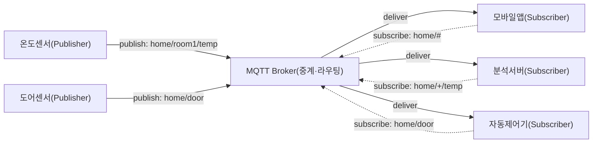
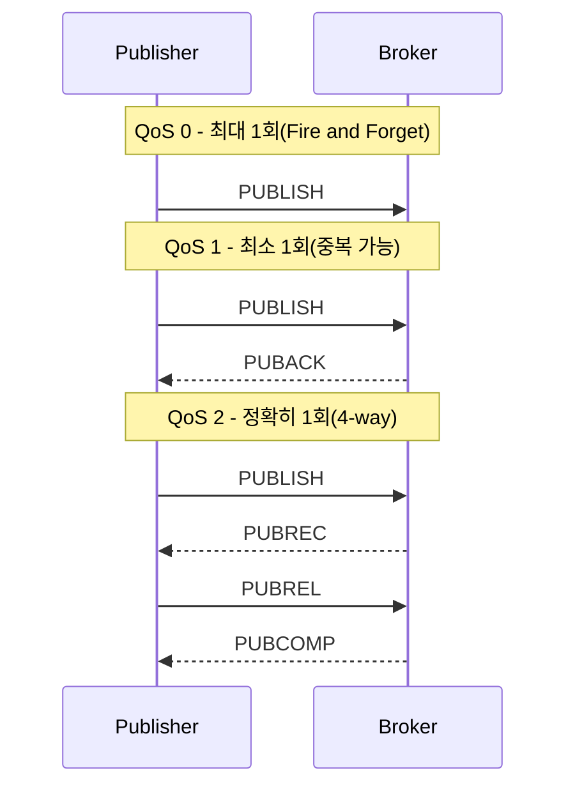
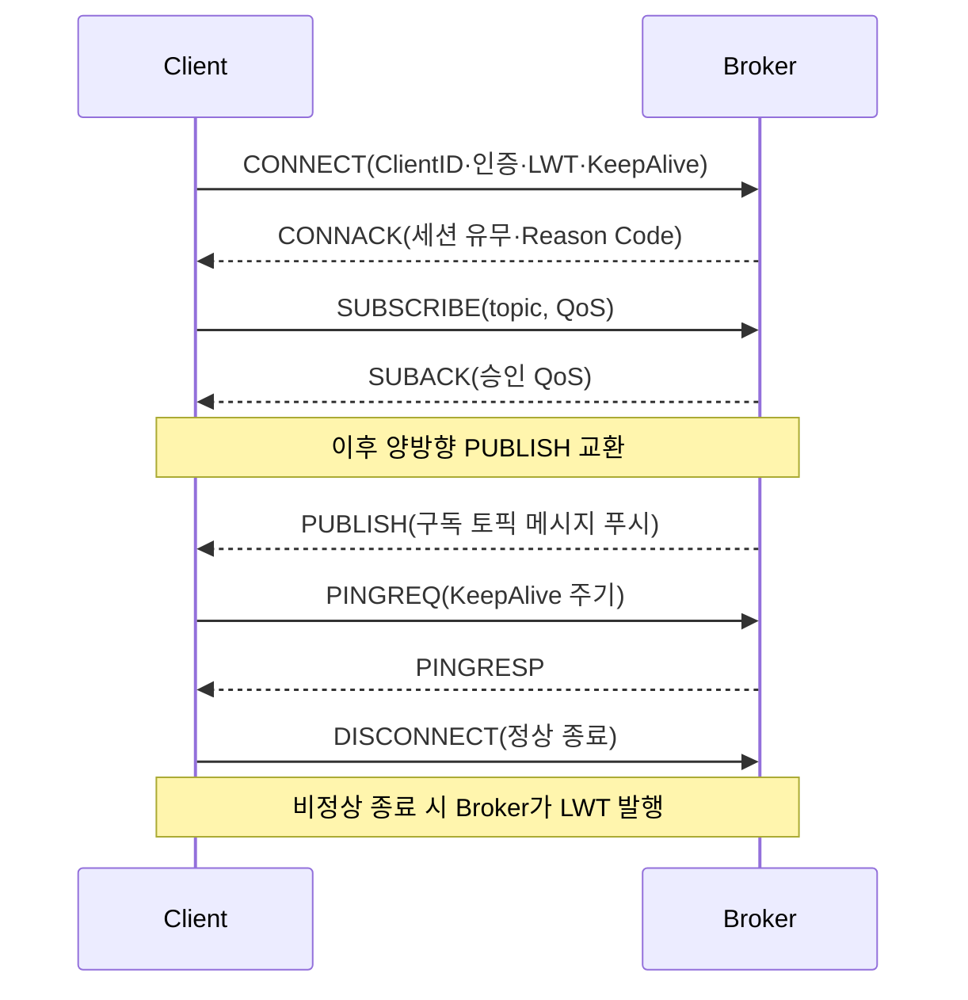

# MQTT(Message Queuing Telemetry Transport)

## 1. 개요

> **정의**: MQTT는 발행/구독(Publish/Subscribe) 모델을 기반으로 하는 **경량 메시징 프로토콜**로, 대역폭·전력·연산 자원이 제한된 환경에서 다수의 디바이스가 브로커(Broker)를 매개로 비동기 통신하도록 설계된 애플리케이션 계층 프로토콜이다. OASIS MQTT 3.1.1(2014)로 표준화되었고 동일 규격이 ISO/IEC 20922:2016으로 채택되었으며, 2019년 OASIS MQTT 5.0으로 기능이 대폭 확장되었다.

MQTT가 등장한 배경은 1999년 IBM과 Arcom(현 Eurotech)이 송유관 원격 감시(SCADA)를 위해 **위성 링크처럼 대역폭이 좁고 지연·단절이 잦은 회선**에서도 안정적으로 센서 데이터를 수집해야 했던 산업 현실에 있다. 당시 표준이던 HTTP는 요청/응답(Request/Response) 구조상 헤더가 무겁고, 서버가 클라이언트에 능동적으로 데이터를 밀어 넣지 못하며(폴링 필요), 연결을 매 요청마다 재수립하는 비용이 커서 수천 개의 저사양 노드를 실시간으로 다루기에 부적합했다. MQTT는 이 문제를 **고정 헤더 2바이트라는 극단적 경량화**와 **연결 지향적 상시 세션**, 그리고 **브로커 중심의 발행/구독 분리**로 해결한다.

발행/구독 모델의 핵심 가치는 **송신자와 수신자의 시간적·공간적·동기적 결합을 끊는(decoupling)** 데 있다. 발행자는 수신자가 누구인지, 몇 개인지, 현재 접속해 있는지 알 필요가 없다. 발행자는 특정 **토픽(Topic)** 에 메시지를 던지고, 그 토픽을 구독한 모든 클라이언트가 브로커를 통해 메시지를 전달받는다. 이 구조 덕분에 새로운 센서나 분석 서버를 추가·제거해도 기존 노드의 코드를 수정할 필요가 없어, 수십만 대 규모로 확장되는 IoT·스마트팩토리·커넥티드카 환경의 사실상 표준 프로토콜로 자리 잡았다.

특징을 요약하면 ① 초경량(최소 고정 헤더 2바이트, 텍스트 오버헤드 없는 바이너리 프레임), ② 발행/구독 기반 비동기·다대다 통신, ③ 세 단계 서비스 품질(QoS 0/1/2)로 신뢰성 조절, ④ TCP 상시 연결 위에서 서버 푸시 지원, ⑤ 유언 메시지(LWT)·보존 메시지(Retain)·Keep Alive 등 불안정 회선을 위한 세션 관리 기능을 갖춘 점이다.

이러한 특징의 조합이 중요한 이유는, IoT 환경의 제약이 어느 하나가 아니라 **대역폭·전력·연산·연결 안정성이 동시에 부족한 복합 제약**이기 때문이다. 단순히 헤더만 줄인 프로토콜이나 신뢰성만 높인 프로토콜로는 이 복합 제약을 만족시킬 수 없다. MQTT는 경량성(대역폭·전력)과 QoS 선택권(신뢰성), 발행/구독 분리(확장성), 세션 관리(연결 안정성)를 하나의 프로토콜 안에서 균형 있게 제공함으로써, 저사양 말단부터 클라우드 수집 계층까지를 잇는 실용적 해법이 되었다. 이 균형이 곧 MQTT가 20여 년간 IoT 표준의 지위를 유지해 온 근본 이유다.

## 2. MQTT 아키텍처와 발행/구독 모델

MQTT 통신은 메시지를 생산하는 **발행자(Publisher)**, 메시지를 수신하는 **구독자(Subscriber)**, 그리고 이 둘을 중계하며 라우팅·세션·QoS를 책임지는 **브로커(Broker)** 로 구성된다. 발행자와 구독자를 통칭해 클라이언트라 부르며, 하나의 클라이언트가 발행자이면서 동시에 구독자일 수 있다. 모든 메시지는 반드시 브로커를 경유하므로 브로커는 시스템의 중추이자 단일 장애점(SPOF)이 될 수 있어, 실무에서는 브로커 클러스터링과 이중화가 필수적이다.

위 구조에서 발행자와 구독자는 서로를 전혀 알지 못한 채 오직 토픽 이름으로만 만난다. 예를 들어 온도센서는 `home/room1/temp`로 25.3℃를 발행할 뿐이고, 이 값이 모바일앱·분석서버·제어기 중 누구에게 몇 부나 전달되는지는 브로커가 구독 테이블을 참조해 결정한다. 이렇게 **관계의 중심이 노드가 아니라 토픽**이라는 점이 REST API의 엔드포인트 중심 사고와 근본적으로 다르며, 이벤트 주도 아키텍처(EDA)와 자연스럽게 결합된다.

### 가. 토픽(Topic)과 와일드카드

토픽은 메시지의 주소이자 분류 체계로, 슬래시(`/`)로 계층을 구분하는 문자열이다(예: `factory/line2/machine5/vibration`). 토픽은 사전에 정의하거나 등록할 필요 없이 발행 시점에 동적으로 생성되므로 유연하지만, 반대로 **명명 규칙(naming convention)을 조직 차원에서 표준화하지 않으면 토픽이 난립**해 운영이 어려워진다. 실무에서는 `국가/공장/라인/장비/측정항목`처럼 상위에서 하위로 좁혀가는 계층 설계와, 선행 슬래시(`/`)나 공백을 금지하는 등의 규약을 문서화한다.

구독자는 두 가지 와일드카드로 여러 토픽을 한 번에 구독한다. 단일 계층 와일드카드 `+`는 한 레벨만 대체하여 `home/+/temp`는 `home/room1/temp`·`home/room2/temp`에 매칭되고, 다계층 와일드카드 `#`는 그 이하 모든 계층을 포괄하여 `home/#`는 `home` 하위 전체를 구독한다(반드시 토픽의 마지막에 위치). 와일드카드는 구독에만 사용할 수 있고 발행 토픽에는 쓸 수 없다. 예컨대 공장 관제 대시보드는 `factory/+/+/vibration`으로 모든 라인·장비의 진동값만 선택적으로 수집할 수 있어, 토픽 설계가 곧 데이터 필터링 설계가 된다.

### 나. QoS(서비스 품질) 3단계

MQTT의 가장 특징적인 기능은 메시지 단위로 신뢰성 수준을 선택하는 QoS다. TCP 자체가 신뢰성을 제공하지만 애플리케이션 관점의 **재접속·중복·유실 시나리오**까지 보장하기 위해 프로토콜 계층에서 별도의 확인 절차를 둔다. 각 단계는 신뢰성과 오버헤드가 정확히 반비례하므로, 설계자는 데이터의 성격에 맞춰 트레이드오프를 결정해야 한다.

**QoS 0(At most once)** 은 응답 없이 한 번만 전송하고 잊는 방식으로, 유실을 허용하는 대신 오버헤드가 가장 작다. 초당 수십 건씩 갱신되는 온도·조도처럼 한두 건 빠져도 무방한 고빈도 텔레메트리에 적합하다. **QoS 1(At least once)** 은 수신 측 PUBACK을 받을 때까지 재전송하므로 유실은 없지만 재전송 과정에서 **중복 수신**이 발생할 수 있어, 애플리케이션이 멱등성(idempotency)을 보장해야 한다. **QoS 2(Exactly once)** 는 PUBLISH→PUBREC→PUBREL→PUBCOMP의 4-way 핸드셰이크로 중복·유실을 모두 제거하지만, 왕복이 두 번 필요해 지연과 부하가 가장 크다. 결제·과금·명령 전달처럼 단 한 번의 정확한 전달이 필수인 경우에만 제한적으로 사용한다. 예컨대 스마트 계량기의 15분 단위 검침값은 과금과 직결되므로 QoS 2를, 실시간 전력 모니터링 그래프는 QoS 0을 쓰는 식으로 혼용하는 것이 전형적인 실무 설계다.

### 다. 세션 관리 기능: LWT · Retain · Keep Alive

불안정한 무선·이동 환경을 전제로 하는 MQTT는 연결 상태를 관리하는 세 가지 장치를 갖는다. 첫째, **유언 메시지(LWT, Last Will and Testament)** 는 클라이언트가 접속 시 미리 등록해 두는 메시지로, 해당 클라이언트가 비정상적으로 연결이 끊기면 브로커가 이를 대신 발행한다. 예를 들어 센서가 `status/sensor7 = offline`을 유언으로 등록하면, 배터리 방전으로 갑자기 사라져도 관제 시스템이 즉시 장애를 인지할 수 있다. 둘째, **보존 메시지(Retained Message)** 는 브로커가 토픽별 최신 메시지 1건을 저장해 두었다가 **새로 구독한 클라이언트에게 즉시 전달**하는 기능으로, 나중에 접속한 노드도 마지막 상태값을 폴링 없이 곧바로 알 수 있다. 셋째, **Keep Alive**는 클라이언트가 지정한 주기 내에 PINGREQ를 보내 연결 생존을 알리고, 브로커는 1.5배 시간 내에 신호가 없으면 연결이 끊긴 것으로 간주해 필요 시 LWT를 발행한다. 이 세 기능이 결합되어 MQTT는 수만 대의 노드가 수시로 접속·이탈하는 환경에서도 상태 일관성을 유지한다.

## 3. 통신 절차와 프로토콜 스택

MQTT는 TCP/IP 위에서 동작하며 기본 포트는 평문 1883, TLS 암호화 시 8883을 사용한다. 통신은 반드시 클라이언트가 브로커에 **CONNECT** 를 보내고 브로커가 **CONNACK** 로 응답하는 연결 수립으로 시작한다. CONNECT 패킷에는 클라이언트 식별자(Client ID), 인증 정보(username/password), Keep Alive 주기, Clean Session 플래그, LWT 설정이 담긴다. 이후 클라이언트는 SUBSCRIBE/PUBLISH를 자유롭게 주고받고, 종료 시 DISCONNECT를 보낸다.

전체 연결 생애주기를 시퀀스로 보면 다음과 같다. 연결 수립 이후 구독과 발행이 교차하며 이루어지고, Keep Alive가 배경에서 연결을 지탱하는 구조를 확인할 수 있다.

MQTT 명령 흐름을 계층과 함께 보면 다음과 같다.

| 계층 | 프로토콜/기술 | 역할 |
|------|--------------|------|
| 응용 | MQTT | 발행/구독, QoS, 세션 관리 |
| 보안 | TLS/SSL | 기밀성·무결성·서버/클라이언트 인증 |
| 전송 | TCP(1883/8883) | 신뢰성 있는 순서 보장 스트림 |
| 네트워크 | IP | 라우팅·주소 지정 |

Clean Session(3.1.1)/Clean Start·Session Expiry(5.0) 플래그는 재접속 시 이전 세션을 이어갈지를 결정한다. Clean Session을 false로 두면 브로커가 오프라인 기간 동안 QoS 1·2 메시지를 큐에 보관했다가 재접속 시 전달하므로, 간헐적으로 접속하는 모바일·저전력 노드가 메시지를 놓치지 않는다. 반대로 true로 두면 매번 새 세션으로 시작해 상태를 남기지 않는다.

한편 TCP조차 부담스러운 초저전력 센서망을 위해 **MQTT-SN(MQTT for Sensor Networks)** 변형이 존재한다. MQTT-SN은 UDP·ZigBee 등 비(非)TCP 매체 위에서 동작하고, 긴 문자열 토픽 대신 2바이트 토픽 ID를 사용하며, 게이트웨이가 MQTT-SN과 표준 MQTT를 변환한다. 이는 배터리로 수년을 버텨야 하는 무선 센서 노드의 현실적 제약을 반영한 설계다.

패킷 구조 관점에서 MQTT의 경량성을 구체적으로 살펴보면, 모든 제어 패킷은 최소 2바이트의 **고정 헤더(Fixed Header)** 로 시작한다. 첫 바이트의 상위 4비트가 패킷 유형(CONNECT·PUBLISH 등 14종)을, 하위 4비트가 플래그(DUP·QoS·RETAIN)를 나타내고, 이어지는 가변 길이 필드가 나머지 길이를 인코딩한다. 그 뒤로 필요한 경우에만 가변 헤더와 페이로드가 붙는다. HTTP가 요청 한 건에 수백 바이트의 텍스트 헤더를 소모하는 것과 달리, MQTT PUBLISH의 오버헤드가 수 바이트에 그치는 이유가 바로 이 극단적으로 압축된 바이너리 프레임 설계에 있다. 초당 수천 건을 수십만 노드가 발행하는 환경에서 이 차이는 대역폭·전력·클라우드 수신 비용의 큰 격차로 이어진다.

## 4. 유사 프로토콜 비교

MQTT의 위치를 이해하려면 경쟁·보완 프로토콜과의 차이를 그 **차이가 생기는 이유**까지 함께 보아야 한다. HTTP와 비교하면, HTTP는 요청/응답 기반이라 서버가 클라이언트에 능동적으로 데이터를 밀어 넣기 어렵고 헤더가 커서 배터리·대역폭을 소모하는 반면, MQTT는 상시 연결과 서버 푸시로 실시간성과 효율을 확보한다. 다만 방화벽 통과성·캐싱·생태계 성숙도에서는 HTTP가 앞서므로, 대용량 파일 전송이나 공개 API에는 여전히 HTTP/REST가 유리하다.

CoAP(Constrained Application Protocol)는 UDP 기반의 요청/응답 REST 스타일로, 브로커 없이 노드 간 직접 통신에 강하고 오버헤드가 더 작지만, 다대다 발행/구독과 상태 유지가 필요한 시나리오에서는 MQTT가 우위다. AMQP는 금융권 수준의 트랜잭션·라우팅·큐잉을 제공하는 무거운 엔터프라이즈 메시징 표준으로 신뢰성은 높지만 IoT 말단에는 과중하다. 반면 Kafka는 초당 수백만 건의 로그·이벤트 스트림을 디스크에 보존·재생하는 데 특화되어, MQTT가 수집한 말단 데이터를 게이트웨이에서 Kafka로 넘겨 대규모 분석 파이프라인에 연결하는 **MQTT+Kafka 하이브리드**가 실무의 정석이다.

| 구분 | MQTT | CoAP | HTTP | AMQP |
|------|------|------|------|------|
| 통신 모델 | Pub/Sub | Req/Resp(REST) | Req/Resp | Pub/Sub·큐 |
| 전송 | TCP | UDP | TCP | TCP |
| 헤더 오버헤드 | 매우 작음(2B~) | 작음(4B~) | 큼 | 중간 |
| QoS | 0/1/2 | Confirmable/Non | 없음 | 트랜잭션 |
| 브로커 | 필수 | 불필요 | 불필요 | 필수 |
| 주 용도 | IoT 실시간 수집 | 제약 노드 REST | 웹·공개 API | 엔터프라이즈 금융 |

실제 산업 적용을 보면, AWS IoT Core·Azure IoT Hub·Google Cloud IoT는 모두 MQTT를 디바이스 접속의 기본 프로토콜로 채택했고, 커넥티드카는 차량-클라우드 텔레메트리에, 스마트팩토리는 OPC-UA와 결합한 설비 데이터 수집에 MQTT를 광범위하게 사용한다. 예를 들어 페이스북 메신저 초기 버전이 모바일 배터리 절약을 위해 MQTT를 채택했던 사례는, 이 프로토콜이 IoT를 넘어 모바일 실시간 통신에도 유효함을 보여준다.

정량적 이점을 예시로 살펴보면, 배터리로 구동되는 원격 센서가 30초마다 상태를 서버에 알린다고 할 때, HTTPS 폴링 방식은 매 주기 TCP 3-way 핸드셰이크와 TLS 협상, 수백 바이트의 요청·응답 헤더를 반복해야 하지만, MQTT는 최초 1회만 연결을 수립한 뒤 상시 세션 위에서 수 바이트 PUBLISH만 전송한다. 여러 벤더의 실측 사례에서 이러한 방식이 동일 데이터 전송 기준으로 네트워크 트래픽과 소비 전력을 수 배 이상 절감하는 것으로 보고되며, 이는 수만 대 규모에서 통신 요금과 배터리 교체 주기라는 총소유비용(TCO)의 차이로 직결된다. 다만 정확한 절감폭은 페이로드 크기·주기·회선 품질에 따라 달라지므로 일반화에는 주의가 필요하다.

## 5. 심화: MQTT 5.0의 진화와 최신 동향

2019년 표준화된 MQTT 5.0은 대규모 IoT 운영에서 드러난 3.1.1의 한계를 보완하며 엔터프라이즈 기능을 대거 도입했다. 첫째, **Reason Code와 User Property** 를 도입해 연결·발행 실패의 원인을 세분화해 반환하고 임의의 메타데이터(키-값)를 메시지에 실을 수 있게 되어, 그동안 애플리케이션 페이로드에 억지로 담던 컨텍스트를 프로토콜 헤더로 분리했다. 둘째, **공유 구독(Shared Subscription)** 은 `$share/group/topic` 형식으로 동일 그룹의 여러 구독자가 메시지를 나눠 받게 하여, 단일 구독자에 부하가 몰리던 문제를 해결하고 **소비자 측 수평 확장(로드 밸런싱)** 을 프로토콜 차원에서 지원한다. 셋째, **토픽 별칭(Topic Alias)** 은 긴 토픽 문자열을 2바이트 정수로 치환해 반복 전송 시 대역폭을 절감하고, **메시지 만료(Message Expiry Interval)** 는 오래된 명령이 뒤늦게 전달되어 오작동을 일으키는 것을 방지한다. 넷째, **요청/응답 패턴(Response Topic·Correlation Data)** 을 공식 지원해 발행/구독 위에서 RPC 스타일 상호작용을 표준화했으며, **흐름 제어(Receive Maximum)** 로 느린 구독자가 브로커에 압도되지 않도록 했다.

최신 동향으로는, 산업용 표준화 기구가 MQTT 위에 데이터 구조와 상태 관리 규약을 얹은 **Sparkplug B** 사양을 채택해 스마트팩토리의 상호운용성을 높이고 있으며, WebSocket을 통한 MQTT(브라우저 직접 연결), 그리고 브로커의 클러스터링·엣지-클라우드 브리징을 통한 초대규모 확장이 활발히 적용되고 있다. 국내에서도 스마트시티·디지털 트윈·전력 AMI(원격검침) 인프라에서 MQTT가 데이터 수집 계층의 사실상 표준으로 쓰이고 있어, 정보관리기술사 관점에서는 단순 프로토콜이 아니라 **IoT 플랫폼 아키텍처의 데이터 수집·연동 백본**으로 이해할 필요가 있다.

## 6. 고려사항 및 시사점

MQTT를 실제 시스템에 적용할 때 기술사는 다음 관점을 종합적으로 고려해야 한다.

첫째, **보안 강화는 선택이 아닌 필수**다. MQTT 자체는 평문 프로토콜이므로 반드시 TLS(8883)로 전송 구간을 암호화하고, Client ID·username/password 기반 인증에 더해 X.509 인증서·OAuth 토큰 기반 상호 인증을 적용해야 한다. 또한 토픽 단위 접근제어(ACL)로 특정 클라이언트가 발행·구독할 수 있는 토픽을 제한하지 않으면, 탈취된 노드 하나가 전체 토픽을 도청·오염시킬 수 있다. 경량성을 이유로 보안을 생략하는 것이 가장 흔한 사고 원인이다.

둘째, **브로커의 가용성과 확장성**을 설계 초기에 확보해야 한다. 모든 트래픽이 브로커를 경유하는 구조상 브로커는 SPOF이자 성능 병목이 되므로, 브로커 클러스터링·이중화와 함께 공유 구독을 활용한 소비자 확장, 그리고 엣지 브로커와 중앙 브로커를 잇는 브리징 토폴로지로 수평 확장을 계획해야 한다.

셋째, **QoS와 세션 정책의 신중한 선택**이 비용과 신뢰성을 좌우한다. 모든 메시지에 QoS 2와 Clean Session=false를 남발하면 브로커의 저장·재전송 부하가 폭증한다. 데이터의 중요도와 유실 허용도를 분류해 텔레메트리는 QoS 0, 상태·명령은 QoS 1~2로 차등 적용하고, 세션 유지 여부도 노드 특성에 맞춰 결정하는 정책적 설계가 필요하다.

넷째, **토픽 명명 표준화와 거버넌스**가 장기 운영성을 결정한다. 토픽이 자유롭게 생성되는 유연성은 표준 없이는 관리 불능의 혼란으로 귀결되므로, 계층적 명명 규칙·네임스페이스·버전 관리를 조직 차원에서 문서화하고 데이터 거버넌스 체계와 연계해야 한다.

다섯째, **연계 기술과의 통합 전략**을 함께 그려야 한다. MQTT는 말단 수집에 최적화된 프로토콜이므로, 수집 이후의 스트림 처리(Kafka)·시계열 저장(TSDB)·실시간 분석·디지털 트윈과의 연동을 포함한 종단 간(End-to-End) 데이터 파이프라인 관점에서 아키텍처를 설계해야 실질적 가치를 창출할 수 있다.

종합하면 MQTT는 단순한 통신 규약을 넘어 IoT 데이터 아키텍처의 **수집 계층 표준**으로 이해해야 하며, 프로토콜의 경량성이라는 장점이 보안·가용성·거버넌스라는 운영 과제와 항상 맞물려 있다는 점을 놓치지 말아야 한다. 특히 초연결(Hyper-connectivity) 시대에 디바이스 수가 기하급수적으로 늘어남에 따라, 프로토콜 선택보다 **대규모 운영 체계(스케일링·보안·관측성)의 성숙도**가 프로젝트 성패를 좌우한다. 향후에는 5G·엣지 컴퓨팅과 결합해 초저지연 제어로 영역을 넓히고, MQTT 5.0의 요청/응답·공유 구독 기능을 활용한 양방향 지능형 제어가 확산될 전망이며, 기술사는 이러한 흐름 속에서 요구 신뢰성·비용·확장성의 트레이드오프를 정량적으로 판단해 최적 아키텍처를 제시할 수 있어야 한다.

## 참고자료
- OASIS, "MQTT Version 5.0 Specification" (2019). https://docs.oasis-open.org/mqtt/mqtt/v5.0/mqtt-v5.0.html
- OASIS, "MQTT Version 3.1.1" / ISO/IEC 20922:2016. https://docs.oasis-open.org/mqtt/mqtt/v3.1.1/mqtt-v3.1.1.html
- MQTT.org, "MQTT: The Standard for IoT Messaging". https://mqtt.org/
- HiveMQ, "MQTT Essentials" 시리즈. https://www.hivemq.com/mqtt-essentials/

---

> **한 줄 요약**: MQTT는 브로커 기반 발행/구독과 QoS 0/1/2·LWT·Retain으로 제약 환경에서 경량·신뢰 통신을 제공하는 IoT 메시징 표준으로, 5.0의 공유 구독·User Property 등으로 엔터프라이즈 확장성을 갖춘 데이터 수집 백본이다.
