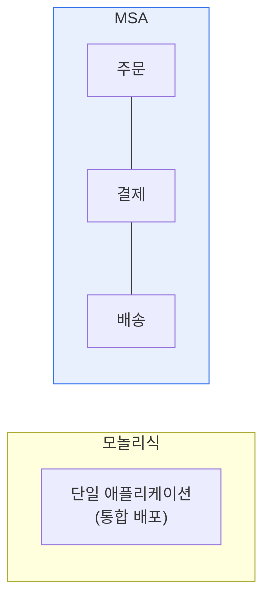

# 마이크로서비스 아키텍처(MSA, Micro Service Architecture)

## 1. 개요

### 가. 개념과 특징
> **MSA**는 하나의 애플리케이션을 **독립적으로 개발·배포·확장 가능한 작은 서비스들의 집합**으로 구성하는 아키텍처. 각 서비스는 고유 기능을 담당하고 API로 통신하며 자율적으로 운영된다.

MSA의 핵심 발상은 '**거대한 하나를 작은 여럿으로 쪼개 각각 독립시키자**'는 것이다. 전통적 모놀리식은 모든 기능이 하나의 큰 덩어리로 묶여, 작은 수정에도 전체를 다시 빌드·배포해야 하고, 특정 기능만 확장할 수 없으며, 한 부분의 장애가 전체를 마비시킨다. 애플리케이션이 커질수록 이 문제가 심각해진다. MSA는 이를 기능 단위(주문·결제·배송 등)의 독립 서비스로 분해해 해결한다. 각 서비스는 자체 데이터베이스를 갖고 독립 배포되므로, 한 서비스만 수정·배포할 수 있고(빠른 배포), 트래픽이 몰리는 서비스만 확장하며(효율적 확장), 한 서비스가 죽어도 다른 서비스는 살아 있다(장애 격리). 팀도 서비스별로 나뉘어 자율적으로 개발한다. 다만 이 자율성의 대가로 분산 시스템의 복잡성(네트워크 통신·데이터 일관성·운영 부담)이 따른다.

### 나. 구현 시 원칙
| 원칙 | 내용 |
|---|---|
| **단일 책임** | 서비스는 하나의 비즈니스 기능에 집중 |
| **자율성·독립 배포** | 서비스별 독립 개발·배포·확장 |
| **분산 데이터** | 서비스마다 자체 데이터베이스 |
| **장애 격리** | 한 서비스 장애가 전체로 전파 안 됨 |
| **API 통신** | 서비스 간 표준 인터페이스(REST 등) |

## 2. 모놀리식 vs MSA

| 구분 | 모놀리식 | MSA |
|---|---|---|
| **구조** | 단일 통합 | 독립 서비스 집합 |
| **배포** | 전체 일괄 | 서비스별 독립 |
| **확장** | 전체 확장 | 필요 서비스만 |
| **장애** | 전체 영향 | 격리 |
| **초기 복잡도** | 낮음 | 높음(분산) |
| **적합** | 소규모·단순 | 대규모·복잡·빈번한 변경 |

## 3. 서비스 메시(Service Mesh)

MSA에서 서비스가 많아지면 서비스 간 통신(인증·재시도·모니터링·로드밸런싱)을 각각 구현하기 어렵다. **서비스 메시** 는 이 서비스 간 통신을 애플리케이션 코드와 분리해 인프라 계층(사이드카 프록시)에서 처리하는 방식이다.

| 요소 | 내용 |
|---|---|
| **사이드카 프록시** | 각 서비스 옆에서 통신 대행(Envoy) |
| **트래픽 관리** | 라우팅·재시도·서킷브레이커 |
| **보안** | mTLS 상호 인증·암호화 |
| **관측성** | 통신 모니터링·추적 |

대표 구현이 Istio다. 서비스 메시는 통신 로직을 코드에서 걷어내 개발자가 비즈니스에 집중하게 한다.

## 4. 고려사항 및 시사점

1. **분산 시스템의 복잡성이 대가**다. MSA는 확장·독립성을 얻는 대신 네트워크 지연·데이터 일관성·운영 부담이 늘므로, 서킷브레이커·사가(Saga)·API 게이트웨이 등으로 이를 관리해야 한다.
2. **적절한 서비스 분해가 관건**이다. 너무 잘게 나누면 통신 오버헤드·관리 부담이 커지고, 크게 나누면 MSA 이점이 줄므로, 비즈니스 경계(도메인 주도 설계)에 맞게 분해한다.
3. **클라우드 네이티브와 결합**한다. 컨테이너(Docker)·오케스트레이션(쿠버네티스)·CI/CD·서비스 메시가 MSA 운영을 뒷받침하며, 모놀리식으로 시작해 필요 시 점진 전환하는 것이 현실적이다.

---

> **한 줄 요약**: MSA는 *애플리케이션을 독립 배포·확장 가능한 작은 서비스로 분해* 하는 아키텍처로, 빠른 배포·효율적 확장·장애 격리의 이점과 분산 복잡성의 대가를 가지며, 도메인 기반 분해와 서비스 메시·쿠버네티스로 운영한다.
