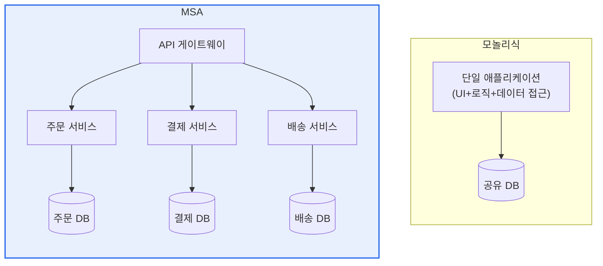
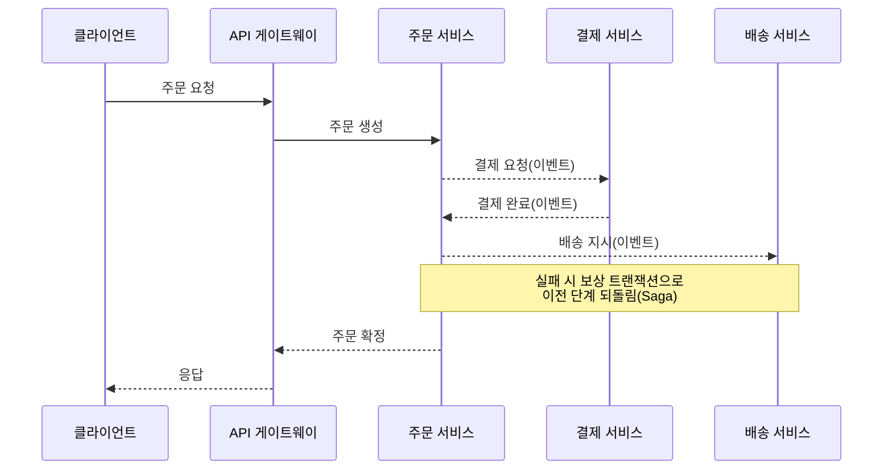

# 마이크로서비스 아키텍처(MSA, Micro Service Architecture)

## 1. 개요

### 가. 정의와 특징
> **MSA**는 하나의 애플리케이션을 **독립적으로 개발·배포·확장 가능한 작은 서비스들의 집합**으로 구성하는 아키텍처 스타일이다. 각 서비스는 하나의 비즈니스 기능을 담당하고, 자체 데이터베이스를 가지며, 경량 API(주로 HTTP/REST, 메시징)로 통신하고 자율적으로 운영된다.

MSA의 핵심 발상은 '**거대한 하나를 작은 여럿으로 쪼개 각각 독립시키자**'는 것이다. 전통적 모놀리식(Monolith)은 UI·비즈니스 로직·데이터 접근이 하나의 큰 배포 단위로 묶여 있다. 규모가 작을 때는 이 구조가 단순하고 효율적이지만, 애플리케이션이 커질수록 세 가지 고질병이 나타난다. 첫째, 작은 수정에도 전체를 다시 빌드·배포해야 해 배포 주기가 느려진다. 둘째, 특정 기능만 부분 확장할 수 없어 트래픽이 한 기능에 몰려도 애플리케이션 전체를 복제해야 한다. 셋째, 한 모듈의 메모리 누수·장애가 프로세스 전체를 마비시켜 장애가 전면 확산된다.

MSA는 이 문제를 기능 단위(예: 회원·주문·결제·배송)의 독립 서비스로 분해해 해결한다. 각 서비스는 자체 저장소를 갖고 독립적으로 배포되므로, 결제 로직만 고쳐 결제 서비스만 배포할 수 있고(**빠른 배포**), 주문이 폭주하면 주문 서비스만 여러 개로 늘릴 수 있으며(**효율적 확장**), 배송 서비스가 죽어도 회원·주문은 계속 동작한다(**장애 격리**). 조직 관점에서도 서비스별로 작은 팀이 전권을 갖고 개발·운영하는 자율성이 생긴다. 이 자율성이 MSA의 최대 이점이지만, 그 대가로 '분산 시스템'이라는 완전히 다른 난이도의 문제 — 네트워크 지연·부분 실패·데이터 일관성·운영 복잡성 — 를 떠안게 된다는 점을 반드시 함께 이해해야 한다.

### 나. 등장 배경
MSA가 부상한 배경에는 세 가지 흐름이 맞물려 있다. 첫째는 **비즈니스 속도**다. 웹·모바일 서비스 경쟁이 격화되면서 '하루에도 수십 번 배포'하는 민첩성이 생존 조건이 되었고, 전체를 한꺼번에 배포하는 모놀리식으로는 이 속도를 낼 수 없었다. 둘째는 **클라우드와 컨테이너의 성숙**이다. 서버를 필요할 때 즉시 늘리고 줄이는 탄력적 인프라, 그리고 서비스를 가볍게 포장·배포하는 컨테이너(Docker)와 오케스트레이션(쿠버네티스)이 등장하면서 수많은 작은 서비스를 실제로 운영할 수 있는 토대가 마련되었다. 셋째는 **조직 이론(콘웨이 법칙)** 이다. "시스템 구조는 그것을 만드는 조직의 소통 구조를 닮는다"는 통찰에서, 작고 자율적인 팀 구조와 작고 자율적인 서비스 구조를 일치시키려는 시도가 MSA로 이어졌다.

### 다. 구현 시 원칙
| 원칙 | 내용 |
|---|---|
| **단일 책임** | 서비스는 하나의 비즈니스 기능(도메인)에 집중 |
| **자율성·독립 배포** | 서비스별 독립 개발·배포·확장 |
| **분산 데이터** | 서비스마다 자체 데이터베이스(DB 공유 금지) |
| **장애 격리** | 한 서비스 장애가 전체로 전파되지 않도록 설계 |
| **API 통신·느슨한 결합** | 표준 인터페이스(REST/메시징)로만 통신 |
| **자동화** | CI/CD·모니터링·인프라 자동화로 운영 부담 상쇄 |

이 원칙들 가운데 실무에서 가장 자주 무너지는 것이 '**분산 데이터**'다. 여러 서비스가 편의상 하나의 데이터베이스를 공유하면 배포는 나뉘어도 데이터가 묶여 있어, 스키마 하나만 바꿔도 여러 서비스가 함께 배포돼야 하는 '**분산된 모놀리식(distributed monolith)**'으로 전락한다. 이는 모놀리식의 결합도와 MSA의 복잡성을 동시에 떠안는 최악의 형태이므로, 서비스별 데이터 소유권을 지키는 것이 MSA 성패의 핵심 규율이다.

## 2. 모놀리식 vs MSA 구조

아래 구조도는 두 아키텍처의 배포·데이터 소유 구조 차이를 보여준다. 모놀리식은 하나의 프로세스와 하나의 DB, MSA는 여러 서비스와 서비스별 DB가 API로 연결된 형태다.

```mermaid
flowchart TB
  subgraph MONO["모놀리식"]
    direction TB
    MA["단일 애플리케이션<br/>(UI+로직+데이터 접근)"] --> MDB[("공유 DB")]
  end
  subgraph MICRO["MSA"]
    direction TB
    GW["API 게이트웨이"] --> S1["주문 서비스"]
    GW --> S2["결제 서비스"]
    GW --> S3["배송 서비스"]
    S1 --> D1[("주문 DB")]
    S2 --> D2[("결제 DB")]
    S3 --> D3[("배송 DB")]
  end
  style MICRO fill:#e8f0fe,stroke:#2f6fed,stroke-width:2px
```

두 구조의 차이는 단순히 '덩어리냐 쪼갬이냐'가 아니라 **어디에 복잡성이 위치하는가**의 차이다. 모놀리식은 복잡성이 코드 내부(거대한 코드베이스)에 있고, MSA는 복잡성이 서비스 사이(네트워크·통신·데이터 일관성)로 이동한다. 따라서 MSA는 초기 복잡도가 높고 소규모·단순 서비스에는 오히려 과잉 설계가 된다. 아래 표의 '적합' 항목이 이 판단의 기준이 된다.

| 구분 | 모놀리식 | MSA |
|---|---|---|
| **구조** | 단일 통합 | 독립 서비스 집합 |
| **배포** | 전체 일괄 | 서비스별 독립 |
| **확장** | 전체 수평 확장 | 필요 서비스만 선택 확장 |
| **장애** | 전체 영향 | 격리(부분 장애) |
| **데이터** | 공유 DB(강한 일관성 용이) | 분산 DB(최종 일관성) |
| **초기 복잡도** | 낮음 | 높음(분산 시스템) |
| **적합** | 소규모·단순·초기 스타트업 | 대규모·복잡·빈번한 변경·대형 조직 |

실무 사례로, 대형 이커머스·스트리밍 서비스들이 트래픽 급증과 잦은 기능 추가를 감당하지 못해 모놀리식을 MSA로 전환한 사례가 널리 알려져 있다. 반대로, 초기 스타트업이 유행을 좇아 처음부터 수십 개 서비스로 쪼갰다가 운영 인력·자동화 없이 감당하지 못해 다시 모놀리식으로 되돌린(이른바 'MSA 롤백') 사례도 흔하다. 이 상반된 사례가 주는 교훈은 명확하다 — **MSA는 목적이 아니라, 감당할 규모와 조직·자동화 역량이 갖춰졌을 때 선택하는 수단**이라는 점이다.

## 3. 서비스 간 통신과 데이터 일관성

서비스가 나뉘면 '함께 성공하거나 함께 실패해야 하는 작업'을 여러 서비스에 걸쳐 처리해야 한다. 예컨대 '주문 생성 → 결제 승인 → 재고 차감'은 하나의 논리적 거래지만 세 서비스에 흩어져 있다. 모놀리식이라면 하나의 DB 트랜잭션으로 원자적으로 처리하겠지만, 서비스마다 DB가 분리된 MSA에서는 전통적 분산 트랜잭션(2PC)이 성능·가용성 문제로 잘 맞지 않는다.

```mermaid
sequenceDiagram
  participant C as 클라이언트
  participant G as API 게이트웨이
  participant O as 주문 서비스
  participant P as 결제 서비스
  participant D as 배송 서비스
  C->>G: 주문 요청
  G->>O: 주문 생성
  O-->>P: 결제 요청(이벤트)
  P-->>O: 결제 완료(이벤트)
  O-->>D: 배송 지시(이벤트)
  Note over O,D: 실패 시 보상 트랜잭션으로<br/>이전 단계 되돌림(Saga)
  O-->>G: 주문 확정
  G-->>C: 응답
```

그래서 MSA는 강한 일관성(즉시 일치)을 포기하고 **최종 일관성(eventual consistency)** 을 받아들이는 대신, 실패를 되돌리는 방식으로 데이터 정합성을 맞춘다. 대표 패턴이 **사가(Saga)** 다. 사가는 여러 서비스의 로컬 트랜잭션을 순차로 실행하되, 중간에 실패하면 이미 완료된 단계를 취소하는 '**보상 트랜잭션(compensating transaction)**'을 실행해 전체를 되돌린다. 위 시퀀스에서 배송 지시가 실패하면 결제를 환불(보상)하고 주문을 취소하는 식이다. 사가는 다시 한 서비스가 흐름을 지휘하는 오케스트레이션 방식과, 각 서비스가 이벤트를 구독해 자율 반응하는 코레오그래피(choreography) 방식으로 나뉜다.

부분 실패에 대응하는 또 다른 축은 **회복탄력성(resilience) 패턴**이다. 특정 서비스가 느려지거나 죽었을 때 호출이 무한정 대기하며 연쇄 장애(cascading failure)로 번지는 것을 막기 위해, **서킷 브레이커(circuit breaker)** 로 장애 서비스 호출을 일정 시간 차단하고, **타임아웃·재시도·벌크헤드(자원 격리)** 로 실패를 봉쇄한다. 이 패턴들이 없으면 '한 서비스 장애가 전체로 번지지 않는다'는 MSA의 장애 격리 이점은 이론에 그친다. 즉 MSA에서 장애 격리는 저절로 얻어지는 것이 아니라, 이런 패턴을 명시적으로 구현해야 실현되는 설계 결과물이다.

## 4. 서비스 메시(Service Mesh)

MSA에서 서비스가 수십·수백 개로 늘면, 앞서 말한 재시도·서킷브레이커·인증·모니터링을 서비스마다 코드로 구현하는 것이 비현실적이 된다. 언어·프레임워크가 제각각이면 같은 로직을 여러 번 다시 짜야 하고, 정책을 바꿀 때마다 모든 서비스를 재배포해야 한다. **서비스 메시**는 이 '서비스 간 통신 공통 관심사'를 애플리케이션 코드에서 분리해 인프라 계층(사이드카 프록시)에서 일괄 처리하는 방식이다.

핵심 아이디어는 각 서비스 옆에 **사이드카 프록시(Envoy 등)** 를 붙여, 서비스가 주고받는 모든 트래픽이 이 프록시를 거치게 하는 것이다. 그러면 트래픽 라우팅·재시도·서킷브레이커·mTLS 암호화·인증·모니터링을 프록시가 대신 처리하고, 개발자는 비즈니스 로직에만 집중할 수 있다. 정책은 중앙(컨트롤 플레인)에서 선언적으로 설정해 코드 수정·재배포 없이 전 서비스에 일괄 적용한다.

| 요소 | 내용 | 효과 |
|---|---|---|
| **사이드카 프록시** | 각 서비스 옆에서 통신 대행(Envoy) | 통신 로직을 코드에서 분리 |
| **트래픽 관리** | 라우팅·재시도·서킷브레이커·카나리 | 무중단 배포·회복탄력성 |
| **보안** | mTLS 상호 인증·서비스 간 암호화 | 제로 트러스트 내부망 |
| **관측성(Observability)** | 분산 추적·메트릭·로그 수집 | 장애 원인 추적 용이 |

대표 구현이 **Istio**이며, 데이터 플레인(Envoy 프록시)과 컨트롤 플레인으로 구성된다. 다만 서비스 메시도 공짜가 아니다. 사이드카가 늘면 리소스 소모와 지연이 증가하고 운영 난도도 높아지므로, 서비스 수가 적을 때는 도입 실익이 크지 않다. 최근에는 사이드카 대신 노드 단위 프록시를 쓰는 경량화(ambient mesh) 흐름도 나타나고 있어, 서비스 메시 역시 규모와 필요에 맞춰 선택할 대상이지 MSA의 필수 부속은 아니라는 점을 유의해야 한다.

## 5. 심화 — MSA 전환 전략과 최근 동향

MSA 도입에서 가장 현실적인 실패 원인은 기술이 아니라 '**시작 방식**'이다. 경험칙으로 널리 통용되는 원칙이 '**모놀리스 우선(Monolith First)**'으로, 도메인 경계가 불확실한 초기에는 잘 구조화된 모놀리식으로 시작해 비즈니스와 경계를 학습한 뒤, 자주 바뀌거나 독립 확장이 필요한 부분부터 서비스를 떼어내는 점진적 전환이 안전하다. 이때 활용하는 대표 기법이 **스트랭글러 무화과(Strangler Fig) 패턴**으로, 기존 모놀리식을 한 번에 걷어내지 않고 새 기능·분리된 기능을 게이트웨이 뒤에서 조금씩 신규 서비스로 대체하며 점진적으로 낡은 시스템을 '졸라 말려' 없애는 방식이다. 실제 대형 서비스의 MSA 전환도 대부분 이 점진적 경로를 밟았다.

서비스 경계를 어떻게 나눌지는 **도메인 주도 설계(DDD)** 의 '바운디드 컨텍스트(Bounded Context)'가 이론적 기준을 제공한다. 즉 기술적 계층(화면·로직·데이터)이 아니라 비즈니스 의미의 경계를 따라 서비스를 나눠야 응집도가 높고 결합이 낮은 분해가 된다. 너무 잘게 나누면(과도한 나노서비스화) 통신 오버헤드와 운영 부담이 폭증하고, 너무 크게 나누면 MSA 이점이 사라지므로, 이 경계 설정이 곧 아키텍트의 핵심 역량이다.

최근 동향으로는, 첫째 **클라우드 네이티브의 표준화**로 쿠버네티스가 MSA 배포·운영의 사실상 표준 플랫폼이 되었고, 둘째 **관측성(Observability)** 이 분산 추적(OpenTelemetry 등) 중심으로 통합되며 MSA 운영의 필수 역량으로 자리 잡았다. 셋째, 과도한 마이크로서비스화의 부작용에 대한 반성으로 적정 크기의 서비스를 지향하는 '**매크로서비스**'나 모듈성은 지키되 단일 배포하는 '**모듈러 모놀리스(modular monolith)**'가 대안으로 재조명받고 있다. 이는 MSA가 만능이 아니라 트레이드오프의 선택임을 산업계가 학습한 결과로 읽을 수 있다.

## 6. 고려사항 및 시사점

1. **분산 시스템의 복잡성이 근본 대가**다. MSA는 확장성·독립성·장애 격리를 얻는 대신 네트워크 지연·부분 실패·데이터 일관성·운영 부담을 떠안는다. 서킷 브레이커·사가·API 게이트웨이·분산 추적 같은 패턴과 도구로 이 복잡성을 상시 관리해야 하며, 이를 감당할 자동화(CI/CD)와 관측성 역량이 전제되지 않으면 MSA는 오히려 독이 된다.
2. **적절한 서비스 분해가 성패를 가른다**. 도메인 주도 설계의 바운디드 컨텍스트를 기준으로 비즈니스 경계에 맞게 나눠야 한다. 지나친 세분화는 통신·관리 비용을, 과소 분해는 이점 상실을 부르므로 '적정 크기'를 찾는 것이 아키텍트의 핵심 판단이다.
3. **점진적 전환이 현실적**이다. 처음부터 완전한 MSA를 목표하기보다, 모놀리스로 시작해 스트랭글러 패턴으로 필요한 부분부터 떼어내는 것이 위험을 줄인다. 'MSA 도입 여부'는 기술 유행이 아니라 조직 규모·변경 빈도·운영 역량을 종합한 의사결정이어야 한다.
4. **조직 구조와 정렬(콘웨이 법칙)** 이 필수다. 자율적 서비스는 자율적 팀을 전제한다. 서비스는 나눴는데 의사결정·배포 권한은 중앙에 묶여 있으면 MSA의 민첩성 이점이 사라진다. 아키텍처 전환은 곧 조직 전환이다.
5. **관측성과 보안을 처음부터 설계**해야 한다. 서비스가 흩어지면 장애 원인 추적이 어려워지므로 분산 추적·중앙 로깅·메트릭을 초기부터 갖춰야 하고, 내부 서비스 간 통신도 mTLS 등 제로 트러스트 관점에서 보호해야 한다. 이는 나중에 덧붙이기 어려운 기반 역량이다.

## 참고자료
- Martin Fowler, "Microservices": https://martinfowler.com/articles/microservices.html
- Istio 공식 문서: https://istio.io/latest/docs/
- microservices.io(Chris Richardson, 패턴 카탈로그): https://microservices.io/

---

> **한 줄 요약**: MSA는 *애플리케이션을 독립 배포·확장 가능한 작은 서비스로 분해* 하는 아키텍처로, 빠른 배포·효율적 확장·장애 격리를 얻는 대신 분산 복잡성(최종 일관성·부분 실패·운영 부담)을 대가로 치르며, **DDD 기반 경계 설정·사가/서킷브레이커·서비스 메시·쿠버네티스·점진적 전환**으로 그 복잡성을 다스려야 성공한다.
