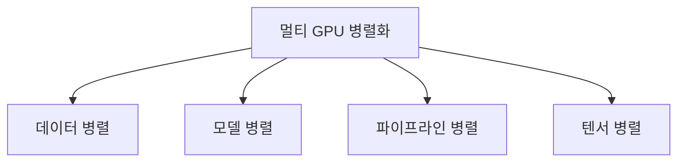

# 멀티 GPU 기술 (대규모 신경망 훈련)

## 1. 개요

### 가. 정의
> 여러 개의 GPU에 연산과 데이터를 **분산하여 대규모 신경망을 병렬로 훈련**하는 기술로, 단일 GPU의 메모리·연산 한계를 넘어서기 위한 분산학습(Distributed Training)의 핵심 기법.

멀티 GPU가 필요한 근본 이유는 두 가지다. 하나는 **모델이 한 GPU 메모리에 들어가지 않는 것**(예: 수백억~수천억 파라미터의 LLM)이고, 다른 하나는 **혼자서는 학습이 너무 오래 걸리는 것**이다. 앞의 문제는 모델을 쪼개는 방식(모델·텐서 병렬)으로, 뒤의 문제는 데이터를 쪼개 여러 GPU가 나눠 처리하는 방식(데이터 병렬)으로 접근하며, 실제 대규모 학습은 이들을 조합해 해결한다.

### 나. 장점 및 배경
GPT·LLaMA 같은 초거대 모델이 등장하면서 단일 GPU로는 학습 자체가 불가능해졌고, 이것이 멀티 GPU가 필수가 된 배경이다. 병렬화의 이점은 단순히 빠른 것만이 아니다. 여러 GPU의 메모리를 합쳐 **단일 GPU를 초과하는 대형 모델**을 담을 수 있고, GPU를 추가해 처리량을 **스케일아웃**할 수 있으며, 큰 배치로 학습해 수렴을 안정화할 수 있다. 다만 GPU를 N개 붙인다고 속도가 N배가 되지는 않는데, 뒤에서 볼 **통신 오버헤드** 때문이다. 이 손실을 얼마나 줄이느냐가 곧 확장 효율(scaling efficiency)이다.

| 장점 | 내용 |
|---|---|
| **학습 속도** | 병렬 연산으로 훈련 시간 단축 |
| **대규모 모델** | 여러 GPU 메모리를 합쳐 단일 GPU 초과 모델 학습 |
| **확장성** | GPU 추가로 처리량 스케일아웃 |
| **대용량 배치** | 큰 배치로 수렴 안정화 |

## 2. 병렬화 방식

병렬화 방식은 **"무엇을 쪼개는가"** 로 구분된다. **데이터 병렬(Data Parallelism)** 은 모델을 모든 GPU에 복제하고 배치(데이터)만 나눠 처리한 뒤, 각 GPU가 계산한 그래디언트를 **AllReduce**로 평균해 동기화한다. 구현이 쉬워 가장 널리 쓰이지만 모델이 GPU 하나에 들어가야 한다는 전제가 있다. 이 전제가 깨지면 **모델 병렬(Model Parallelism)** 로 모델 자체를 여러 GPU에 쪼개 얹는다. 모델 병렬은 다시 둘로 세분되는데, **파이프라인 병렬**은 레이어를 단계(스테이지)로 나눠 컨베이어벨트처럼 흘려보내고(단, 앞 단계가 끝나야 뒤가 시작되는 유휴 구간인 '버블'이 생김), **텐서 병렬**은 하나의 큰 행렬 연산 자체를 여러 GPU가 조각내 동시에 계산한다. 텐서 병렬은 연산 중간마다 통신이 잦아 GPU 간 대역폭이 매우 커야 하므로 보통 한 노드 안(NVLink)에서 쓴다.

| 방식 | 무엇을 쪼개나 | 설명 |
|---|---|---|
| **데이터 병렬** | 배치(데이터) | 모델 복제, 배치 분할 후 AllReduce로 그래디언트 동기화 |
| **모델 병렬** | 모델(파라미터) | 대형 모델을 여러 GPU에 분할 |
| **파이프라인 병렬** | 레이어(깊이) | 레이어를 단계로 나눠 파이프라인 처리(버블 존재) |
| **텐서 병렬** | 개별 연산(행렬) | 한 행렬 연산을 GPU 간 분할, 통신 빈번 |

## 3. 환경 구축 시 고려사항

멀티 GPU 환경의 성패를 가르는 것은 결국 **통신을 얼마나 줄이고 메모리를 얼마나 아끼느냐**다. GPU 수가 늘수록 그래디언트 동기화 통신량이 커져 병목이 되므로, GPU 간에는 NVLink, 노드 간에는 InfiniBand·RoCE 같은 초고속 인터커넥트와 NCCL 통신 라이브러리로 지연을 줄인다. 또 데이터 병렬은 모델을 GPU마다 복제하느라 메모리가 낭비되는데, 이를 옵티마이저 상태·그래디언트·파라미터를 GPU들에 분산 저장해 해결하는 것이 **ZeRO**다. 여기에 32비트 대신 16비트를 쓰는 **혼합정밀도(AMP)**, 순전파 중간값을 버렸다 재계산하는 **그래디언트 체크포인팅**으로 메모리를 더 아낀다. 배치가 커지면 학습이 불안정해지므로 학습률을 배치 크기에 맞춰 키우고(스케일링) 초반에 서서히 올리는 워밍업을 적용하며, 동기 SGD(정확하나 느린 GPU에 발목)와 비동기 SGD(빠르나 부정확) 사이의 선택도 고려한다.

| 고려사항 | 내용 |
|---|---|
| **통신 오버헤드** | 그래디언트 동기화 병목 → NVLink·NCCL·InfiniBand로 완화 |
| **부하 분산** | GPU 간 연산·메모리 균형(파이프라인 버블 최소화) |
| **배치·학습률** | 큰 배치 시 학습률 스케일링·워밍업 |
| **메모리 관리** | ZeRO·혼합정밀도(AMP)·그래디언트 체크포인팅 |
| **동기화 방식** | 동기(정확·느림) vs 비동기(빠름·부정확) SGD |
| **전력·냉각·비용** | 고밀도 GPU 발열·전력 관리, 인프라 비용 |

## 4. 관련 기술·프레임워크

이러한 병렬화·최적화는 대부분 성숙한 프레임워크로 추상화되어 있어 직접 구현할 필요가 적다. PyTorch의 **DDP**는 데이터 병렬을, **FSDP**와 마이크로소프트 **DeepSpeed(ZeRO)** 는 메모리 분산까지, NVIDIA **Megatron-LM**은 텐서·파이프라인 병렬을 제공한다. 그 아래에서 GPU 간 집합통신은 **NCCL**이, 하드웨어 계층은 NVLink/NVSwitch와 InfiniBand·RoCE가 담당한다.

| 구분 | 예 |
|---|---|
| **통신 라이브러리** | NCCL, MPI |
| **분산 프레임워크** | PyTorch DDP/FSDP, DeepSpeed(ZeRO), Megatron-LM |
| **인터커넥트** | NVLink/NVSwitch, InfiniBand, RoCE |

## 5. 고려사항 및 시사점(기술사 관점)
- **통신 최적화가 확장 효율의 관건**: GPU를 늘려도 통신 병목이 크면 선형 확장이 무너진다. 인터커넥트·통신 오버랩(연산과 통신 겹치기)이 스케일링 효율을 좌우한다.
- **3D 병렬의 조합**: 초거대 모델은 데이터+파이프라인+텐서 병렬을 함께 쓰는 **3D 병렬**로 학습하며, 각 병렬의 통신 특성에 맞춰 노드 내/노드 간 배치를 최적화한다. 예컨대 통신이 잦은 텐서 병렬은 NVLink로 묶인 노드 내에, 통신이 적은 데이터 병렬은 노드 간에 배치한다.
- **비용·전력 트레이드오프**: 고밀도 GPU 클러스터는 전력·냉각 비용이 크므로, 혼합정밀도·효율적 병렬 조합으로 목표 성능당 비용을 낮추는 설계가 중요하다.
- **AI 데이터센터로의 확장**: HBM·초고속 네트워크와 결합한 대규모 GPU 클러스터가 파운데이션 모델 시대의 핵심 인프라가 되고 있으며, 소프트웨어(프레임워크)와 하드웨어(인터커넥트)의 공동 최적화가 경쟁력을 결정한다.

---

> **한 줄 요약**: 멀티 GPU는 *데이터·모델·파이프라인·텐서 병렬* 로 무엇을 쪼갤지에 따라 대규모 신경망을 분산 훈련하며, GPU를 늘려도 손실이 적으려면 **통신 오버헤드·메모리(ZeRO/AMP)·동기화** 최적화와 NCCL·DDP·InfiniBand 등 인프라가 성능을 좌우한다.
