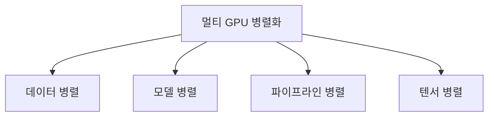

# 멀티 GPU 기술 (대규모 신경망 훈련)

## 1. 개요

### 가. 개념
> 여러 개의 GPU에 연산·데이터를 **분산하여 대규모 신경망을 병렬 훈련**하는 기술. 단일 GPU의 메모리·연산 한계를 극복한다.

### 나. 장점

| 장점 | 내용 |
|---|---|
| **학습 속도** | 병렬 연산으로 훈련 시간 단축 |
| **대규모 모델** | 단일 GPU 메모리 초과 모델 학습 |
| **확장성** | GPU 추가로 처리량 스케일아웃 |
| **대용량 배치** | 큰 배치로 수렴 효율 |

## 2. 병렬화 방식

| 방식 | 설명 |
|---|---|
| **데이터 병렬** | 모델 복제, 배치 분할(AllReduce로 그래디언트 동기화) |
| **모델 병렬** | 모델을 여러 GPU에 분할(대형 모델) |
| **파이프라인 병렬** | 레이어를 단계로 나눠 파이프라인 처리 |
| **텐서 병렬** | 연산(행렬)을 GPU 간 분할 |

## 3. 환경 구축 시 고려사항

| 고려사항 | 내용 |
|---|---|
| **통신 오버헤드** | 그래디언트 동기화 병목 → NVLink·NCCL·InfiniBand |
| **부하 분산** | GPU 간 연산·메모리 균형 |
| **배치·학습률** | 큰 배치 시 학습률 스케일링·워밍업 |
| **메모리 관리** | ZeRO·혼합정밀도(AMP)·그래디언트 체크포인팅 |
| **동기화 방식** | 동기(정확) vs 비동기(속도) SGD |
| **전력·냉각·비용** | 고밀도 GPU 발열·전력 관리 |

## 4. 관련 기술·프레임워크

| 구분 | 예 |
|---|---|
| **통신 라이브러리** | NCCL, MPI |
| **분산 프레임워크** | PyTorch DDP/FSDP, DeepSpeed(ZeRO), Megatron-LM |
| **인터커넥트** | NVLink/NVSwitch, InfiniBand, RoCE |

## 5. 고려사항 및 시사점
- **통신(인터커넥트) 최적화**가 확장 효율(스케일링 효율)의 관건
- 대규모는 데이터+모델+파이프라인 **3D 병렬** 혼합
- HBM·초고속 네트워크와 결합한 AI 데이터센터로 확장

---

> **한 줄 요약**: 멀티 GPU는 *데이터·모델·파이프라인·텐서 병렬* 로 대규모 신경망을 분산 훈련하며, *통신 오버헤드·부하분산·메모리·동기화* 최적화와 NCCL·DDP·InfiniBand 등이 성능의 핵심이다.
