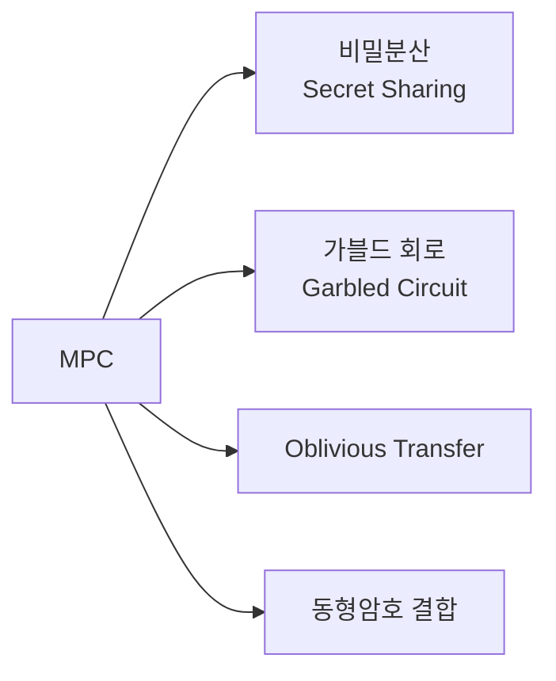
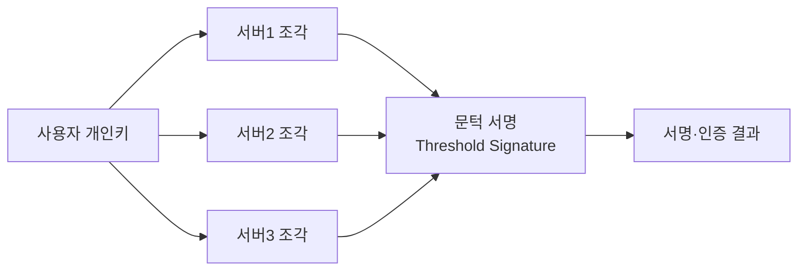

# 다자간 계산(MPC, Multi-Party Computation)

## 1. 개요

### 가. 개념
> 서로 신뢰하지 않는 **여러 참여자가 각자의 입력을 비공개로 유지**한 채, 공동으로 약속한 함수의 **결과값만 계산**해 얻는 암호 프로토콜. "입력은 감추고 결과만 공유".

### 나. 원리
- 입력을 **조각(Share)** 으로 분산해 참여자에게 나눠줌
- 조각 상태에서 연산(덧셈·곱셈)을 수행하고, 마지막에 결과만 복원
- 개별 조각으로는 원본 입력을 알 수 없음(정보이론적/암호학적 안전)

### 다. 특징·보안 모델

| 항목 | 내용 |
|---|---|
| **입력 프라이버시** | 타 참여자 입력 비공개 |
| **정확성** | 정직한 참여자는 올바른 결과 획득 |
| **담합 저항** | 임계치(t) 미만 담합엔 안전 |
| **보안 모델** | Semi-honest(정직-호기심), Malicious(악의적) |

## 2. MPC 기술 종류

| 기법 | 설명 | 대표 |
|---|---|---|
| **비밀분산(Secret Sharing)** | Shamir 임계 분산으로 입력 조각화 후 연산 | SPDZ, BGW |
| **가블드 회로(Garbled Circuit)** | 회로를 암호화해 2자간 안전 계산 | Yao's GC |
| **OT(Oblivious Transfer)** | 송신자가 무엇을 줬는지 모르는 선택적 전송 | GC의 기반 요소 |
| **동형암호 결합** | 암호문 상태 연산과 하이브리드 | FHE+MPC |

## 3. MPC 기반 인증 서비스

| 구분 | 내용 |
|---|---|
| **분산키 관리(DKG)** | 개인키를 단일 지점에 저장하지 않고 분산 생성·보관 |
| **문턱 서명(Threshold Signature)** | t/n 서버가 협력해야 서명 생성 → 단일 서버 유출에도 안전 |
| **활용** | 디지털 지갑(MPC Wallet), 분산 인증·PKI, 패스워드리스 인증 |

## 4. 고려사항 및 시사점
- **성능**: 통신·연산 오버헤드(특히 Malicious 모델) → 프로토콜 최적화 필요
- **PET(개인정보 보호강화기술)** 의 핵심 — 데이터 결합·공동분석에 활용
- 활용: 금융 사기탐지 공동분석, 의료 데이터 협업, **프라이버시 보존 AI**(연합학습 보완)
- 동형암호·차분프라이버시와 **상호 보완**해 데이터 활용과 보호를 양립

---

> **한 줄 요약**: MPC는 *여러 참여자가 입력을 비공개로 둔 채 결과만 공동 계산* 하는 기술로, 비밀분산·가블드 회로·OT로 구현하며, 개인키를 분산해 문턱 서명을 만드는 분산 인증·MPC 지갑에 활용된다.
