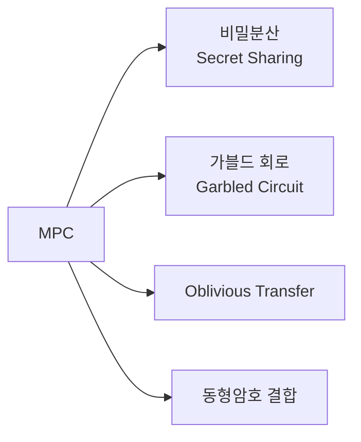
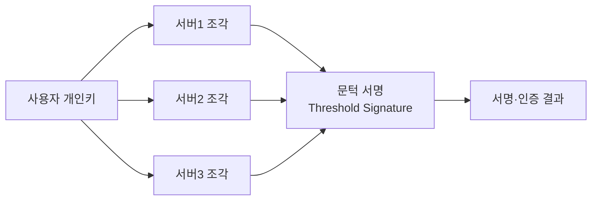

# 다자간 계산(MPC, Multi-Party Computation)

## 1. 개요

### 가. 정의
> 서로 신뢰하지 않는 **여러 참여자가 각자의 입력을 비공개로 유지**한 채, 사전에 약속한 함수의 **결과값만 공동으로 계산**해 얻는 암호 프로토콜. 한마디로 "입력은 감추고, 결과만 공유"한다.

MPC의 사고 실험은 흔히 "**백만장자 문제**"로 설명된다. 두 부자가 각자의 재산액을 상대에게 밝히지 않으면서 누가 더 부자인지만 알아내는 문제인데, 이처럼 원본 데이터를 제3자나 상대에게도 노출하지 않으면서 그 데이터에 대한 계산 결과만 얻어야 할 때 MPC가 쓰인다. 데이터를 한곳에 모아 계산하는 전통 방식과 달리, MPC는 **데이터를 모으지 않고도 함께 계산**한다는 점이 근본적으로 다르다.

### 나. 원리
핵심 아이디어는 입력을 **조각(Share)** 으로 쪼개어 분산하는 것이다. 참여자는 자기 입력을 여러 조각으로 나눠 서로에게 나눠 갖게 하는데, 개별 조각 하나만으로는 원본을 전혀 알 수 없도록 설계된다(예: 비밀 s를 무작위 r로 나눠 s−r과 r로 배분). 이후 참여자들은 **조각 상태 그대로 덧셈·곱셈 연산을 수행**하고, 마지막에 결과 조각들을 합쳐 최종 결과만 복원한다. 덧셈은 각자 조각을 더하기만 하면 되어 쉽고, 곱셈은 추가 통신(Beaver triple 등)이 필요해 비용이 크다—이 곱셈 비용이 MPC 성능의 핵심 변수다.

### 다. 특징·보안 모델
MPC의 안전성은 담합에 견디는 정도로 표현된다. **임계치(t)** 미만의 참여자가 조각을 모아도 원본을 복원할 수 없어야 하며, 보안 강도는 공격자 모델에 따라 갈린다.

| 항목 | 내용 |
|---|---|
| 입력 프라이버시 | 타 참여자의 입력을 알 수 없음 |
| 정확성 | 정직한 참여자는 올바른 결과를 얻음 |
| 담합 저항 | 임계치(t) 미만의 담합에는 안전 |
| 보안 모델 | Semi-honest(정직-호기심) vs Malicious(악의적) |

여기서 **Semi-honest** 모델은 참여자가 프로토콜은 정직히 따르되 오가는 정보로 남의 입력을 엿보려 한다고 가정하며 상대적으로 가볍다. 반면 **Malicious** 모델은 참여자가 프로토콜 자체를 어기고 조작한다고 가정하므로, 검증 절차가 추가되어 훨씬 무겁다. 이 가정의 차이가 곧 성능-보안 트레이드오프의 출발점이다.

## 2. MPC 기술 종류

MPC를 구현하는 기법은 계산을 어떻게 표현하느냐에 따라 나뉜다. **비밀분산**은 값을 여러 조각으로 나눠 산술 연산으로 다루는 방식으로 다자(n자) 계산과 대규모 수치 연산에 강하다. **가블드 회로**는 계산을 논리 회로로 표현한 뒤 회로 전체를 암호화해 2자 간에 안전하게 평가하는 방식이다. **OT**는 송신자가 여러 값 중 수신자가 어느 것을 가져갔는지 모르게 전달하는 기본 벽돌로, 가블드 회로의 토대가 된다. **동형암호 결합**은 암호문 상태 연산이 가능한 HE를 MPC와 섞어 통신량을 줄이는 하이브리드다.

| 기법 | 설명 | 대표 |
|---|---|---|
| 비밀분산(Secret Sharing) | Shamir 임계 분산으로 조각화 후 산술 연산 | SPDZ, BGW |
| 가블드 회로(Garbled Circuit) | 회로를 암호화해 2자 간 안전 계산 | Yao's GC |
| OT(Oblivious Transfer) | 무엇을 줬는지 모르는 선택적 전송 | GC의 기반 요소 |
| 동형암호 결합 | 암호문 연산과 하이브리드로 통신 절감 | FHE+MPC |

## 3. MPC 기반 인증 서비스

MPC의 대표적 실용 사례가 **키의 분산 관리**다. 전통적 인증에서는 개인키를 한곳에 저장하는데, 그 지점이 뚫리면 전부 털린다(단일 실패점). MPC 기반 인증은 개인키를 처음부터 **하나로 합쳐진 적 없는 조각들로 분산 생성(DKG)** 하고, 서명이 필요할 때 t/n 서버가 각자 조각으로 부분 계산에 협력해 **완전한 개인키를 어디서도 복원하지 않은 채** 서명을 만들어낸다(문턱 서명). 따라서 서버 한두 대가 유출돼도 임계치 미만이면 키는 안전하다.

| 구분 | 내용 |
|---|---|
| 분산키 생성(DKG) | 개인키를 단일 지점 없이 분산 생성·보관 |
| 문턱 서명(Threshold Signature) | t/n 서버가 협력해야 서명 → 단일 유출에도 안전 |
| 활용 | MPC 지갑(가상자산), 분산 인증·PKI, 패스워드리스 인증 |

예를 들어 가상자산 **MPC 지갑**은 개인키(seed) 자체를 저장하지 않으므로, 기존 하드웨어 지갑의 분실·탈취 위험을 구조적으로 낮춘다.

## 4. 고려사항 및 시사점
MPC의 가장 큰 실무 장벽은 **성능**이다. 곱셈마다 참여자 간 통신이 오가고 Malicious 모델에서는 검증 부담이 더해져, 계산·통신 오버헤드가 크다. 따라서 연산 회로 최적화와 전처리(오프라인 단계에서 무작위 조각 미리 생성)로 온라인 지연을 줄이는 것이 관건이다. 그럼에도 MPC는 **PET(개인정보 보호강화기술)** 의 핵심 축으로, 여러 기관이 원본을 공유하지 않고 공동 분석하는 시나리오—금융권 공동 **사기탐지**, 병원 간 **의료 데이터 협업**, 개인정보를 보호하며 학습하는 AI—에 쓰인다. 나아가 **동형암호·차분 프라이버시·연합학습**과 상호 보완되어, 데이터 활용과 보호를 양립시키는 방향으로 발전하고 있다.

---

> **한 줄 요약**: MPC는 *여러 참여자가 입력을 비공개로 둔 채 결과만 공동 계산* 하는 암호 기술로, 비밀분산·가블드 회로·OT로 구현하며, 개인키를 분산해 단일 실패점 없이 문턱 서명을 만드는 분산 인증·MPC 지갑과 프라이버시 보존 공동분석에 활용된다.
