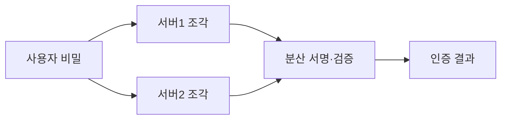

# 다자간 계산(MPC, Multi-Party Computation)

## 1. 개요

### 가. 개념·원리·특징
> 서로 신뢰하지 않는 **여러 참여자가 각자의 입력을 비공개로 유지**한 채, 공동으로 함수 결과만 계산하는 암호 프로토콜.

| 항목 | 내용 |
|---|---|
| **원리** | 입력을 조각(Share)으로 분산, 조각 상태로 연산 후 결과만 복원 |
| **특징** | 입력 프라이버시, 정확성, 담합 저항(임계치) |
| **보안 모델** | Semi-honest(정직-호기심), Malicious(악의) |

## 2. MPC 기술 종류

| 기법 | 설명 |
|---|---|
| **비밀분산(Secret Sharing)** | Shamir 등으로 입력을 조각화(예: SPDZ) |
| **가블드 회로(Garbled Circuit)** | Yao의 회로 암호화 방식(2자간) |
| **동형암호 기반** | 암호문 상태 연산과 결합 |
| **OT(Oblivious Transfer)** | 선택적 정보 전송 기반 요소 기술 |

## 3. MPC 기반 인증 서비스

- **분산키·문턱서명(Threshold Signature)**: 개인키를 여러 서버에 분산 → 단일 유출 시에도 안전(지갑·인증·PKI)

## 4. 시사점
- **PET**의 핵심 기술, 금융·의료 데이터 공동분석·프라이버시 보존 AI에 활용

---

> **한 줄 요약**: MPC는 *여러 참여자가 입력을 비공개로 둔 채 결과만 공동 계산* 하는 기술로, 비밀분산·가블드 회로 등으로 구현하며 문턱서명 기반 분산 인증에 활용된다.
