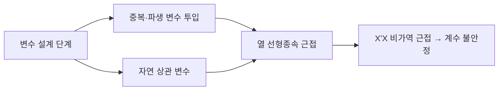

# 다중공선성(Multicollinearity)

## 1. 개요

### 가. 정의
> 다중회귀에서 **독립변수(설명변수)들 사이에 강한 선형 상관관계**가 존재하여, 개별 회귀계수의 추정이 불안정해지는 현상.

다중회귀는 각 독립변수가 종속변수에 미치는 "**순수한 고유 효과**"를 계수로 분리해 추정한다. 이 분리가 성립하려면 독립변수들이 서로 충분히 독립적이어야 한다. 그런데 두 변수가 거의 같은 방향으로 움직이면, 회귀식은 "종속변수의 변화를 A가 설명한 것인지 B가 설명한 것인지" 구분할 근거를 잃는다. 수학적으로는 설계행렬 X의 열들이 선형종속에 가까워져 X'X가 **특이행렬(비가역)에 근접**하고, 그 역행렬 원소가 폭발하면서 계수 추정치가 요동친다. 즉 다중공선성은 데이터 자체의 오류가 아니라 **변수 구조에서 비롯되는 식별(identification) 문제**다.

### 나. 문제점 및 필요성
다중공선성이 심하면 계수의 **표준오차가 커져(분산 팽창)** t검정이 유의하지 않게 나오고, 심지어 이론과 반대되는 **부호로 뒤집히거나 비현실적으로 큰 값**이 추정된다. 예컨대 소득과 소비를 함께 넣으면 둘의 계수가 서로 상쇄되며 부호가 흔들린다. 흥미로운 점은 이런 상황에서도 **모형 전체의 예측력(R²)은 유지될 수 있다**는 것이다. 이는 개별 변수의 기여를 나누지 못할 뿐, 두 변수가 합쳐 만드는 예측은 여전히 유효하기 때문이다. 따라서 "변수의 영향을 해석·추론"하려는 목적에서는 반드시 처리해야 하지만, "예측만"이 목적이면 방치해도 무방한 경우가 있다. 이 목적 구분이 대응 전략의 출발점이다.

## 2. 발생 원인

원인은 크게 세 갈래다. 첫째, 같은 정보를 단위만 바꿔 넣는 **중복 변수**(키를 cm와 inch로 동시 투입)는 완전 상관이므로 가장 심각하다. 둘째, 기존 변수로부터 만든 **파생·합성 변수**(합계·비율)는 원 변수와 구조적으로 얽힌다. 셋째, 데이터 세계 자체의 **자연 상관**(소득-소비, 주택 면적-방 개수)은 제거하기 어려워 실무에서 가장 흔하다. 아래 표는 유형별 예시다.

| 원인 | 예 | 성격 |
|---|---|---|
| **중복 변수** | 키(cm)와 키(inch) 동시 투입 | 완전 공선성(제거로 해결) |
| **파생·합성 변수** | 합계·비율 변수 | 구조적 종속 |
| **자연 상관** | 소득-소비, 면적-방 개수 | 근사 공선성(판단 필요) |

## 3. 진단 방법

진단의 핵심은 "어떤 변수가 다른 변수들의 조합으로 얼마나 잘 설명되는가"를 계량하는 것이다. 그 대표 지표가 **VIF(분산팽창계수)** 로, i번째 변수를 나머지 변수들로 회귀했을 때의 결정계수 Rᵢ²에 대해 VIFᵢ = 1/(1−Rᵢ²)로 정의된다. Rᵢ²가 0.9면 VIF=10이 되며, 이는 그 변수의 계수 분산이 공선성 없을 때보다 10배 팽창했다는 뜻이다. 상관행렬은 두 변수 쌍만 보므로, 셋 이상이 얽힌 공선성은 놓칠 수 있어 VIF·조건지수로 보완한다.

| 방법 | 판단 기준 | 원리 |
|---|---|---|
| **상관계수** | 독립변수 간 상관 ±0.8↑ | 쌍별 선형관계만 포착 |
| **VIF/공차** | VIF ≥ 10(엄격 5), 공차=1/VIF | 한 변수를 나머지로 설명한 정도 |
| **조건지수** | 30↑ 시 심각 | X'X 고유값 최대/최소 비의 제곱근 |

## 4. 해결 방안

해결은 목적과 원인에 따라 달라진다. 해석이 중요하면 **변수 제거**가 가장 직접적이지만, 도메인상 필요한 변수를 없애면 편향(누락변수 편의)이 생길 수 있어 신중해야 한다. 정보 손실을 피하려면 상관된 변수들을 **주성분분석(PCA)** 으로 무상관 성분으로 재구성한다. 다만 이때 축은 해석력이 떨어진다. 예측이 목적이면 계수를 0 쪽으로 수축시키는 **정규화 회귀**가 실용적이다. Ridge(L2)는 공선성 하에서도 계수 분산을 낮춰 안정화하고, Lasso(L1)는 상관 변수 중 일부 계수를 0으로 만들어 자동 선택 효과를 낸다.

| 방안 | 내용 | 적합 상황 |
|---|---|---|
| **변수 제거** | 상관 높은 변수 중 하나 제거 | 중복·해석 목적 |
| **차원축소** | PCA·요인분석으로 성분화 | 정보 보존·다수 상관 |
| **정규화 회귀** | Ridge(L2)·Lasso(L1) | 예측 목적·계수 안정화 |
| **데이터 보강** | 표본 확대, 중심화(centering) | 표본 부족·교호작용항 |

## 5. 고려사항 및 시사점
기술사 관점에서 다중공선성은 "통계적 결함"이 아니라 **분석 목적에 따른 선택 문제**로 접근해야 한다. 예측 정확도만 필요한 서비스(추천·수요예측)라면 공선성을 허용하고 정규화로 관리하는 것이 합리적이지만, 정책·인과 해석이 필요한 분석(요인 효과 규명)에서는 반드시 제거·재구성한다. 머신러닝에서는 트리 기반 모형이 공선성에 상대적으로 둔감하고, 규제(Regularization)와 특성 선택이 자연스러운 방어선이 된다. 궁극적으로는 사후 처방보다 **도메인 지식 기반의 변수 설계로 사전 예방**하는 것이 가장 효과적이며, 이는 데이터 거버넌스·피처 스토어 표준화와도 연결된다.

---

> **한 줄 요약**: 다중공선성은 *독립변수 간 강한 선형 상관으로 X'X가 비가역에 근접해 회귀계수 추정이 불안정* 해지는 식별 문제로, VIF(≥10)·조건지수로 진단하고 목적에 따라 변수 제거·PCA·Ridge/Lasso로 해결한다.
