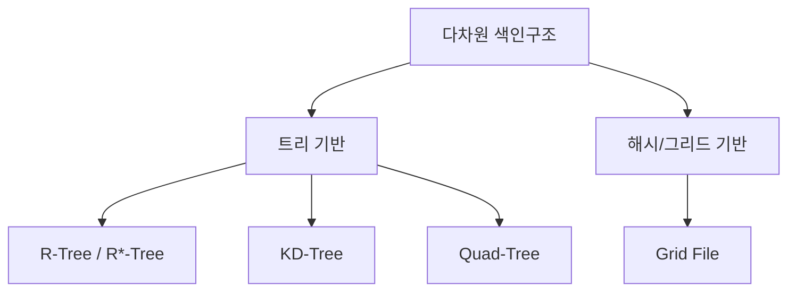

# 다차원 색인구조(Multidimensional Index Structure)

## 1. 개요

### 가. 정의
> 위치·공간·다속성처럼 **2차원 이상의 다차원 데이터를 효율적으로 검색**하기 위한 색인 구조. 범위 질의, 최근접 이웃(NN) 질의, 공간 포함·중첩 질의를 빠르게 처리한다.

### 나. 등장 배경 및 필요성
B-Tree 같은 전통 색인은 값을 하나의 축(1차원)으로 정렬해 대소 비교로 탐색하기 때문에, "위도·경도가 모두 특정 범위인 지점 찾기"처럼 **여러 축을 동시에 만족**해야 하는 질의에는 근본적으로 부적합하다. 두 개의 1차원 색인을 각각 걸어도 한쪽 축으로 좁힌 뒤 나머지는 전수 검사해야 해 비효율적이다. 공간 데이터는 애초에 "가깝다/포함한다"라는 관계가 다차원 좌표의 근접성으로 정의되므로, 이 근접성 자체를 반영해 **공간을 계층적으로 분할·군집화**하는 색인이 필요하다. 지도 서비스, 이미지 특징벡터 검색, AI 임베딩 검색이 폭증하면서 다차원 색인은 필수 인프라가 됐다.

## 2. 유형

색인 구조는 공간을 나누는 방식에 따라 나뉜다. **R-Tree/R*-Tree**는 객체들을 감싸는 **최소경계사각형(MBR)** 을 계층적으로 묶어 트리를 만들며, 질의 영역과 겹치는 MBR만 따라 내려가 탐색 범위를 줄인다. 면적을 가진 공간 객체(건물·도로)와 범위 질의에 강해 공간DB의 사실상 표준이지만, MBR이 서로 겹치면 성능이 떨어져 R*-Tree가 이 겹침을 최소화하도록 개선했다. **KD-Tree**는 축을 번갈아 가며 공간을 이진 분할하는 구조로 점 데이터의 NN 검색에 효율적이나, 차원이 높아지면 분할 효과가 급감한다. **Quad-Tree**는 2D 공간을 네 사분면으로 재귀 분할해 지도·영상처럼 데이터가 희소·불균등한 경우 유리하다. **Grid File**은 공간을 격자 버킷으로 나눠 균등 분포 데이터에서 상수 시간 접근에 가깝다.

| 유형 | 분할 방식 | 특징·적합 |
|---|---|---|
| **R-Tree/R*-Tree** | MBR 계층 묶음 | 공간 객체·범위 질의, 공간DB 표준 |
| **KD-Tree** | 축 교대 이진분할 | 점 데이터·NN, 고차원서 성능 저하 |
| **Quad-Tree** | 사분면 재귀 분할 | 2D 영상·지도, 희소 데이터 |
| **Grid File** | 다차원 격자 버킷 | 균등 분포 데이터에 효율 |

## 3. 선택 기준

어떤 구조가 최적인지는 데이터와 질의의 성격에 달려 있고, 잘못 고르면 색인이 오히려 부담이 된다. **데이터 유형**이 좌표만 가진 점이면 KD-Tree가, 면적·부피를 가진 영역 객체면 MBR 기반 R-Tree가 자연스럽다. **질의 유형**이 범위 질의냐, 최근접 이웃이냐, 공간 포함이냐에 따라 유리한 구조가 갈린다. **차원 수**가 특히 중요한데, 수십~수백 차원을 넘어가면 뒤에 설명할 차원의 저주로 트리 색인이 무력화되어 근사(ANN)로 방향을 틀어야 한다. **데이터 분포**가 균등하면 Grid File이, 편중돼 있으면 밀도에 적응하는 트리 구조가 낫다.

| 기준 | 고려 |
|---|---|
| **데이터 유형** | 점(KD) vs 영역/객체(R-Tree) |
| **질의 유형** | 범위·NN·공간 포함 |
| **차원 수** | 고차원은 근사(ANN) 고려 |
| **분포** | 균등(Grid) vs 편중(트리) |

## 4. 활용 사례

다차원 색인은 "가까운 것을 빨리 찾는" 모든 서비스의 밑단에 있다. **공간DB·GIS**에서는 "내 주변 1km 식당"이나 "이 행정구역에 포함된 건물"을 R-Tree로 즉시 찾는다. **멀티미디어** 검색에서는 이미지를 특징벡터로 바꾼 뒤 유사 이미지를 NN으로 찾고, **OLAP**에서는 다차원 큐브의 범위 집계를 가속한다. 특히 오늘날 가장 큰 응용은 **AI 벡터 검색**으로, 텍스트·이미지를 고차원 임베딩으로 바꿔 의미가 비슷한 항목을 근사최근접(ANN)으로 검색하는 것이며 이것이 RAG·추천 시스템의 핵심이다.

| 분야 | 활용 |
|---|---|
| **공간DB·GIS** | 주변 검색·영역 질의(위치 서비스) |
| **멀티미디어** | 이미지·특징벡터 유사도(NN) 검색 |
| **OLAP** | 다차원 큐브 범위 집계 |
| **AI 벡터 검색** | 고차원 임베딩 근사최근접(ANN) 기반 |

## 5. 고려사항 및 시사점
- **차원의 저주(Curse of Dimensionality)**: 차원이 커질수록 모든 점이 서로 비슷하게 멀어져 "가깝다"는 개념이 무의미해지고, 트리의 가지치기 효과가 사라진다. 따라서 고차원에서는 PCA 등 차원 축소를 병행하거나, 정확도를 약간 포기하고 속도를 얻는 **근사최근접(ANN)** 으로 전환한다.
- **분포·질의 적합성이 성능을 좌우**: 동일 데이터도 구조 선택에 따라 수십 배 성능 차가 나므로, 데이터 분포와 주 질의 패턴을 먼저 분석해 색인을 결정해야 한다.
- **벡터 검색으로의 진화**: 전통 트리 색인은 **HNSW(그래프 기반)·IVF(군집 기반)** 같은 ANN 알고리즘으로 발전했으며, 이들이 RAG·추천·시맨틱 검색을 떠받치는 핵심 인프라가 되었다.

---

> **한 줄 요약**: 다차원 색인구조는 *R-Tree·KD-Tree·Quad-Tree·Grid File* 등으로 공간을 계층 분할해 다차원 데이터의 범위·NN 질의를 가속하며, 데이터·질의 유형과 차원 수에 맞게 선택하고 차원의 저주 때문에 고차원에서는 HNSW·IVF 같은 벡터 검색(ANN)으로 진화한다.
