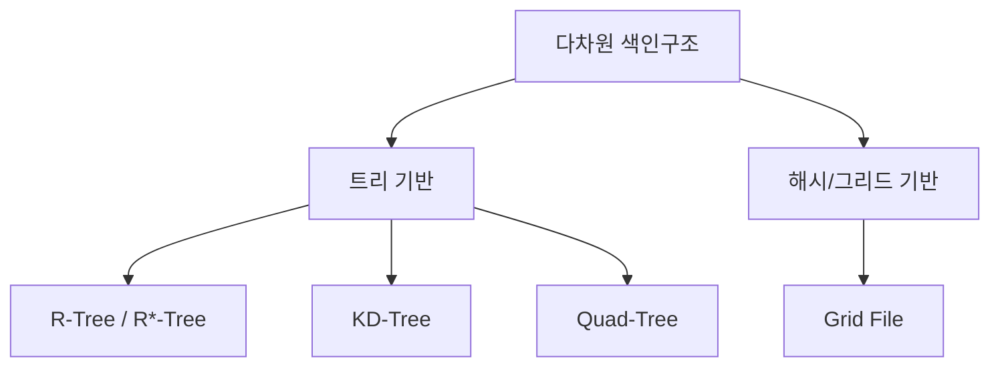

# 다차원 색인구조(Multidimensional Index Structure)

## 1. 개요

### 가. 정의
> 위치·공간·다속성 등 **2차원 이상의 다차원 데이터를 효율적으로 검색**하기 위한 색인 구조. 범위 질의·최근접 이웃(NN)·공간 질의를 빠르게 처리한다.

### 나. 필요성
- B-Tree 등 1차원 색인은 **다차원 범위·공간 질의에 비효율**
- 공간DB·이미지·위치 서비스·벡터 검색의 급증

## 2. 유형

| 유형 | 방식 | 특징 |
|---|---|---|
| **R-Tree/R*-Tree** | 최소경계사각형(MBR) 계층 | 공간 객체·범위 질의, 공간DB 표준 |
| **KD-Tree** | 축을 번갈아 이진 공간분할 | 점 데이터·NN, 고차원서 성능 저하 |
| **Quad-Tree** | 공간을 사분면 재귀 분할 | 2D 영상·지도, 희소 데이터 |
| **Grid File** | 다차원 격자 버킷 분할 | 균등 분포 데이터에 효율 |

## 3. 선택 기준

| 기준 | 고려 |
|---|---|
| **데이터 유형** | 점(KD) vs 영역/객체(R-Tree) |
| **질의 유형** | 범위·NN·공간 포함 |
| **차원 수** | 고차원은 근사(ANN) 고려 |
| **분포** | 균등(Grid) vs 편중(트리) |

## 4. 활용 사례

| 분야 | 활용 |
|---|---|
| **공간DB·GIS** | 지도·위치 기반 서비스(주변 검색, 영역 질의) |
| **멀티미디어** | 이미지·특징벡터 유사도(NN) 검색 |
| **OLAP** | 다차원 큐브 범위 집계 |
| **AI 벡터 검색** | 고차원 임베딩 근사최근접(ANN)의 기반 |

## 5. 고려사항 및 시사점
- **차원의 저주**: 고차원일수록 성능 저하 → 차원 축소·근사(ANN) 병행
- 데이터 분포·질의 유형에 맞는 구조 선택이 성능 좌우
- 벡터 검색(HNSW·IVF)으로 진화 — RAG·추천의 핵심 인프라

---

> **한 줄 요약**: 다차원 색인구조는 *R-Tree·KD-Tree·Quad-Tree·Grid File* 등으로 다차원·공간 데이터의 범위·NN 질의를 가속하며, 데이터·질의 유형에 맞게 선택하고 벡터 검색(ANN)으로 진화한다.
