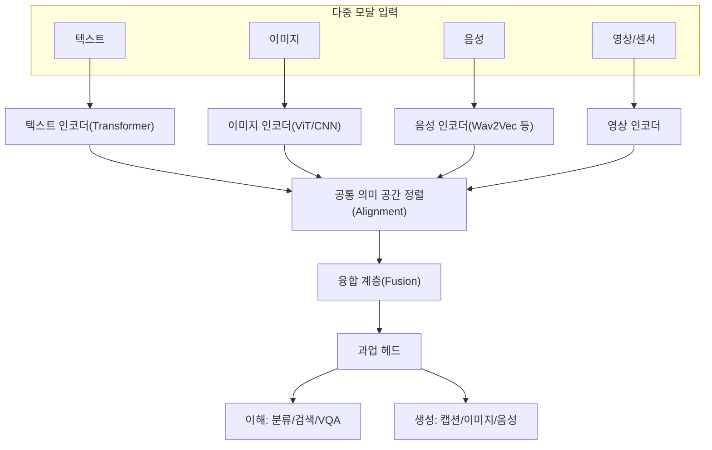
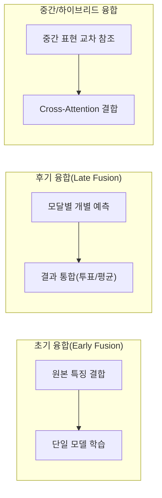

# 멀티모달 AI(Multimodal AI)

## 1. 개요

> **정의**: 멀티모달 AI(Multimodal AI)는 텍스트·이미지·음성·영상·센서 신호 등 **서로 다른 형태(Modality)의 데이터를 동시에 입력·처리·융합**하여 단일 모달만으로는 얻기 어려운 통합적 이해와 생성 능력을 확보하는 인공지능 기술이다. 각 모달의 표현을 **공통 의미 공간(Joint Embedding Space)**으로 정렬(Align)하고 결합(Fuse)하는 것이 핵심 원리다.

멀티모달 AI가 부상한 배경은 인간 인지의 본질과 맞닿아 있다. 사람은 언어만으로 세상을 이해하지 않는다. "고양이가 소파에서 잔다"는 문장을 이해할 때, 우리는 고양이의 시각적 형상, 야옹 소리, 부드러운 촉감의 기억을 함께 동원한다. 즉 인간의 개념(Concept)은 본질적으로 **여러 감각의 결합**으로 형성되며, 따라서 텍스트만 학습한 언어모델은 물리 세계에 대한 접지(Grounding)가 결여된 반쪽짜리 지능이라는 한계를 가진다. 멀티모달 AI는 이 간극을 메워 AI를 **현실 세계에 접지된 지능**으로 확장하려는 시도다.

두 번째 동인은 **거대언어모델(LLM)의 발전과 데이터의 한계**다. 텍스트 코퍼스는 이미 상당 부분 학습에 소진되어 순수 언어 데이터만으로는 성능 향상이 둔화되고 있다. 반면 이미지·영상·음성은 인터넷상에 방대하게 존재하며 언어가 담지 못하는 공간적·시간적·감성적 정보를 품고 있다. 서로 다른 모달이 상호 보완적(Complementary) 정보를 제공하므로, 이들을 결합하면 개별 모달의 약점을 보완하고 잡음(Noise)에 강건한 예측이 가능해진다. 예컨대 소음이 심한 환경에서 음성 인식률이 떨어져도 입술 움직임(영상)을 함께 보면 인식 정확도를 회복할 수 있다.

세 번째 동인은 **응용 요구**다. 자율주행은 카메라·라이다·레이더를 융합해야 하고, 의료 진단은 영상(CT·MRI)·수치(혈액검사)·텍스트(판독소견)를 종합해야 하며, 로봇은 시각과 언어 지시를 함께 이해해야 행동할 수 있다. GPT-4o, Gemini, Claude 등 최신 파운데이션 모델이 텍스트·이미지·음성을 하나의 모델에서 처리하는 방향으로 수렴하는 것은 이러한 실무 요구의 반영이다. 답안에서는 멀티모달 AI를 단순한 기능 확장이 아니라 **"AGI(범용 인공지능)로 가는 필수 경로이자 파운데이션 모델의 표준 형태"**로 규정하는 것이 타당하다.

## 2. 멀티모달 AI의 전체 구조

멀티모달 AI는 각 모달을 독립적으로 인코딩한 뒤 공통 표현 공간으로 정렬하고, 이를 융합하여 최종 과업(이해·생성)을 수행하는 계층적 구조를 가진다. 아래 개념도는 입력부터 출력까지의 전체 골격을 나타낸다.

이 구조에서 가장 어려운 문제는 **모달 간 이질성(Heterogeneity Gap)**이다. 텍스트는 이산적(Discrete) 토큰 시퀀스이고 이미지는 연속적(Continuous) 픽셀 격자이며 음성은 시간 축의 파형이다. 데이터의 차원·분포·의미 밀도가 모두 다르므로, 이를 하나의 벡터 공간에서 비교 가능하게 만드는 **정렬(Alignment)**이 멀티모달의 기술적 핵심이 된다. 정렬이 잘 되면 "강아지 사진"과 "a photo of a dog"라는 텍스트가 임베딩 공간에서 가까운 위치에 놓이게 되어, 텍스트로 이미지를 검색하거나 이미지를 언어로 설명하는 교차 모달(Cross-modal) 과업이 가능해진다.

정렬의 대표 사례가 OpenAI의 **CLIP(Contrastive Language-Image Pre-training)**이다. CLIP은 4억 쌍의 (이미지, 텍스트) 데이터를 대조학습(Contrastive Learning)으로 훈련하여, 짝이 맞는 이미지-텍스트 쌍의 임베딩은 가깝게, 아닌 쌍은 멀게 배치한다. 이렇게 학습된 공통 공간 덕분에 CLIP은 별도 재학습 없이도 임의의 라벨 집합에 대해 **제로샷(Zero-shot) 분류**를 수행할 수 있으며, 이후 Stable Diffusion·DALL-E 등 생성 모델의 텍스트 조건부여 백본으로 널리 활용되었다.

## 3. 모달 융합(Fusion) 전략의 유형과 절차

여러 모달의 정보를 언제, 어떻게 결합하느냐에 따라 성능과 계산 비용이 크게 달라진다. 융합 시점을 기준으로 초기·후기·중간(하이브리드) 융합으로 구분하는 것이 일반적이며, 아래 다이어그램은 세 방식의 데이터 흐름 차이를 보여준다.

**초기 융합(Early Fusion)**은 각 모달의 원본 특징(Feature)을 입력 단계에서 하나로 이어 붙여(Concatenation) 단일 모델로 학습하는 방식이다. 모달 간 저수준 상호작용을 초기부터 학습할 수 있어 세밀한 상관관계 포착에 유리하지만, 차원이 급증하고 한 모달이 결측(Missing)되면 전체가 취약해지는 단점이 있다. **후기 융합(Late Fusion)**은 모달별로 독립적인 모델이 각자 예측을 낸 뒤 그 결과를 투표·가중평균으로 통합하는 방식으로, 모듈성이 높고 결측에 강건하지만 모달 간 상호작용을 학습하지 못한다. 이 둘의 절충이 **중간/하이브리드 융합**이며, 트랜스포머의 **교차 어텐션(Cross-Attention)**을 이용해 한 모달의 표현이 다른 모달의 표현을 참조하도록 하는 방식이 현대 멀티모달 모델의 주류가 되었다. 예를 들어 이미지-텍스트 질의응답(VQA)에서 텍스트 질문 토큰이 이미지 패치들을 어텐션으로 조회하여 답을 찾는 구조가 이에 해당한다.

실제 대규모 멀티모달 LLM(MLLM)의 처리 절차는 다음과 같다. ① 이미지를 ViT(Vision Transformer)로 인코딩해 시각 토큰 시퀀스를 얻는다. ② **정렬 모듈(예: Q-Former, MLP Projector)**이 시각 토큰을 언어모델이 이해할 수 있는 임베딩 공간으로 사영(Projection)한다. ③ 사영된 시각 토큰을 텍스트 토큰과 함께 하나의 시퀀스로 연결해 LLM에 입력한다. ④ LLM이 통합 시퀀스에 대해 자기회귀(Autoregressive)로 응답을 생성한다. 이 방식은 이미 잘 학습된 언어모델의 추론 능력을 그대로 활용하면서 시각 이해를 얹는 것으로, 학습 효율이 높아 LLaVA·BLIP-2·Flamingo 등 다수 모델이 채택하고 있다.

## 4. 주요 응용과 대표 모델 비교

멀티모달 AI의 과업은 크게 **교차 모달 이해(Understanding)**와 **교차 모달 생성(Generation)**으로 나뉜다. 이해 과업에는 이미지 캡셔닝, 시각 질의응답(VQA), 텍스트-이미지 검색, 문서 이해(OCR+레이아웃)가 있고, 생성 과업에는 텍스트→이미지(DALL-E, Stable Diffusion), 텍스트→영상(Sora), 텍스트→음성(TTS), 이미지→텍스트(캡션)가 있다. 아래 표는 대표 기술의 특성을 비교하되, 각 모델이 서로 다른 설계 철학을 택한 이유를 함께 이해하는 것이 중요하다.

| 모델/기술 | 모달 조합 | 핵심 기법 | 특징 |
|---|---|---|---|
| CLIP | 이미지↔텍스트 | 대조학습, 공통 임베딩 | 제로샷 분류, 검색 백본 |
| Stable Diffusion | 텍스트→이미지 | 잠재확산(Latent Diffusion) | 텍스트 조건부 이미지 생성 |
| BLIP-2 / LLaVA | 이미지+텍스트 | Q-Former/사영+LLM | 시각 대화·VQA, 학습 효율 |
| GPT-4o / Gemini | 텍스트·이미지·음성 | 통합 파운데이션 모델 | 실시간 멀티모달 대화 |

CLIP이 **대조학습으로 정렬 공간을 만드는 데** 집중했다면, Stable Diffusion은 그 정렬 공간을 **생성의 조건(Condition)**으로 활용한다. 즉 텍스트 임베딩이 확산 과정의 방향을 안내하여 원하는 이미지를 만들어낸다. 이는 이해와 생성이 별개가 아니라 **같은 공통 표현 공간을 공유**함을 보여주는 사례다. 한편 GPT-4o처럼 하나의 모델이 여러 모달을 네이티브(Native)로 처리하는 통합형은, 모달별 인코더를 따로 두고 사후 결합하던 이전 세대와 달리 입력 단계부터 여러 모달 토큰을 함께 다루어 지연(Latency)을 줄이고 음성 대화의 감정·억양까지 반영한다.

구체적 성과 사례로, 의료 영상 분야에서는 흉부 X선 영상과 판독 소견 텍스트를 함께 학습한 멀티모달 모델이 단일 영상 모델 대비 진단 보조 성능을 개선한 연구가 다수 보고되었다. 자율주행에서는 Tesla·Waymo가 카메라·레이더·라이다를 융합해 단일 센서의 사각(악천후 시 카메라 저하, 근거리 레이더 한계)을 상호 보완한다. 이러한 사례들은 멀티모달의 본질적 가치가 **모달 간 상호 보완을 통한 강건성(Robustness) 확보**에 있음을 실증한다.

## 5. 심화: 최신 동향과 과제

최근 멀티모달 AI는 **네이티브 멀티모달(Any-to-Any) 파운데이션 모델**로 진화하고 있다. 초기에는 사전학습된 비전 인코더와 언어모델을 사후에 연결(Bridging)했으나, 최신 모델은 처음부터 여러 모달을 통합 토큰으로 학습하여 모달 경계를 허문다. 나아가 텍스트·이미지·음성뿐 아니라 **행동(Action)**까지 다루는 **Vision-Language-Action(VLA)** 모델이 로보틱스에 적용되어, 언어 지시와 시각 인지를 로봇 제어 신호로 직접 변환하는 **구체화된 지능(Embodied AI)** 연구가 활발하다.

동시에 해결해야 할 과제도 뚜렷하다. 첫째, **모달 편향(Modality Bias)** — 학습이 특정 모달(주로 텍스트)에 치우쳐 시각 정보를 충분히 활용하지 못하는 현상이 있다. 둘째, **환각(Hallucination)** — 이미지에 없는 객체를 있다고 답하는 등 시각적 근거 없이 언어 사전지식에 의존하는 오류가 멀티모달에서도 나타난다. 셋째, **정렬 데이터 확보와 계산 비용** — 고품질 (이미지, 텍스트) 쌍 구축과 대규모 대조학습에는 막대한 자원이 필요하다. 넷째, **평가의 어려움** — 생성 결과의 품질과 모달 간 일관성을 정량 평가하는 표준 지표가 아직 미성숙하다. 이들은 답안에서 멀티모달의 한계와 향후 연구 방향으로 제시하기 좋은 논점이다.

## 6. 고려사항 및 시사점

기술사 관점에서 멀티모달 AI 도입·활용 시 고려할 전략과 시사점은 다음과 같다.

- **적용 전략 — 과업 특성에 맞는 융합 방식 선택**: 모달 간 저수준 상관이 중요하면(입술-음성 동기화) 초기·교차 융합을, 모달이 독립적이고 결측이 잦으면 후기 융합을 택한다. 무조건 통합형 대형 모델이 정답은 아니며, 비용·지연·데이터 가용성을 함께 고려한 설계가 필요하다.
- **트레이드오프 — 성능 대 자원**: 네이티브 멀티모달 모델은 강력하지만 학습·추론 비용이 크다. 실무에서는 CLIP 같은 경량 정렬 모델 + 검색, 또는 사전학습 인코더를 재사용하는 사영 방식으로 비용을 절감하고, 온디바이스 환경에서는 경량 멀티모달(sMLLM)을 검토한다.
- **신뢰성·안전 — 환각과 근거 제시**: 의료·자율주행 등 고위험 영역에서는 멀티모달 환각을 통제하기 위해 시각적 근거를 함께 제시(Grounding)하고, XAI·Human-in-the-loop 검증 절차를 병행해야 한다. 잘못된 교차 모달 판단은 물리적 피해로 직결될 수 있다.
- **데이터·거버넌스 — 편향과 저작권**: 대규모 이미지-텍스트 쌍은 저작권·개인정보·사회적 편향을 내포하므로, 학습 데이터의 출처 관리와 편향 완화, 생성물의 저작권·딥페이크 악용 대응 등 AI 거버넌스 체계를 함께 갖춰야 한다.
- **전망 — AGI로의 경로와 표준화**: 멀티모달은 파운데이션 모델의 표준 형태로 수렴하고 있으며, VLA·Embodied AI로 확장되어 물리 세계와 상호작용하는 지능으로 발전할 전망이다. 조직은 데이터 자산을 모달 교차적으로 통합·정렬할 수 있는 데이터 파이프라인과 평가 체계를 선제적으로 준비하는 것이 바람직하다.

## 참고자료

- Radford et al., "Learning Transferable Visual Models From Natural Language Supervision (CLIP)", 2021 — https://arxiv.org/abs/2103.00020
- Li et al., "BLIP-2: Bootstrapping Language-Image Pre-training", 2023 — https://arxiv.org/abs/2301.12597
- Liu et al., "Visual Instruction Tuning (LLaVA)", 2023 — https://arxiv.org/abs/2304.08485

---
> **한 줄 요약**: 멀티모달 AI는 텍스트·이미지·음성 등 이질적 모달을 공통 의미 공간으로 정렬·융합하여 상호 보완적 이해와 생성을 실현하는 기술로, CLIP의 대조학습 정렬과 교차 어텐션 융합을 기반으로 파운데이션 모델의 표준 형태이자 AGI·구체화 지능으로 가는 핵심 경로다.
