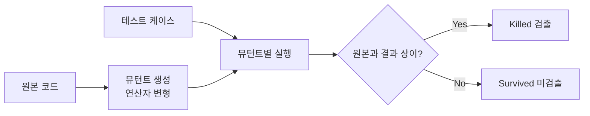

# 뮤테이션 테스트(Mutation Test)

## 1. 개요

### 가. 정의
> 프로그램 소스에 **인위적 결함(뮤턴트, Mutant)을 주입**한 뒤, 기존 테스트 스위트가 그 결함을 **검출(Kill)** 하는지를 측정하여, 테스트 케이스 자체의 **결함 검출력(효과성)** 을 정량 평가하는 화이트박스 기법.

일반적인 테스트가 "프로그램이 올바른가"를 묻는다면, 뮤테이션 테스트는 방향을 뒤집어 "**테스트가 충분히 엄격한가**"를 묻는다. 즉 검증의 대상이 제품 코드가 아니라 **테스트 자체**라는 점이 본질이다. 뮤턴트는 개발자가 흔히 저지르는 실수(부호 바꿈, 비교 연산자 오류 등)를 흉내 낸 것이며, 좋은 테스트라면 이런 미세한 변형을 반드시 잡아내야 한다는 가정에 기반한다.

### 나. 등장 배경 및 필요성
현장에서 테스트 품질의 지표로 널리 쓰이는 **코드 커버리지**에는 근본적 맹점이 있다. 커버리지는 "그 코드 라인이 실행되었는가"만 볼 뿐, "실행 결과가 올바른지 **단언(assert)** 했는가"는 보지 않는다. 그래서 단언문이 하나도 없는 텅 빈 테스트도 커버리지 100%를 달성할 수 있다. 이렇게 커버리지 수치는 높지만 실제로는 아무 결함도 못 잡는 **가짜 안전감**을 걷어내기 위해, 실제 결함(뮤턴트)을 심어 테스트가 그것을 잡는지 검증하는 방식이 필요했다. 이것이 뮤테이션 테스트가 커버리지의 한계를 보완하는 지점이다.

## 2. 동작 원리

동작의 핵심 논리는 다음과 같다. 원본 코드를 한 군데씩 변형한 여러 개의 뮤턴트를 만들고, **각 뮤턴트에 대해 기존 테스트 전체를 돌린다.** 만약 어떤 뮤턴트에서 테스트가 실패한다면, 그 테스트는 해당 결함을 감지할 능력이 있다는 뜻이므로 뮤턴트를 "**죽였다(Killed)**"고 본다. 반대로 뮤턴트를 심었는데도 모든 테스트가 여전히 통과한다면, 그 결함을 아무도 못 잡은 것이므로 뮤턴트가 "**살아남았다(Survived)**"—즉 테스트에 구멍이 있다는 신호다. 살아남은 뮤턴트는 곧 보강해야 할 테스트의 목록이 된다.

## 3. 뮤테이션 연산자와 지표

뮤턴트는 **뮤테이션 연산자(Mutation Operator)** 라는 규칙으로 기계적으로 생성된다. 이 연산자들은 실제 버그 통계에서 자주 나타나는 유형을 본떠 설계되었기 때문에, 뮤턴트를 잡는 능력은 곧 진짜 버그를 잡는 능력의 대리 지표가 된다.

| 뮤테이션 연산자 | 예 |
|---|---|
| 산술 | `a+b` → `a-b` |
| 관계 | `a>b` → `a<b` |
| 논리 | `&&` → `\|\|` |
| 상수/변수 치환 | `x=1` → `x=0` |
| 문장 삭제 | 특정 라인 제거 |

테스트의 효과성은 **뮤테이션 점수(Mutation Score)** 로 계량한다. 여기서 분모에서 등가 뮤턴트를 빼는 것이 중요한데, 등가 뮤턴트는 원리적으로 절대 죽일 수 없으므로 포함하면 점수가 부당하게 낮아지기 때문이다.

| 지표 | 내용 |
|---|---|
| Mutation Score | Killed / (전체 뮤턴트 − Equivalent) × 100 |
| Killed | 테스트가 검출한 뮤턴트(양호) |
| Survived | 검출하지 못한 뮤턴트 → 테스트 보완 대상 |
| Equivalent Mutant | 변형해도 의미가 동일해 절대 죽지 않는 뮤턴트(한계) |

예를 들어 `if (x >= 1)` 을 `if (x > 0)` 으로 바꾼 뮤턴트는 x가 정수라면 두 조건이 완전히 같아 어떤 입력으로도 차이를 만들 수 없다. 이런 **등가 뮤턴트**는 살아남지만 테스트의 결함이 아니며, 이를 사람이 일일이 판별해야 하는 것이 뮤테이션 테스트의 대표적 난제다.

## 4. 장단점

뮤테이션 테스트의 최대 강점은 커버리지가 놓치는 **단언의 부실함**까지 드러내 테스트 품질을 정량화한다는 점이지만, 그 대가로 **연산량이 막대**하다. 뮤턴트 하나마다 테스트 전체를 돌려야 하므로, 뮤턴트가 수천 개면 테스트를 수천 번 반복 실행하는 셈이다.

| 장점 | 단점 |
|---|---|
| 테스트 품질을 정량 평가(커버리지 맹점 보완) | 뮤턴트 × 테스트 조합으로 연산량 과다 |
| 미흡한 테스트를 구체적으로 식별·유도 | 등가 뮤턴트 판별이 어려움 |
| 실제 결함 유형 기반이라 신뢰도 높음 | 실행·판정 자동화 도구 필요 |

## 5. 고려사항 및 시사점
성능 문제는 실무 적용의 가장 큰 걸림돌이므로, **뮤턴트 샘플링**(전체가 아닌 일부만 생성), **선택적 뮤테이션**(효과 큰 연산자만 사용), **병렬 실행**, 변경된 코드에만 적용하는 **증분 뮤테이션**으로 부담을 줄인다. 실무에서는 PIT(Java) 같은 도구로 CI 파이프라인에 통합해, 코드 변경 시 뮤테이션 점수가 떨어지면 경고하도록 운영한다. 특히 항공·의료·자동차 같은 **안전-필수(Safety-critical) 시스템**에서는 테스트가 정말 결함을 잡는지 실증해야 하므로, 뮤테이션 테스트가 테스트 신뢰도의 객관적 근거로 활용된다.

---

> **한 줄 요약**: 뮤테이션 테스트는 *코드에 인위적 결함(뮤턴트)을 심어 테스트가 이를 검출(Kill)하는지* 로 테스트의 결함 검출력을 정량 평가하는 기법으로, 커버리지의 맹점을 보완하지만 연산량·등가 뮤턴트가 과제이며 샘플링·병렬화·CI 통합으로 실용화한다.
