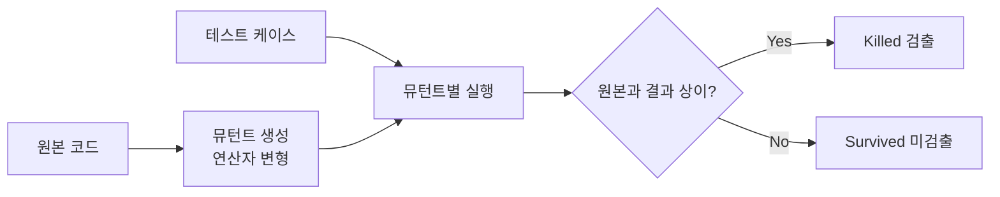

# 뮤테이션 테스트(Mutation Test)

## 1. 개요

### 가. 정의
> 프로그램 소스에 **인위적 결함(뮤턴트, Mutant)을 주입**한 뒤, 기존 테스트 케이스가 그 결함을 **검출(Kill)** 하는지로 **테스트 케이스의 결함 검출력(품질)** 을 평가하는 화이트박스 기법.

### 나. 필요성
- 코드 커버리지가 높아도 **실제 결함 검출력**은 보장되지 않음
- 테스트 스위트의 **효과성**을 정량 측정해 미흡 테스트 보완

## 2. 동작 원리

## 3. 뮤테이션 연산자와 지표

| 뮤테이션 연산자 | 예 |
|---|---|
| **산술** | `a+b` → `a-b` |
| **관계** | `>` → `<` |
| **논리** | `&&` → `||` |
| **상수/변수** | 값 치환 |
| **문장 삭제** | 라인 제거 |

| 지표 | 내용 |
|---|---|
| **Mutation Score** | Killed / (전체 − Equivalent) × 100 |
| **Killed** | 테스트가 검출한 뮤턴트(양호) |
| **Survived** | 검출 못 한 뮤턴트 → 테스트 보완 필요 |
| **Equivalent Mutant** | 의미가 동일해 절대 죽지 않는 뮤턴트(한계) |

## 4. 장단점

| 장점 | 단점 |
|---|---|
| 테스트 품질 정량 평가 | 뮤턴트 수 많아 **연산량 과다** |
| 미흡 테스트 식별·보완 유도 | **Equivalent Mutant** 판별 난제 |
| 커버리지 한계 보완 | 실행·판정 자동화 필요 |

## 5. 고려사항 및 시사점
- 뮤턴트 샘플링·병렬 실행으로 **성능** 개선
- CI 파이프라인에 통합해 회귀 시 테스트 품질 유지
- 안전-필수(SW-Safety) 시스템의 테스트 신뢰도 검증에 활용

---

> **한 줄 요약**: 뮤테이션 테스트는 *코드에 인위적 결함(뮤턴트)을 주입해 테스트가 이를 검출(Kill)하는지* 로 테스트 케이스의 결함 검출력을 정량 평가하는 화이트박스 기법이다.
