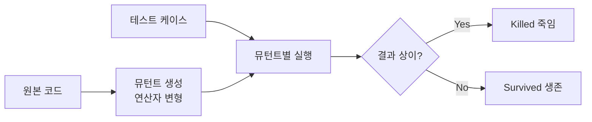

# 뮤테이션 테스트(Mutation Test)

## 1. 개요

### 가. 정의
> 프로그램 소스에 **인위적 결함(뮤턴트, Mutant)을 주입**한 뒤, 기존 테스트 케이스가 그 결함을 **검출(Kill)** 하는지로 **테스트 케이스의 품질(결함 검출력)** 을 평가하는 화이트박스 기법.

### 나. 목적
- 커버리지만으로 알기 어려운 **테스트 스위트의 실제 효과성** 측정

## 2. 동작 원리

## 3. 뮤테이션 연산자 및 지표

| 구분 | 내용 |
|---|---|
| **뮤테이션 연산자** | 산술(+↔-)·관계(>↔<)·논리·상수·문장 삭제 등 변형 규칙 |
| **Mutation Score** | Killed / (전체 뮤턴트 − Equivalent) × 100 |
| **Equivalent Mutant** | 의미가 동일해 절대 죽지 않는 뮤턴트(한계) |

## 4. 장단점
- **장점**: 테스트 케이스 품질 정량 평가, 미흡한 테스트 보완 유도
- **단점**: 뮤턴트 수 많아 **연산량 과다**, Equivalent Mutant 판별 난제

---

> **한 줄 요약**: 뮤테이션 테스트는 *코드에 인위적 결함을 주입해 테스트가 이를 검출하는지* 로 테스트 케이스의 결함 검출력을 평가하는 기법이다.
