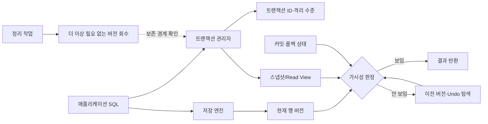
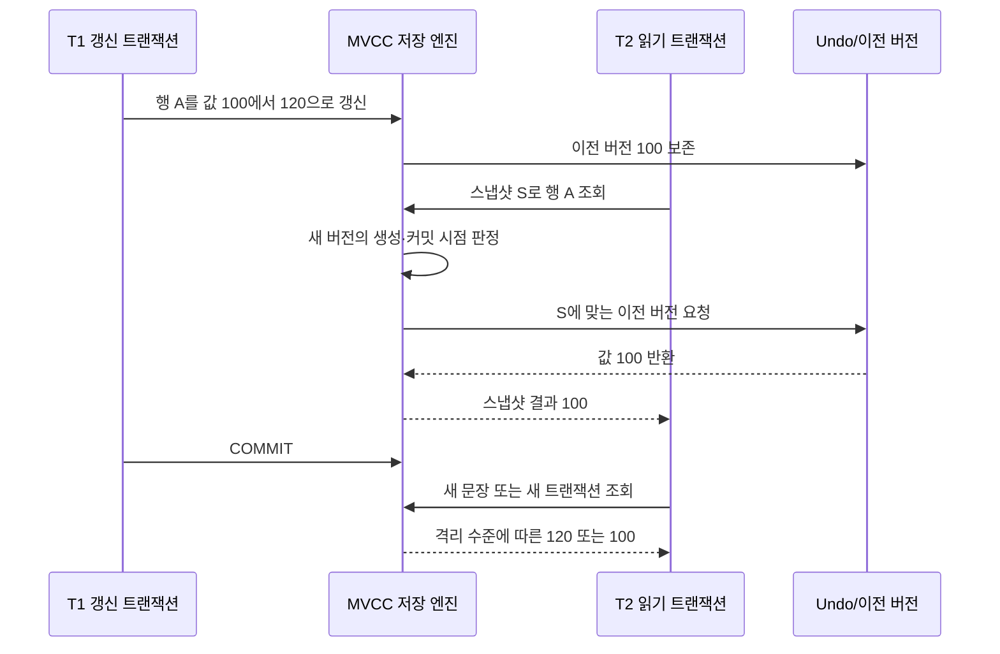

# MVCC(다중 버전 동시성 제어)와 스냅샷 기반 트랜잭션

## 1. 개요

> **정의**: MVCC(Multi-Version Concurrency Control, 다중 버전 동시성 제어)는 하나의 행을 갱신할 때 기존 값을 즉시 덮어쓰기보다 여러 버전으로 보존하고, 각 트랜잭션이 자신의 스냅샷에서 볼 수 있는 버전을 판정하여 읽기와 쓰기의 충돌을 줄이는 동시성 제어 기법이다.

온라인 서비스의 데이터베이스는 동시에 실행되는 트랜잭션이 같은 행을 읽고 수정한다. 단순한 잠금만 사용하면 쓰기 일관성은 지키기 쉽지만, 읽기 요청이 갱신 잠금을 기다리면서 지연이 커지고 분석 질의가 업무 트랜잭션을 막는 문제가 생긴다. MVCC는 이 충돌을 “읽는 트랜잭션은 자신이 볼 수 있는 과거 버전을 읽고, 쓰는 트랜잭션은 새 버전을 만든다”는 방식으로 분리한다.

MVCC의 핵심은 데이터를 단 하나의 현재 값으로 보지 않는 데 있다. 논리적으로는 하나의 행이지만 물리적으로는 생성 트랜잭션, 만료 트랜잭션, 이전 버전 연결 정보와 함께 여러 레코드가 존재할 수 있다. 읽기 요청은 최신 레코드라는 이유만으로 반환하지 않고, 자신의 스냅샷에서 커밋되어 보이는 버전을 선택한다. 이 판정 과정이 격리성과 비차단 읽기를 만든다.

다만 MVCC가 잠금을 없애는 기술은 아니다. 갱신 충돌, 유니크 제약, 명시적 잠금 읽기, 직렬화 수준의 검증에는 여전히 잠금이나 충돌 감지가 필요하다. 또한 오래 열린 트랜잭션이 과거 버전의 정리를 막으면 저장 공간이 증가하고 인덱스·테이블 성능이 떨어진다. 따라서 MVCC는 저장 엔진의 내부 구현과 트랜잭션 운영 정책을 함께 설계해야 효과가 난다.

기술사 답안에서는 MVCC를 “성능이 빠른 데이터베이스 기능”으로만 설명해서는 부족하다. 어떤 스냅샷을 선택하는지, 커밋 전·후 버전이 어떻게 보이는지, 격리 수준별로 어떤 현상이 허용되는지, 과거 버전이 언제 회수되는지까지 연결해야 한다. 특히 PostgreSQL의 튜플 가시성·VACUUM과 InnoDB의 undo 로그·Read View는 구현 방식이 다르므로 공통 원리와 제품별 차이를 구분한다.

### 1.1 등장 배경과 필요성

전통적인 2PL(Two-Phase Locking)은 트랜잭션이 읽거나 갱신하는 데이터에 잠금을 걸어 다른 트랜잭션의 접근을 통제한다. 강한 일관성을 얻기 쉽지만, 공유 잠금과 배타 잠금이 겹치면 읽기와 쓰기가 서로 대기한다. 대규모 웹 서비스에서는 짧은 주문 갱신 하나가 장시간 실행되는 리포트 조회 때문에 지연될 수 있다.

MVCC는 읽기 작업에 데이터의 논리적 시점을 부여한다. 트랜잭션 A가 행을 갱신하는 동안 트랜잭션 B가 조회하면, B는 A가 아직 커밋하지 않은 새 값을 읽지 않고 스냅샷에 포함된 이전 버전을 읽는다. 그 결과 “더티 리드”를 피하면서도 단순한 읽기끼리 불필요하게 막지 않는다.

이 방식은 특히 읽기 비중이 높은 OLTP, 주문·결제의 동시 처리, 복제본을 이용한 분석, 장시간 리포트 조회에서 유리하다. 반대로 갱신 충돌이 매우 많거나 장시간 트랜잭션이 빈번하거나 저장 공간이 제한된 환경에서는 버전 생성·정리 비용을 평가해야 한다.

### 1.2 핵심 목표

첫째 목표는 트랜잭션이 일관된 관찰 시점을 얻도록 하는 것이다. 트랜잭션은 다른 트랜잭션이 중간에 쓰는 값을 임의로 보지 않고, 자신이 허용하는 커밋 시점의 집합을 기준으로 행을 판정한다.

둘째 목표는 읽기와 쓰기의 경합을 줄이는 것이다. 일반적인 비잠금 읽기는 과거 버전을 활용하므로 갱신자가 쓰기 잠금을 보유하고 있어도 읽기가 반드시 대기하지 않는다. 다만 이 특성은 최신 확정 값이나 강한 잠금이 필요한 업무에는 그대로 적용되지 않는다.

셋째 목표는 격리 수준과 성능의 선택 폭을 넓히는 것이다. READ COMMITTED는 문장마다 새로운 관찰 시점을 취할 수 있고, REPEATABLE READ는 트랜잭션 동안 같은 스냅샷을 유지할 수 있다. SERIALIZABLE은 추가 충돌 검증으로 직렬 실행과 동등한 결과를 목표로 한다.

## 2. MVCC의 구성요소와 가시성 원리

### 2.1 전체 동작 구조

MVCC는 애플리케이션, 트랜잭션 관리자, 저장 엔진, 버전 저장 영역, 정리 작업이 결합된 구조다. 애플리케이션이 SQL을 실행하면 트랜잭션 관리자는 현재 트랜잭션의 ID와 격리 수준에 맞는 스냅샷을 만든다. 저장 엔진은 현재 행과 연결된 이전 버전을 따라가며 스냅샷에 보이는 값을 찾는다.

트랜잭션 ID는 버전의 생성·수정 주체를 식별하는 기준이다. 구현에 따라 행 헤더, 트랜잭션 테이블, undo 로그, 타임라인 정보가 함께 사용된다. 중요한 점은 버전 값 자체만으로는 가시성을 결정할 수 없다는 것이다. 버전이 어느 트랜잭션에서 생성되었고 그 트랜잭션이 스냅샷 시점에 커밋되었는지까지 확인해야 한다.

스냅샷은 특정 시점에 “보이는 트랜잭션”과 “아직 보이지 않는 트랜잭션”을 구분하는 읽기 기준이다. 현재 행이 나중 트랜잭션에 의해 수정되었더라도, 그 수정 트랜잭션이 스냅샷에서 보이지 않으면 저장 엔진은 이전 버전을 따라가 반환한다. 이 때문에 물리적으로 최신이 아닌 버전이 논리적으로는 올바른 결과가 된다.

### 2.2 버전과 가시성 판정

행 버전은 일반적으로 생성 시점과 만료 시점에 대한 메타데이터를 갖는다. 새 버전의 생성 트랜잭션이 커밋되어 있고, 해당 버전의 만료 트랜잭션이 스냅샷에 보이지 않으면 그 버전은 읽기 대상이 된다. 반대로 생성 트랜잭션이 아직 진행 중이면 그 버전은 다른 트랜잭션의 일반 읽기에서 제외된다.

한 트랜잭션이 수정한 값을 자기 자신이 읽을 수 있는지는 엔진의 가시성 규칙에 포함된다. 자신의 이전 문장에서 만든 변경은 외부 커밋 여부와 무관하게 같은 트랜잭션의 논리적 작업 결과로 보일 수 있다. 이 규칙이 없으면 한 트랜잭션 안에서 INSERT 후 SELECT 같은 자연스러운 흐름이 깨진다.

삭제도 물리적 즉시 제거가 아니라 삭제 표시 또는 새 버전 생성으로 처리될 수 있다. 스냅샷에 삭제 트랜잭션이 보이지 않으면 이전 버전은 아직 읽을 수 있고, 삭제 트랜잭션이 보이면 해당 행은 결과에서 제외된다. 이후 모든 활성 트랜잭션이 그 이전 버전을 볼 가능성이 없어졌을 때 정리 작업이 실제 공간을 회수한다.

| 구성요소 | 역할 | 설계·운영 포인트 |
|---|---|---|
| 트랜잭션 ID | 버전 생성·수정 주체 식별 | ID 고갈·랩어라운드와 상태 추적 고려 |
| 스냅샷/Read View | 보이는 커밋과 진행 트랜잭션 구분 | 격리 수준에 따라 생성 시점이 달라짐 |
| 행 버전 | 논리적 과거·현재 값 보존 | 버전 체인 길이와 저장 공간 관리 |
| Undo/이전 버전 영역 | 읽기용 과거 값과 롤백 정보 제공 | 보존 시간, I/O, 정리 지연 모니터링 |
| 가시성 판정기 | 스냅샷에 맞는 버전 선택 | 엔진별 헤더·트랜잭션 상태 확인 |
| 정리 작업 | 더 이상 필요 없는 버전 회수 | 장기 트랜잭션과 충돌하지 않도록 운영 |

표의 구성요소는 서로 독립적인 기능 목록이 아니라 하나의 생명주기다. 트랜잭션이 버전을 만들고 스냅샷이 그 버전을 읽으며, 활성 트랜잭션이 종료된 뒤에야 정리 작업이 안전하게 과거 버전을 제거할 수 있다. 어느 한 단계가 지연되면 저장 공간과 응답시간에 연쇄적인 영향이 발생한다.

### 2.3 읽기와 쓰기의 논리적 흐름

읽기 트랜잭션은 먼저 자신의 격리 수준에 맞는 스냅샷을 확보한다. 그 다음 인덱스나 테이블에서 후보 행을 찾고, 후보 버전의 생성·삭제 메타데이터를 스냅샷과 비교한다. 후보가 보이지 않으면 이전 버전 저장 영역으로 이동하며, 보이는 버전을 찾거나 해당 행이 스냅샷에 존재하지 않는 것으로 판정한다.

쓰기 트랜잭션은 기존 행을 변경하더라도 읽기 트랜잭션이 참조할 수 있는 과거 상태를 보존한다. 저장 엔진에 따라 새 버전을 별도 레코드로 두거나, 현재 레코드는 유지하고 이전 값을 undo 영역에 기록하는 방식이 사용된다. 이 차이는 인덱스 갱신 비용, 정리 방식, 장애 복구 절차에 영향을 준다.

커밋은 버전이 다른 트랜잭션의 스냅샷에 보일 수 있게 만드는 경계다. 롤백은 새 버전을 무효화하거나 undo 정보를 이용해 논리적 이전 상태를 복원한다. 따라서 MVCC는 데이터 파일만의 기능이 아니라 WAL·redo·undo·트랜잭션 상태 관리와 함께 동작한다.

## 3. 격리 수준과 동시성 이상 현상

### 3.1 격리 수준의 의미

격리 수준은 동시 실행 중인 트랜잭션이 다른 트랜잭션의 결과를 어느 정도까지 관찰할 수 있는지를 정의한다. 이름이 같아도 제품별 구현과 기본값이 다를 수 있으므로, 설계서에는 표준 용어와 실제 엔진 설정을 함께 기록해야 한다.

READ UNCOMMITTED는 커밋되지 않은 변경까지 읽을 수 있어 가장 약한 격리다. MVCC 엔진이 일반 조회에서 이를 그대로 허용하지 않거나 특별히 처리하는 경우도 있으므로, “MVCC이면 항상 더티 리드가 없다”고 단정하지 말고 제품 문서를 확인한다.

READ COMMITTED는 각 SQL 문장이 시작될 때 또는 실행 시점에 새로운 스냅샷을 취하는 모델이다. 같은 트랜잭션 안에서 두 번 조회하면 그 사이 다른 트랜잭션이 커밋한 변경을 두 번째 조회에서 볼 수 있다. 업무 화면의 최신성은 높지만, 여러 문장을 조합한 업무 규칙에는 추가 잠금이나 조건 검증이 필요할 수 있다.

REPEATABLE READ는 트랜잭션의 일관된 관찰 시점을 유지하는 모델이다. 같은 트랜잭션의 동일한 논리 질의가 일관된 결과를 얻기 쉽지만, 오래 열린 트랜잭션은 과거 버전 보존을 길게 요구한다. MySQL InnoDB와 PostgreSQL은 같은 이름의 수준도 세부 현상과 구현이 다를 수 있다.

SERIALIZABLE은 동시 실행 결과가 어떤 직렬 실행과 동일하도록 제한하는 가장 강한 수준이다. MVCC 기반 SSI(Serializable Snapshot Isolation)처럼 잠금을 최소화하면서 위험한 의존성을 감지하는 구현도 있고, 범위 잠금과 결합하는 구현도 있다. 충돌 시 재시도해야 하므로 애플리케이션의 멱등성과 재시도 정책이 필수다.

| 격리 수준 | 허용 가능성이 있는 현상 | MVCC 관점의 특징 | 적용 예 |
|---|---|---|---|
| READ UNCOMMITTED | 더티 리드 등 | 가장 약한 일관성, 엔진별 처리 차이 | 정확성보다 빠른 참고성 조회 |
| READ COMMITTED | 반복 불가능 읽기, 일부 팬텀 | 문장별 스냅샷 | 일반 웹 요청·OLTP |
| REPEATABLE READ | 구현에 따라 팬텀·쓰기 충돌 | 트랜잭션 또는 일관 읽기 스냅샷 | 업무 단위 일관 조회 |
| SERIALIZABLE | 직렬성 위반을 허용하지 않음 | 충돌 감지·범위 보호·재시도 | 재고·정산·핵심 규칙 |

이 표를 암기할 때는 현상 이름만 외우지 말고 스냅샷 생성 시점과 쓰기 충돌 처리의 차이로 연결한다. 예를 들어 READ COMMITTED의 두 SELECT가 다른 값을 읽는 것은 오류가 아니라 문장마다 관찰 시점이 새로 만들어졌기 때문일 수 있다. 반대로 결제 한도처럼 여러 읽기 결과를 합쳐 판단하는 업무는 단일 스냅샷 또는 명시적 잠금이 필요하다.

### 3.2 대표적인 동시성 이상

더티 리드는 다른 트랜잭션이 아직 커밋하지 않은 값을 읽는 현상이다. MVCC의 기본적인 스냅샷 가시성은 진행 중인 트랜잭션의 버전을 제외하여 이를 줄인다. 그러나 외부 캐시나 읽기 복제본이 별도의 일관성 규칙을 가지면 데이터베이스 내부에서 더티 리드가 없어도 사용자 화면에서는 유사한 착시가 발생할 수 있다.

반복 불가능 읽기는 한 트랜잭션 안에서 같은 조건으로 읽었는데 다른 트랜잭션의 커밋 때문에 값이 달라지는 현상이다. 문장별 스냅샷을 사용하는 READ COMMITTED에서 자연스럽게 나타날 수 있다. 합계·잔액·권한을 여러 번 읽어 비교해야 한다면 한 번에 읽거나 더 강한 격리 수준을 선택해야 한다.

팬텀 리드는 같은 조건의 범위 조회를 반복했을 때 새로 삽입되거나 삭제된 행 때문에 결과 행 집합이 달라지는 현상이다. 단일 행 버전만 관리해서는 범위 전체의 변화까지 막을 수 없다. 직렬성 수준, 범위 잠금, predicate locking, 유니크 제약 등 업무에 맞는 범위 보호가 필요하다.

쓰기 스큐는 두 트랜잭션이 서로 다른 행을 읽고 각각 수정하지만, 두 변경을 합친 결과가 업무 불변식을 깨뜨리는 현상이다. 예를 들어 당직 의사 두 명 중 한 명 이상이 남아야 하는 규칙에서 두 트랜잭션이 서로 다른 의사를 퇴근 처리하면 모두 퇴근하는 결과가 될 수 있다. 단순 MVCC의 일관된 읽기만으로는 해결되지 않으며 SERIALIZABLE, 명시적 잠금 또는 원자적 조건 갱신이 요구된다.

## 4. 주요 구현과 운영 메커니즘

### 4.1 PostgreSQL 계열의 튜플 버전과 VACUUM

PostgreSQL은 UPDATE를 기존 튜플의 값만 덮어쓰는 방식으로 보지 않고 새 튜플 버전을 생성하는 방식으로 처리한다. 튜플 헤더의 트랜잭션 정보와 스냅샷을 비교해 어느 버전이 보이는지 결정하며, 이전 튜플은 활성 트랜잭션이 필요로 하지 않을 때 정리 대상이 된다.

이 구조는 읽기와 쓰기의 충돌을 줄이는 대신 테이블에 죽은 튜플(dead tuple)이 쌓일 수 있다. VACUUM은 더 이상 보이지 않는 튜플을 재사용 가능하게 표시하고 트랜잭션 메타데이터를 관리한다. VACUUM이 지나치게 늦으면 테이블 팽창, 인덱스 팽창, 스캔 비용 증가가 발생한다.

Autovacuum은 테이블별 변경량과 임계값을 바탕으로 정리 작업을 수행한다. 기본값만 믿기보다 업데이트 빈도, 행 크기, 인덱스 수, 장기 트랜잭션, 복제 슬롯을 함께 관찰해 테이블별 튜닝을 한다. 장기 트랜잭션이 과거 스냅샷을 붙잡고 있으면 VACUUM이 공간을 회수하지 못하므로 애플리케이션 커넥션 풀과 배치 작업도 점검해야 한다.

트랜잭션 ID wraparound는 단순한 저장 공간 문제가 아니라 가시성 판정의 안전성과 관련된다. 데이터베이스는 오래된 트랜잭션 ID를 적절히 freeze하여 과거 버전의 의미가 바뀌지 않도록 관리한다. 운영자는 autovacuum 지연, oldest xmin, dead tuple, 테이블·인덱스 팽창을 정기적으로 모니터링해야 한다.

### 4.2 InnoDB의 undo 로그와 Read View

InnoDB는 변경 전 값을 undo 로그에 보존하고, 일관 읽기가 필요할 때 Read View와 undo 체인을 이용해 스냅샷에 맞는 버전을 재구성한다. 현재 페이지에 있는 값이 자신의 Read View에서 너무 최신이면 undo 로그를 따라 과거 값을 만든다.

REPEATABLE READ에서는 트랜잭션의 일관 읽기가 동일한 관찰 시점을 유지하는 동작이 중요하다. READ COMMITTED에서는 문장마다 더 최신의 Read View를 만들 수 있으므로 같은 트랜잭션 안에서도 조회 결과가 달라질 수 있다. 이 차이를 애플리케이션의 “트랜잭션”이라는 단어와 혼동하지 않아야 한다.

Undo 로그 정리는 아직 어떤 활성 Read View도 필요로 하지 않는 시점에 수행된다. 오래 열린 트랜잭션, 대형 배치, 커넥션 반환 누락은 undo 공간과 purge 지연을 키울 수 있다. 따라서 버전 정리는 백그라운드 작업의 문제이면서도 트랜잭션 경계를 짧게 유지하는 애플리케이션 설계의 문제다.

### 4.3 비잠금 읽기와 잠금 읽기의 구분

일반 SELECT는 스냅샷에 맞는 비잠금 읽기를 수행할 수 있지만, SELECT ... FOR UPDATE나 SELECT ... FOR SHARE처럼 최신 버전을 확인하고 잠금을 획득하는 읽기는 다른 목적을 가진다. 재고 차감 직전의 수량을 보호하거나 작업 큐의 한 행을 독점할 때는 잠금 읽기가 필요하다.

비잠금 읽기는 과거 버전을 반환할 수 있으므로 “가장 최신의 확정 값”이 항상 필요한 업무에는 부적합할 수 있다. 반대로 모든 조회를 잠금 읽기로 바꾸면 MVCC가 줄여준 동시성이 다시 잠금 경합으로 사라진다. 조회의 의미를 먼저 정의한 뒤 잠금 여부를 결정한다.

위 흐름은 T2가 언제 스냅샷을 만들었는지에 따라 결과가 달라진다는 점을 보여준다. T1이 커밋하기 전이면 T2는 120을 볼 수 없고, T1이 커밋한 뒤라도 T2의 격리 수준이 이전 스냅샷을 유지하면 100을 계속 볼 수 있다. 따라서 장애 분석 시 SQL 실행 시각만 기록하지 말고 트랜잭션 시작·스냅샷·커밋 시점을 함께 기록해야 한다.

### 4.4 인덱스와 버전 정리의 관계

MVCC는 테이블 본문뿐 아니라 인덱스 접근과도 연결된다. 인덱스가 가리킨 튜플이 현재 스냅샷에서 보이지 않으면 저장 엔진은 가시성 검사를 수행하고 필요하면 이전 버전을 찾는다. 인덱스 설계가 나쁘면 후보 행이 많아져 버전 판정과 랜덤 I/O가 함께 증가한다.

일부 엔진은 인덱스만 읽어도 가시성을 확인할 수 있도록 별도의 메타데이터나 가시성 맵을 활용한다. 이 최적화가 제대로 작동하려면 정리 작업과 통계 갱신이 정상이어야 한다. 따라서 “인덱스를 추가하면 MVCC 비용이 사라진다”가 아니라, 인덱스 선택도·커버링·정리 상태를 함께 평가한다.

## 5. 비교와 산업 적용 사례

### 5.1 2PL·낙관적 제어와의 비교

2PL은 충돌 가능성이 있는 데이터에 잠금을 걸어 실행 중인 트랜잭션의 접근을 직접 제한한다. 강한 규칙을 표현하기 쉽지만, 잠금 대기와 교착상태를 관리해야 한다. MVCC는 읽기 경로를 버전 선택으로 처리하여 읽기 대기를 줄이지만, 오래된 버전 저장과 쓰기 충돌 재시도를 요구한다.

낙관적 동시성 제어는 충돌이 드물다는 가정 아래 잠금 없이 작업하고 커밋 시 버전 번호나 타임스탬프를 검증한다. MVCC와 함께 사용될 수 있지만 동일 개념은 아니다. MVCC는 읽을 버전을 제공하는 메커니즘이고, 낙관적 검증은 커밋 가능성을 판단하는 정책이다.

| 구분 | MVCC | 2PL | 낙관적 검증 |
|---|---|---|---|
| 읽기 방식 | 스냅샷의 적합한 버전 선택 | 잠금 획득 후 읽기 | 현재 값 읽고 나중에 검증 |
| 읽기-쓰기 경합 | 일반 읽기는 낮음 | 잠금 종류에 따라 대기 | 보통 낮지만 커밋 실패 가능 |
| 주요 비용 | 버전·undo·정리 | 잠금 대기·교착상태 | 충돌 시 재시도·롤백 |
| 강점 | 읽기 확장과 일관 스냅샷 | 규칙 표현과 최신 값 보호 | 짧은 트랜잭션·낮은 충돌 |
| 주의점 | 장기 트랜잭션·팽창 | 대기 폭증·교착상태 | 재시도 멱등성·기아 |

세 방식은 경쟁 관계라기보다 조합 대상이다. 실무 데이터베이스는 일반 조회에 MVCC를 사용하면서 갱신 충돌에는 행 잠금, 범위 불변식에는 직렬성 검증, 애플리케이션 계층에는 낙관적 버전 검사를 함께 적용한다. 기술사 답안의 설계 제안도 “MVCC를 채택한다”에서 끝내지 말고 충돌이 발생하는 경로별로 보완 수단을 제시해야 한다.

### 5.2 사례 1 — 주문·재고 서비스

상품 목록과 주문 조회는 읽기 비중이 높으므로 MVCC 기반 비잠금 읽기가 지연을 줄인다. 고객이 주문 상태를 조회하는 동안 운영자가 상태를 갱신해도, 고객은 커밋된 일관 버전을 받으며 일반 조회가 장시간 잠금 대기하지 않는다.

반면 재고 차감은 두 주문이 같은 마지막 재고를 읽고 모두 성공하면 안 된다. 이 경로는 `UPDATE ... SET stock = stock - 1 WHERE product_id = ? AND stock > 0` 같은 원자적 조건 갱신 또는 최신 행 잠금과 함께 설계한다. MVCC 스냅샷 읽기만으로 재고 불변식이 보장된다고 주장하면 안 된다.

### 5.3 사례 2 — 장시간 리포트와 운영 트랜잭션

월별 매출 리포트가 수 분 동안 실행되는 환경에서 MVCC는 운영자가 신규 주문을 처리하는 동안 리포트가 자신이 선택한 시점의 일관된 데이터를 읽게 한다. 이는 리포트가 테이블 전체를 잠가 주문 입력을 막는 문제를 줄인다.

그러나 리포트 트랜잭션이 오래 유지되면 그 시점 이전의 버전이 정리되지 못한다. 해결책은 읽기 전용 복제본이나 분석 저장소로 부하를 분리하고, 리포트를 페이지 단위의 짧은 트랜잭션으로 나누며, 스냅샷의 일관성이 반드시 필요한지 업무와 합의하는 것이다.

### 5.4 사례 3 — 금융 정산과 직렬성 요구

금융 정산은 단순 조회의 비차단성보다 중복·누락·쓰기 스큐 방지가 중요하다. 잔액과 출금 한도를 서로 다른 행에서 읽고 갱신하는 로직은 READ COMMITTED만으로는 안전하지 않을 수 있다. 핵심 규칙은 SERIALIZABLE, 명시적 잠금, 원자적 조건 갱신, 정산 후 대사로 다층 방어한다.

직렬성 충돌로 트랜잭션이 재시도될 수 있으므로 정산 API는 요청 식별자와 멱등 키를 사용해야 한다. 외부 결제 승인이나 메시지 발행을 데이터베이스 재시도와 한 묶음으로 처리하면 외부 부작용이 중복될 수 있으므로, 아웃박스 패턴과 중복 제거 키를 함께 설계한다.

## 6. 심화 — 분산·클라우드 환경에서의 MVCC

분산 데이터베이스는 단일 노드의 트랜잭션 ID만으로 전체 스냅샷을 표현하기 어렵다. 논리적 타임스탬프, 하이브리드 논리 시계, 범위별 리더, 커밋 대기와 같은 메커니즘을 이용해 여러 노드의 읽기 시점을 조정한다. 네트워크 지연이 스냅샷 일관성과 쓰기 가용성 사이의 트레이드오프로 이어지므로 CAP와 일관성 모델을 함께 검토해야 한다.

분산 SQL 시스템의 직렬성 스냅샷은 “각 노드에서 보이는 최신 값”을 단순히 합치는 것이 아니다. 질의에 필요한 읽기 타임스탬프를 정하고, 해당 시점의 데이터가 여러 복제본에 존재하는지 확인하며, 커밋 충돌과 재시도를 조정해야 한다. 리전 간 왕복 시간이 길면 강한 일관성의 읽기·쓰기가 사용자 지연을 증가시킬 수 있다.

클라우드 관리형 데이터베이스에서는 MVCC 내부 파라미터를 모두 직접 제어하지 못할 수 있다. 대신 장기 트랜잭션, 커넥션 풀 유휴 세션, 정리 지연, undo·WAL·스토리지 사용량, 잠금 대기와 재시도율을 관측 가능한 서비스 지표로 만든다. 자동 확장이 저장 공간 문제를 숨길 수 있으므로 비용과 성능을 함께 추적한다.

HTAP 환경에서는 OLTP의 MVCC 버전 정리와 분석 스캔의 스냅샷 수명이 충돌할 수 있다. 분석 workload를 별도 컬럼 저장소·복제 스트림·레이크하우스로 분리하면 운영 트랜잭션의 버전 보존 부담을 낮출 수 있다. 다만 데이터 신선도 지연과 스키마 변환 비용이 생기므로 SLA에 반영한다.

최근의 시간여행 질의와 감사 추적은 MVCC의 과거 버전 개념과 닮았지만 목적이 다르다. MVCC의 과거 버전은 동시성 제어와 롤백을 위한 내부 데이터일 수 있고, 규제 감사용 이력은 장기간 보존·변경 사유·접근 통제·법적 증거성을 요구한다. 내부 버전을 감사 원장으로 간주하지 말고 별도의 불변 이벤트·감사 로그 설계를 둔다.

## 7. 고려사항 및 시사점

### 7.1 트랜잭션 수명 관리

트랜잭션은 업무 단위를 보장할 만큼만 길게 유지하고, 사용자 입력 대기나 외부 API 호출을 데이터베이스 트랜잭션 안에 넣지 않는다. 장기 트랜잭션은 과거 버전 정리와 스키마 변경을 방해하고, 장애 시 롤백 범위를 키운다.

커넥션 풀에서 트랜잭션 상태가 남은 채 연결이 재사용되지 않도록 자동 롤백과 타임아웃을 적용한다. 운영 대시보드에는 가장 오래된 트랜잭션, 유휴 상태의 트랜잭션, 스냅샷 유지 시간, 정리 지연을 별도 표시한다.

### 7.2 일관성 요구사항과 격리 수준 매핑

모든 업무에 SERIALIZABLE을 적용하거나 모든 업무를 READ COMMITTED로 통일하는 방식은 위험하다. 주문 조회, 재고 차감, 정산, 감사 조회처럼 업무 의미가 다른 흐름마다 허용 가능한 지연과 이상 현상을 정의한다.

요구사항에는 “최신”이라는 표현 대신 기준 시점과 허용 지연을 적는다. 예를 들어 검색 목록은 수 초 지연을 허용하지만 결제 완료 확인은 같은 세션에서 방금 커밋한 결과를 즉시 확인해야 할 수 있다. 읽기 라우팅, 세션 고정, 잠금 읽기, 재시도를 이 정책과 연결한다.

### 7.3 정리·저장공간·성능 관측

버전 생성량은 UPDATE·DELETE 빈도, 행 크기, 인덱스 수에 따라 달라진다. dead tuple, undo history length, purge lag, 테이블·인덱스 팽창, WAL 증가량 같은 엔진 지표를 수집하고 저장 공간 임계값과 연결한다.

정리 작업을 무조건 자주 실행하면 I/O 경합이 늘 수 있고, 너무 늦게 실행하면 조회 성능과 비용이 악화된다. 업무 피크와 배치 시간을 고려해 자동 정리 파라미터를 튜닝하며, 설정 변경은 대표 테이블에서 부하 테스트로 검증한다.

### 7.4 실패·재시도·멱등성

MVCC 직렬성 충돌이나 데드락은 정상적인 동시성 제어의 결과로 발생할 수 있다. 애플리케이션은 오류를 무조건 사용자 실패로 반환하거나 무한 재시도하지 말고, 재시도 가능한 오류를 분류하고 지수 백오프와 최대 횟수를 설정한다.

재시도 대상 트랜잭션은 외부 부작용이 중복되지 않도록 멱등 키, 아웃박스, 중복 수신 방지, 보상 절차를 갖춰야 한다. 데이터베이스 커밋은 성공했지만 응답이 유실된 경우를 고려해 클라이언트가 같은 요청을 다시 보내도 결과가 한 번만 반영되도록 한다.

### 7.5 보안·감사·운영 통제

스냅샷이 과거 데이터를 읽게 된다는 사실은 접근 통제를 우회한다는 뜻이 아니다. 행 수준 보안, 테넌트 조건, 권한 검사는 과거 버전에도 동일하게 적용되어야 하며, 삭제된 개인정보의 보존 정책과 undo·백업의 잔존 가능성을 검토한다.

운영자가 성능 문제를 해결하기 위해 장기 트랜잭션을 강제 종료할 때는 업무 영향과 롤백 비용을 확인한다. 강제 종료 전후의 세션·쿼리·정리 지표를 기록해 원인과 조치의 효과를 감사 가능하게 만든다.

### 7.6 기술사 관점의 종합 시사점

MVCC는 데이터베이스 엔진 기능이지만, 실제 품질은 트랜잭션 경계·격리 수준·인덱스·정리 정책·모니터링·재시도 설계의 결합으로 결정된다. “읽기 비차단”이라는 장점만 강조하면 버전 팽창과 업무 불변식 위반을 놓친다.

아키텍처 선정 시에는 TPS와 평균 지연뿐 아니라 P99 지연, 갱신 충돌률, 장기 트랜잭션 비율, 정리 지연, 스토리지 비용, 장애 복구 시 재처리량을 측정한다. 동일한 MVCC라도 엔진과 workload에 따라 최적의 격리 수준과 튜닝 값이 달라진다.

답안의 결론은 “MVCC를 적용한다”가 아니라 “업무별 일관성 등급을 정의하고, 스냅샷 읽기와 잠금·직렬성·멱등 재시도를 조합하며, 버전 생명주기를 관측·통제한다”로 정리하는 것이 바람직하다.

## 참고자료

- PostgreSQL, “Introduction to MVCC”: https://www.postgresql.org/docs/current/mvcc-intro.html
- PostgreSQL, “Concurrency Control”: https://www.postgresql.org/docs/current/mvcc.html
- MySQL, “Consistent Nonlocking Reads”: https://dev.mysql.com/doc/refman/8.4/en/innodb-consistent-read.html
- MySQL, “InnoDB Multi-Versioning”: https://dev.mysql.com/doc/refman/8.4/en/innodb-multi-versioning.html
- PostgreSQL, “Transaction Isolation”: https://www.postgresql.org/docs/current/transaction-iso.html

---

> **한 줄 요약**: MVCC는 트랜잭션별 스냅샷과 다중 버전으로 읽기·쓰기 경합을 줄이되, 격리 수준·충돌 재시도·장기 트랜잭션·버전 정리를 함께 설계해야 일관성과 성능을 동시에 달성할 수 있다.
