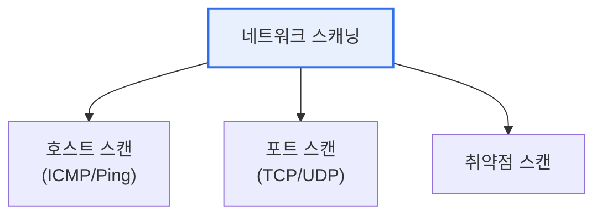

# 네트워크 스캐닝(Network Scanning)

## 1. 개요

### 가. 정의
> **네트워크 스캐닝**은 네트워크에 연결된 **호스트·포트·서비스·취약점 정보를 탐색·수집**하는 기술로, 공격자에게는 침투 사전 정찰(reconnaissance)의 수단이자 방어자에게는 자산·취약점 점검의 도구다.

네트워크 스캐닝이 보안에서 중요한 이유는 '**공격의 첫 단계이자 방어의 첫 단계**'라는 양면성에 있다. 공격자는 목표를 침투하기 전에 반드시 대상을 정찰한다. 어떤 호스트가 살아 있고(호스트 스캔), 어떤 포트가 열려 있으며(포트 스캔), 어떤 서비스·OS가 돌고 있고(서비스/OS 탐지), 어떤 취약점이 있는지(취약점 스캔)를 파악해야 공격 경로를 정한다. 스캐닝은 바로 이 정보를 캐내는 활동이다. 그런데 같은 기술을 방어자도 쓴다. 보안 관리자는 자기 네트워크를 스캔해 열린 포트·불필요한 서비스·알려진 취약점을 찾아 선제적으로 막는다. 즉 스캐닝은 공격·방어 양쪽의 필수 도구이며, 대표 도구인 Nmap이 양쪽에서 함께 쓰인다. 따라서 스캐닝 탐지·차단 능력과, 스스로 스캔해 노출면을 줄이는 역량이 모두 중요하다.

### 나. 스캐닝의 목적
| 목적 | 내용 |
|---|---|
| **호스트 발견** | 살아있는 호스트 식별(Ping 스캔) |
| **포트 스캔** | 열린 포트·서비스 파악 |
| **서비스·OS 탐지** | 버전·운영체제 식별(핑거프린팅) |
| **취약점 스캔** | 알려진 취약점 존재 여부 |

## 2. 주요 스캐닝 기법

포트 스캔은 TCP 3-way handshake의 동작을 이용해 여러 방식으로 이뤄진다. 대표적으로 **TCP 연결(Full-open)** 스캔은 정상 연결을 완성해 확실하지만 로그에 남는다. **SYN(Half-open)** 스캔은 SYN만 보내고 SYN-ACK를 받으면 열림으로 판단한 뒤 연결을 끊어(RST) 로그를 피하는 은밀한 방식이다. 이 외에 방화벽 우회를 노리는 FIN·NULL·XMAS 스캔이 있다. [[tcp-handshake]]

| 기법 | 내용 |
|---|---|
| **TCP Connect** | 완전한 연결(확실·탐지 쉬움) |
| **SYN(Half-open)** | SYN만 전송(은밀·스텔스) |
| **FIN/NULL/XMAS** | 비정상 플래그로 방화벽 우회 |
| **UDP 스캔** | UDP 포트 응답 없음 이용 |

## 3. 탐지 및 대응

| 대응 | 내용 |
|---|---|
| **IDS/IPS** | 스캔 패턴(대량 연결 시도) 탐지·차단 |
| **방화벽** | 불필요 포트 차단, 접근 통제 |
| **포트 최소화** | 사용 안 하는 서비스·포트 폐쇄 |
| **로그 모니터링** | 비정상 연결 시도 감시 |

## 4. 고려사항 및 시사점

1. **합법성이 전제**다. 스캐닝은 권한 없는 대상에 하면 불법(정보통신망법 위반)이 될 수 있으므로, 모의해킹·자산 점검 등 정당한 권한과 사전 동의 하에서만 수행해야 한다.
2. **공격 표면 최소화가 근본 방어**다. 스캔으로 노출되는 열린 포트·불필요 서비스를 줄이는 것이 가장 효과적이며, 정기적 자가 스캔으로 노출면을 점검한다.
3. **방어 관점에서 능동 활용**한다. 취약점 관리(VM)·자산 관리에 스캐닝을 정기적으로 활용해 알려진 취약점을 선제 조치하고, 스캔 탐지를 SIEM·SOAR와 연계해 정찰 단계에서 대응한다. [[soar]]

---

> **한 줄 요약**: 네트워크 스캐닝은 *호스트·포트·서비스·취약점을 탐색* 하는 기술로 공격의 정찰이자 방어의 점검 수단이며, SYN·FIN 등 다양한 기법이 있고, 공격 표면 최소화와 IDS/IPS 탐지, 합법적 수행이 핵심이다.
