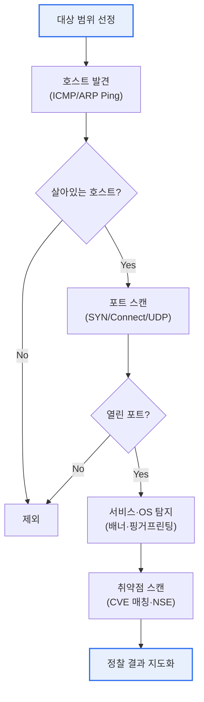
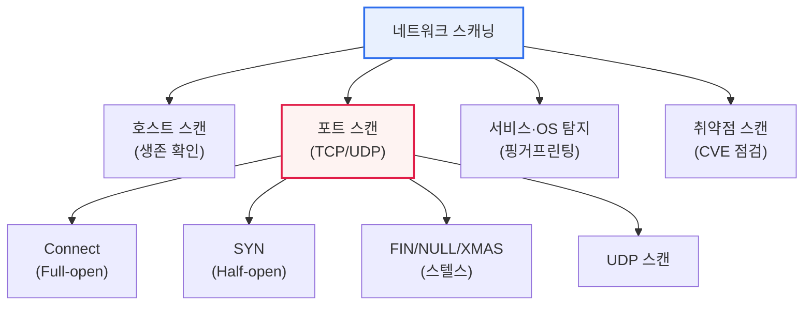

# 네트워크 스캐닝(Network Scanning)

## 1. 개요

### 가. 정의

> **네트워크 스캐닝(Network Scanning)** 은 네트워크에 연결된 **호스트·포트·서비스·취약점 정보를 능동적으로 탐색·수집**하는 기술로, 공격자에게는 침투에 앞선 사전 정찰(reconnaissance)의 핵심 수단이자, 방어자에게는 자산 식별과 취약점 점검(Vulnerability Assessment)의 도구로 쓰이는 이중적 성격을 갖는다.

네트워크 스캐닝이 보안에서 중요한 이유는 '**공격의 첫 단계이자 방어의 첫 단계**'라는 양면성에 있다. 사이버 킬 체인(Cyber Kill Chain)의 7단계 중 첫 단계가 바로 정찰(Reconnaissance)인데, 공격자는 목표를 침투하기 전에 반드시 대상의 지형을 파악한다. 어떤 호스트가 살아 있고(호스트 발견), 어떤 포트가 열려 있으며(포트 스캔), 그 포트에서 어떤 서비스·OS가 어떤 버전으로 돌고 있고(서비스/OS 핑거프린팅), 그 버전에 알려진 취약점(CVE)이 있는지(취약점 스캔)를 순차적으로 파악해야 실제 공격(Exploitation) 경로를 확정할 수 있다. 스캐닝은 바로 이 '지도 그리기' 활동이다.

그런데 정확히 같은 기술을 방어자도 사용한다. 보안 관리자는 자기 네트워크를 스스로 스캔해 불필요하게 열린 포트, 관리자가 모르는 사이 기동된 서비스(Shadow IT), 패치되지 않은 취약 버전을 찾아 선제적으로 차단한다. 이 때문에 대표 도구인 **Nmap(Network Mapper)** 은 공격자와 방어자 양쪽 모두의 필수 도구가 되었으며, 수동 정찰(패시브)과 달리 대상에 직접 패킷을 보내는 **능동(Active) 정찰**이라는 점에서 흔적(로그·트래픽)을 남긴다. 따라서 방어 관점에서는 ① 남의 스캔을 탐지·차단하는 능력과 ② 스스로 스캔해 공격 표면(Attack Surface)을 줄이는 역량이 동시에 요구된다.

### 나. 수동 정찰과 능동 정찰

정찰은 대상에 패킷을 보내지 않고 공개정보(WHOIS, DNS, 검색엔진, Shodan 등)만으로 정보를 모으는 **수동(Passive) 정찰**과, 실제로 패킷을 던져 반응을 관찰하는 **능동(Active) 정찰**로 나뉜다. 네트워크 스캐닝은 후자에 해당하며, 반응을 유발하는 대신 탐지 위험을 감수한다. 공격자는 대개 수동 정찰로 대략의 자산 범위를 좁힌 뒤, 능동 스캐닝으로 정밀 지도를 완성하는 2단계 전략을 쓴다.

| 목적 | 내용 | 대표 기법·도구 |
|---|---|---|
| **호스트 발견** | 살아있는 호스트 식별(생존 확인) | Ping/ICMP, ARP 스캔, TCP Ping |
| **포트 스캔** | 열린 포트·서비스 파악 | SYN, Connect, UDP 스캔 |
| **서비스·OS 탐지** | 버전·운영체제 식별(핑거프린팅) | Nmap `-sV`, `-O`, 배너 그래빙 |
| **취약점 스캔** | 알려진 취약점(CVE) 존재 여부 | Nessus, OpenVAS, Nmap NSE |

## 2. 스캐닝의 전체 프로세스와 유형

### 가. 스캐닝 프로세스

스캐닝은 무작정 전 포트를 두드리는 것이 아니라 **호스트 발견 → 포트 스캔 → 서비스/OS 탐지 → 취약점 스캔**의 깔때기(funnel) 형태로 좁혀 들어간다. 앞 단계에서 살아있다고 확인된 호스트에만 포트 스캔을 하고, 열려 있다고 확인된 포트에만 서비스 탐지를 하는 식으로 범위를 줄여야 효율과 은밀성이 모두 올라간다. 예컨대 /24 대역(254개 호스트)을 전 포트(65,535개) 스캔하면 약 1,600만 회의 프로브가 필요하지만, 먼저 호스트 발견으로 살아있는 20대만 추리고 상위 1,000개 포트만 보면 2만 회로 줄어든다.

```mermaid
flowchart TB
  A[대상 범위 선정] --> B["호스트 발견<br/>(ICMP/ARP Ping)"]
  B --> C{살아있는 호스트?}
  C -->|Yes| D["포트 스캔<br/>(SYN/Connect/UDP)"]
  C -->|No| Z[제외]
  D --> E{열린 포트?}
  E -->|Yes| F["서비스·OS 탐지<br/>(배너·핑거프린팅)"]
  E -->|No| Z
  F --> G["취약점 스캔<br/>(CVE 매칭·NSE)"]
  G --> H[정찰 결과 지도화]
  style A fill:#e8f0fe,stroke:#2f6fed,stroke-width:2px
  style H fill:#e8f0fe,stroke:#2f6fed,stroke-width:2px
```

### 나. 스캐닝의 분류

```mermaid
flowchart TB
  S[네트워크 스캐닝] --> H["호스트 스캔<br/>(생존 확인)"]
  S --> P["포트 스캔<br/>(TCP/UDP)"]
  S --> O["서비스·OS 탐지<br/>(핑거프린팅)"]
  S --> V["취약점 스캔<br/>(CVE 점검)"]
  P --> P1["Connect<br/>(Full-open)"]
  P --> P2["SYN<br/>(Half-open)"]
  P --> P3["FIN/NULL/XMAS<br/>(스텔스)"]
  P --> P4["UDP 스캔"]
  style S fill:#e8f0fe,stroke:#2f6fed,stroke-width:2px
  style P fill:#fef3f2,stroke:#e11d48,stroke-width:2px
```

**호스트 스캔**은 대상 대역에서 어떤 IP가 실제로 응답하는지를 먼저 가려낸다. 전통적으로 ICMP Echo(Ping)를 쓰지만, 방화벽이 ICMP를 막는 환경이 많아 실무에서는 TCP SYN Ping(80/443 포트로 SYN 전송), TCP ACK Ping, UDP Ping을 함께 쓴다. 같은 브로드캐스트 도메인 안이라면 방화벽으로도 막기 어려운 **ARP 스캔**이 가장 확실하다. Nmap의 `-sn` 옵션이 포트 스캔 없이 호스트 발견만 수행하는 모드다.

**서비스·OS 탐지**는 열린 포트에 실제 프로브를 보내 응답의 특징(배너 문자열, TCP/IP 스택의 미세한 구현 차이)을 지문처럼 대조해 소프트웨어 종류·버전과 운영체제를 추정한다. 예를 들어 22번 포트가 `SSH-2.0-OpenSSH_7.4`라는 배너를 돌려주면 OpenSSH 7.4로 특정되고, 이 버전에 걸린 CVE를 곧바로 조회할 수 있다. OS 탐지(`-O`)는 TTL 초기값, TCP 윈도 크기, 옵션 순서 등 스택 특성을 종합해 Windows/Linux 계열을 구별한다.

### 다. 포트 스캔 기법의 원리

포트 스캔의 핵심은 **TCP 3-way handshake(SYN → SYN/ACK → ACK)** 의 동작 원리를 역이용하는 데 있다. 열린 포트는 SYN에 SYN/ACK로 응답하고, 닫힌 포트는 RST로 응답하며, 방화벽이 조용히 버리면(Drop) 아무 응답이 없다. 이 세 가지 반응의 차이를 읽어 포트 상태(open/closed/filtered)를 판정하는 것이다.

**TCP Connect(Full-open)** 스캔은 OS의 `connect()` 시스템 콜을 그대로 써서 핸드셰이크를 끝까지 완성한다. 권한이 없어도 실행할 수 있고 결과가 확실하지만, 연결이 완전히 성립되므로 서버 애플리케이션 로그에 접속 기록이 고스란히 남아 탐지되기 쉽다. **SYN(Half-open)** 스캔은 SYN만 보내고 SYN/ACK를 받으면 '열림'으로 판단한 직후 ACK 대신 RST를 보내 연결을 끊는다. 3-way handshake를 완성하지 않으므로 많은 애플리케이션 로그에 남지 않아 '스텔스 스캔'으로 불리며, 빠르고 은밀해 Nmap의 기본 스캔(`-sS`, 단 관리자 권한 필요)으로 쓰인다.

**FIN·NULL·XMAS** 스캔은 핸드셰이크와 무관한 비정상 플래그 조합을 던진다. RFC 793에 따르면 닫힌 포트는 이런 패킷에 RST로 답하고 열린 포트는 무시하므로, '응답 없음=열림 또는 필터링'으로 역판정한다. 상태 없는(stateless) 단순 방화벽·ACL을 우회할 여지가 있으나, Windows 계열은 RFC를 따르지 않아 잘 통하지 않는다. **UDP 스캔**은 비연결형 특성상 응답이 없어도 열림일 수 있어 판정이 느리고 모호한데, 닫힌 포트가 돌려주는 ICMP Port Unreachable(Type 3, Code 3)의 유무로 상태를 추정한다. DNS(53)·SNMP(161)·NTP(123) 같은 중요한 UDP 서비스 점검에 반드시 필요하다.

| 기법 | 동작 원리 | 특징 |
|---|---|---|
| **TCP Connect** | 3-way handshake 완성 | 확실·권한 불필요·로그 남음 |
| **SYN(Half-open)** | SYN 후 RST로 중단 | 은밀·빠름·기본 스캔 |
| **FIN/NULL/XMAS** | 비정상 플래그로 역판정 | 단순 방화벽 우회·Windows 무력 |
| **UDP 스캔** | ICMP Unreachable 유무 | 느림·모호·DNS/SNMP 점검 필수 |

### 라. 실무 스캔 예시(Nmap)

실제 점검·모의해킹에서는 목적에 따라 옵션을 조합한다. 아래는 대표적인 스캔 시나리오로, '넓게 훑고 좁게 파고드는' 깔때기 전략이 옵션 수준에서도 그대로 나타난다.

- `nmap -sn 10.0.0.0/24` — 포트 스캔 없이 호스트 발견만(생존 확인). 대역에서 살아있는 자산을 먼저 추린다.
- `nmap -sS -p- 10.0.0.5` — SYN(Half-open) 스캔으로 전 포트(1~65535) 점검. 은밀하고 빠른 기본 정밀 스캔.
- `nmap -sV -sC 10.0.0.5` — 서비스 버전 탐지(`-sV`) + 기본 스크립트(`-sC`)로 배너·기초 취약점 확인.
- `nmap -O 10.0.0.5` — TCP/IP 스택 지문으로 운영체제·버전 추정.
- `nmap -sU --top-ports 50 10.0.0.5` — 주요 UDP 포트(DNS·SNMP·NTP 등) 점검.
- `nmap -T2 -f -D RND:10 <target>` — 속도를 낮추고(`-T2`) 패킷 분할·디코이(`-D`)로 IDS 탐지 회피를 시험(모의해킹 한정).
- `nmap --script vuln 10.0.0.5` — NSE(Nmap Scripting Engine)로 알려진 취약점을 자동 점검.

이처럼 스캔은 '어떤 정보를, 얼마나 은밀하게'라는 목적에 따라 기법·속도·회피 옵션을 달리한다. 방어자는 자산 점검에 `-sV -sC`를, 공격자는 탐지 회피에 `-T2 -f -D`를 선호한다는 차이가 곧 탐지 규칙 설계의 단서가 된다.

## 3. 탐지 및 대응

스캐닝은 능동 정찰이라 반드시 흔적을 남긴다. **짧은 시간에 한 출발지가 다수 포트·다수 호스트로 연결을 시도**하는 패턴, 완성되지 않는 반쪽 연결(Half-open)의 급증, 비정상 플래그 패킷 등이 대표적 징후다. 방어는 이 징후를 탐지하는 축과, 애초에 보일 것을 줄이는 축으로 나뉜다.

먼저 **IDS/IPS와 SIEM**은 임계치 기반(예: 1초에 N개 포트 접속) 또는 시그니처 기반으로 스캔을 탐지·차단하고, 방화벽은 불필요 포트를 원천 차단해 스캔에 응답할 표면 자체를 줄인다. 능동적으로는 **허니팟·틈새 탐지(port knocking)** 로 스캐너를 유인·식별하기도 한다. 그러나 근본 대책은 **공격 표면 최소화**다. 사용하지 않는 서비스를 끄고 포트를 닫으면 스캔해도 나올 것이 없다. 실제로 2017년 워너크라이(WannaCry) 사태는 인터넷에 노출된 SMB(445) 포트를 대량 스캔해 전파되었는데, 445 포트 차단·패치만으로 대부분 예방할 수 있었다는 점이 표면 축소의 중요성을 보여준다.

| 대응 | 내용 |
|---|---|
| **IDS/IPS** | 스캔 패턴(대량 연결·Half-open) 탐지·차단 |
| **방화벽·ACL** | 불필요 포트 차단, 최소 노출 원칙 |
| **포트/서비스 최소화** | 미사용 서비스 폐쇄, 하드닝 |
| **SIEM·SOAR 연계** | 로그 상관분석·자동 대응(플레이북) |

## 4. 심화 — 방어적 활용과 최신 동향

스캐닝은 '막아야 할 위협'이면서 동시에 '적극 활용할 보안 프로세스'다. 성숙한 조직은 스캐닝을 **취약점 관리(Vulnerability Management, VM)** 와 **공격 표면 관리(ASM)** 의 핵심 엔진으로 삼는다. 정기적(예: 주 1회)으로 내부·외부 자산을 자동 스캔해 새로 열린 포트, 새로 뜬 서비스, 신규 CVE 노출을 SIEM으로 모으고, SOAR 플레이북으로 티켓 발행·격리까지 자동화한다. 클라우드 환경에서는 인스턴스가 수시로 생성·소멸하므로 정적 자산대장이 무의미해져, **지속적(continuous) 스캐닝** 과 클라우드 API 연계 자산 발견이 필수가 되었다.

공격 도구도 진화하고 있다. Nmap이 정밀 스캔의 표준이라면, **Masscan·ZMap** 은 인터넷 전체(약 43억 IPv4)를 수 분~수십 분 만에 훑는 초고속 스캐너로, 대규모 노출 자산 조사에 쓰인다. **Shodan·Censys** 는 이런 스캔 결과를 상시 축적해 검색엔진처럼 제공하는데, 공격자는 여기서 특정 취약 버전이 노출된 대상을 즉시 골라낼 수 있어 '정찰의 상품화'가 일어났다. 방어자 역시 자기 조직 자산을 Shodan에서 검색해 의도치 않은 노출을 점검하는 역발상 활용이 권장된다. 한편 IPv6 확산은 주소 공간이 방대(2^128)해 무차별 스캔을 어렵게 만들지만, DNS·구성 관리 정보 유출을 통한 표적 정찰이라는 새로운 국면을 낳고 있다.

기출·유사주제 관점에서 네트워크 스캐닝은 **사이버 킬 체인, 모의해킹(침투 테스트) 방법론, 취약점 관리, IDS/IPS, SOAR** 와 폭넓게 연계되어 출제된다. 답안에서는 단순 기법 나열에 그치지 말고 '공격 정찰이자 방어 점검'이라는 양면성과, 표면 최소화·능동 활용이라는 방어 전략을 함께 제시하는 구성이 고득점에 유리하다.

## 5. 고려사항 및 시사점

1. **합법성이 절대 전제다.** 스캐닝은 권한 없는 대상에 수행하면 정보통신망법 위반(침입·장애 유발) 소지가 있으므로, 모의해킹·자산 점검 등 정당한 권한과 **사전 서면 동의(Scope of Work)** 범위 안에서만 수행해야 한다. 대상 IP·시간·기법을 명시한 계약이 없으면 방어 목적이라도 법적 위험을 진다.

2. **공격 표면 최소화가 근본 방어다.** 열린 포트·불필요 서비스를 줄이는 것이 탐지·차단보다 효과가 크며, 정기적 자가 스캔으로 노출면 변화를 추적하고 하드닝 기준(CIS Benchmark 등)을 적용해 '보일 것 자체를 없애는' 접근이 우선한다.

3. **방어 관점에서 능동적으로 활용한다.** 취약점 관리·자산 관리에 스캐닝을 상시 편입해 신규 CVE 노출을 선제 조치하고, 스캔 탐지 이벤트를 SIEM·SOAR와 연계해 정찰 단계에서 킬 체인을 끊는 '조기 차단' 전략을 구사한다.

4. **탐지 회피와 오탐의 균형을 고려한다.** 공격자는 속도 조절(느린 스캔)·분산 출발지·디코이(decoy)로 탐지를 회피하므로, 단순 임계치 탐지는 우회되기 쉽다. 정상 취약점 스캐너의 트래픽과 악성 정찰을 구분하는 정책(화이트리스트·행위 기반 분석)을 세워 오탐과 미탐을 함께 낮춰야 한다.

5. **클라우드·IPv6 환경으로의 전환에 대비한다.** 동적 자산과 방대한 주소 공간은 전통적 주기 스캔의 실효성을 떨어뜨리므로, API 연계 지속 스캐닝과 공격 표면 관리(ASM) 솔루션으로 패러다임을 전환해야 한다.

## 6. 참고자료

- Nmap 공식 문서(Reference Guide): https://nmap.org/book/man.html
- MITRE ATT&CK, Active Scanning(T1595): https://attack.mitre.org/techniques/T1595/
- Lockheed Martin, Cyber Kill Chain: https://www.lockheedmartin.com/en-us/capabilities/cyber/cyber-kill-chain.html
- CISA, Reducing the Significant Risk of Known Exploited Vulnerabilities: https://www.cisa.gov/known-exploited-vulnerabilities-catalog

---

> **한 줄 요약**: 네트워크 스캐닝은 *호스트·포트·서비스·취약점을 능동 탐색* 하는 기술로 공격의 첫 정찰이자 방어의 첫 점검이라는 양면성을 가지며, SYN·FIN·UDP 등 3-way handshake를 역이용하는 기법이 있고, *공격 표면 최소화·IDS/IPS 탐지·SIEM·SOAR 연계·합법적 수행* 이 방어의 핵심이다.
