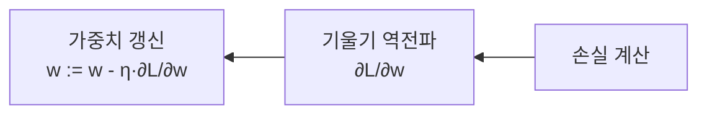

# 인공신경망(Artificial Neural Network)

## 1. 개요

### 가. 정의
> 인간 뇌의 뉴런 구조를 모방해, **입력의 가중합에 활성화 함수를 적용**하는 노드를 계층으로 연결하고 **가중치를 학습**하여 패턴을 인식·예측하는 모델. 딥러닝의 기반이 된다.

인공신경망의 핵심 통찰은 "**복잡한 함수를, 단순한 계산 단위(뉴런)를 층으로 쌓아 근사한다**"는 것이다. 하나의 뉴런은 입력에 가중치를 곱해 더하고 활성화 함수를 통과시키는 단순 연산만 하지만, 이런 뉴런을 여러 층으로 겹치면 어떤 연속함수든 원하는 정밀도로 근사할 수 있다(보편근사정리). 규칙을 사람이 일일이 짜는 대신, **데이터로부터 가중치를 조정해 규칙을 스스로 찾게** 하는 것이 기존 프로그래밍과의 근본적 차이다.

### 나. 구성요소와 역할

신경망은 입력층·은닉층·출력층으로 구성되며, 각 층이 맡은 역할이 다르다. **입력층**은 특징(feature)을 받아들이는 관문이고, **은닉층**은 입력을 비선형으로 변환하며 점점 더 추상적인 표현을 만들어낸다. 층이 깊을수록(=은닉층이 많을수록) 표현력이 커지는 이유가 여기에 있으며, 이것이 "딥(deep)"러닝이라는 이름의 근거다. **출력층**은 최종 예측값을 낸다. 각 뉴런은 `z = Σwᵢxᵢ + b`로 가중합을 구한 뒤 활성화 함수 `f(z)`를 적용하는데, 이때 **활성화 함수가 비선형이 아니면 아무리 층을 쌓아도 하나의 선형변환으로 붕괴**해 버린다. 즉 비선형 활성화 함수가 심층 구조의 표현력을 실제로 살리는 열쇠다.

| 구성요소 | 역할 |
|---|---|
| 뉴런(노드) | 가중합 z=Σwᵢxᵢ+b 계산 후 활성화 |
| 가중치(w)·편향(b) | 학습으로 조정되는 파라미터 |
| 입력층 | 특징(feature) 입력 |
| 은닉층 | 비선형 특징 추출·변환(깊이=표현력) |
| 출력층 | 예측값 산출(분류·회귀) |
| 활성화 함수 | 비선형성 부여(없으면 선형모델과 동일) |

## 2. 피드포워드 뉴럴 네트워크(FFNN)

> 신호가 **입력→은닉→출력** 한 방향으로만 전파되고 순환이 없는 기본 신경망(MLP).

FFNN은 예측을 수행하는 **추론(순전파)** 의 기본 형태다. 순환이 없으므로 계산이 층 순서대로 한 번에 흐르며, 각 층에서 이전 층의 출력을 입력으로 받아 가중합과 활성화를 반복한다. 절차는 ① 각 층에서 가중합 `z = Wx + b`를 계산하고, ② 활성화 함수 `a = f(z)`를 적용해, ③ 그 결과를 다음 층 입력으로 전달하며, ④ 출력층에서 최종 예측값을 낸다. 예를 들어 손글씨 숫자 이미지를 입력하면, 은닉층들이 획·곡선 같은 특징을 점진적으로 조합하고 출력층에서 0~9 각 숫자일 확률을 내놓는다. 여기서 아직 학습은 일어나지 않으며, 순전파는 "**현재 가중치로 답을 내보는**" 단계다.

## 3. 역전파(Backpropagation)

> 출력의 오차(Loss)를 **출력→입력 방향으로 역전파**하며 **연쇄법칙(Chain Rule)** 으로 각 가중치의 기울기를 구해 경사하강법으로 갱신하는 학습 알고리즘.

학습의 본질은 "**오차를 줄이는 방향으로 가중치를 조금씩 옮기는 것**"이고, 그러려면 각 가중치가 오차에 얼마나 기여했는지(∂L/∂w)를 알아야 한다. 문제는 수백만 개 가중치의 기울기를 일일이 계산하면 비용이 폭발한다는 점이다. 역전파는 **연쇄법칙**을 이용해 출력층에서 계산한 오차 신호를 입력 방향으로 되돌리며 층별 기울기를 **재사용·전파**함으로써 이를 한 번의 역방향 순회로 효율적으로 구한다. 절차는 순전파로 예측→손실(MSE·교차엔트로피) 계산→오차를 역전파해 층별 기울기 산출→경사하강법 `w := w - η·∂L/∂w`로 갱신이며, 이를 에폭 단위로 반복한다. 학습률 η가 너무 크면 발산하고 너무 작으면 학습이 느려, 적절한 설정이 중요하다.

| 절차 | 내용 |
|---|---|
| 1. 순전파 | 현재 가중치로 예측값 계산 |
| 2. 손실 계산 | Loss(예측, 정답) — MSE·Cross-Entropy |
| 3. 오차 역전파 | 연쇄법칙으로 층별 기울기(Gradient) 산출 |
| 4. 가중치 갱신 | 경사하강법(η: 학습률)으로 조정, Epoch 반복 |

깊은 망에서는 기울기가 층을 거치며 계속 곱해져 **0으로 사라지거나(소실) 폭발**하는 문제가 생긴다. 소실은 학습이 멈추는 원인인데, 기울기를 그대로 흘려보내는 ReLU, 층 입력 분포를 안정화하는 배치정규화, 신호가 층을 건너뛰게 하는 잔차연결(ResNet)이 이를 크게 완화했다. 이 기법들이 나오면서 비로소 아주 깊은 신경망 학습이 실용화됐다.

## 4. 활성화 함수의 종류

활성화 함수는 단순히 비선형을 넣는 것을 넘어, **기울기 소실·계산량·출력 해석**에 직접 영향을 준다. Sigmoid는 출력을 0~1로 눌러 확률로 해석하기 좋지만, 양 끝에서 기울기가 0에 가까워 깊은 망에서 소실을 일으킨다. 그래서 은닉층 주력은 계산이 간단하고 양수 구간 기울기가 1로 유지되는 **ReLU**가 됐다. 다만 ReLU는 음수 입력에서 뉴런이 죽는(Dying ReLU) 단점이 있어 Leaky ReLU·ELU가 이를 보완하고, 트랜스포머 계열은 부드러운 GELU를 즐겨 쓴다. 출력층에서 다중분류에는 여러 값을 합이 1인 확률분포로 만드는 **Softmax**를 쓴다. 즉 "은닉층=ReLU 계열, 다중분류 출력층=Softmax"가 전형적 조합이다.

| 함수 | 출력범위 | 특징·용도 |
|---|---|---|
| Sigmoid | 0~1 | 확률 해석, 기울기 소실 |
| Tanh | -1~1 | 0 중심, 소실 잔존 |
| ReLU | 0~∞ | 계산 간단·빠름, 은닉층 주력 |
| Leaky ReLU/ELU | 음수 허용 | Dying ReLU 완화 |
| GELU | ≈ReLU(부드러움) | 트랜스포머에서 사용 |
| Softmax | 합=1 | 다중분류 확률 출력(출력층) |

## 5. 고려사항 및 시사점
- **과적합 관리**: 파라미터가 많아 학습 데이터를 외워버리기 쉬우므로, 무작위로 뉴런을 끄는 드롭아웃, 가중치 크기를 제약하는 정규화, 데이터 증강으로 일반화 성능을 확보한다.
- **구조의 특화**: 공간 패턴에는 CNN(영상), 순서·시계열에는 RNN/LSTM, 장거리 문맥에는 어텐션 기반 **Transformer**로 발전했다. 문제 구조에 맞는 아키텍처 선택이 성능을 좌우한다.
- **AI의 토대**: 오늘날 생성형 AI·LLM도 결국 대규모 신경망과 역전파 학습 위에 서 있으므로, 신경망의 기본 원리는 최신 AI를 이해하는 출발점이다.

---

> **한 줄 요약**: 인공신경망은 *가중합+비선형 활성화 뉴런을 층으로 쌓아* 복잡한 함수를 근사하는 모델로, FFNN이 순방향으로 예측하고 역전파가 연쇄법칙으로 오차 기울기를 효율적으로 구해 가중치를 갱신하며, ReLU·Softmax 등 활성화 함수 선택이 학습 안정성과 성능을 좌우한다.
