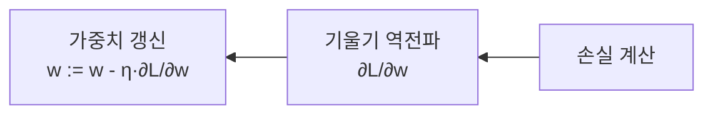

# 인공신경망(Artificial Neural Network)

## 1. 개요

### 가. 개념
> 인간 뇌의 뉴런 구조를 모방해, **입력의 가중합에 활성화 함수를 적용**하는 노드를 계층으로 연결하고 **가중치를 학습**하여 패턴을 인식·예측하는 모델. 딥러닝의 기반.

### 나. 구성요소와 역할

| 구성요소 | 역할 |
|---|---|
| **뉴런(노드)** | 입력 가중합 z=Σwᵢxᵢ+b 계산 후 활성화 |
| **가중치(w)·편향(b)** | 학습으로 조정되는 파라미터 |
| **입력층** | 특징(feature) 입력 |
| **은닉층** | 비선형 특징 추출·변환(깊이=표현력) |
| **출력층** | 예측값 산출(분류·회귀) |
| **활성화 함수** | 비선형성 부여(없으면 선형모델과 동일) |

## 2. 피드포워드 뉴럴 네트워크(FFNN)
> 신호가 **입력→은닉→출력** 한 방향으로만 전파되고 순환이 없는 기본 신경망(MLP).

**순전파(Forward) 절차**
1. 각 층에서 **가중합** z = Wx + b 계산
2. **활성화 함수** a = f(z) 적용
3. 다음 층 입력으로 전달 → 반복
4. 출력층에서 **예측값** 산출

## 3. 역전파(Backpropagation)
> 출력의 오차(Loss)를 **출력→입력 방향으로 역전파**하며 **연쇄법칙(Chain Rule)** 으로 각 가중치의 기울기를 구해 경사하강법으로 갱신하는 학습 알고리즘.

| 절차 | 내용 |
|---|---|
| 1. 순전파 | 예측값 계산 |
| 2. 손실 계산 | Loss(예측, 정답) — MSE·Cross-Entropy |
| 3. 오차 역전파 | 연쇄법칙으로 층별 **기울기(Gradient)** 산출 |
| 4. 가중치 갱신 | 경사하강법(η: 학습률)으로 조정, 반복(Epoch) |

- **문제**: 기울기 소실/폭주 → ReLU·배치정규화·잔차연결(ResNet)로 완화

## 4. 활성화 함수의 종류

| 함수 | 출력범위 | 특징 |
|---|---|---|
| **Sigmoid** | 0~1 | 확률 해석, 기울기 소실 |
| **Tanh** | -1~1 | 0 중심, 소실 잔존 |
| **ReLU** | 0~∞ | 계산 간단·빠름, 은닉층 주력 |
| **Leaky ReLU/ELU** | 음수 허용 | Dying ReLU 완화 |
| **GELU** | ≈ReLU | 트랜스포머에서 사용 |
| **Softmax** | 합=1 | 다중분류 확률 출력(출력층) |

## 5. 고려사항 및 시사점
- **과적합**: 드롭아웃·정규화·데이터 증강으로 억제
- 구조 발전: CNN(영상)·RNN/LSTM(시계열)·**Transformer**(언어)로 확장
- 딥러닝·생성형 AI(LLM)의 이론적 토대

---

> **한 줄 요약**: 인공신경망은 *가중합+활성화 뉴런의 계층 구조* 로, FFNN이 순방향으로 예측하고 역전파가 연쇄법칙으로 오차 기울기를 계산해 가중치를 갱신하며, Sigmoid·ReLU·Softmax 등 활성화 함수가 비선형성을 부여한다.
