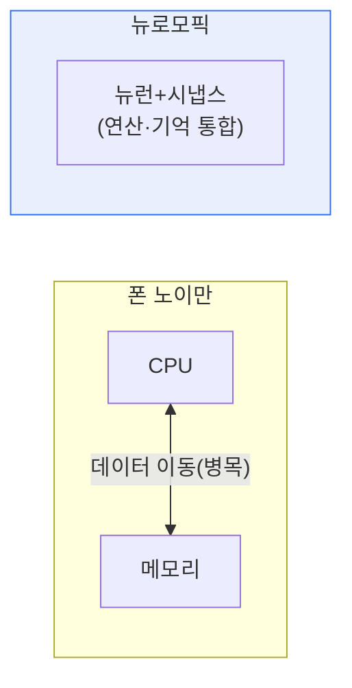

# 뉴로모픽 칩(Neuromorphic Chip)

## 1. 개요

### 가. 정의
> **뉴로모픽 칩**은 인간 뇌의 **뉴런과 시냅스 구조·동작 방식을 모방**하여, 저전력으로 병렬적·이벤트 기반 연산을 수행하는 신경모방 반도체다.

뉴로모픽 칩의 핵심 발상은 '**컴퓨터를 뇌처럼 만들어 뇌처럼 효율적으로 동작하게 하자**'는 것이다. 기존 컴퓨터(폰 노이만 구조)는 연산장치(CPU)와 메모리가 분리되어 있어, 데이터를 둘 사이로 끊임없이 옮기는 과정에서 병목과 막대한 전력 소모가 생긴다(폰 노이만 병목). 반면 인간의 뇌는 뉴런이 연산과 기억을 함께 하고, 자극이 있을 때만 신호를 보내며(이벤트 기반), 수많은 뉴런이 병렬로 동작해 20W 정도의 낮은 전력으로 엄청난 정보를 처리한다. 뉴로모픽 칩은 이 뇌의 원리를 하드웨어로 구현한다. 연산과 메모리를 통합(In-memory computing)하고, 스파이크(뾰족한 신호)로 정보를 전달하는 **스파이킹 신경망(SNN)** 으로 동작해, AI 연산을 매우 낮은 전력으로 수행한다. 엣지·IoT처럼 전력이 제한된 환경의 AI에 적합하다.

### 나. 등장 배경
딥러닝의 확산으로 AI 연산량과 전력 소모가 폭증하면서, 폰 노이만 구조의 전력·병목 한계를 넘는 새로운 컴퓨팅 패러다임이 요구되었다.

## 2. 기존 구조와 비교

| 구분 | 폰 노이만 구조 | 뉴로모픽 칩 |
|---|---|---|
| **구조** | 연산·메모리 분리 | 연산·메모리 통합(뉴런·시냅스) |
| **처리** | 순차적 | 병렬·이벤트 기반(스파이크) |
| **전력** | 높음(데이터 이동) | 매우 낮음 |
| **적합** | 범용 연산 | 저전력 AI·패턴 인식 |

## 3. 핵심 기술

| 기술 | 내용 |
|---|---|
| **스파이킹 신경망(SNN)** | 스파이크로 정보 전달(이벤트 기반) |
| **In-memory Computing** | 메모리에서 연산 수행(병목 제거) |
| **뉴런·시냅스 소자** | 멤리스터 등으로 시냅스 모방 |
| **비동기·이벤트 처리** | 자극 있을 때만 동작(저전력) |

대표 칩으로 인텔 Loihi, IBM TrueNorth 등이 있다.

## 4. 고려사항 및 시사점

1. **저전력 엣지 AI의 유력 기술**이다. 배터리로 동작하는 IoT·웨어러블·자율기기에서 상시 AI 추론을 극저전력으로 수행할 수 있어, 온디바이스 AI의 돌파구가 된다.
2. **소프트웨어·알고리즘 생태계가 과제**다. 기존 딥러닝(GPU) 생태계와 달리 SNN 기반 알고리즘·개발 도구가 미성숙해, 상용화를 위해서는 소프트웨어 스택 확보가 필요하다.
3. **차세대 컴퓨팅 패러다임**으로 주목된다. 폰 노이만 한계와 AI 전력 문제를 근본적으로 해결하려는 접근으로, 양자컴퓨팅과 함께 미래 컴퓨팅의 한 축으로 연구되고 있다.

---

> **한 줄 요약**: 뉴로모픽 칩은 *뇌의 뉴런·시냅스를 모방해 연산·메모리를 통합하고 스파이크로 동작(SNN)* 하는 신경모방 반도체로, 폰 노이만 병목을 넘어 초저전력 병렬 AI 연산을 실현해 엣지 AI의 유력 기술로 주목된다.
