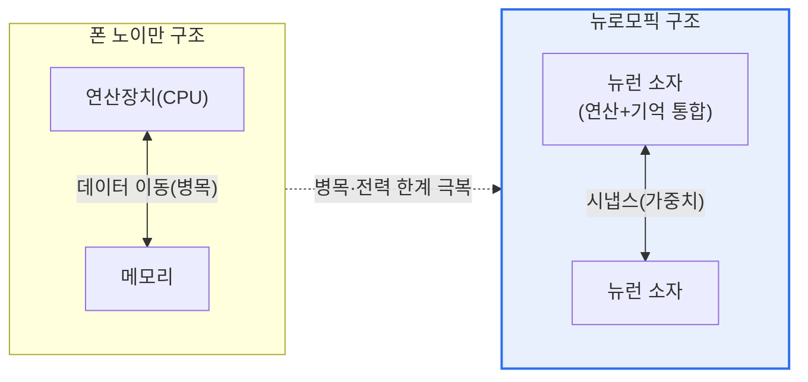
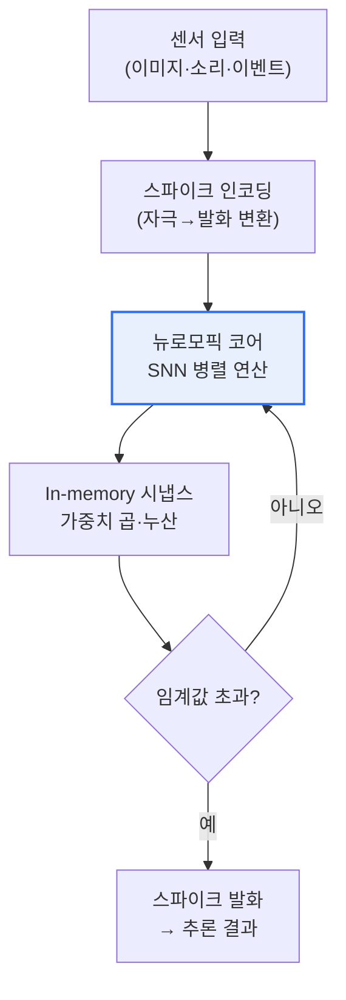

# 뉴로모픽 칩(Neuromorphic Chip)

## 1. 개요

### 가. 정의
> **뉴로모픽 칩(Neuromorphic Chip)** 은 인간 뇌의 **뉴런(neuron)과 시냅스(synapse)의 구조·동작 방식을 하드웨어로 모방**하여, 연산과 기억을 통합하고 이벤트 기반으로 병렬 연산함으로써 극저전력 AI 처리를 실현하는 신경모방 반도체다.

뉴로모픽 칩의 핵심 발상은 '**컴퓨터를 뇌처럼 만들어 뇌만큼 효율적으로 동작하게 하자**'는 것이다. 오늘날 대부분의 컴퓨터는 **폰 노이만 구조(von Neumann architecture)** 를 따른다. 연산장치(CPU)와 메모리가 물리적으로 분리되어 있어, 명령과 데이터를 둘 사이 버스로 끊임없이 실어 나른다. 연산 속도는 빨라졌지만 이 데이터 이동 통로의 대역폭이 성능을 제약하고, 이동 과정에서 막대한 전력이 소모된다. 이를 **폰 노이만 병목(von Neumann bottleneck)** 또는 '메모리 장벽(memory wall)'이라 부른다. 대규모 딥러닝처럼 데이터를 대량으로 주고받는 작업일수록 이 병목이 치명적이다.

반면 인간의 뇌는 완전히 다른 방식으로 동작한다. 약 860억 개의 뉴런이 각각 연산과 기억을 함께 수행하고(In-memory), 자극이 있을 때만 스파이크(spike)라는 짧은 전기 신호를 이웃 뉴런에 보내며(event-driven), 수많은 뉴런이 대규모로 병렬 동작한다. 그 결과 뇌는 슈퍼컴퓨터가 수 메가와트를 쓰는 인지 작업을 **약 20W** — 백열전구 하나 수준의 전력으로 처리한다. 뉴로모픽 칩은 이 뇌의 세 가지 원리(연산·기억 통합, 이벤트 기반 스파이크, 대규모 병렬)를 반도체로 구현해, 폰 노이만 병목을 우회하고 AI 연산의 전력 효율을 근본적으로 끌어올린다. 정보 표현·전달은 생물학적 뉴런의 발화를 본뜬 **스파이킹 신경망(SNN, Spiking Neural Network)** 으로 이루어진다.

### 나. 등장 배경
딥러닝이 확산되면서 모델 규모와 학습·추론 연산량이 기하급수적으로 늘었고, 이를 GPU 대규모 클러스터로 처리하면서 데이터센터 전력 소모와 발열이 심각한 제약이 되었다. 동시에 스마트폰·웨어러블·IoT·자율기기처럼 배터리로 상시 동작해야 하는 엣지 환경에서는 클라우드로 데이터를 보내지 않고 기기 안에서 저전력으로 AI를 돌려야 할 필요가 커졌다.

무어의 법칙 둔화와 '메모리 장벽'의 심화로 기존 구조의 개선만으로는 이 요구를 감당하기 어렵다는 인식이 확산되면서, 연산 방식 자체를 바꾸는 접근이 주목받았다. 폰 노이만 구조의 전력·병목 한계를 넘는 새로운 컴퓨팅 패러다임에 대한 요구가 뉴로모픽 컴퓨팅 등장의 배경이다.

## 2. 폰 노이만 구조와의 비교

전체 구조 관점에서, 두 방식의 근본 차이는 '연산과 기억이 분리되어 있는가'다. 폰 노이만 구조는 CPU와 메모리를 오가는 왕복 이동이 필수인 반면, 뉴로모픽은 뉴런·시냅스 소자 안에서 연산과 기억이 한 몸으로 일어난다.

```mermaid
flowchart LR
  subgraph V["폰 노이만 구조"]
    C["연산장치(CPU)"] <-->|"데이터 이동(병목)"| M["메모리"]
  end
  subgraph N["뉴로모픽 구조"]
    NN["뉴런 소자<br/>(연산+기억 통합)"] <-->|"시냅스(가중치)"| NN2["뉴런 소자"]
  end
  V -.->|"병목·전력 한계 극복"| N
  style N fill:#e8f0fe,stroke:#2f6fed,stroke-width:2px
```

이 구조 차이가 실무적으로 만드는 결과를 표로 정리하되, 각 항목의 '이유'가 중요하다. **처리 방식**에서 폰 노이만은 명령을 한 줄씩 순차 실행하는 데 최적화된 반면, 뉴로모픽은 자극이 있을 때만 해당 뉴런이 반응하는 이벤트 기반이라 항상 모든 소자가 돌지 않는다. 그래서 **전력**에서 큰 차이가 난다 — 데이터가 없으면 계산도, 전력 소모도 거의 발생하지 않기 때문이다(sparse activity). 이것이 뉴로모픽이 '저전력 AI'로 불리는 근본 이유다.

| 구분 | 폰 노이만 구조 | 뉴로모픽 칩 |
|---|---|---|
| **구조** | 연산·메모리 분리 | 연산·메모리 통합(뉴런·시냅스) |
| **처리** | 순차적(명령어 실행) | 병렬·이벤트 기반(스파이크) |
| **정보 표현** | 이진값(비트) | 스파이크 발화 타이밍·빈도 |
| **전력** | 높음(데이터 이동·상시 동작) | 매우 낮음(자극 시에만 동작) |
| **강점** | 범용·정밀 연산 | 저전력 패턴 인식·상시 추론 |

## 3. 핵심 기술 요소와 동작 원리

### 가. 스파이킹 신경망(SNN)
뉴로모픽 칩의 소프트웨어적 두뇌에 해당하는 것이 **SNN**이다. 기존 인공신경망(ANN)이 각 뉴런에서 연속적인 실수값을 곱하고 더해 다음 층으로 전달하는 것과 달리, SNN은 생물학적 뉴런처럼 입력이 누적되어 임계값(threshold)을 넘는 순간에만 스파이크를 발화한다. 대표 모델인 LIF(Leaky Integrate-and-Fire) 뉴런은 입력 전류를 막전위에 적분(integrate)하다가 임계값 도달 시 발화하고, 발화가 없으면 전위가 서서히 새어나간다(leaky). 정보는 값 자체보다 스파이크가 '언제, 얼마나 자주' 발생하는지(시간 부호화, temporal coding)에 담긴다. 자극이 없으면 계산도 없다는 이 희소성(sparsity)이 저전력의 핵심이다. 다만 이 불연속 발화는 미분이 어려워 기존 역전파(back-propagation)를 그대로 쓸 수 없고, 대리 기울기(surrogate gradient)나 ANN-SNN 변환 같은 별도 학습 기법이 필요하다.

### 나. In-memory Computing과 시냅스 소자
폰 노이만 병목을 없애는 물리적 방법이 **In-memory Computing(메모리 내 연산)** 이다. 데이터를 CPU로 가져와 계산한 뒤 되돌려 쓰는 대신, 데이터가 저장된 메모리 소자 자리에서 곧바로 연산을 수행한다. 이를 위해 시냅스의 '연결 세기(가중치)'를 저장하면서 동시에 아날로그 연산을 할 수 있는 신소자가 연구된다. 대표적으로 **멤리스터(Memristor)** 는 흘려보낸 전류 이력에 따라 저항값이 바뀌는 소자로, 저항 상태로 시냅스 가중치를 표현하고 옴의 법칙·키르히호프 법칙으로 곱셈·누산(MAC)을 물리적으로 수행한다. PCM(상변화메모리)·ReRAM 같은 소자도 같은 목적으로 활용된다. 연산과 저장이 한 소자에서 일어나므로 데이터 이동이 사라지고, 이것이 전력·지연 감소로 직결된다.

### 다. 비동기·이벤트 기반 처리
뉴로모픽 칩은 전체를 하나의 클록으로 동기화해 매 사이클 모든 소자를 구동하는 방식이 아니라, 각 코어가 스파이크(이벤트)가 도착할 때만 비동기적으로 동작한다. 이 방식은 입력이 희소할수록 유휴 전력이 극단적으로 낮아지고, 여러 코어가 서로 다른 이벤트를 동시에 처리하는 대규모 병렬성을 자연스럽게 얻는다. 아래는 감지→스파이크 인코딩→SNN 처리→추론 결과에 이르는 데이터 흐름을 나타낸 개념도다.

```mermaid
flowchart TD
  S["센서 입력<br/>(이미지·소리·이벤트)"] --> E["스파이크 인코딩<br/>(자극→발화 변환)"]
  E --> Q["뉴로모픽 코어<br/>SNN 병렬 연산"]
  Q --> W["In-memory 시냅스<br/>가중치 곱·누산"]
  W --> F{"임계값 초과?"}
  F -->|"예"| O["스파이크 발화<br/>→ 추론 결과"]
  F -->|"아니오"| Q
  style Q fill:#e8f0fe,stroke:#2f6fed,stroke-width:2px
```

### 라. ANN과 SNN의 차이
기존 딥러닝의 인공신경망(ANN)과 뉴로모픽의 SNN은 정보를 표현하는 방식 자체가 다르다. ANN은 각 뉴런이 매 순간 하나의 실수 활성값을 내보내고 모든 뉴런이 동기적으로 갱신되므로, 입력이 있든 없든 전체 네트워크가 밀집(dense) 연산을 수행한다. 반면 SNN은 시간축을 명시적으로 갖고, 뉴런이 발화할 때만 이진 스파이크(0/1)를 이웃에 전달한다. 즉 정보가 '값의 크기'가 아니라 '발화의 시점·빈도'에 실린다. 이 차이 때문에 SNN은 입력이 희소할수록 연산량과 전력이 급감하는 이점을 얻지만, 대신 시간 차원이 추가되고 발화가 불연속이어서 학습이 어렵다는 대가를 치른다.

학습 측면의 함의도 크다. ANN은 오차를 출력에서 입력 방향으로 미분해 가중치를 갱신하는 역전파가 확립돼 있으나, SNN의 스파이크는 미분 불가능해 그대로 적용할 수 없다. 그래서 발화 함수를 매끄러운 함수로 근사하는 대리 기울기(surrogate gradient), 잘 학습된 ANN을 SNN으로 변환하는 방식, 그리고 생물학적으로 국소적인 STDP(스파이크 타이밍 의존 가소성) 같은 규칙이 연구된다. 정확도는 아직 성숙한 ANN이 앞서는 경우가 많지만, 전력 효율과 지연에서 SNN이 갖는 이점이 엣지 응용에서 이를 상쇄한다.

### 마. 대표 칩과 학습 방식
상용·연구용 뉴로모픽 칩으로는 인텔의 **Loihi/Loihi 2**, IBM의 **TrueNorth**·**NorthPole**, 영국 맨체스터대의 **SpiNNaker** 등이 있다. Loihi 2는 128개의 비동기 뉴로모픽 코어와 온칩 학습(on-chip learning)을 지원해, 칩 내부에서 시냅스 가중치를 갱신하며 적응할 수 있다. 이러한 온칩 학습은 클라우드에 데이터를 보내지 않고 기기에서 스스로 배우는 엣지 AI에 유리하다. 아래는 대표 칩의 지향점을 비교한 것으로, 같은 '뉴로모픽'이라도 완전 이벤트 기반 SNN(Loihi)과 저정밀 추론 가속(NorthPole)처럼 설계 철학이 갈린다.

| 칩 | 주체 | 특징 |
|---|---|---|
| **Loihi 2** | Intel | 128 코어, 온칩 학습, 완전 이벤트 기반 SNN |
| **TrueNorth** | IBM | 100만 뉴런급, 초저전력 추론 특화(연구용) |
| **NorthPole** | IBM | 저정밀(2~8bit) 추론 가속, 메모리 근접 연산 |
| **SpiNNaker** | Univ. of Manchester | 다수 ARM 코어로 대규모 SNN 시뮬레이션 |

여기서 Loihi 2 여러 개를 묶은 대규모 시스템이 뒤에서 다룰 Hala Point이며, 이는 뉴로모픽이 단일 칩을 넘어 시스템 수준으로 확장될 수 있음을 보여 준다.

## 4. 적용 사례와 산업 동향 비교

뉴로모픽의 강점은 '저전력으로 상시 동작하는 패턴 인식·이상 감지'에서 두드러진다. 대표 사례가 **이벤트 카메라(DVS, Dynamic Vision Sensor)** 와의 결합이다. 일반 카메라가 정해진 프레임마다 전체 화면을 통째로 촬영하는 것과 달리, 이벤트 카메라는 밝기가 변한 화소만 비동기적으로 스파이크로 내보낸다. 이 희소한 이벤트 스트림은 SNN의 입력과 형식이 일치하므로, 뉴로모픽 칩이 별도 변환 없이 마이크로초 단위 지연으로 움직임을 추적할 수 있다. 배경이 정지한 장면에서는 전송·연산할 이벤트가 거의 없어 전력이 극단적으로 낮아진다. 이 특성은 빠른 반응과 저전력이 동시에 요구되는 자율주행·드론·로봇의 실시간 인지에 특히 유리하다.

두 번째로, 배터리로 상시 동작해야 하는 웨어러블·헬스케어에서 심전도·근전도 등 생체신호의 이상 패턴을 저전력으로 끊김 없이 감시하는 용도가 연구된다. 세 번째로, 스마트 팩토리에서 설비의 진동·소리 신호를 상시 학습·감시해 고장을 조기에 예측하는 예지정비(predictive maintenance)가 있다. 이 세 사례의 공통점은 '데이터가 대부분 평상시에는 조용하다가 이상 시에만 급변한다'는 희소성이며, 바로 이 지점이 이벤트 기반 뉴로모픽의 전력 효율이 극대화되는 조건이다.

규모 면의 진전을 보여 주는 대표 사례가 인텔이 미국 샌디아 국립연구소에 구축한 대규모 뉴로모픽 시스템 **Hala Point**다. 공개된 자료에 따르면 이 시스템은 1,152개의 Loihi 2 프로세서로 약 11.5억 개의 뉴런과 수백억 개 규모의 시냅스를 구현하면서도 전자레인지 크기의 6U 섀시에 담기고 최대 소비전력이 약 2,600W 수준으로, 뉴런 규모 대비 전력 효율이 매우 높다. 이는 뉴로모픽이 소형 엣지뿐 아니라 '지속가능한 AI'를 위한 데이터센터급 접근으로도 확장될 수 있음을 시사한다. 다만 이러한 수치는 연구·실증 단계의 발표값으로, 범용 AI 워크로드에서의 실효 성능은 응용에 따라 달라질 수 있다.

한편 뉴로모픽 성능을 공정하게 비교하기는 쉽지 않다. GPU는 초당 부동소수점 연산량(FLOPS)이라는 익숙한 척도가 있으나, 이벤트 기반 SNN은 처리하는 연산량 자체가 입력의 희소성에 따라 달라지므로 같은 잣대로 재기 어렵다. 그래서 '스파이크당 에너지(pJ/spike)'나 '추론당 에너지(mJ/inference)', 지연(latency) 등을 함께 보고, 반드시 동일 과업(iso-accuracy)에서 GPU 대비 몇 배의 전력 효율인지를 따져야 한다. 발표되는 '수백~수천 배 저전력'류의 수치도 특정 희소 워크로드에 한정된 값일 수 있어, 응용 조건을 확인하지 않은 일반화는 경계해야 한다.

산업 동향상 뉴로모픽은 GPU를 대체한다기보다 역할을 분담하는 방향으로 자리 잡고 있다. 대규모 학습·범용 추론은 여전히 GPU/NPU가 담당하고, 상시·저전력·저지연이 결정적인 엣지 인지 영역에서 뉴로모픽이 보완적 가속기로 쓰이는 구도가 현실적이다.

## 5. 심화 — 소프트웨어 생태계와 표준화 과제

뉴로모픽은 폰 노이만 병목을 우회하는 여러 접근 중 하나로, 인접 기술과의 관계 속에서 이해하는 것이 유용하다. 메모리에서 곱·누산을 수행하는 In-memory Computing(PIM)과 개념을 공유하고, 저전력 엣지 AI라는 목표에서는 온디바이스 AI·경량 NPU와 겹치며, '폰 노이만 이후'라는 큰 그림에서는 양자컴퓨팅과 함께 비(非)폰 노이만 컴퓨팅의 한 갈래로 묶인다. 다만 각 기술의 성격은 다르다 — PIM·NPU가 기존 딥러닝 연산을 더 효율적으로 '가속'하는 데 방점이 있다면, 뉴로모픽은 정보 표현 방식(스파이크·시간 부호화) 자체를 뇌에 가깝게 바꾸는 더 근본적 전환을 지향한다. 이 차이가 곧 생태계 진입 장벽의 크기이기도 하다.

뉴로모픽이 하드웨어 잠재력에도 불구하고 폭넓게 상용화되지 못한 가장 큰 이유는 **소프트웨어·알고리즘 생태계의 미성숙**이다. GPU 기반 딥러닝은 CUDA·PyTorch·TensorFlow로 이어지는 성숙한 개발 스택과 방대한 사전학습 모델, 인력 풀을 갖췄지만, SNN은 학습 방법이 확립 도중이고 프레임워크(예: 인텔 Lava, snnTorch, Norse 등)가 상대적으로 초기 단계다. SNN의 불연속 발화 때문에 표준 역전파를 쓰기 어렵다는 근본적 난점, 정확도 면에서 성숙한 ANN에 아직 뒤처지는 과제, 칩마다 아키텍처·API가 달라 이식성이 낮은 점이 겹친다. 이 때문에 학계·산업은 SNN 학습 알고리즘(대리 기울기·ANN 변환)의 정확도 향상, 벤더 중립적 개발 도구와 벤치마크 표준화, 이벤트 기반 센서-칩 통합 파이프라인 확보를 핵심 과제로 다루고 있다. 하드웨어의 전력 우위를 실제 응용 성과로 바꾸는 열쇠는 결국 이 소프트웨어 생태계에 있다.

정리하면, 뉴로모픽의 성숙도는 '칩의 뉴런 수'가 아니라 '개발자가 쉽게 쓸 수 있는 도구·모델·표준이 얼마나 갖춰졌는가'로 판가름 난다. GPU 생태계가 CUDA를 축으로 10년 이상 축적된 것을 감안하면, 뉴로모픽 역시 킬러 응용(반드시 저전력이어야만 성립하는 유즈케이스) 중심으로 생태계가 점진적으로 형성될 가능성이 높다. 기술사 관점에서는 하드웨어 스펙보다 이 생태계·표준의 성숙 곡선을 도입 판단의 핵심 지표로 삼아야 한다.

## 6. 고려사항 및 시사점 (기술사 관점)

1. **저전력 엣지·온디바이스 AI의 유력 대안이다.** 배터리로 상시 동작하는 IoT·웨어러블·자율기기에서 극저전력으로 AI 추론을 수행할 수 있어, 클라우드 의존을 줄이고 프라이버시·지연을 개선하는 온디바이스 AI의 돌파구가 된다. 다만 적용은 상시·저전력·패턴 인식이 핵심인 워크로드에 선별적으로 이뤄져야 한다.

2. **소프트웨어·알고리즘 생태계 확보가 상용화의 관건이다.** GPU 대비 미성숙한 SNN 개발 도구·학습 기법·표준을 얼마나 빨리 갖추느냐가 확산 속도를 좌우한다. 조직은 프레임워크(Lava 등) 성숙도와 벤치마크 표준화 추이를 관찰하며 파일럿을 준비하는 것이 바람직하다.

3. **GPU/NPU와의 역할 분담(하이브리드) 관점이 현실적이다.** 대규모 학습은 GPU, 상시·저지연 엣지 인지는 뉴로모픽이 담당하는 이종 가속 구조로 접근해야 하며, 전면 대체가 아니라 상보적 채택이 합리적이다.

4. **소자·공정 기술의 성숙과 신뢰성 검증이 필요하다.** 멤리스터·PCM 등 아날로그 신소자는 편차(variability)·내구성·정밀도 문제가 남아 있어, 재현성과 신뢰성 검증이 대규모 채택의 전제다. 소자-회로-알고리즘을 함께 최적화하는 접근이 요구된다.

5. **지속가능한 AI 관점의 전략적 가치가 크다.** 데이터센터 전력·탄소가 사회적 제약이 되는 상황에서, 뉴로모픽의 전력 효율은 ESG·에너지 비용 측면의 전략 자산이 될 수 있다. 양자컴퓨팅과 함께 폰 노이만 한계를 넘는 미래 컴퓨팅의 한 축으로 중장기 투자·인력 확보 대상으로 검토할 만하다.

## 참고자료
- Intel, "Intel Builds World's Largest Neuromorphic System (Hala Point)": https://www.intc.com/news-events/press-releases/detail/1691/intel-builds-worlds-largest-neuromorphic-system-to
- Intel Research, Neuromorphic Computing: https://www.intel.com/content/www/us/en/research/neuromorphic-computing.html
- Open Neuromorphic, "A Look at Loihi 2": https://open-neuromorphic.org/neuromorphic-computing/hardware/loihi-2-intel/

---

> **한 줄 요약**: 뉴로모픽 칩은 *뇌의 뉴런·시냅스를 모방해 연산·메모리를 통합하고 스파이크(SNN)로 이벤트 기반 병렬 연산* 하는 신경모방 반도체로, 폰 노이만 병목과 AI 전력 문제를 넘어 초저전력 엣지 AI를 실현하는 유력 기술이나, SNN 소프트웨어 생태계 성숙이 상용화의 관건이다.
