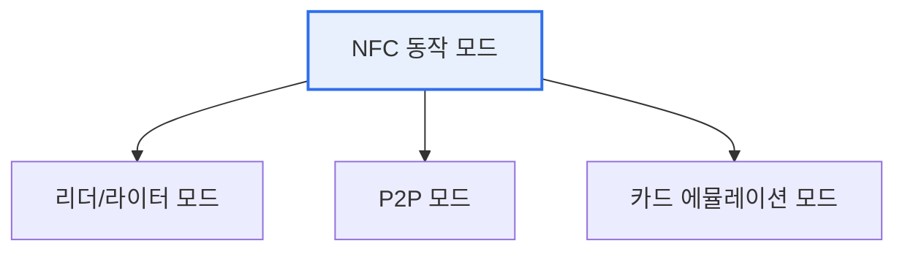

# NFC(Near Field Communication)

## 1. 개요

### 가. 정의
> 13.56MHz 주파수를 사용해 **10cm 이내 근거리에서 무선으로 데이터를 주고받는** 비접촉식 통신 기술. RFID에서 발전했으며 결제·태그·기기 연결에 쓰인다.

NFC의 핵심 특징은 '**아주 가까이 대야만 동작한다**'는 점인데, 이 짧은 도달거리가 오히려 보안·직관성의 장점이 된다. 사용자가 의도적으로 가까이 대는 행위 자체가 인증·동의의 의미를 가지므로, 결제·출입 등 보안이 필요한 용도에 적합하다.

### 나. 특징
- 근거리(≤10cm), 저전력, 빠른 연결(수 ms)
- 능동/수동 모드 지원(수동 태그는 자체 전원 불필요)

## 2. 동작 모드

| 모드 | 설명 | 예 |
|---|---|---|
| **리더/라이터** | NFC 태그를 읽고 씀 | 포스터 태그, 정보 조회 |
| **P2P(Peer-to-Peer)** | 기기 간 데이터 교환 | 안드로이드 빔, 명함 교환 |
| **카드 에뮬레이션** | 스마트폰이 카드처럼 동작 | 모바일 결제·교통카드·출입 |

## 3. RFID와 비교

| 구분 | NFC | RFID |
|---|---|---|
| **거리** | ≤10cm | 수 cm~수 m |
| **주파수** | 13.56MHz(HF) | LF·HF·UHF 다양 |
| **통신** | 양방향(P2P) | 주로 단방향 |
| **용도** | 결제·태그·기기연결 | 물류·재고·출입 |

## 4. 시사점
- 모바일 결제(삼성페이·애플페이) 대중화의 핵심 기술
- 보안: 근거리 특성 + 토큰화·보안요소(SE)로 결제 안전성 확보
- 릴레이 공격 등 위협에 대한 거리·시간 검증 필요

---

> **한 줄 요약**: NFC는 *13.56MHz·10cm 이내 비접촉 근거리 통신* 으로 리더·P2P·카드에뮬레이션 모드를 지원하며, 근거리 특성을 활용해 모바일 결제·태그·출입에 널리 쓰인다.
