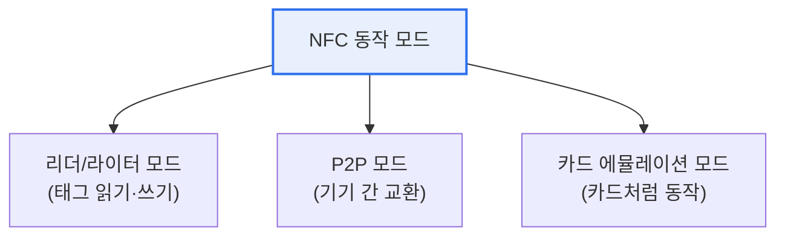

# NFC(Near Field Communication)

## 1. 개요

### 가. 정의
> 13.56MHz 주파수 대역에서 **약 10cm 이내의 극근거리에서만 무선으로 데이터를 주고받는** 비접촉식 통신 기술. RFID 기술을 기반으로 발전했으며, 스마트폰에 내장되어 결제·태그·기기 연결의 표준이 되었다.

NFC를 이해하는 핵심은 '**도달 거리가 짧다는 것이 왜 단점이 아니라 장점인가**'이다. 10cm라는 짧은 거리는 사용자가 **의도적으로 기기를 가까이 대는 행위**를 요구한다. 이 물리적 근접 행위 자체가 "나는 이 결제/인증에 동의한다"는 의사표시가 되므로, 별도의 복잡한 인증 없이도 직관적이면서 안전한 상호작용이 가능하다. 지하철 개찰구에 카드를 대는 순간의 자연스러움이 바로 NFC 설계 철학의 결과다.

### 나. 특징 및 동작 원리
NFC는 저전력·빠른 연결(수십 ms)이 특징이며, 능동(Active)과 수동(Passive) 모드를 모두 지원한다. 특히 **수동 태그는 자체 전원이 없어도** 리더가 만드는 전자기장에서 유도 전력을 얻어 동작하는데, 이 덕분에 배터리 없는 스티커 태그·카드가 가능하다. 통신은 자기유도 결합(Inductive Coupling) 방식으로 이뤄진다.

## 2. NFC 동작 모드

세 모드는 스마트폰이 어떤 역할을 하느냐로 나뉜다. **리더/라이터 모드** 에서 폰은 태그를 읽는 리더가 되어, 포스터의 NFC 태그를 찍어 정보를 얻는다. **P2P 모드** 에서는 두 기기가 대등하게 데이터를 교환한다. 그리고 가장 중요한 **카드 에뮬레이션 모드** 에서는 폰이 마치 신용카드·교통카드처럼 행세하여, 기존 결제 단말기가 폰을 카드로 인식하게 한다. 삼성페이·애플페이의 비접촉 결제가 바로 이 모드다.

| 모드 | 폰의 역할 | 대표 활용 |
|---|---|---|
| **리더/라이터** | 리더(읽는 쪽) | 포스터·제품 태그 조회 |
| **P2P** | 대등한 교환 주체 | 명함·파일 교환(안드로이드 빔) |
| **카드 에뮬레이션** | 카드(읽히는 쪽) | 모바일 결제·교통카드·출입증 |

## 3. RFID와의 비교

NFC는 RFID의 한 갈래지만 목적이 다르다. RFID가 수 미터 거리에서 다수의 물품을 빠르게 식별하는 **물류·재고 관리**에 최적화되었다면, NFC는 짧은 거리에서 안전하게 한 건을 처리하는 **결제·인증**에 특화되었다. 거리가 짧다는 제약이 곧 보안이 되는 것이 NFC 차별점이다.

| 구분 | NFC | RFID |
|---|---|---|
| **거리** | ≤10cm | 수 cm ~ 수 m |
| **주파수** | 13.56MHz(HF 고정) | LF·HF·UHF 다양 |
| **통신 방향** | 양방향(P2P 가능) | 주로 단방향 |
| **주 용도** | 결제·태그·기기연결 | 물류·재고·출입 |

## 4. 보안 위협과 대응

NFC 결제의 안전성은 근거리 특성에만 기대지 않고 다층 방어로 보강된다. 카드번호 대신 **토큰(Token)** 을 전달해 실제 카드정보가 노출되지 않게 하고, 폰 내부의 **보안요소(Secure Element)** 또는 HCE로 결제 자격증명을 격리 보관한다. 다만 공격자가 정상 통신을 중계해 거리를 위조하는 **릴레이 공격(Relay Attack)** 위협이 있어, 응답 시간·거리 검증(Distance Bounding)으로 대응한다.

## 5. 고려사항 및 시사점

1. **모바일 결제 생태계의 핵심 인프라**로, 별도 하드웨어 없이 스마트폰만으로 카드·교통·출입을 통합했다는 점에서 사용자 경험 혁신의 대표 사례다.
2. **보안은 거리+토큰화+보안요소의 다층 구조**로 확보되며, NFC 자체의 물리적 한계에만 의존하지 않는다.
3. QR결제·BLE·UWB 등 대체·보완 기술과 공존하되, NFC는 '대는 순간 완료'되는 직관성에서 강점을 유지한다. 향후 디지털 신분증·자동차 디지털 키 등으로 활용이 확장되고 있다.

---

> **한 줄 요약**: NFC는 *13.56MHz·10cm 이내 비접촉 근거리 통신* 으로, 짧은 도달 거리를 오히려 보안·직관성의 장점으로 삼아 리더·P2P·카드에뮬레이션 모드를 지원하며 토큰화·보안요소와 결합해 모바일 결제의 핵심이 되었다.
